# solLingoIsland — 遊戲畫面英文即時查詢工具

> **本文件為 plan 階段之產品手冊初稿（意圖版）**：表達使用者最終如何使用本產品，細節待 code 階段依實作校準、release 階段驗證充分性；尚未設計之行為不在此臆造。

## 產品定位

玩英文遊戲遇到看不懂的字句時，按 `Alt+L` 框選畫面上的文字，立即取得**英文原文、KK 音標、繁體中文翻譯**，還能整句朗讀、**點選單字查該字字義**、或**編輯辨識錯的原文重新翻譯**——全程不用切出遊戲、不中斷操作。

- Windows 常駐；安裝版**啟動時自動檢查更新**（背景下載、重啟套用，免手動換版），另提供免安裝 Portable 版；工作列常駐主控入口隨時找得到（不依賴系統匣顯示設定）
- 辨識與翻譯使用你自己的 OpenAI API 額度（金鑰只存在環境變數，程式不儲存）
- 朗讀使用 Windows 內建語音，離線可用、不另計費
- 每次查詢自動留存**查詢歷史**，可隨時開啟回顧、重聽、刪除或清除（只存在你本機）
- 把值得記的字句**加入我的筆記**：以自訂資料夾分類、拖曳排序、長期保存（不受歷史清除影響）
- 對筆記**練習發音**：在筆記卡片播音鈕旁**按住麥克風鈕錄音、放開由 AI 評分**，唸得夠標準旁邊**成績框轉綠顯分**（最佳分本機保存、可一鍵清空重練）
- 可管理多個**命名應用主題**（輸入文字，或**貼上／上傳遊戲畫面由 AI 自動解釋**），擇一使用讓翻譯更貼切
- **（v2.0.0 新增）影片擷取**：貼一支 YouTube 英文影片，導引播放**到句暫停**、點字幕單字即查、存進同一套「我的筆記」——螢幕與影片是兩個並排的**擷取來源**，下游查詢／筆記／發音練習完全共用

## 使用前提

- Windows 11（或 Windows 10 1903 以上）
- 遊戲以**無邊框視窗化（borderless windowed）**執行（獨占全螢幕下遮罩無法覆蓋）
- 自備 OpenAI API 金鑰與額度
- Windows 已安裝英文語音包（預設通常已有）

## 快速開始

1. **安裝程式**：自 [GitHub Releases](https://github.com/twStellerWhale-Ocean2/solLingoIsland/releases/latest) 下載 `LingoIsland-win-Setup.exe` 執行（安裝至使用者目錄、不需系統管理員權限；之後**新版會自動更新**）。不想安裝可改下載 `Portable.zip` 解壓到任意資料夾。
2. **設定金鑰**：設定使用者環境變數 `OPENAI_API_KEY`。PowerShell 一行完成：

   ```powershell
   [Environment]::SetEnvironmentVariable('OPENAI_API_KEY','sk-你的金鑰','User')
   ```

3. **啟動常駐**：安裝後自動啟動（之後可從開始功能表啟動；Portable 版雙擊 `LingoIsland.exe`），**工作列出現 LingoIsland 按鈕**（常駐主控入口，預設最小化）即代表就緒；隨時可從工作列或 `Alt+Tab` 找回它查看狀態、開設定或結束（不必再去翻系統匣顯示設定）。
4. **開始查詢**：進入遊戲，看到不懂的英文 → 按 `Alt+L`（左右 Alt 皆可）→ **畫面凍結為靜止畫格** → 拖曳框選文字（或在某句上**雙擊**由 AI 自動判斷該句）→ 放開滑鼠。凍結期間點擊／雙擊不會傳到背後遊戲。
5. **查看結果**：結果顯示於主視窗 **Dictionary 分頁**（原文／KK 音標／中譯）；點 `▶ Play` 聽整句，或**點英文句中任一單字查該字字義**（往前鈕返回原句），辨識有錯可按**鉛筆鈕**改原文重譯；擷取完成時主視窗會自動跳到前景並短暫置頂（疊在無邊框遊戲上），`Alt+Tab` 回遊戲即可。也可直接在 Dictionary 分頁頂部**打字查詢**（或按下拉挑選查詢歷史）。

## 操作說明

| 動作 | 操作 |
| --- | --- |
| 喚起選區 | 預設 `Alt+L`（左右 Alt 皆可）；可於系統匣「設定 → 喚起快捷鍵」自訂為其他鍵盤組合或滑鼠鍵 |
| 變更快捷鍵 | 系統匣「設定」→ 喚起快捷鍵「變更」→ 進入監聽、直接按下想用的鍵盤組合或滑鼠鍵（中鍵／側鍵／左右同按）→ `Esc` 取消 |
| 框選文字 | 畫面凍結後按住滑鼠左鍵拖曳、放開即送出查詢；或在某句文字上**雙擊**，由 AI 自動判斷該句 |
| 取消／關閉 | `ESC` 於擷取遮罩階段可取消、回遊戲；查詢結果留在 **Dictionary 分頁**，切到別的分頁再切回都還在（不再是會關閉的浮動視窗）；下一次查詢、或自歷史/筆記「檢視」，會**更新** Dictionary 分頁的內容 |
| 整句發音 | Dictionary 分頁 `▶ Play` 按鈕（重按會重新播放） |
| 單字查詢 | 點選英文原句中的任一單字，即**查詢該單字字義**（原文/音標/中譯；查詢中游標轉圈、避免連點）；用頂部**往前／往後**鈕可返回原句，單字查詢結果不會自動加入筆記 |
| 編輯重新翻譯 | 辨識錯字時，Dictionary 分頁頂部**鉛筆鈕**→改英文原文→「Re-translate」自動重譯；筆記／歷史條目**右鍵「Edit text」**亦可就地校正原文、自動更新中文 |
| 開啟主視窗 | 點工作列 LingoIsland 按鈕／`Alt+Tab`，或系統匣圖示 → 開啟**統一主視窗**（上方分頁：**主題**／**螢幕截圖**／**影片**／筆記／歷史／選項／關於；Dictionary 為右上獨立視窗鈕） |
| 截圖管理 | 「螢幕截圖」分頁下方「Captured screenshots」：每次擷取自動保存（縮圖清單含擷取時間＋使用中主題），可選取放大檢視、刪除、Clear all |
| 查看查詢結果 | 結果就在 **Dictionary 分頁**（主視窗最左）——隨時點該分頁即可看最近一次結果；系統匣右鍵選單「Result」亦可直接切到該分頁（無任何查詢歷史時提示「No query result yet」） |
| 查詢歷史 | 主視窗「歷史」分頁：左側選日期 → 右側該日紀錄（新在上）；**點一下即選取**（卡片深粉框標示）；每筆可 `＋筆記`、`▶ 播音`、`檢視`、`刪除`；頂部「清除全部」 |
| 加入我的筆記 | Dictionary 分頁**底部**「＋ 加入我的筆記」，或歷史條目「＋筆記」→ 右下角閃示「已加入」（已收藏過則提示「已在筆記中」） |
| 自動加入筆記 | 勾選 Dictionary 分頁底部「自動加入筆記」→ 之後每次查詢成功自動去重收藏（類比自動播放） |
| 我的筆記 | 主視窗「筆記」分頁：左側**多層資料夾樹如檔案總管**——頂部「建立資料夾」、節點**右鍵選單**（新增子資料夾／更名〔`F2` 原地編輯〕／刪除〔`Del`〕）、**同層自動依名稱排序**、拖曳只改所屬資料夾（目標夾高亮）；右側該夾條目可拖曳排序（顯示插入位置線；**拖到清單上／下緣時清單會自動跟著捲動**，長清單重排免中斷）**或拖到左側資料夾改歸屬**，**每卡原文下小字顯示登記時間**（很舊的版本收藏、沒有時間紀錄的筆記不顯示）；右上**三顆排序鈕（字母／日期／自訂順序）**——每顆點一下切**遞增／遞減**（▲／▼）、再點一下翻方向，**目前使用中的鈕會醒目標示（toggle）**；字母／日期是**檢視排序、不會動到你手動拖曳的順序**，「自訂順序」就是你拖曳排出的那個順序（可正／反）——**在字母／日期排序下若拖曳某張卡，會自動切回「自訂順序」並套用你的拖曳**（不會白拖）；**排序模式與方向會各資料夾各自記住、重啟沿用**，加上「**Clear Practice（清空練習紀錄）**」把該夾所有成績框歸零；**點一下即選取**（卡片深粉框標示）；條目**右鍵**＝**直接列底色選項**（無底色＋**十種粉彩色**、目前色打勾）＋最下方分隔線後 `Delete`（播音請按行尾播音鈕、檢視請雙擊），**雙擊＝檢視**，**行尾＝播音鈕｜麥克風鈕｜成績框** |
| 發音練習 | 筆記卡片播音鈕旁的**麥克風鈕**：**按住錄音、放開送 AI 評分**（錄音會上傳 OpenAI 評分、不留存本機）。旁邊**成績框**顯示你的**最佳分**——**綠**＝達門檻通過、**紅**＝未達、**灰「—」**＝還沒練；**按住錄音時框內藍色音量條隨音量跳動（看得到有沒有收到聲）、評分中顯示轉圈**、得分先閃這次分再回落最佳分；**沒有真的唸（靜音／只有背景雜訊）不會給分（顯 0、不通過）**、唸太短／沒麥克風／沒網路會**各自明確提示**、成績框不誤判通過；**評分結果與提示以 Windows 系統通知呈現、會進通知中心可回頭看**（通知標題含你在練的那句、內文含分數/門檻/AI 建議；勿擾／專注或全螢幕遊戲時只進通知中心不跳橫幅；未安裝的可攜/開發版則退回右下角小浮層）；**唸過關的筆記卡片底色會變透明、透出背後的小公主圖案**（卡片外框仍是你的底色加深、看得出分類；門檻調整或清空練習紀錄會跟著重判）；右上「Clear Practice」把整個資料夾的成績框歸零重練 |
| 應用主題 | 主視窗「主題」分頁：新增命名主題（輸入文字，或貼上／上傳畫面按「🔎 以圖片自動解釋」）、「設為使用中」；查詢時注入該主題描述；未選任何主題＝維持預設翻譯 |
| 開啟設定 | 主視窗「選項」分頁，或系統匣圖示右鍵 →「選項」 |
| 查看常駐狀態 | 主視窗**底部狀態列**顯示金鑰狀態與當前快捷鍵；系統匣圖示右鍵亦可看狀態 |
| 收合視窗 | 按主控視窗「✕」或最小化 → **收合、程式仍常駐**（不會結束、熱鍵照常可用） |
| 結束程式 | 常駐主控視窗「結束」，或系統匣圖示右鍵 →「結束」 |
| 自動更新 | 啟動時背景檢查新版並靜默下載；就緒後底部狀態列提示、主視窗「關於」分頁可「立即重啟更新」；未按者結束程式後下次啟動即為新版。「關於」分頁亦可手動「檢查更新」 |
| 移除 | 結束程式後於「設定 → 應用程式」解除安裝（Portable 版刪除資料夾）＋刪除環境變數；個人資料（筆記/歷史/主題/設定，`%APPDATA%\LingoIsland`）視需要自行刪除 |

> **v1.0.0 起**：查詢結果不再是浮動視窗，而是併入主視窗最左的 **Dictionary 分頁**（可直接打字查詢＋下拉挑選查詢歷史）。上述 v0.31–0.32 之「浮動結果視窗／Result 喚回鈕」截圖已不適用，待補 Dictionary 分頁新截圖。

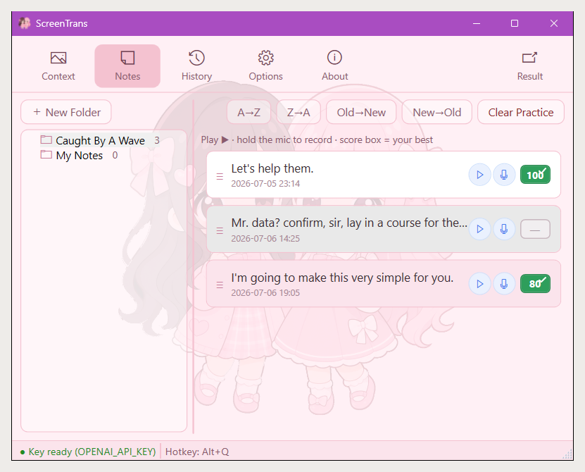

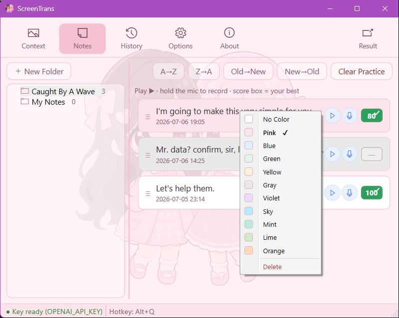

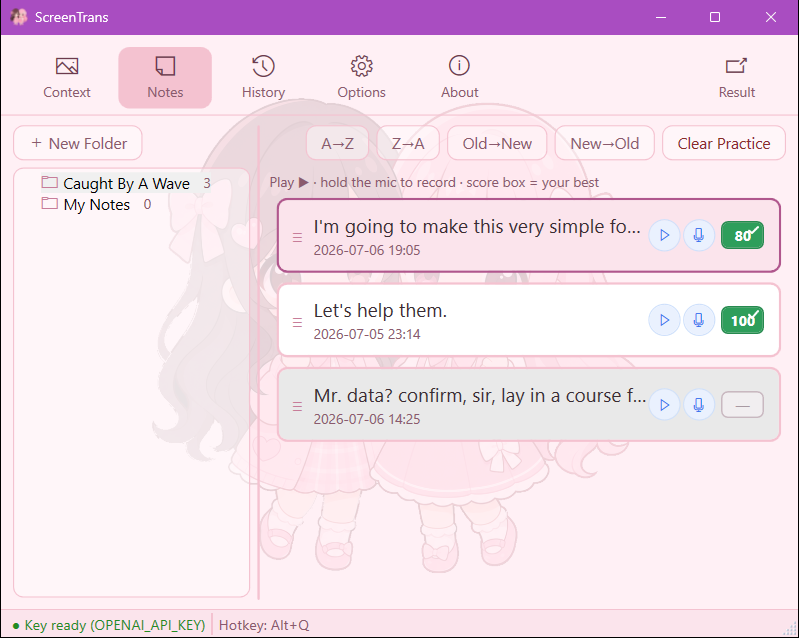

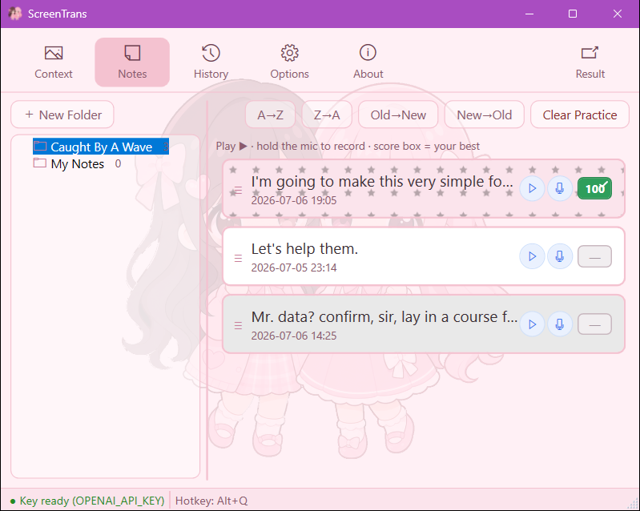


## 影片擷取 · 學習查詢（v2.0.0）

把 **YouTube 英文影片**當成螢幕以外的第二個擷取來源——不用切出遊戲/影片，字幕本身就是文字（免辨識）：

1. 開主視窗 **Video 分頁**，在頂部貼上 YouTube 連結或影片 ID，按 **Load**。
2. 版面三欄：**左＝影片清單**（載過的影片留在此、可點切換載入、標記所屬主題、可刪除）｜ **中＝YouTube 播放器**（下方為當前句字幕帶）｜ **右＝逐句英文字幕**（點跳）。欄寬可拖拉調整。
3. 按導引播放：**播到一句就自動暫停**，畫面下方顯示那句字幕（可續播／重播該句／跳下一句）。
4. 暫停時**點字幕裡任一英文單字**，即查它的原文／KK 音標／中譯並可朗讀（與螢幕查詢同一套結果與朗讀）。
5. 想記的字或整句按 **＋ Add to Notes** 存進「我的筆記」，沿用去重、資料夾分類與發音練習。

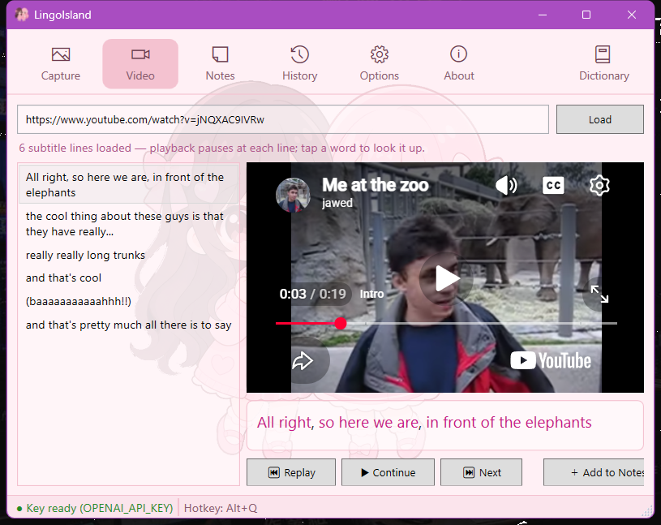

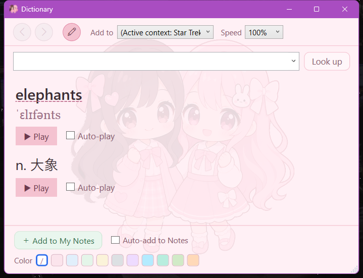

> **字幕來源**：優先抓影片的**人工（真人）字幕**（VTT、乾淨句級）；若該片只有 YouTube **自動字幕**，改以 **json3** 事件級格式取得（避開自動字幕 VTT 之逐字滾動渲染破碎）——一樣乾淨可用，狀態列標示為「機器轉錄」（仍可能有辨識誤差）。
> 需要：Windows 11（內建 WebView2；缺失時 Video 分頁明確提示安裝、不影響其他功能）、本機 `yt-dlp`；查詢一樣用你自備的 OpenAI 金鑰。**本工具只取字幕文字、不下載影片內容。**
> 本版只做「學習查詢」（點字查、存筆記）；限定角色的「代言／跟讀練習」與完整影片庫管理為後續版本。

### 說話人字幕・依說話人篩選・整檔 YAML 編修（v2.5.0）

字幕每句可標示**是誰在說**（右側清單與當前句字幕帶皆前置說話人），並能依說話人篩選、或以整份 YAML 一次修訂：

- **說話人前置**：字幕若含說話人（人工字幕之 VTT `<v 名字>` 語音標記即自動帶入、非 AI 推斷），每句前面顯示「說話人：內容」；沒有標示的句子照常只顯示內容。
- **依說話人篩選**：右側清單上方下拉選單可只看某位說話人的句子（`All speakers` ／各說話人 ／`(no speaker)` 未標示）。**篩選只影響顯示**，不改變導引播放與到句暫停。
- **整檔 YAML 編修**：按 **Edit YAML** 把整份字幕攤成一個 YAML 檔（每句 `speaker`／`start`／`end`／`text`）一次編修——合併或拆分斷句、補上說話人都比逐行改容易；**Apply** 解析回逐句字幕（YAML 有語法錯會留在編修模式提示），**Cancel** 放棄。


> **說話人來源（本版）**：僅取自人工字幕內含的 `<v 名字>` 語音標記，或你在 YAML 編修時**手動標註**——皆為確定來源、非推斷。以 **AI 推斷**自動補全說話人見下節（v2.6.0）；參考網路資料（wiki）為後續版本；「指定某說話人才暫停」亦為後續版本。

### AI 說話人推斷疊加（v2.6.0）

人工／YAML 是「確定來源」；這一版加上**第一個推斷來源**——按一顆按鈕，讓 AI 依台詞替沒有標示說話人的句子補上「大概是誰說的」：

- 影片頁右側「**AI speakers**」按鈕（會用到你的 OpenAI 金鑰，故手動觸發、非自動）。
- **非破壞疊加**：只補**未標示**的句子；人工字幕原本就有的說話人（VTT `<v>` ground truth）一律保留，AI 判斷不出的句子（如背景音）維持空白。
- 這是**根據台詞文字＋常識的推斷、不是看畫面**——狀態列明白標示「inference from dialogue, not ground truth」；不準的地方可再用整檔 YAML 編修手動修正。

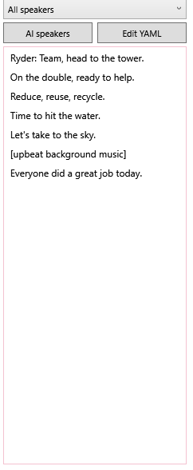

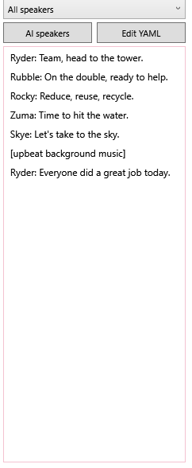

> 之後版本再加**第二顆來源按鈕**（參考 PAW Patrol Wiki 等網路台詞、同一套疊加架構）與「指定某說話人才暫停」。

## 發音練習畫面（v0.31.0）

「我的筆記」每張卡片播音鈕旁有**麥克風鈕（錄音）＋成績框（狀態）**：按住麥克風鈕錄音、放開送 AI 評分。**成績框**顯示最佳分——**綠**＝通過、**紅**＝未達、**灰「—」**＝未練；**按住錄音時框內藍色音量條回饋收音、評分中顯示轉圈**，得分先閃這次分再回落最佳分。**沒有真的唸（只有背景雜訊）不會給分（顯 0）。** 評分結果與提示會以 **Windows 系統通知**呈現、**進通知中心可回頭看**（通知標題含你在練的那句、內文含分數/門檻/AI 建議）——不像原本右下角一閃即逝；勿擾/專注或全螢幕遊戲時只進通知中心不跳橫幅（Windows 行為）。右上「Clear Practice」把該夾成績框全歸零（不刪筆記）。麥克風鈕與播音鈕同為藍色圓鈕、錄音中才轉紅。

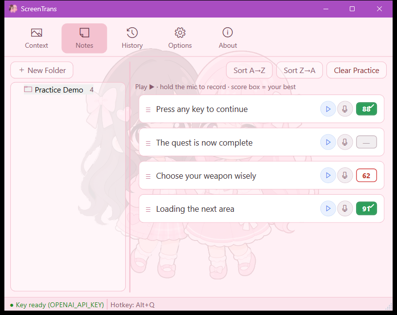

評分完成後，結果與提示以 **Windows 系統通知**呈現、進**通知中心可回頭看**（標題含你正在練的那句、內文含分數/門檻/AI 建議）：


「選項」分頁的「Pronunciation practice」可調**及格門檻**（0–100，滑桿＋數值，預設 80）與**評分模型**（`gpt-audio-1.5`）；錄音上傳 OpenAI 評分、不留存本機。

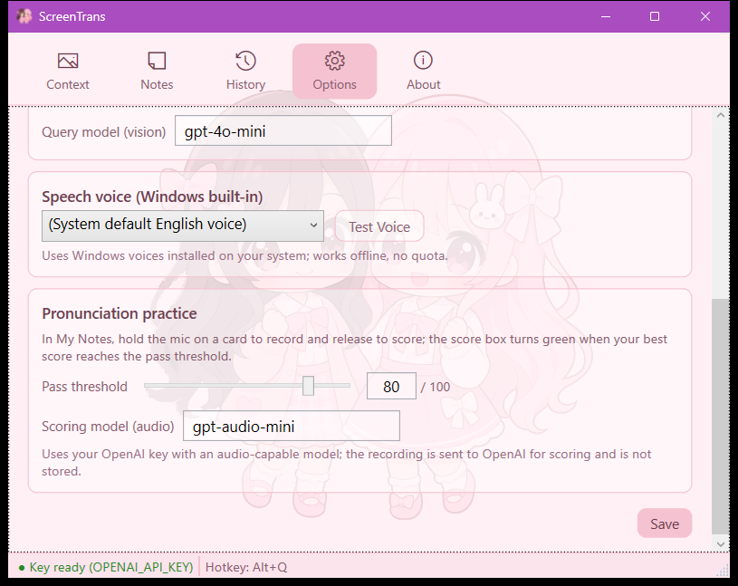

## 選用設定（appsettings.json）

`%APPDATA%\LingoIsland\appsettings.json` 可調整（皆有預設值、可不理會；由「選項」分頁儲存時自動建立。舊版存於 exe 旁者，首次啟動會自動搬移）：

| 參數 | 預設 | 說明 |
| --- | --- | --- |
| `paramModel` | `gpt-4o-mini` | 查詢使用的 OpenAI 模型 |
| `paramHotkey` | `Alt+L` | 喚起選區的快捷鍵綁定；建議由系統匣「設定 → 喚起快捷鍵」以監聽方式變更（支援鍵盤組合與滑鼠中鍵／側鍵／左右同按） |
| `paramQueryTimeoutSec` | `15` | 單次查詢逾時秒數；填 `0` 或負值時自動套用安全下限 `15` 秒 |
| `paramQueryMaxRetries` | `2` | 查詢遇暫時性錯誤（逾時、連線中斷、429、5xx）時的最大重試次數（指數退避；`0`＝不重試）；金鑰無效等永久性錯誤不重試 |
| `paramTtsVoice` | （空＝系統預設英文語音） | 朗讀語音名稱；亦可由系統匣「設定」選單挑選已安裝的 Windows 語音 |
| `paramContextHint` | （空） | #14 遺留單一主題；#36 起由「主題」分頁之命名主題清單取代，此欄若有值會在首次啟動**遷移**為一則「預設主題」。日常改用「主題」分頁 |
| `paramHistoryMax` | `200` | 查詢歷史保留筆數上限；超過時自動汰除最舊；填 `0` 或負值時套用預設 `200` |
| `paramPronPassThreshold` | `80` | 發音練習及格門檻（0–100）；唸出的分數達到此值，該筆筆記成績框才轉綠通過。建議由「選項」分頁調整 |
| `paramPronModel` | `gpt-audio-1.5` | 發音評分使用的 OpenAI 音訊模型（`gpt-audio` 系列、須支援語音輸入）；沿用同一把 `OPENAI_API_KEY`，不另設金鑰 |
| `paramEntryFontSize` | `18` | 筆記／歷史條目原文字級（8–48）；建議由「選項 → 條目顯示」調整 |
| `paramEntryBold` | `true` | 筆記／歷史條目原文是否粗體 |
| `paramEntryWrap` | `false` | 條目原文是否自動換行（`false`＝過長顯示一行加 `…`） |
| `paramResultFontSize` | `28` | Dictionary 分頁結果基準字級（14–48；音標／中譯等比縮放）；建議由「選項 → Dictionary result」調整 |
| `paramPassedCardTransparent` | `true` | 發音**通過**的筆記卡是否透明底（透出背後小公主）；`false`＝過關卡維持素色底。建議由「選項 → 條目顯示」調整 |

> **「選項」分頁新增兩區＋守衛**：**條目顯示**（條目字級／粗體／自動換行／**過關卡是否透明底**）、**Dictionary result**（基準字級）；另外在選項頁改了設定**沒按「儲存」就切到別的分頁**時，會**三選提示**：**儲存後離開／不儲存離開／取消**（「儲存後離開」會先存檔、成功才離開，失敗則留在頁上提示）；而**按「儲存」成功時改為在底部狀態列輕量閃示「Saved ✓」、不再彈出對話框**。

> **筆記／歷史條目微調（v0.40.0）**：卡片**外框加深、更好認**；灰色底色調成不偏粉的冷灰；登記時間改**兩行**（上：年月日、下：時間、字更小），兩頁一致、不再過寬。
>
> **更新檢查訊息更準（v0.40.0）**：檢查更新失敗不再一律說「檢查你的網路」——分辨**離線、查詢過於頻繁（稍後再試）、伺服器暫時忙碌、更新來源異常**各給對應說明；暫時性問題會自動重試幾次，下載時顯示「Downloading update… X%」。

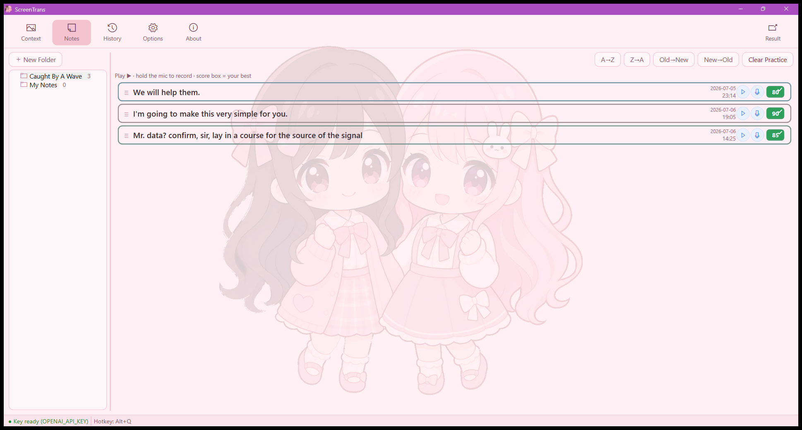


## 成功判定

- 啟動後工作列出現 LingoIsland 按鈕（可 `Alt+Tab` 尋得）、主控視窗**底部狀態列**顯示「金鑰已備妥」；換版／換資料夾後仍可從工作列找到，不需重設系統匣顯示。
- 按主控視窗「✕」只收合、程式續常駐；唯「結束」才退出。
- 遊戲中按 `Alt+L` 於 0.3 秒內畫面凍結為靜止遮罩；框選或雙擊後 1～3 秒內顯示三欄結果。
- 框選範圍與實際截圖內容一致（多螢幕、DPI 縮放亦然）。
- 金鑰未設定時，查詢會顯示明確錯誤與設定指引，程式不會當掉。
- 查詢後開啟「展示歷史紀錄」可見剛才那筆；重啟程式後歷史仍在，「清除全部」後清單為空。
- 對某則筆記按住麥克風鈕唸一次、放開後 AI 回評分：達門檻成績框轉綠、重啟後仍綠；「Clear Practice」後該夾成績框回未練；無麥克風或錄音太短時明確提示、成績框不會誤判通過。

## 常見問題

- **遮罩蓋不住遊戲？** 遊戲顯示設定改為「無邊框視窗化」。
- **查詢一直失敗？** 依序確認：`OPENAI_API_KEY` 已設且有效 → 網路可連 OpenAI → 額度未用罄。
- **沒有聲音？** 確認 Windows 已安裝英文語音包（設定 → 時間與語言 → 語音）。
- **發音練習麥克風鈕沒反應／唸完成績框不轉綠？** 確認 Windows 隱私權→麥克風已允許桌面應用存取（設定 → 隱私權與安全性 → 麥克風），錄音時**要真的把句子唸出來**（只有背景雜訊、沒有朗讀會判 0 分＝紅、不通過）、說得夠久（太短會忽略），且能連上 OpenAI；成績框是否轉綠取決於分數是否達「選項」分頁設定的及格門檻（也可能只是未達門檻＝紅）。

---

設計文件見 [docs/design.md](docs/design.md)；本 repo 開發流程依增量 Issue 工單推進。
