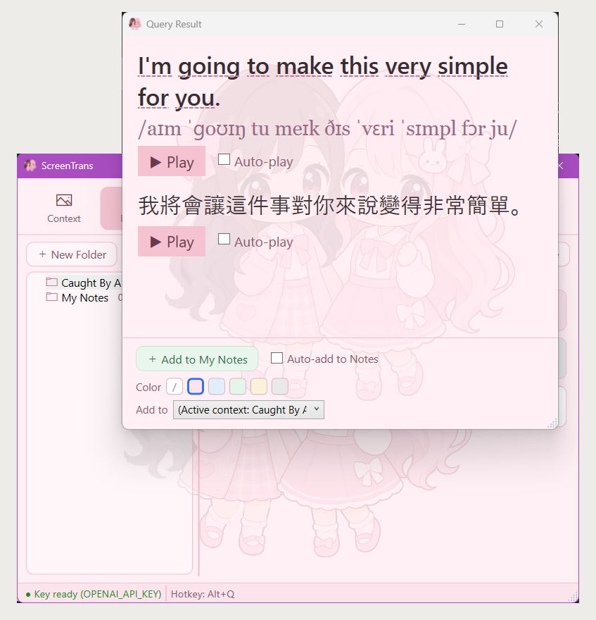

# solScreenEnglishTrans1 — 遊戲畫面英文即時查詢工具

> **本文件為 plan 階段之產品手冊初稿（意圖版）**：表達使用者最終如何使用本產品，細節待 code 階段依實作校準、release 階段驗證充分性；尚未設計之行為不在此臆造。

## 產品定位

玩英文遊戲遇到看不懂的字句時，按 `Alt+L` 框選畫面上的文字，立即取得**英文原文、KK 音標、繁體中文翻譯**，還能整句朗讀、或**點選單字聽個別發音**——全程不用切出遊戲、不中斷操作。

- Windows 常駐；安裝版**啟動時自動檢查更新**（背景下載、重啟套用，免手動換版），另提供免安裝 Portable 版；工作列常駐主控入口隨時找得到（不依賴系統匣顯示設定）
- 辨識與翻譯使用你自己的 OpenAI API 額度（金鑰只存在環境變數，程式不儲存）
- 朗讀使用 Windows 內建語音，離線可用、不另計費
- 每次查詢自動留存**查詢歷史**，可隨時開啟回顧、重聽、刪除或清除（只存在你本機）
- 把值得記的字句**加入我的筆記**：以自訂資料夾分類、拖曳排序、長期保存（不受歷史清除影響）
- 對筆記**練習發音**：在筆記卡片播音鈕旁**按住麥克風鈕錄音、放開由 AI 評分**，唸得夠標準旁邊**成績框轉綠顯分**（最佳分本機保存、可一鍵清空重練）
- 可管理多個**命名應用情境**（輸入文字，或**貼上／上傳遊戲畫面由 AI 自動解釋**），擇一使用讓翻譯更貼切

## 使用前提

- Windows 11（或 Windows 10 1903 以上）
- 遊戲以**無邊框視窗化（borderless windowed）**執行（獨占全螢幕下遮罩無法覆蓋）
- 自備 OpenAI API 金鑰與額度
- Windows 已安裝英文語音包（預設通常已有）

## 快速開始

1. **安裝程式**：自 [GitHub Releases](https://github.com/twStellerWhale-Ocean2/solScreenEnglishTrans1/releases/latest) 下載 `ScreenTrans-win-Setup.exe` 執行（安裝至使用者目錄、不需系統管理員權限；之後**新版會自動更新**）。不想安裝可改下載 `Portable.zip` 解壓到任意資料夾。
2. **設定金鑰**：設定使用者環境變數 `OPENAI_API_KEY`。PowerShell 一行完成：

   ```powershell
   [Environment]::SetEnvironmentVariable('OPENAI_API_KEY','sk-你的金鑰','User')
   ```

3. **啟動常駐**：安裝後自動啟動（之後可從開始功能表啟動；Portable 版雙擊 `ScreenTrans.exe`），**工作列出現 ScreenTrans 按鈕**（常駐主控入口，預設最小化）即代表就緒；隨時可從工作列或 `Alt+Tab` 找回它查看狀態、開設定或結束（不必再去翻系統匣顯示設定）。
4. **開始查詢**：進入遊戲，看到不懂的英文 → 按 `Alt+L`（左右 Alt 皆可）→ **畫面凍結為靜止畫格** → 拖曳框選文字（或在某句上**雙擊**由 AI 自動判斷該句）→ 放開滑鼠。凍結期間點擊／雙擊不會傳到背後遊戲。
5. **查看結果**：浮動視窗顯示原文／KK 音標／中譯；點 `▶ 整句發音` 聽整句，或**點英文句中任一單字聽該字發音**；切去對照其他視窗時結果**會保留不消失**，按 `ESC` 或關閉鈕才關閉，回到遊戲。

## 操作說明

| 動作 | 操作 |
| --- | --- |
| 喚起選區 | 預設 `Alt+L`（左右 Alt 皆可）；可於系統匣「設定 → 喚起快捷鍵」自訂為其他鍵盤組合或滑鼠鍵 |
| 變更快捷鍵 | 系統匣「設定」→ 喚起快捷鍵「變更」→ 進入監聽、直接按下想用的鍵盤組合或滑鼠鍵（中鍵／側鍵／左右同按）→ `Esc` 取消 |
| 框選文字 | 畫面凍結後按住滑鼠左鍵拖曳、放開即送出查詢；或在某句文字上**雙擊**，由 AI 自動判斷該句 |
| 取消／關閉 | `ESC`（任一階段皆可；關結果視窗時請先點一下結果視窗使其為焦點，或直接按其關閉鈕）；**切到其他視窗對照、點主視窗或開主視窗分頁，結果都保留不關**（想關就自己關），下一次查詢或自歷史/筆記「檢視」會取代前一結果（同時只有一張；按喚起鍵當下即先收起前一結果）；於選項分頁按「儲存」會套用語音設定並關閉目前結果視窗 |
| 整句發音 | 結果視窗 `▶ 整句發音` 按鈕（重按會重新播放） |
| 單字發音 | 點選英文原句中的任一單字，即單獨朗讀該字（標點不影響、與整句發音並存） |
| 開啟主視窗 | 點工作列 ScreenTrans 按鈕／`Alt+Tab`，或系統匣圖示 → 開啟**統一主視窗**（上方分頁：情境／筆記／歷史／選項／關於） |
| 喚回查詢結果 | 主視窗功能列**右端「Result」鈕**（系統匣右鍵選單亦有同項）：結果視窗開著（含最小化）→帶到最前；關掉了→以**最近一次查詢**重開；沒有任何查詢歷史→提示「No query result yet」 |
| 查詢歷史 | 主視窗「歷史」分頁：左側選日期 → 右側該日紀錄（新在上）；每筆可 `＋筆記`、`▶ 播音`、`檢視`、`刪除`；頂部「清除全部」 |
| 加入我的筆記 | 結果視窗**底部**「＋ 加入我的筆記」，或歷史條目「＋筆記」→ 右下角閃示「已加入」（已收藏過則提示「已在筆記中」） |
| 自動加入筆記 | 勾選結果視窗底部「自動加入筆記」→ 之後每次查詢成功自動去重收藏（類比自動播放） |
| 我的筆記 | 主視窗「筆記」分頁：左側**多層資料夾樹如檔案總管**——頂部「建立資料夾」、節點**右鍵選單**（新增子資料夾／更名〔`F2` 原地編輯〕／刪除〔`Del`〕）、**同層自動依名稱排序**、拖曳只改所屬資料夾（目標夾高亮）；右側該夾條目可拖曳排序（顯示插入位置線）**或拖到左側資料夾改歸屬**，**每卡原文下小字顯示登記時間**；右上排序鈕 **A→Z／Z→A**（依原文）與 **Old→New／New→Old**（依登記時間，皆即存、重啟沿用），加上「**Clear Practice（清空練習紀錄）**」把該夾所有成績框歸零；條目**右鍵**＝`▶ 播音`／`檢視`／`底色`／`刪除`，**雙擊＝檢視**，**行尾＝播音鈕｜麥克風鈕｜成績框** |
| 發音練習 | 筆記卡片播音鈕旁的**麥克風鈕**：**按住錄音、放開送 AI 評分**（錄音會上傳 OpenAI 評分、不留存本機）。旁邊**成績框**顯示你的**最佳分**——**綠**＝達門檻通過、**紅**＝未達、**灰「—」**＝還沒練；**按住錄音時框內藍色音量條隨音量跳動（看得到有沒有收到聲）、評分中顯示轉圈**、得分先閃這次分再回落最佳分；**沒有真的唸（靜音／只有背景雜訊）不會給分（顯 0、不通過）**、唸太短／沒麥克風／沒網路會**各自明確提示**、成績框不誤判通過；**評分結果與提示以 Windows 系統通知呈現、會進通知中心可回頭看**（通知標題含你在練的那句、內文含分數/門檻/AI 建議；勿擾／專注或全螢幕遊戲時只進通知中心不跳橫幅；未安裝的可攜/開發版則退回右下角小浮層）；右上「Clear Practice」把整個資料夾的成績框歸零重練 |
| 應用情境 | 主視窗「情境」分頁：新增命名情境（輸入文字，或貼上／上傳畫面按「🔎 以圖片自動解釋」）、「設為使用中」；查詢時注入該情境描述；未選任何情境＝維持預設翻譯 |
| 開啟設定 | 主視窗「選項」分頁，或系統匣圖示右鍵 →「選項」 |
| 查看常駐狀態 | 主視窗**底部狀態列**顯示金鑰狀態與當前快捷鍵；系統匣圖示右鍵亦可看狀態 |
| 收合視窗 | 按主控視窗「✕」或最小化 → **收合、程式仍常駐**（不會結束、熱鍵照常可用） |
| 結束程式 | 常駐主控視窗「結束」，或系統匣圖示右鍵 →「結束」 |
| 自動更新 | 啟動時背景檢查新版並靜默下載；就緒後底部狀態列提示、主視窗「關於」分頁可「立即重啟更新」；未按者結束程式後下次啟動即為新版。「關於」分頁亦可手動「檢查更新」 |
| 移除 | 結束程式後於「設定 → 應用程式」解除安裝（Portable 版刪除資料夾）＋刪除環境變數；個人資料（筆記/歷史/情境/設定，`%APPDATA%\ScreenTrans`）視需要自行刪除 |




## 發音練習畫面（v0.31.0）

「我的筆記」每張卡片播音鈕旁有**麥克風鈕（錄音）＋成績框（狀態）**：按住麥克風鈕錄音、放開送 AI 評分。**成績框**顯示最佳分——**綠**＝通過、**紅**＝未達、**灰「—」**＝未練；**按住錄音時框內藍色音量條回饋收音、評分中顯示轉圈**，得分先閃這次分再回落最佳分。**沒有真的唸（只有背景雜訊）不會給分（顯 0）。** 評分結果與提示會以 **Windows 系統通知**呈現、**進通知中心可回頭看**（通知標題含你在練的那句、內文含分數/門檻/AI 建議）——不像原本右下角一閃即逝；勿擾/專注或全螢幕遊戲時只進通知中心不跳橫幅（Windows 行為）。右上「Clear Practice」把該夾成績框全歸零（不刪筆記）。麥克風鈕與播音鈕同為藍色圓鈕、錄音中才轉紅。


評分完成後，結果與提示以 **Windows 系統通知**呈現、進**通知中心可回頭看**（標題含你正在練的那句、內文含分數/門檻/AI 建議）：


「選項」分頁的「Pronunciation practice」可調**及格門檻**（0–100，滑桿＋數值，預設 80）與**評分模型**（`gpt-audio-1.5`）；錄音上傳 OpenAI 評分、不留存本機。


## 選用設定（appsettings.json）

`%APPDATA%\ScreenTrans\appsettings.json` 可調整（皆有預設值、可不理會；由「選項」分頁儲存時自動建立。舊版存於 exe 旁者，首次啟動會自動搬移）：

| 參數 | 預設 | 說明 |
| --- | --- | --- |
| `paramModel` | `gpt-4o-mini` | 查詢使用的 OpenAI 模型 |
| `paramHotkey` | `Alt+L` | 喚起選區的快捷鍵綁定；建議由系統匣「設定 → 喚起快捷鍵」以監聽方式變更（支援鍵盤組合與滑鼠中鍵／側鍵／左右同按） |
| `paramQueryTimeoutSec` | `15` | 單次查詢逾時秒數；填 `0` 或負值時自動套用安全下限 `15` 秒 |
| `paramQueryMaxRetries` | `2` | 查詢遇暫時性錯誤（逾時、連線中斷、429、5xx）時的最大重試次數（指數退避；`0`＝不重試）；金鑰無效等永久性錯誤不重試 |
| `paramTtsVoice` | （空＝系統預設英文語音） | 朗讀語音名稱；亦可由系統匣「設定」選單挑選已安裝的 Windows 語音 |
| `paramContextHint` | （空） | #14 遺留單一情境；#36 起由「情境」分頁之命名情境清單取代，此欄若有值會在首次啟動**遷移**為一則「預設情境」。日常改用「情境」分頁 |
| `paramHistoryMax` | `200` | 查詢歷史保留筆數上限；超過時自動汰除最舊；填 `0` 或負值時套用預設 `200` |
| `paramPronPassThreshold` | `80` | 發音練習及格門檻（0–100）；唸出的分數達到此值，該筆筆記成績框才轉綠通過。建議由「選項」分頁調整 |
| `paramPronModel` | `gpt-audio-1.5` | 發音評分使用的 OpenAI 音訊模型（`gpt-audio` 系列、須支援語音輸入）；沿用同一把 `OPENAI_API_KEY`，不另設金鑰 |

## 成功判定

- 啟動後工作列出現 ScreenTrans 按鈕（可 `Alt+Tab` 尋得）、主控視窗**底部狀態列**顯示「金鑰已備妥」；換版／換資料夾後仍可從工作列找到，不需重設系統匣顯示。
- 按主控視窗「✕」只收合、程式續常駐；唯「結束」才退出。
- 遊戲中按 `Alt+L` 於 0.3 秒內畫面凍結為靜止遮罩；框選或雙擊後 1～3 秒內顯示三欄結果。
- 框選範圍與實際截圖內容一致（多螢幕、DPI 縮放亦然）。
- 金鑰未設定時，查詢會顯示明確錯誤與設定指引，程式不會當掉。
- 查詢後開啟「展示歷史紀錄」可見剛才那筆；重啟程式後歷史仍在，「清除全部」後清單為空。
- 對某則筆記按住麥克風鈕唸一次、放開後 AI 回評分：達門檻成績框轉綠、重啟後仍綠；「Clear Practice」後該夾成績框回未練；無麥克風或錄音太短時明確提示、成績框不會誤判通過。

## 常見問題

- **遮罩蓋不住遊戲？** 遊戲顯示設定改為「無邊框視窗化」。
- **查詢一直失敗？** 依序確認：`OPENAI_API_KEY` 已設且有效 → 網路可連 OpenAI → 額度未用罄。
- **沒有聲音？** 確認 Windows 已安裝英文語音包（設定 → 時間與語言 → 語音）。
- **發音練習麥克風鈕沒反應／唸完成績框不轉綠？** 確認 Windows 隱私權→麥克風已允許桌面應用存取（設定 → 隱私權與安全性 → 麥克風），錄音時**要真的把句子唸出來**（只有背景雜訊、沒有朗讀會判 0 分＝紅、不通過）、說得夠久（太短會忽略），且能連上 OpenAI；成績框是否轉綠取決於分數是否達「選項」分頁設定的及格門檻（也可能只是未達門檻＝紅）。

---

設計文件見 [docs/design.md](docs/design.md)；本 repo 開發流程依增量 Issue 工單推進。
