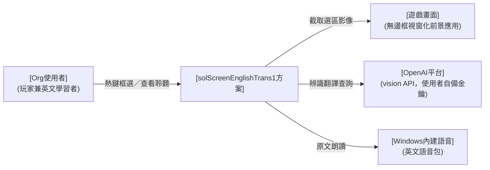
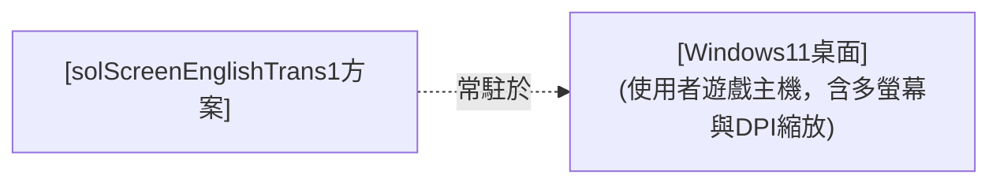
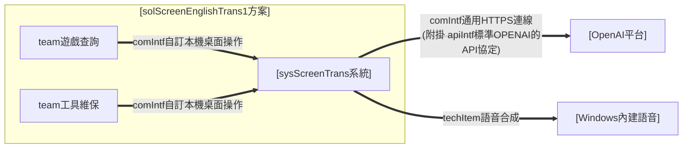
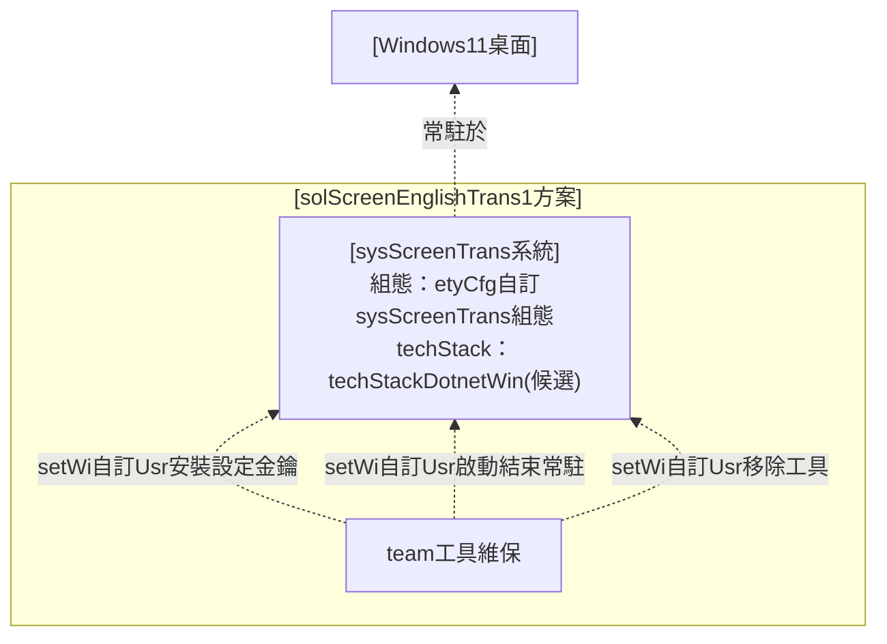
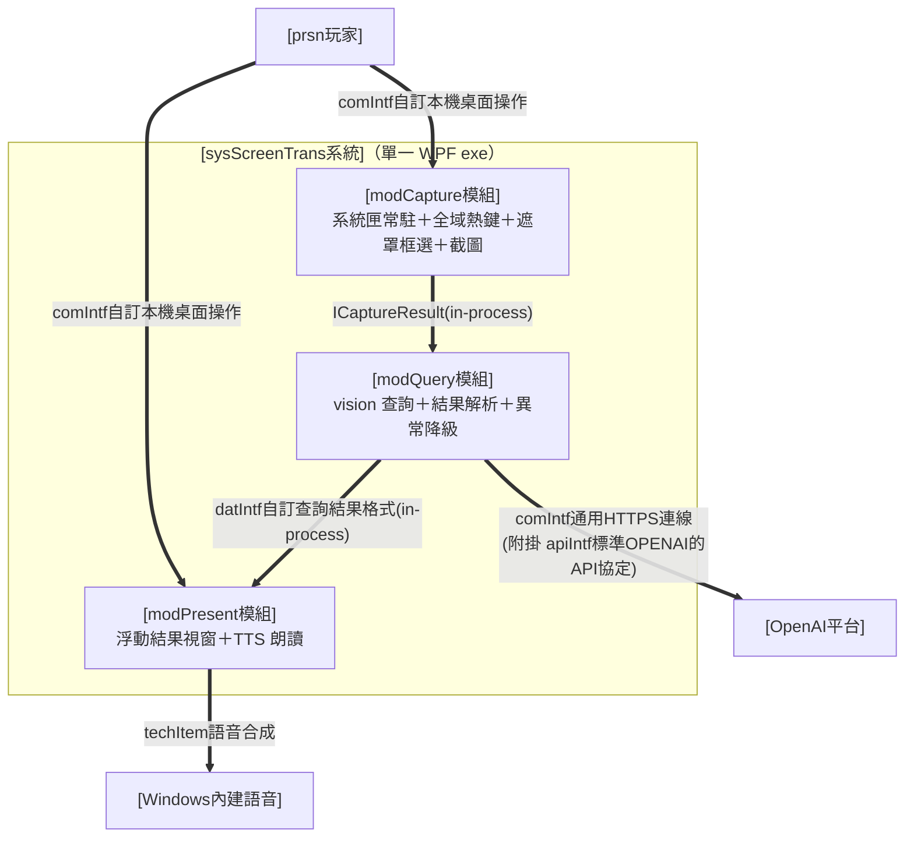
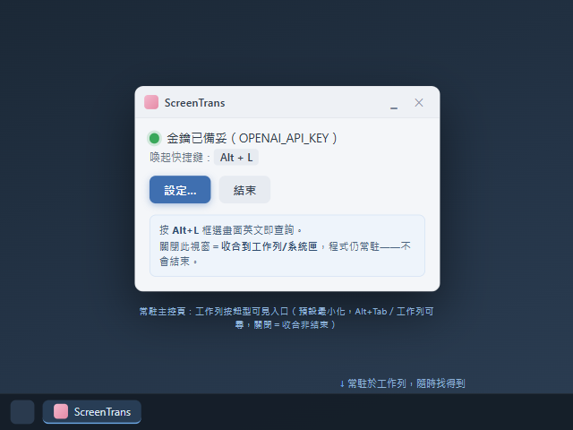

# I. 方案設計

> 需求視角；使用者之初始需求。只談「使用者是誰、做什麼、要什麼」，不預設解法。

## A. 主旨摘要

> 本節一段話定調：本層在做什麼、視角為何。（逐字繼承 Issue #1 ＜I. 緣起目的＞種子）

* 需求方為 [USR] 本人（遊戲玩家兼英文學習者）。
* 需求為：遊玩英文遊戲時，能以一組熱鍵框選畫面任意區塊，立即取得該區塊英文之原文、KK 音標、繁體中文翻譯，並可聆聽原文發音，全程不中斷遊戲。
* MVP 範圍：背景常駐＋熱鍵喚起＋變暗選區＋單次辨識翻譯查詢＋浮動視窗顯示與朗讀；不含歷史紀錄、生詞本、多語言、設定介面。

## B. 運作想定

> 本節四分：(A) 資訊架構／(B) 人員編組／(C) 動作項目／(D) 軟硬項目。(A) 先圖後條列；(B)(C) 以表格呈現。

### (A) 資訊架構

> 描述本層方案與外部之運作關係與部署環境偏好。

運作關係（sol 與外部）：

> 圖例：`-->` 需求層運作關係（正式介面契約於 ＜II＞／＜III＞ 落地）。

部署環境（需求偏好）：

> 圖例：`-.->` 部署／配置關係。

#### sol 查詢工具

solScreenEnglishTrans1 畫面選區查詢工具，對內以單一系統實現（見 ＜II＞）。

#### 外部關聯項目

遊戲畫面（查詢對象、非介接系統）、OpenAI 平台（辨識翻譯外部服務）、Windows 內建語音（朗讀引擎）。

#### 部署偏好

使用者自有 Windows 11 遊戲主機，免安裝、單一執行檔、系統匣常駐。

### (B) 人員編組

> 以表格描述本層人員／組織（Org 與外部關聯對象）：對象｜關係｜說明。

| 關聯對象 | 關係 | 說明 |
| --- | --- | --- |
| Org使用者 | 本方案使用者 | 玩家兼英文學習者，單人使用並自行維保；內部 team 見 ＜II＞ |
| 遊戲畫面 | 查詢對象 | 前景執行之英文遊戲（無邊框視窗化前提），本方案僅截取其畫面、不介接 |
| OpenAI平台 | 外部服務商 | 提供 vision 辨識翻譯服務；額度與金鑰由使用者自備 |
| Windows內建語音 | 外部依賴 | OS 內建英文語音包，供原文朗讀 |

### (C) 動作項目

> 以表格描述本層動作／SOP（orgsopcat/orgSop→teamSop→prsnSop 逐層 zoom）；編號全程上下對應。

| orgsopcat 大類 | orgSop 職責 | 說明 |
| --- | --- | --- |
| **orgsopcat#1-遊戲查詢** | orgSop#1-畫面選區查詢 | 遊戲中熱鍵喚起、框選畫面區塊、取得原文／音標／中譯、查看聆聽後返回遊戲 |
| **orgsopcat#2-系統維保** | orgSop#2-工具安裝維保 | 程式放置、金鑰設定、常駐啟動與結束、異常排除、移除 |

### (D) 軟硬項目

> 本層所需之設備、外部系統與服務（需求視角；細部選型見 C.技術選型）。

* **使用者遊戲主機**：Windows 11（或 Windows 10 1903+）桌面環境，含多螢幕與 DPI 縮放情境。
* **遊戲畫面**：以無邊框視窗化（borderless windowed）執行之英文遊戲（使用前提；獨占全螢幕不支援）。
* **OpenAI vision API**：使用者自備金鑰與額度之外部辨識翻譯服務。
* **Windows 內建語音**：OS 內建英文語音包（朗讀用，離線可用）。

## C. 組態設定

> 本節四分：(A) 技術選型／(B) 關鍵參數／(C) 人機介面／(D) 部署做法。

### (A) 技術選型

> 依 FORMAT §2.5 三層技術選型契約宣告；本層宣告系統類型 techApp。平台 techStack 與元件 techItem 見 ＜II.C.(A)＞／＜III.C.(A)＞。

* **techApp（系統類型）＝ [techApp桌面查詢工具]**（桌面即時查詢工具：常駐背景、熱鍵喚起、即查即走）：綁該契約之最低能力清單（§A：常駐輕量、喚起即時、零輸入干擾、隨時可逃、明確錯誤降級、金鑰安全、多螢幕 DPI 正確）與不干擾介面 bar（§B），逐頁審查據以判讀；不在此複述。
* **點名強制 techItem**（見 [techApp桌面查詢工具] §C，本方案輸出含發音朗讀）：[techItem語音合成]；具體選型於 ＜III.C.(A)＞ 落地。

### (B) 關鍵參數

> 列本層關鍵參數／組態（需求偏好→etyCfg→Env／appsettings）；列舉即可、不解釋。

* **金鑰**：`OPENAI_API_KEY` 一律環境變數，程式與 repo 不落地（spec#5）。
* **喚起快捷鍵**：預設 `Alt+L`（左右 Alt 皆可），**可自訂**（鍵盤組合或滑鼠鍵，存 appsettings）。
* **查詢模型**：預設 `gpt-4o-mini`，可調（appsettings）。
* **使用前提**：遊戲無邊框視窗化。

### (C) 人機介面

> 本層定**各 orgSop 走何種介面通道**，並定整體視覺（look）；互動分配見 ＜II.C.(C)＞、各頁配置見 ＜III.C.(C)＞。

各 orgSop 之介面通道：

| orgSop | 通道 | 說明 |
| --- | --- | --- |
| orgSop#1-畫面選區查詢 | **桌面原生 GUI**（遮罩 overlay＋浮動視窗） | 熱鍵喚起、鍵盤滑鼠即查即走，不開常駐主視窗 |
| orgSop#2-工具安裝維保 | **常駐主控頁（工作列按鈕型）＋系統匣選單頁（輔助）＋OS 標準設定** | 常駐時保留常顯、可 Alt+Tab／工作列尋得之主控入口（金鑰狀態／設定／結束），不受系統匣自動隱藏影響；系統匣選單為輔助入口；安裝金鑰、移除走檔案總管與環境變數設定 |

**業界常規（look，公開標準）**：Windows 桌面工具遵循 **Windows 11 Fluent Design**（Segoe UI Variable 字階、4px 間距格、圓角 8px、亮暗主題、acrylic／mica 層次），可近用性掛 **WCAG 2.1 AA** 對比；常駐工具以**工作列按鈕（taskbar button）**維持穩定可尋之入口（Alt+Tab／工作列可達，不受系統匣溢位自動隱藏影響），系統匣圖示為輔助（右鍵選單、單一實例）。

**本系統（solScreenEnglishTrans1 取捨）**：

* **遮罩**：全螢幕 45% 黑色半透明變暗、十字游標、高對比選框（accent 藍 2px＋反白遮罩差顯）、頂部中央一行操作提示——只承載「選取」一件事。
* **結果視窗**：淺粉底圓角卡片、大字；直排原文／KK 音標／中譯，英文組與中文組各有獨立播放鈕與「自動播放」勾選（勾選後框選完即朗讀）；英文原文可**逐字點選**——點某個單字即單獨發音（游標呈可點狀、整句播放鈕並存）；首次置中、之後記住使用者擺放的位置與大小；可拖曳標題移動、右下握把縮放；**失焦（切換至其他視窗對照）不自動關閉**，改由 `ESC`／關閉鈕／下一次查詢取代關閉。
* **常駐主控入口**：程式執行後保留一個**工作列按鈕型**的可見主控視窗——常顯於工作列、可 Alt+Tab／點工作列尋得，承載金鑰狀態、設定、結束；**預設最小化、不擋遊戲**，需要時還原。此入口不依賴 Win11 系統匣顯示設定，換版／換路徑後仍穩定可尋（系統匣圖示改為輔助入口）。**關閉主控視窗＝收合（最小化/隱藏至系統匣）而非結束程式**，唯明確「結束」才退出常駐。
* **偏離聲明**：本方案為桌面原生應用，不錨 [hmiIntf通用視覺規範]（MD3 web 基座、admin shell 不適用），改錨 [techApp桌面查詢工具] §B 不干擾介面 bar；可近用性維持 WCAG 精神。

主題風格示意圖（設計期參考稿、以文字為準）：

### (D) 部署做法

> 描述本層部署作法：大方向。

* **免安裝單一 exe**：self-contained 發佈，複製即用；系統匣常駐、不開主視窗。
* 開發 REPO＝`twMoonBear-Laboratory/solScreenEnglishTrans1`（私有）。
* productReadme 為自然語言操作腳本，供自然人或 AI Agent 依步驟執行。

## D. 規格效益

> 需求規格（need）＋其端對端驗收課目與效益指標；以本層需求回扣全案。need 不出現解法元件名。

### (A) 規格要求

> need（spec#N，客戶目的／營運議題／成效期待，不混工程手段；粒度一致互不包含）＋端對端驗收課目（e2eTest，以 orgSop 為驗收單元、依 productReadme）。（spec 逐字繼承 Issue #1 種子）

* **spec#1-可常駐執行、常顯可尋且熱鍵喚起**：程式常駐執行，並保留一個**常顯、可穩定尋得的可見主控入口**（工作列按鈕型，可 Alt+Tab／工作列尋得），不受 Windows 系統匣自動隱藏設定影響、換版換路徑後仍可找到程式以查看狀態與維運；主控入口**預設最小化、不擋遊戲**，**關閉主控視窗＝收合而非結束**（唯明確結束才退出）。遊戲中按喚起快捷鍵（預設 `Alt+L`、左右 Alt 皆可）即喚起查詢流程，不中斷遊戲操作；再次可用 `ESC` 隨時取消。喚起快捷鍵**可由使用者自訂**——涵蓋鍵盤組合（修飾鍵＋主鍵）與滑鼠鍵（中鍵、側鍵、左右鍵同按），於設定中以監聽方式擷取、`Esc` 取消，存回組態重啟沿用。
* **spec#2-可框選畫面查詢區塊**：喚起後全螢幕變暗，滑鼠拖曳框選欲查詢之畫面區塊，放開即完成選取；多螢幕與 DPI 縮放環境下選區對位正確。
* **spec#3-可辨識並翻譯選區英文**：對選區影像內之英文進行辨識，回傳英文原文、KK 音標、繁體中文翻譯三項內容。
* **spec#4-可查看並聆聽查詢結果**：查詢結果以浮動視窗顯示（原文／音標／中譯），提供播放按鈕以 Windows 內建語音朗讀英文原文與中文翻譯、並可選擇朗讀語音（離線可用、免額度）；英文原文並可**逐字點選單獨發音**（整句朗讀與單字發音並存，方便聆聽個別生字），`ESC` 關閉視窗。
* **spec#5-查詢使用自備額度且金鑰不落地**：辨識翻譯使用 [USR] 自備之 OpenAI API 額度（讀 `OPENAI_API_KEY` 環境變數），程式與 repo 不儲存任何金鑰。

**端對端驗收課目（e2eTest，依 productReadme，每 orgSop 至少一案，回扣 orgSop／spec）**：

* **e2eTest#01-工具安裝維保**（依 orgSop#2、docProgTest#01）：放置 exe、設定金鑰、啟動常駐、確認**工作列常駐主控入口可尋（Alt+Tab／工作列）**與熱鍵可用、關主控視窗僅收合不結束、明確結束、移除 → 全程依 README 可完成、無殘留。
* **e2eTest#02-畫面選區查詢一圈**（依 orgSop#1、docProgTest#02）：於無邊框視窗化前景應用按 `Alt+L`、框選英文區塊、等待查詢、查看三欄結果、播放整句朗讀並點選單字聆聽發音、`ESC` 關閉返回 → 全圈閉合、選區對位正確、結果三欄齊備、整句與單字發音皆可用、`ESC` 任一階段可逃。

### (B) 效益指標

> 每條 spec 一項追蹤指標（評估方式／觀察項目），**回扣本需求**。

* **spec#1**：常駐閒置記憶體（<100MB）、熱鍵喚起延遲（<300ms）與成功率、遊戲操作是否被中斷；自訂快捷鍵（含滑鼠低階 hook 情境）下對全系統輸入之延遲影響（滑鼠移動/點擊順暢、無可感延遲）與各類組合擷取正確率；常駐主控入口之可尋性（換版／換路徑後仍以工作列／Alt+Tab 找到程式、不需重設系統匣顯示）與「關視窗＝收合非結束」行為正確性。
* **spec#2**：多螢幕與 DPI 縮放下選區對位誤差（0px 目標）、`ESC` 取消成功率。
* **spec#3**：辨識翻譯正確性抽測（遊戲字型樣本）、單次查詢延遲（1～3 秒目標）。
* **spec#4**：結果三欄位齊備率、Windows 語音播放成功率（離線、無金鑰／無網路亦可）、語音選擇生效與重複播放行為正確性；單字點選發音之命中正確性（點中的詞即為朗讀詞、標點不誤讀、整句與單字發音並存）。
* **spec#5**：金鑰不落地稽核（repo／程式檔／設定檔掃描無金鑰）、單次查詢成本觀察。

# II. 系統設計

> 視角＝team。自 ＜I＞ 的 Org／orgSop 解析出團隊（team）與其作業（teamSop），並界定方案下屬之系統（sys）。不出現 prsn／module。

## A. 主旨摘要

> 本節一段話定調：本層在做什麼、視角為何。

方案以單一桌面常駐系統 [sysScreenTrans系統] 承接需求，核心為**三段管線**：**capture**（常駐熱鍵→遮罩框選→選區截圖）→ **query**（單次 vision 查詢→結構化三欄結果）→ **present**（浮動視窗顯示＋TTS 朗讀）。管線各段責任分離、以資料契約銜接；query 段之供應商（模型名稱、prompt）走組態可抽換，為本案之擴充機制。**方法論偏離（本案不套核／殼 OODA，待 USR 於 Draft PR 裁決）**：本方案 techApp＝[techApp桌面查詢工具]（非指管管理系統），FORMAT §2 核／殼 OODA 模型與域完整性（硬規則⑥）不適用——無管理閉環、無領域殼、無任務域、無 Measure；改以上述三段管線＋供應商可抽換為擴充機制。人機介面亦不錨 MD3 web admin shell、改錨 Windows 11 Fluent（詳 ＜I／III.C.(C)＞）；techStack 採候選契約 [techStackDotnetWin]（家規四選一無桌面選項，詳 ＜C.(A)＞）。MVP 實例化範圍＝單次查詢一圈做深做透。

## B. 運作想定

> 本節四分：(A) 資訊架構／(B) 人員編組／(C) 動作項目／(D) 軟硬項目。(A) 先圖後條列；(B)(C) 以表格呈現。

### (A) 資訊架構

> 先圖後條列，描述本層系統與其組成（方案→sys 逐層 zoom）。

運作架構圖（方案內含人員＋系統，sol 下屬 sys）：

> 圖例：`==>` 通訊／承載（線上標 comIntf 契約名，apiIntf 並列附掛）。

組態架構圖（techStack 以文字標於建置單元方框）：

> 圖例：`-.->` 配置作業（線上標 setWi）、techStack 選型（文字標記）。

* **sol 下屬 sys**：[sysScreenTrans系統]——實現常駐熱鍵、遮罩框選截圖、vision 查詢與結果呈現朗讀之單一系統；內部 module 見 ＜III＞。
  * **對外保證**（機制見 ＜III.B.(A)＞）：喚起即時且零輸入干擾（spec#1）、選區對位正確（spec#2）、查詢結果三欄齊備或明確錯誤降級（spec#3）、隨時可逃（spec#1／#4）、金鑰不落地（spec#5）。
* **管線契約（pipeline contract；本案擴充機制，取代核／殼契約之位置）**：三段各以資料契約銜接、責任不互滲——
  * 〔capture〕輸入＝熱鍵事件／滑鼠拖曳；輸出＝選區影像（實際像素對位）。不認查詢語意。
  * 〔query〕輸入＝選區影像；輸出＝[datIntf自訂查詢結果格式]（原文／音標／中譯）。供應商、模型、prompt 走組態抽換，不動 capture／present。
  * 〔present〕輸入＝[datIntf自訂查詢結果格式]；輸出＝浮動視窗與 TTS 播放。不認辨識來源。
* **異常降級一致**：金鑰缺失、網路失敗、逾時、回應不合格式，一律於 present 段顯示明確可讀錯誤與下一步指引（[runWi自訂Sys辨識翻譯選區]），程式續存活。

### (B) 人員編組

> 以表格描述本層團隊編成（Org 下屬 team）：team｜上級／編成位置｜職責。單人方案：兩 team 皆由 [Org使用者] 本人擔任（角色分工、非多人）。

| team | 上級／編成位置 | 職責 |
| --- | --- | --- |
| team遊戲查詢（#1） | Org使用者（遊戲中） | 熱鍵喚起、框選查詢、查看聆聽結果 |
| team工具維保（#2） | Org使用者（維保時） | 程式放置、金鑰設定、常駐啟動結束、移除 |

### (C) 動作項目

> 以表格描述本層動作／SOP；每條 orgSop 由其 team 承接為多條 teamSop。

> **derived 標記**：本層 teamSop 為 ＜III＞ prsnSop 之上捲視圖（維護改 III、此處重生），勿獨立增刪；編號全程上下對應。

| team（承 orgSop#） | teamSop |
| --- | --- |
| team遊戲查詢（#1） | teamSop#1.1-熱鍵喚起與框選擷取 teamSop#1.2-辨識翻譯查詢 teamSop#1.3-結果查看與朗讀 |
| team工具維保（#2） | teamSop#2.1-安裝與金鑰設定 teamSop#2.2-常駐啟動與結束 teamSop#2.3-工具移除 |

### (D) 軟硬項目

> 本層方案所依賴之平台與服務。

* **執行平台**：Windows 11 桌面（多螢幕、DPI 縮放），免安裝單一 exe 常駐。
* **外部服務**：OpenAI vision API（[comIntf通用HTTPS連線]＋[apiIntf標準OPENAI的API協定]，使用者自備金鑰；僅辨識翻譯使用）。
* **OS 內建能力**：Windows 內建語音（[techItem語音合成]，朗讀主路徑、離線可用免金鑰）、全域熱鍵、螢幕擷取、系統匣。

## C. 組態設定

> 本節四分：(A) 技術選型／(B) 關鍵參數／(C) 人機介面／(D) 部署做法。

### (A) 技術選型

> 平台 techStack（承 ＜I.C.(A)＞ techApp=桌面查詢工具）；標於 ＜B.(A)＞ 組態架構圖。見 FORMAT §2.5。

* **techStack（平台）＝ [techStackDotnetWin]（候選契約，待家規裁決）**：.NET 8＋WPF、self-contained 單一 exe、手動放置部署。現行家規四選一（StaticWeb／ReactWeb／NodeSys／PythonSys）皆為 web／伺服器類、無法承載原生桌面需求（全域熱鍵、螢幕擷取、系統匣），故以候選契約提出、隨本增量 Draft PR 請 USR 裁決入庫。
* **techItem（元件，承 [techApp桌面查詢工具] 強制）**：[techItem語音合成]（原文朗讀）；具體版本／用法見 ＜III.C.(A)＞。

### (B) 關鍵參數

> 列本層關鍵參數／組態；列舉即可、不解釋。

* [etyCfg自訂sysScreenTrans組態]：`OPENAI_API_KEY`（Env、機密）、`paramHotkey`（appsettings 結構化喚起快捷鍵綁定，預設 `Alt+L`；可為鍵盤組合或滑鼠鍵，取代原硬編碼）、`paramModel=gpt-4o-mini`／`paramQueryTimeoutSec=15`／`paramQueryMaxRetries=2`／`paramTtsVoice=系統預設英文語音`（appsettings；`paramQueryMaxRetries` 為查詢暫時性錯誤之最大重試次數；語音朗讀改用 Windows 內建語音、不再有 TTS 供應商參數）。

### (C) 人機介面

> 本層定**各 teamSop 的功能如何分配到互動面**（IA）；整體視覺見 ＜I.C.(C)＞、各頁配置見 ＜III.C.(C)＞。

**業界常規（IA，公開標準）**：桌面常駐工具無導覽樹（非管理網站，MD3 adaptive navigation 不適用——偏離見 ＜II.A＞）；查詢採 **hotkey-first 狀態流**（Windows tray app＋Snipping Tool 選取慣例）：常駐 → 熱鍵喚起（遮罩）→ 框選（橡皮筋）→ 查詢（進度）→ 結果（卡片）→ 關閉返回。**維運入口**由「僅系統匣選單」改為以**常駐主控頁（工作列按鈕型）為第一線可見入口**、系統匣選單為輔助——確保換版換路徑後仍穩定可尋（不受系統匣自動隱藏影響）。**NN/g progressive disclosure** 精神落於「查詢動線平時零 UI、按需現身；維運入口常顯但預設最小化、不擋遊戲」。

**導覽衍生（IA ⟵ SOP；硬規則④之桌面對應）**：`teamSop#1.1→選區遮罩頁`、`teamSop#1.2／#1.3→查詢結果頁`、`teamSop#2.2／#2.3→常駐主控頁（系統匣選單頁為輔助鏡像）`；`teamSop#2.1`（安裝金鑰）走 OS 標準設定、不在本系統 UI 內。

**反擁擠定調**：遮罩只做選取、結果視窗只做呈現與朗讀、常駐主控頁與系統匣選單只做維運（金鑰狀態／設定／結束）；嚴禁把設定、歷史、選項塞進查詢動線。主控頁與系統匣選單為同一組維運動作之兩個入口鏡像，動作來源單一、不各寫一份。

版面設定示意圖（涵蓋遊戲查詢與工具維保兩域之互動面；設計期參考稿、以文字為準）：

### (D) 部署做法

> 描述本層部署作法。

* **首版實作範圍（MVP）**：單次查詢一圈（常駐→熱鍵→框選→查詢→顯示朗讀→關閉）做深做透，過逐頁審查後才擴充。
* **方案層（e2e 環境）**：於 Windows 11 實機以發佈之單一 exe 執行 ＜III.D＞ intTest 與 ＜I.D＞ e2eTest。
* 各建置單元之建置／測試／部署指令見 ＜III.C.(D) 部署做法＞。

## D. 規格效益

> 系統層工程驗證（規格要求＝品管測試）；效益回扣需求層。

### (A) 規格要求

> 系統層品管測試：組態符合性（cfgTest）與文件程式化（docProgTest）。

**組態符合性測試（cfgTest）**：

| 代號 | 測試對象 | 通過判定 |
| --- | --- | --- |
| cfgTest#01 | [etyCfg自訂sysScreenTrans組態] | 實作與部署組態符合契約規範（金鑰僅環境變數、appsettings 預設值正確） |

**文件程式化測試（docProgTest）**（通過判定皆為「自然人或 AI Agent 可依 productReadme 完成對應流程」）：

* **docProgTest#01-工具安裝維保**（orgSop#2）：放置 exe、設定金鑰、啟動常駐、結束、移除。
* **docProgTest#02-畫面選區查詢一圈**（orgSop#1）：熱鍵喚起、框選、查詢、查看聆聽、關閉返回。

### (B) 效益指標

> 系統層效益回扣需求層；指標正本見 ＜I.D.(B) 效益指標＞（每 spec 一項），本層不重列、僅標承接。

* 本層之 cfgTest／docProgTest 全綠為「系統設計可被工程驗證」之效益門檻；對 spec#1–5 之成效量測沿用 ＜I.D.(B)＞，不另立指標（硬規則①，不重抄）。

# III. 模組設計

> 視角＝prsn。自 ＜II＞ 的 team／teamSop 解析出一線操作者（prsn）與其工作項（WI），並界定模組（module）與模組間介面。系統＝[sysScreenTrans系統]。

## A. 主旨摘要

> 本節一段話定調：本層在做什麼、視角為何。

[sysScreenTrans系統] 為單一 WPF exe，內部由三模組構成（單一 csproj、以資料夾＋namespace 分模組）：[modCapture模組] **常駐與擷取**——常駐主控入口（工作列按鈕型可見主控視窗，承載金鑰狀態／設定／結束、關視窗僅收合不結束）＋系統匣輔助入口、`RegisterHotKey` 全域熱鍵、全螢幕變暗遮罩與橡皮筋框選、實際像素對位截圖；[modQuery模組] **辨識翻譯查詢**——依 [apiIntf標準OPENAI的API協定] 單次 vision 呼叫、解析為 [datIntf自訂查詢結果格式]、異常降級；[modPresent模組] **呈現與朗讀**——浮動結果視窗、[techItem語音合成] TTS 播放。模組間以 C# interface（in-process）銜接，邊界對齊 ＜II＞ 管線契約；模組內部留白歸 code。

## B. 運作想定

> 本節四分：(A) 資訊架構／(B) 人員編組／(C) 動作項目／(D) 軟硬項目。(A) 先圖後條列；(B)(C) 以表格呈現。

### (A) 資訊架構

> 先圖後條列，描述本層系統與其組成（sys 下屬 module）。

運作架構圖（sys 下屬 module）：

> 圖例：`==>` 通訊／呼叫（線上標契約名；模組間為 in-process C# interface，機器可驗全文歸 code）。

組態架構圖：

> 圖例：`-->` 參數相依（標 param）、`-.->` 配置作業（標 setWi）、techStack 選型（文字標記）。

* **sys 下屬 module**：[modCapture模組]、[modQuery模組]、[modPresent模組]（皆隸屬單一 WPF exe；[techStackDotnetWin] 候選）。
  * **[modCapture模組] 選區對位契約**（spec#2）：遮罩視窗覆蓋全部螢幕（含多螢幕虛擬桌面）；框選座標以**實際像素**（physical pixels）換算（Per-Monitor DPI aware），截圖直接取螢幕實際像素區塊。**invariant**：選區影像與使用者所見框選範圍 0px 偏移；任一螢幕、任一 DPI 縮放皆同。
  * **[modCapture模組] 喚起快捷鍵契約**（spec#1）：喚起快捷鍵可自訂，依綁定型別選後端——**鍵盤組合**（修飾鍵＋主鍵）以 `RegisterHotKey` 註冊（**鍵盤仍禁低階鍵盤 hook**，維持零延遲）；**滑鼠鍵**（中鍵、側鍵 `XButton1`／`XButton2`、左右鍵同按）以低階滑鼠 hook `WH_MOUSE_LL` 偵測——**放寬原「禁低階 hook」限制、僅限滑鼠**。低階滑鼠 hook callback **僅比對當前綁定、其餘事件即刻 `CallNextHookEx` 放行**，不阻塞、不改寫輸入；程式結束時 `UnhookWindowsHookEx`／`UnregisterHotKey` 釋放。設定期以獨立**監聽模式**（同時擷取鍵盤與滑鼠事件、`Esc` 取消）擷取綁定，與執行期註冊為兩條獨立路徑。兩後端對外統一以 `HotKeyPressed` 事件呈現，喚起接線不變。**invariant**：鍵盤路徑對全系統輸入零延遲影響；滑鼠低階 hook 對滑鼠移動/點擊無可感延遲（callback 輕量放行）且確保釋放不外洩；綁定被占用或無法註冊時明確提示。
  * **[modCapture模組] 常駐主控入口契約**（spec#1）：程式常駐時提供一個**工作列按鈕型**可見主控視窗（`ShowInTaskbar=true`），承載金鑰狀態、設定、結束等維運動作；**啟動時建立、預設最小化**（不搶焦、不擋遊戲），可經 Alt+Tab／點工作列還原。**關閉（✕）＝收合**（最小化或隱藏至系統匣）**而非結束程式**，唯明確「結束」才 `Shutdown` 退出常駐；`ShutdownMode` 仍為 `OnExplicitShutdown`。系統匣圖示與右鍵選單保留為**輔助入口**，與主控視窗共用**同一組維運動作來源**（單一事實、不各寫一份）。**invariant**：常駐期間主控入口恆可經工作列／Alt+Tab 尋得（不依賴 Win11 系統匣顯示設定，換版換路徑後仍可尋）；關主控視窗不結束常駐、熱鍵續有效；明確結束才釋放熱鍵與系統匣、無殘留；單一實例下不重複建立主控視窗。
  * **[modQuery模組] 查詢契約**（spec#3／#5）：單次 vision 呼叫附結構化輸出要求，回應以 JSON schema 驗證為 [datIntf自訂查詢結果格式]（JSON 三欄位皆必要：`original` 英文原文／`phonetic` KK 音標／`translation` 繁中翻譯，型別皆 string；缺一即判不合格式、走降級；選區無可辨識英文時三欄皆回空字串、呈現層顯示「未偵測到英文文字」）；金鑰僅自環境變數讀取、不寫任何檔案與日誌。**暫時性錯誤重試（retry/backoff）**：對**暫時性**失敗（連線中斷、逾時、HTTP 429、HTTP 5xx）以有限次數指數退避自動重試（`paramQueryMaxRetries` 次、預設 2，退避約 1s／2s）；**永久性**失敗（401 金鑰無效、400／其他 4xx 請求錯誤、回應格式解析失敗）**不重試**、立即走降級；使用者主動取消（`CancellationToken`）不視為暫時性錯誤。**invariant**：三欄齊備或走異常降級（[runWi自訂Sys辨識翻譯選區]）；暫時性錯誤於次數上限內自動恢復、永久性錯誤不因重試拖長等待；查詢逾時秒數恆為正（不當組態於 [etyCfg自訂sysScreenTrans組態] 讀取邊界淨化，見 ＜C.(B)＞），逾時機制不因非正值即刻取消而失效；程式檔／設定檔／日誌掃描無金鑰。
  * **[modPresent模組] 呈現契約**（spec#4）：結果視窗 topmost；首次置中、之後記住使用者擺放的位置與大小（跨啟動、存 `%APPDATA%\ScreenTrans\ui-state.json`）；可拖曳標題移動、右下握把縮放；TTS（Windows 內建語音 SAPI，語音可於設定選擇）非同步播放、中英可各自播放與自動播放、重複觸發先停再播；`ESC`／關閉鈕／下一次查詢取代關閉（**失焦（Deactivated）不自動關閉**，切換視窗對照時結果保留）；**同時至多一個結果視窗——下一次查詢開始時，前一結果視窗由喚起流程關閉取代**。**逐字發音**：英文原文以逐字可點呈現，點選任一單字即以 `en-US` 單獨朗讀（重複觸發先停再播），整句播放鈕與自動播放並存；單字切分依空白分詞、剝除前後標點、保留原詞內部撇號／連字號與大小寫（切分為不依賴 UI 之純函式、可單元測試）。**invariant**：UI 執行緒不阻塞；關閉後無殘影視窗；切換視窗對照（失焦）時結果視窗保留、不自動關閉；同一時間至多一個結果視窗（下一次查詢取代前一個、無殘留堆疊）；點選之單字即為朗讀之詞（前後標點不誤入、原詞不變形）、整句朗讀不受逐字互動影響。
  * **單一實例 invariant**：重複啟動偵測既有實例並提示，不重複註冊熱鍵。
* **模組間介面（in-process）**：[modCapture模組]→[modQuery模組]＝`ICaptureResult`（選區影像＋來源螢幕資訊）；[modQuery模組]→[modPresent模組]＝[datIntf自訂查詢結果格式]（成功）或錯誤描述（降級）。C# interface 簽章歸 code。
* **對外介面**：[modQuery模組]→OpenAI＝[comIntf通用HTTPS連線]＋[apiIntf標準OPENAI的API協定]；[modPresent模組]→Windows 語音＝[techItem語音合成]。

### (B) 人員編組

> 逐 team 列出一線人員（prsn）。單人方案：prsn玩家＝[Org使用者] 本人；**組長督核不適用**（無多人分權，偏離 FORMAT §5 `.2 組長督核` 慣例，詳 ＜II.A＞）。

| team | prsn（執行） | 備註 |
| --- | --- | --- |
| team遊戲查詢（#1） | prsn玩家 | 遊戲中即查即走 |
| team工具維保（#2） | prsn玩家 | 維保時段自行操作 |

### (C) 動作項目

> 每條 ＜II＞ teamSop#N.M 由 prsnSop#N.M.1 承接（單人方案無 `.2` 督核）；surface 見 ＜C.(C)＞。

| team | teamSop | prsnSop（執行） |
| --- | --- | --- |
| **team遊戲查詢（#1）** prsn玩家 | teamSop#1.1 | prsnSop#1.1.1〔prsn玩家·選區遮罩頁〕熱鍵喚起並框選〔[runWi自訂Usr熱鍵喚起框選]〕 |
| | teamSop#1.2 | prsnSop#1.2.1〔prsn玩家·查詢結果頁〕確認查詢進行與結果送達〔[runWi自訂Sys辨識翻譯選區]〕 |
| | teamSop#1.3 | prsnSop#1.3.1〔prsn玩家·查詢結果頁〕查看聆聽並關閉〔[runWi自訂Usr查看聆聽結果]〕 |
| **team工具維保（#2）** prsn玩家 | teamSop#2.1 | prsnSop#2.1.1〔prsn玩家·OS 標準設定〕放置程式並設定金鑰〔[setWi自訂Usr安裝設定金鑰]〕 |
| | teamSop#2.2 | prsnSop#2.2.1〔prsn玩家·常駐主控頁〕啟動、尋得、收合與結束常駐〔[setWi自訂Usr啟動結束常駐]〕 |
| | teamSop#2.3 | prsnSop#2.3.1〔prsn玩家·OS 標準設定〕移除程式與金鑰〔[setWi自訂Usr移除工具]〕 |

### (D) 軟硬項目

> 本層部署所需之具體元件。

* **Windows 原生 API**：`RegisterHotKey`／`UnregisterHotKey`（鍵盤全域熱鍵）、`SetWindowsHookEx(WH_MOUSE_LL)`／`UnhookWindowsHookEx`／`CallNextHookEx`（滑鼠鍵綁定，僅比對後放行）、GDI＋螢幕擷取（實際像素）、系統匣（NotifyIcon，輔助入口）、WPF 常駐主控視窗（`ShowInTaskbar=true`＋`WindowState.Minimized` 啟動、`Closing` 攔截改收合）、Per-Monitor DPI awareness。
* **語音合成**：`System.Speech.Synthesis`（SAPI，離線免金鑰）；語音以 `GetInstalledVoices()` 列舉供選擇。
* **外部端點**：OpenAI vision API（HTTPS）。

## C. 組態設定

> 本節四分：(A) 技術選型／(B) 關鍵參數／(C) 人機介面／(D) 部署做法。

### (A) 技術選型

> 各 module 之 techItem 具體選型／版本（承 ＜II.C.(A)＞ techStack、落地 ＜I.C.(A)＞ techApp 強制項）。

* [modCapture模組]：.NET 8 WPF＋Win32 P/Invoke（`RegisterHotKey`／`UnregisterHotKey`／`GetDpiForMonitor`；滑鼠鍵綁定另用 `SetWindowsHookEx(WH_MOUSE_LL)`／`UnhookWindowsHookEx`／`CallNextHookEx`）＋`System.Drawing.Graphics.CopyFromScreen`（截圖）＋`Hardcodet.NotifyIcon.Wpf`（或 WinForms `NotifyIcon`，系統匣）。喚起快捷鍵綁定以可序列化 model（修飾鍵集合＋鍵盤主鍵 或 滑鼠鍵）存 `paramHotkey`，[HotKeyService] 依綁定型別選 `RegisterHotKey`／`WH_MOUSE_LL` 後端、統一 `HotKeyPressed` 事件。
* [modQuery模組]：`HttpClient`（內建）＋`System.Text.Json`（解析與 schema 驗證）；OpenAI chat completions vision（structured output），模型預設 `gpt-4o-mini`；暫時性錯誤以自寫指數退避重試迴圈（不引入第三方套件），送出單次請求與退避延遲皆接縫化以供單元測試注入。
* [modPresent模組]：WPF 視窗＋**語音合成**＝[techItem語音合成]：`System.Speech.Synthesis`（SAPI，離線、免金鑰、零外部依賴）朗讀，中英佇列循序播放；語音以 `SpeechSynthesizer.GetInstalledVoices()` 列舉、由設定選定並存 `paramTtsVoice`（`SelectVoice`）；語音缺失時明確提示、不當機。

### (B) 關鍵參數

> 列本層關鍵參數／組態；列舉即可、不解釋。

* **Env**：`OPENAI_API_KEY`（[modQuery模組]；僅此一機密；可經系統匣「設定…」寫入使用者環境變數，仍不落地於程式／設定檔）。
* **appsettings.json**：`paramModel=gpt-4o-mini`、`paramQueryTimeoutSec=15`（查詢逾時秒數；**非正值（≤0）於組態讀取邊界套用安全下限 15**，令逾時機制不致因不當組態即刻取消而失效）、`paramQueryMaxRetries=2`（查詢暫時性錯誤最大重試次數；0＝不重試）、`paramTtsVoice=`（空＝系統預設英文語音；值為 `GetInstalledVoices()` 列舉之語音名稱）。
* **appsettings.json（喚起快捷鍵）**：`paramHotkey`＝可序列化綁定（預設 `Alt+L`）——鍵盤組合以修飾鍵集合＋主鍵表達、滑鼠鍵以中鍵／`XButton1`／`XButton2`／左右同按表達；於系統匣「設定」監聽擷取、`Esc` 取消，存回後重啟沿用。

### (C) 人機介面

> 本層從 prsn 歸納出**具名頁面**（桌面 surface）：每頁以「領域+功能+頁」命名、標明管線階段；版型循 [techApp桌面查詢工具] §B 不干擾介面 bar 與 Windows 11 Fluent Design。

**業界常規（page，公開標準）**：遮罩選取循 Snipping Tool／PowerToys 慣例（變暗底＋橡皮筋＋十字游標）；浮動卡片循 Fluent acrylic 卡片（圓角、細邊框）；常駐主控頁循 Windows 常駐工具之工作列按鈕視窗慣例（`ShowInTaskbar`、最小化收合、關閉≠結束）；系統匣選單頁循 Windows tray 慣例；鍵盤可近用性（`ESC` 一致取消）掛 WCAG 精神。

**本系統頁面清單**（MVP）：

| 頁面 | 導覽（teamSop） | 管線階段 | 版型＋主要元素 | prsnSop | surface |
| --- | --- | --- | --- | --- | --- |
| 選區遮罩頁 | 遊戲查詢／teamSop#1.1 | capture | 全螢幕 45% 變暗遮罩＋十字游標＋accent 橡皮筋選框（差顯反白）＋頂部一行提示（`拖曳框選要查詢的文字，ESC 取消`） | #1.1.1 | 桌面 overlay（topmost） |
| 查詢結果頁 | 遊戲查詢／teamSop#1.2·1.3 | query＋present | 淺粉底圓角大字卡片（可縮放、記住位置大小；預設約 560×380）：查詢中＝`辨識翻譯中…`；完成＝三區直排（原文／KK 音標／中譯），英文原文逐字可點（點詞即單獨發音、游標呈可點狀），英文組與中文組各附獨立整句播放鈕與「自動播放」勾選；失敗＝錯誤訊息＋下一步指引 | #1.2.1·#1.3.1 | 桌面浮動視窗（topmost、可拖曳縮放） |
| 常駐主控頁 | 工具維保／teamSop#2.2 | 維運 | **工作列按鈕型**小型主控視窗（Fluent 卡片、約 360×260、預設最小化）：金鑰狀態（備妥／缺失）、目前喚起快捷鍵、「設定…」「結束」按鈕、一行使用提示（`按 <快捷鍵> 框選查詢；關閉此視窗僅收合、不結束`）；`ShowInTaskbar`、Alt+Tab 可尋，關閉（✕）＝收合非結束 | #2.2.1 | 桌面視窗（工作列按鈕、可最小化） |
| 系統匣選單頁（輔助） | 工具維保／teamSop#2.2·2.3 | 維運 | tray 圖示右鍵選單（**主控頁之輔助鏡像**）：狀態列（金鑰備妥／缺失）、開啟主控頁、設定（金鑰→使用者環境變數、朗讀語音選單〔Windows 已安裝語音〕、查詢模型、**喚起快捷鍵**〔顯示當前綁定＋「變更」進入監聽模式擷取鍵鼠組合、`Esc` 取消〕）、關於、結束 | #2.2.1 | 系統匣 |

> **設計原則**：每頁只服務一個專業目的（遮罩＝選取、卡片＝呈現朗讀、主控頁/tray＝維運）；常駐主控頁與系統匣選單頁為**同一組維運動作之兩個入口鏡像**（動作來源單一），主控頁為第一線常顯入口、tray 為輔助。安裝金鑰與移除（#2.1.1／#2.3.1）走 OS 標準設定（檔案總管＋環境變數），非本系統頁面。`prsnSop→頁` 以 ＜B.(C)＞ 為準、本節為反查。

頁面設計示意圖（每具名頁一張；設計期參考稿、以文字為準）：

### (D) 部署做法

> 建置／測試／部署指令（繼承 techStack；GATE 由此取建置/測試指令）。

* [sysScreenTrans系統]：繼承 [techStackDotnetWin]（候選）——**建置指令** `dotnet build -c Release`、**發佈指令** `dotnet publish -c Release -r win-x64 --self-contained -p:PublishSingleFile=true`、**測試指令** `dotnet test`、**部署方法** 單一 exe 手動放置（免安裝）。
* **方案層**：於 Windows 11 實機以發佈 exe 跑 intTest／e2eTest。

## D. 規格效益

> 模組層工程驗證（規格要求＝品管測試）；效益回扣需求層。intTest 以遞增基底層層堆疊。

### (A) 規格要求

> 模組層品管測試：遞增整合（intTest）。另模組層單元測試（query 解析、選區座標換算、present 段英文單字切分純函式〔標點剝除／撇號連字號與大小寫保留／多空白邊界〕等，涵蓋度目標 ≥80%）與介面測試（datIntf 契約一致）全文歸 code。

**遞增整合測試（intTest）**：

| # | 驗證 WI | 基底 | 步驟 → 預期 |
| --- | --- | --- | --- |
| 01 | setWi自訂Usr安裝設定金鑰 | 無 | 發佈 exe、設 `OPENAI_API_KEY` → 檔案就位、環境變數存在非空 |
| 02 | setWi自訂Usr啟動結束常駐 | 01 | 啟動 exe → 常駐主控入口以工作列按鈕呈現（Alt+Tab 可尋）、預設最小化不擋畫面、系統匣圖示出現；明確結束 → 程序退出、熱鍵與系統匣釋放；重複啟動 → 單一實例提示、不重複建立主控視窗 |
| 03 | runWi自訂Usr熱鍵喚起框選（喚起） | 02 | 按 `Alt+L`（左右各測） → 遮罩 <300ms 出現；按 `ESC` → 遮罩消失、無殘影 |
| 04 | runWi自訂Usr熱鍵喚起框選（框選） | 03 | 拖曳框選 → 取得選區影像；多螢幕／125%／150% DPI 下與框選範圍 0px 偏移 |
| 05 | runWi自訂Sys辨識翻譯選區（成功） | 04 | 以含英文之測試影像查詢 → 回應解析為三欄齊備之 [datIntf自訂查詢結果格式] |
| 06 | runWi自訂Sys辨識翻譯選區（降級／重試） | 02 | 未設金鑰／400／401 → 立即明確錯誤、不重試；斷網／逾時／429／5xx → 有限次指數退避重試後成功則正常顯示、耗盡仍失敗則明確錯誤；全程程式續存活（暫時性重試後成功、永久性不重試之分類另有模組層單元測試涵蓋） |
| 07 | runWi自訂Usr查看聆聽結果（顯示） | 05 | 結果視窗顯示三區內容 → 與查詢結果一致；可拖曳移動與縮放、關閉後再開還原上次位置大小 |
| 08 | runWi自訂Usr查看聆聽結果（朗讀） | 07 | 點播放 → Windows 語音播放呼叫發生（測試攔截驗證，無網路／無金鑰亦可）；於設定選擇語音 → 後續播放採該語音（缺語音時提示不當機）；重複點 → 先停再播；切換到其他視窗（失焦）→ 結果視窗保留不自動關閉；`ESC`／關閉鈕 → 視窗關閉；連續再查一次 → 前一結果視窗由喚起流程關閉取代（同時至多一個）|
| 09 | setWi自訂Usr移除工具 | 02 | 刪除 exe＋環境變數 → 無殘留檔案、程序、開機項 |
| 10 | runWi自訂Usr熱鍵喚起框選（自訂快捷鍵） | 02 | 設定→變更快捷鍵→監聽模式：按鍵盤組合（如 `Ctrl+Shift+F`）→ 顯示並存綁定，重啟後以該組合喚起遮罩；改綁滑鼠鍵（中鍵／側鍵／左右同按）→ 以該滑鼠鍵喚起、且滑鼠一般移動點擊無可感延遲；監聽中按 `Esc` → 取消不變更；存設定後 `paramQueryMaxRetries`／既有值不被重置 |
| 11 | runWi自訂Usr查看聆聽結果（單字發音） | 07 | 點選英文原文中任一單字 → Windows 語音以該單字（`en-US`）單獨播放呼叫發生（測試攔截驗證，無網路／無金鑰亦可）；含標點之詞（如 `world.`／`"quote"`／`it's`／`co-op`）→ 朗讀詞為剝除前後標點後之原詞、內部撇號/連字號與大小寫保留；點選單字後整句播放鈕仍可用、自動播放不受影響 → 逐字與整句發音並存 |
| 12 | setWi自訂Usr啟動結束常駐（常駐主控入口） | 02 | 啟動 → 主控視窗以工作列按鈕呈現、Alt+Tab／點工作列可還原，顯示金鑰狀態與當前喚起快捷鍵；按主控視窗 ✕（關閉）→ 收合（最小化/隱藏），程序續存、熱鍵仍可喚起遮罩；經主控頁或系統匣「結束」→ 退出常駐、熱鍵與系統匣釋放、無殘留；換資料夾（模擬換版/換路徑）重啟 → 仍以工作列／Alt+Tab 尋得、不需重設系統匣顯示 |

### (B) 效益指標

> 模組層效益回扣需求層；指標正本見 ＜I.D.(B) 效益指標＞（每 spec 一項），本層不重列、僅標承接。

* 本層之 intTest 全綠＋上述 invariant 成立（選區 0px 偏移、零輸入干擾、金鑰不落地、UI 不阻塞、單一實例），為「模組設計可被工程驗證、對外保證成立」之效益門檻；對 spec#1–5 之成效量測沿用 ＜I.D.(B)＞，不另立指標（硬規則①，不重抄）。
