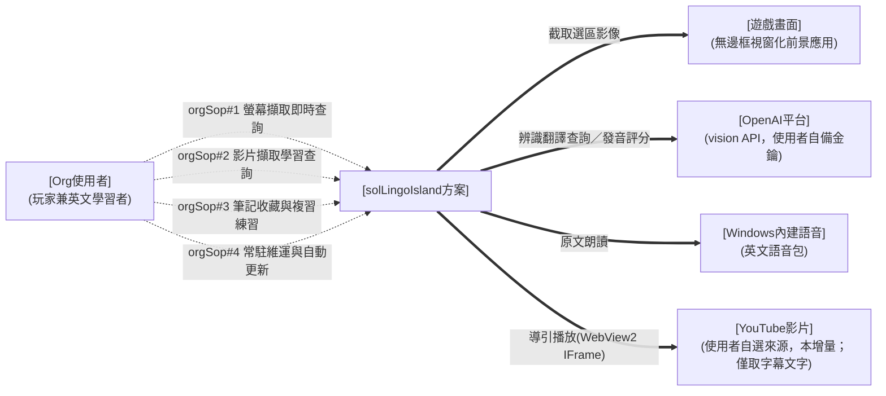
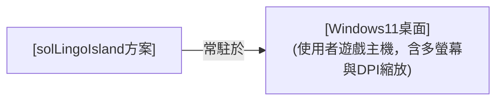
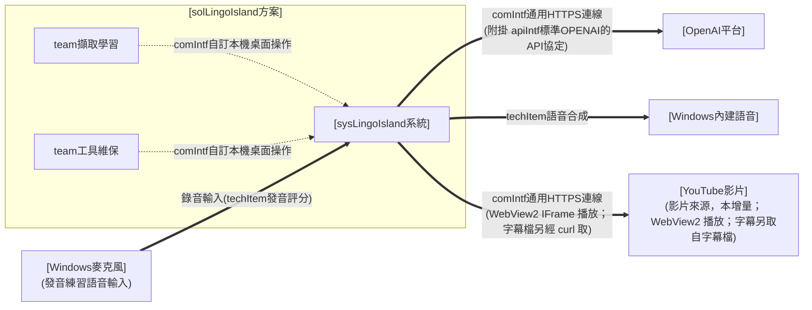
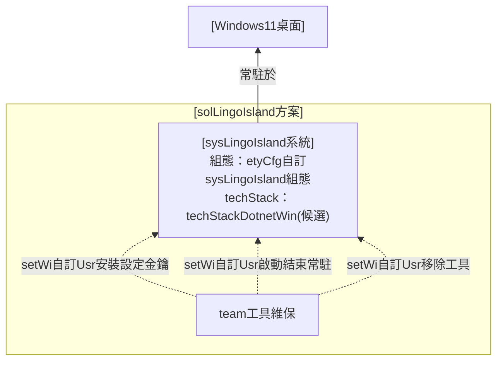
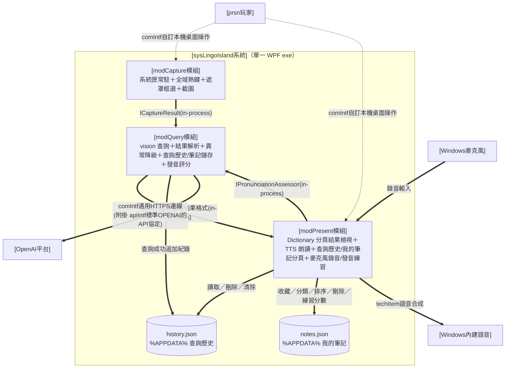
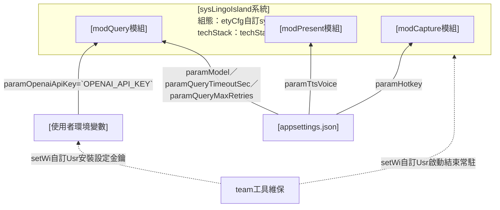

# I. 需求分析

> 需求視角；使用者之初始需求。只談「使用者是誰、做什麼、要什麼」，不預設解法。

## A. 主旨摘要

> 本節一段話定調：本層在做什麼、視角為何。（逐字繼承 Issue #1 ＜I. 緣起目的＞種子）

* 需求方為 [USR] 本人（遊戲玩家兼英文學習者）。
* 需求為：遊玩英文遊戲時，能以一組熱鍵框選畫面任意區塊，立即取得該區塊英文之原文、KK 音標、繁體中文翻譯，並可聆聽原文發音，全程不中斷遊戲。
* MVP 範圍：背景常駐＋熱鍵喚起＋變暗選區＋單次辨識翻譯查詢＋主視窗 Dictionary 分頁顯示與朗讀（含手動打字查詢）＋查詢歷史本機回顧（清單／詳情／重聽／刪除清除）＋我的筆記收藏（依資料夾分類、拖曳排序、檢視重聽、去重、**逐則發音練習**——就地錄音、AI 評分、成績框回饋）＋可管理多個命名應用情境（文字或貼圖／上傳檔 vision 自動解釋、擇一使用注入查詢）；不含生詞本、多語言。
* **本增量（v2.0.0 影片來源升格）**：本方案由「螢幕翻譯工具」升格為**多來源英文擷取練習中樞**——螢幕與 **YouTube 影片**為可插拔擷取來源，下游查詢／筆記／發音練習共用。本增量新增**影片「學習查詢」主動線**（Mode A，`spec#2`–`spec#2`）：選定 YouTube 影片、自動取得字幕、導引播放到句暫停顯字幕、於暫停句點字查詢並加入既有「我的筆記」；**不含**說話者標註、代言練習、完整影片庫（後續增量另立工單）。

## B. 運作想定

> 本節四分：(A) 資訊架構／(B) 人員編組／(C) 動作項目／(D) 軟硬項目。(A) 先圖後條列；(B)(C) 以表格呈現。

### (A) 資訊架構

> 描述本層方案與外部之運作關係與部署環境偏好。

運作關係（sol 與外部）：

> 圖例（三線通則）：粗 `==>`＝運行關聯／細 `-->`＝部署設定關聯／虛 `-.->`＝人員操作；本層為需求層示意，正式介面契約於 ＜II＞／＜III＞ 落地。

部署環境（需求偏好）：

> 圖例：細 `-->`＝部署設定關聯（沿三線通則）。

#### sol 查詢工具

solLingoIsland 畫面選區查詢工具，對內以單一系統實現（見 ＜II＞）。

#### 外部關聯項目

遊戲畫面（查詢對象、非介接系統）、OpenAI 平台（辨識翻譯外部服務）、Windows 內建語音（朗讀引擎）、**YouTube 影片（本增量之影片擷取來源；僅取字幕文字、不下載影片內容）**。

#### 部署偏好

使用者自有 Windows 11 遊戲主機，免安裝、單一執行檔、系統匣常駐。

### (B) 單位人員

#### 方案外單位人員關聯

> 條列描述本需求與方案外之關聯對象。

* [遊戲畫面]：前景執行之英文遊戲（無邊框視窗化前提），本方案僅截取其畫面、不介接。
* [OpenAI平台]：提供 vision 辨識翻譯與音訊發音評分之外部服務；額度與金鑰由使用者自備。
* [Windows內建語音]：OS 內建英文語音包，供原文朗讀（離線、免金鑰）。
* [YouTube影片]：使用者自選之英文影片來源（本增量）；本工具僅取其字幕文字、不下載影片內容（來源使用者自負，比照自備金鑰）。

#### 方案內單位人員編組

> org 層需求方；單人方案（內部 team 見 ＜II＞）。

* [Org使用者]：玩家兼英文學習者，單人使用並自行維保。

### (C) 動作項目

> 以表格描述本層動作／SOP（orgsopcat/orgSop→teamSop→prsnSop 逐層 zoom）；編號全程上下對應。orgSop 數＝需求域數（3）＋平台維保（1），故與 spec（3）不等（維保為平台 orgSop、無獨立 value-spec）。

| orgsopcat 大類 | orgSop 職責 | 說明 |
| --- | --- | --- |
| **orgsopcat#1-多來源英文擷取學習** | orgSop#1-螢幕擷取即時查詢 | 遊戲中熱鍵喚起、框選（或雙擊）畫面英文、取得原文／KK 音標／繁中翻譯、於 Dictionary 查看聆聽（逐字查、編輯重譯、打字查）；可設命名應用情境（文字或貼圖 vision 解釋）注入以提升準確度；不中斷遊戲（對映 spec#1） |
| | orgSop#2-影片擷取學習查詢 | 選定 YouTube 影片為擷取來源、自動取得字幕、導引播放到句暫停顯字幕、於暫停句點字查詢、將擷取之字／句加入我的筆記；螢幕與影片為並列之可插拔擷取來源（對映 spec#2） |
| | orgSop#3-筆記收藏與複習練習 | 將查詢結果／歷史加入我的筆記（去重／資料夾／拖曳排序／檢視重聽）、查詢歷史本機回顧（清單／詳情／重聽／刪除清除）、於我的筆記逐則發音練習（錄音／AI 評分／最佳分／可調門檻／清空）（對映 spec#3） |
| **orgsopcat#2-系統維運** | orgSop#4-常駐維運與自動更新 | 常駐主控入口（工作列常顯可尋、換版可尋）、自訂喚起快捷鍵、金鑰設定（環境變數、不落地）、啟動／收合／結束、啟動時自動更新、移除（平台維保，服務全部 spec、無獨立 value-spec） |

### (D) 軟硬項目

> 本層所需之設備、外部系統與服務（需求視角；細部選型見 C.技術選型）。

* **使用者遊戲主機**：Windows 11（或 Windows 10 1903+）桌面環境，含多螢幕與 DPI 縮放情境。
* **遊戲畫面**：以無邊框視窗化（borderless windowed）執行之英文遊戲（使用前提；獨占全螢幕不支援）。
* **OpenAI vision API**：使用者自備金鑰與額度之外部辨識翻譯服務。
* **Windows 內建語音**：OS 內建英文語音包（朗讀用，離線可用）。

## C. 組態設定

> 本節四分：(A) 技術選型／(B) 關鍵參數／(C) 人機介面／(D) 部署做法。

### (A) 技術選型

> 依 FORMAT §2.5 三層技術選型契約宣告；本層宣告系統類型 techApp。平台 techStack 與元件 techItem 見 ＜II.C.(A)＞／＜III.C.(A)＞。

* **techApp（系統類型）＝ [techApp桌面查詢工具]**（桌面即時查詢工具：常駐背景、熱鍵喚起、即查即走）：綁該契約之最低能力清單（§A：常駐輕量、喚起即時、零輸入干擾、隨時可逃、明確錯誤降級、金鑰安全、多螢幕 DPI 正確）與不干擾介面 bar（§B），逐頁審查據以判讀；不在此複述。
* **點名強制 techItem**（見 [techApp桌面查詢工具] §C，本方案輸出含發音朗讀）：[techItem語音合成]；具體選型於 ＜III.C.(A)＞ 落地。
* **本增量新增 techItem（功能驅動，非 techApp 點名）**：[techItem發音評分]——「我的筆記」發音練習之語音評分，沿用既有 OpenAI 金鑰之音訊輸入模型（與 [techItem語音合成] TTS 責任區隔）；具體選型於 ＜III.C.(A)＞ 落地。另 [techItem桌面通知]（#101）——發音練習回饋以原生 Windows 通知呈現（可回看），與應用內自畫浮層責任區隔；具體選型於 ＜III.C.(A)＞ 落地。
* **本增量新增 techItem（影片來源驅動，非 techApp 點名）**：[techItem影片播放]（WebView2＋YouTube IFrame Player API，導引播放到句暫停）、[techItem字幕擷取]（`curl` 取字幕檔原文，或本機自製字幕檔——自帶時間＋說話人，epic #178 增量6′-B「時間 pivot」定案）；唯一新平台依賴＝WebView2（Win11 內建 runtime），具體選型於 ＜III.C.(A)＞ 落地。

### (B) 關鍵參數

> 列本層關鍵參數／組態（需求偏好→etyCfg→Env／appsettings）；列舉即可、不解釋。

* **金鑰**：`OPENAI_API_KEY` 一律環境變數，程式與 repo 不落地（spec#1）。
* **喚起快捷鍵**：預設 `Alt+L`（左右 Alt 皆可），**可自訂**（鍵盤組合或滑鼠鍵，存 appsettings）。
* **查詢模型**：預設 `gpt-4o-mini`，可調（appsettings）。
* **應用情境提示**：使用者自然語言描述目前應用主題／情境（選填、可存可清），查詢時作為「參考、非指令」注入 prompt（spec#1）。
* **發音練習及格門檻**：`paramPronPassThreshold`（0–100 整數、預設 80，於設定頁可調）；發音評分用之 OpenAI 音訊輸入模型 `paramPronModel`（預設 `gpt-audio-mini`、可調 appsettings），沿用 `OPENAI_API_KEY`（不另設金鑰）。
* **條目顯示偏好**（設定頁「條目顯示」，存 appsettings）：`paramEntryFontSize`（筆記/歷史條目原文字級，預設 18、界 8–48）、`paramEntryBold`（粗體，預設 true）、`paramEntryWrap`（自動換行，預設 false＝單行省略）、`paramPassedCardTransparent`（#123；發音通過之筆記卡是否透明底透浮水印，預設 true＝維持 #118；false＝過關卡維持素底）。
* **Dictionary 分頁顯示偏好**（設定頁「Dictionary result」，存 appsettings）：`paramResultFontSize`（Dictionary 分頁結果基準字級，預設 28、界 14–48）。（`paramResultHideOnBlur` 於 #135 隨浮動視窗移除而停用——欄位保留相容、UI 不再呈現。）
* **使用前提**：遊戲無邊框視窗化。

### (C) 人機介面

> 本層定**各 orgSop 走何種介面通道**，並定整體視覺（look）；互動分配見 ＜II.C.(C)＞、各頁配置見 ＜III.C.(C)＞。

各 orgSop 之介面通道：

| orgSop | 通道 | 說明 |
| --- | --- | --- |
| orgSop#1-螢幕擷取即時查詢 | **桌面原生 GUI**（遮罩 overlay＋主視窗 Dictionary 分頁＋情境分頁） | 熱鍵喚起框選、結果於 Dictionary 分頁查看聆聽（逐字查／編輯重譯／打字查；擷取完成主視窗前景疊於無邊框遊戲，#135）；命名應用情境（文字/貼圖自動解釋）擇一注入提升準確度 |
| orgSop#2-影片擷取學習查詢 | **桌面原生 GUI**（統一主視窗「影片擷取」分頁：WebView2＋字幕清單） | 貼 YouTube 影片、取字幕、導引播放到句暫停顯字幕、暫停句點字查詢、加入我的筆記 |
| orgSop#3-筆記收藏與複習練習 | **桌面原生 GUI**（統一主視窗「筆記」／「歷史」分頁＋收藏 toast） | 收藏加入並 toast、資料夾管理與排序、查詢歷史回顧（清單/詳情/重聽/刪清）、筆記卡片就地錄音送 AI 評分、清空練習紀錄 |
| orgSop#4-常駐維運與自動更新 | **常駐主控頁（工作列按鈕型）＋系統匣選單頁（輔助）＋OS 標準設定** | 常駐時保留常顯、可 Alt+Tab／工作列尋得之主控入口（金鑰狀態／設定／結束、自動更新），不受系統匣自動隱藏影響；系統匣選單為輔助；安裝金鑰、移除走檔案總管與環境變數設定 |

**業界常規（look，公開標準）**：Windows 桌面工具遵循 **Windows 11 Fluent Design**（Segoe UI Variable 字階、4px 間距格、圓角 8px、亮暗主題、acrylic／mica 層次），可近用性掛 **WCAG 2.1 AA** 對比；常駐工具以**工作列按鈕（taskbar button）**維持穩定可尋之入口（Alt+Tab／工作列可達，不受系統匣溢位自動隱藏影響），系統匣圖示為輔助（右鍵選單、單一實例）。**Windows 桌面 HMI 慣例（硬性，凡有標準答案者依慣例、不另創）**：視窗標題只出現在 OS 標題列、內容區不重複；狀態文字置**底部狀態列**（`StatusBar`）；樹狀清單採標準節點＋**右鍵選單**（新增／更名＝`F2` 原地編輯／刪除＝`Del`）如檔案總管、建立入口置頂部工具列；清單拖曳以**插入位置指示線**與**目標高亮**即時回饋落點；圖示採系統字圖（**Segoe MDL2 Assets**）而非 emoji（跨環境呈現一致、語彙標準）。

**本系統（solLingoIsland 取捨）**：

* **遮罩**：喚起當下截取整個虛擬桌面為**凍結畫格快照**（不透明背景、選取期間畫面靜止、背後遊戲被完全遮住且收不到輸入）＋其上疊 45% 黑淡化、十字游標、高對比選框（accent 藍 2px＋反白遮罩差顯）、頂部中央一行操作提示——只承載「選取」一件事。凍結畫格使點擊／雙擊落在靜止快照上、不干擾背後遊戲（Issue #90，取代原半透明實時變暗）。
* **結果視窗**：**標準表單**（OS 標準標題列＋標準邊框拖拉縮放＋工作列按鈕，字型比照主視窗；Issue #59）、淺粉底大字；直排原文／KK 音標／中譯（**不加欄目標示**——三區以字級/色彩/字體分層、一望即知），基準字級於選項頁可調（音標＝基準−4、中譯＝基準−2 等比縮放，下限 12）；英文組與中文組各有獨立播放鈕與「自動播放」勾選（勾選後框選完即朗讀）；英文原文可**逐字點選——點某個單字即查詢該單字字義**（複查回饋改制：原為單獨發音；游標呈可點狀，查詢中顯示等待游標並擋連點，整句播放鈕並存）；頂部工具列置**往前／往後導航鈕**（主查詢＝重置為單一、查單字＝推入堆疊，可返回原句；導航與單字查詢結果**不自動加入筆記**）與**編輯鈕（鉛筆）**——可校正英文原文後「Re-translate」重查（辨識有誤時用）；「加入至資料夾」下拉置頂部工具列；首次置中、之後記住使用者擺放的位置與大小；以標準標題列拖曳移動、標準邊框拖拉縮放；topmost 浮於遊戲上「一直存在」，**失焦（切換至其他視窗對照）預設不自動關閉、不隱藏**（有工作列按鈕可尋），**點選主視窗／經 tray 開主視窗分頁亦不關閉**（與主視窗共存，Issue #105）——惟選項頁提供**「失焦自動隱藏」開關（預設關）**，勾選後失焦即隱藏、下次查詢再現（單字查詢/重譯進行中不隱藏）；關閉時機僅限 `ESC`／標題列關閉鈕／下一次查詢或自歷史/筆記「檢視」開卡取代／選項儲存後（語音服務重建而）關閉、不重開；同時至多一個。 **Dictionary 分頁改制（#135）**：上述浮動視窗行為整體由主視窗 **Dictionary 分頁**取代——結果於分頁內呈現、不再是獨立浮窗（無位置記憶／失焦隱藏／ESC 關窗／單一守窗）；喚起、歷史/筆記「檢視」、查單字、編輯重譯皆渲染至本頁，擷取完成時主視窗**前景＋暫置頂**疊於無邊框遊戲；分頁頂另置可編輯下拉查詢（並列查詢歷史）、維持透明底＋全域半透明白控制項透出浮水印（與各分頁風格一致）。
* **統一主視窗（常駐主控入口）**：程式執行後保留一個**工作列按鈕型**的可見主視窗——常顯於工作列、可 Alt+Tab／點工作列尋得；採 **Office 式頂部功能列分頁（每鈕圖示在上、文字在下，序：🖼情境／📒筆記／🕘歷史／⚙選項／ℹ關於；圖示用 Segoe MDL2 Assets 字圖——情境=Picture 風景、筆記=QuickNote、歷史=History、選項=Setting 齒輪、關於=Info）＋下方對應功能頁**，承載維運與檢視；功能列**右端另置 `Result` 動作鈕**（同款圖上字下、MDL2 字圖 `E8A7` OpenInNewWindow〔以實測渲染為準〕，非分頁、不入分頁群組，Issue #107）——**一鍵喚回查詢結果視窗**：結果卡開啟中（含最小化中）→先還原再帶至前景；已關閉且有查詢歷史→以最新一筆重開三欄詳情（重用「檢視」單一取代守衛）；**無任何歷史**（含清除全部後、歷史檔毀損退空）→右下 toast 提示 `No query result yet`、不開卡（不留無聲死按鈕）；tray 選單**同步設 `Result` 項**（兩入口鏡像、動作來源單一，共用同一組合根決策）；**內容區不重複視窗標題**（OS 標題列已有），金鑰／快捷鍵狀態置**底部狀態列**；**預設最小化、不擋遊戲**，需要時還原。此入口不依賴 Win11 系統匣顯示設定，換版／換路徑後仍穩定可尋（系統匣圖示改為輔助入口）。**關閉主視窗＝收合（最小化/隱藏至系統匣）而非結束程式**，唯明確「結束」才退出常駐。 **#135**：功能列新增最前之 **Dictionary 分頁**（承載查詢結果、取代浮動視窗）；`Result` 鈕與 tray「Result」改為**切至 Dictionary 分頁**顯示最新查詢（分頁尚無結果則以最新歷史一筆檢視、無歷史則 toast）。
* **統一美術**：主視窗與各分頁採**淺粉底**（承結果卡片色系 `#FFF0F5`／`#F4C2D0` accent）＋**小女孩 logo（`assets/icon.png`）背景浮水印**（Issue #71 提高不透明度至 `0.14`、放大至清晰可見、仍不擋操作）；**控制項半透明**（卡片/次要按鈕/輸入框白底一律 `#66FFFFFF`＝白色 40%，Issue #71→#73→#75——讓底層浮水印明顯透出、不再白色不透明），以共用樣式資源套用、各頁不各刻。
* **介面語言政策（Issue #81 原為全英；Issue #179＋epic #178 決策10 起改為全繁中）**：**所有介面文字（UI chrome）一律繁體中文**（單向繁中、就地改字串、不導入 resx；全 app 含影片頁繁中化完成）——各分頁/視窗之標籤、按鈕、選單、提示、狀態列、對話框皆繁中。**保留英文者**：底色盤 [NoteColors.Palette] 之色名（英文名作為智能配色「色名↔hex」對應鍵，UI 顯示經 `NoteColors.DisplayName` 轉繁中，#179）、**持久化預設資料名**（主題 `New Theme`、筆記預設夾 `My Notes`、新資料夾基名 `New Folder`——保留以免遷移既有使用者存檔）、專有名詞（LingoIsland／OpenAI／OPENAI_API_KEY 等）。**翻譯內容（product output）本即繁體中文**——本工具用途即為替華語使用者翻譯英文遊戲畫面，故 AI 查詢/圖片解釋之**輸出（`translation`／`description` 欄）恆為繁中**、AI 提示語（system/point/describe prompt）維持中文（僅注入之可選色名清單隨盤改英文）。分野原則（#179 後）：**介面殼與譯文皆繁中**；AI 提示語本即中文。
* **影片擷取頁**：與螢幕擷取頁並列之擷取來源頁——**分【內容】／【獲得】兩子頁籤，互斥切換（#182）**：兩 pane **疊放同格、以可見性切換**（非 `TabControl`，避免切頁卸載重建 WebView2 播放器而中斷播放），**同一時間只顯示其一**；【獲得】＝整幅獲取卡片（切至此時影片清單不在畫面上），【內容】＝**左影片清單｜右播放器＋逐句字幕**（承 #165／#167 之左清單右操作版面，惟僅作用於【內容】內部）。左側**影片清單到頂**（Clear all 置頂＋依 theme 篩選；載過影片可點切換、標記所屬主題、欄寬可拖拉、**每筆附 YouTube 縮圖**〔#171〕，epic #145 增量4；**單項刪除改右鍵選單「Delete」或 `Delete` 鍵**〔`ListDeleteSupport`〕、無底部刪除鈕）。**【獲得】子頁籤**（epic #178 增量6′「輸入 pivot」定案；#193 擴為雙來源）——**兩種等價來源、擇一即可**：①**貼網址**＝單一輸入框貼含**具體 YouTube 影片網址＋字幕檔網址**之自然語言文字，程式純字串抽兩網址（**不做關鍵字搜尋**；已砍原 finder〔web_search 配片〕與結果表）；②**本機自製字幕檔（#193）**＝「選擇字幕檔…」鈕（可複選）或**拖放檔案至輸入框**（可多檔），字幕檔**得於檔內自帶影片網址**——程式於**檔頭區**（第一個時間行之前）取首個可解出 YouTube ID 之網址，抽到即免於輸入框打任何字；**不限定註解前綴**（非時間戳行一律略過，`;`／`#`／裸網址皆可），故不建立只有本 app 讀得懂的私有格式。**單檔＝摘要確認後載入播放；多檔＝彙總確認後批次加入【內容】清單、不自動播放**。**【內容】子頁籤**＝**左影片清單｜中 WebView2 播放器＋其下當前句字幕帶與播放控制｜右逐句英文字幕清單**（可捲、雙擊跳播）**＋其下說話人勾選面板**。（螢幕截圖頁同模板：左＝截圖清單〔Clear all／theme 篩選／右鍵·Delete 刪〕｜右上＝獲取區塊〔Capture Screen＋快捷鍵 Change〕｜右下＝內容區塊〔放大預覽〕。**主題管理頁**〔#169〕亦同版面族：左＝主題清單〔New Theme 置頂／右鍵·Delete 刪〕｜右＝編輯區內容卡片。）逐句字幕清單**雙擊**該句才跳播（單擊僅選取，#169）；整檔 YAML 編修框自動換行（#169）。**說話人（epic #145 增量5）**：字幕若含說話人（人工字幕之 VTT `<v 名字>` 語音標記帶入、非推斷）則每句前置「說話人：內容」（清單與字幕帶皆然）；字幕清單下方**可上下拖拉之說話人勾選面板**（`(全部)`＋各具名說話人＋`(無說話人)`、複選、斑馬紋列；**每列名字尾端以括弧顯示該說話人之語句數**〔#196〕；epic #178 增量6′-C/D）為**篩選／暫停／字型色共用之單一勾選來源**（**語句數為呈現層獨立顯示屬性**：具名說話人＝經 `PauseDecider.SplitSpeakers` 拆為原子後含該名之 cue 數〔合唸句對每位參與者各計一次，與面板拆原子口徑一致〕、`(全部)`＝總句數、`(無說話人)`＝未標說話人之句數；**invariant——`Name` 仍為純名字、續為篩選／暫停／字型色／勾選保留之唯一 key，語句數只入獨立顯示屬性〔如 `DisplayName＝Name (N)`〕、不得併入 `Name`**，否則改指說話人重建面板時比對失準、勾選與配色錯亂；面板本於 cue 變動〔載入／編 YAML／改指說話人〕整份重建，計數於重建時一併重算、不需額外 `INotifyPropertyChanged` 訊號）——篩選下拉三態（顯示全部／只顯示勾選／勾選者粗體＋上色）、暫停下拉兩態（不暫停／在勾選者暫停）皆讀此勾選；每列尾附「加入筆記」圖示（該說話人全部台詞收進 `[影片-說話人]` 夾、批次加入前提醒費用並逐句 AI 翻譯）；可切**整檔 YAML 編修**（`speaker`／`start`／`text`〔start-only #158〕一次修訂斷句與說話人，Apply 解析回逐句、語法錯留編修態明訊）。沿用淺粉底＋半透明控制項與小女孩浮水印，字幕帶字級比照結果卡、暫停句逐字可點；載入／取字幕以進度與明確錯誤降級（循 [techApp桌面查詢工具] §B 不干擾介面 bar）。**說話人來源（epic #178 增量1 起）**：說話人一律來自字幕本身之人工標記（人工字幕 VTT `<v 名字>` 語音標記帶入、非推斷）；epic #178 增量1 移除內容頁「講話人補強」整列兩鈕——「🧠 AI 純推斷」（`OpenAiSpeakerEnricher`，依台詞猜說話人）與「🌐 Script」（`OpenAiWebSpeakerEnricher` 網搜逐字稿補說話人）皆移除，因 epic #178 主線改以「逐字稿為主」重建說話人（增量5），事後補強按鈕多餘。`OpenAiWebSpeakerEnricher` 之逐塊對齊管線保留、留待增量5 轉用。**start-only（#158）**：對外字幕只留開始時間，一句顯示至下一句開始（無空窗）、到句暫停於「下一句開始，或本句開始＋上限（預設 8s，防超長間隔乾等）」（`PauseDecider`，顯示與暫停解耦；json3 併句/VTT 去滾動之結束時間僅解析階段內部 `TimedCue` 保留、對外丟棄）。**時間未知合法化（epic #178 增量4）**：`SubtitleCue` 之開始時間由「非可空」改為**可表示『時間未知』**（可空／哨兵，plan 拍板）——供字幕主線 pivot（增量5′「字幕檔為主＋Whisper 聲音對齊」，#178 pivot）時，字幕檔句對不到 Whisper 時間者**不落回 0 秒**；`PauseDecider`（`NextPause`／`CueAt`）與各產生器（`SubtitleYaml`／`SubtitleRefine`）**容忍未定時句**、不於 0 秒誤判當前句或連環暫停，已定時句仍嚴格遞增。此為增量5 之資料地基、無使用者可見新功能。**指定說話人暫停／上色（epic #178 增量6′-C/D，取代原增量7 之「Pause at」下拉）**：暫停與字型色皆由說話人勾選面板驅動——暫停下拉「不暫停／在勾選之說話人暫停」（勾 `(全部)` 等同每句暫停）；**說話人字型色為常設**（非篩選態），以**使用中主題之 12 色描述含該說話人名（不分大小寫）**判定、套為**字型色**（非底色），主題切換即重算（`RebuildSpeakerColors`）。字幕帶另置**播音鈕**（Segoe MDL2 喇叭字圖、離線 SAPI 朗讀當前句）；控制列含 Theme 下拉＋`Previous`（跳上一句）＋時間偏移 `＋`／`－` 鈕（就地增減、按 Shift 才套用）。**依 theme 篩選（多媒體·B）**：影片清單與截圖清單頂端各一 theme 圖文下拉（縮圖＋名稱，共用 `ThemeFilter`），依選中 theme 篩選顯示（不動播放）。
* **偏離聲明**：本方案為桌面原生應用，不錨 [hmiIntf通用視覺規範]（MD3 web 基座、admin shell 不適用），改錨 [techApp桌面查詢工具] §B 不干擾介面 bar；可近用性維持 WCAG 精神。

主題風格示意圖（設計期參考稿、以文字為準）：

### (D) 部署做法

> 描述本層部署作法：大方向。

* **安裝式散佈＋自動更新（Velopack，Issue #51）**：GitHub Release 掛 `Setup.exe`（安裝即用）與 `Portable.zip`（免安裝解壓即用）；程式啟動時背景檢查更新、靜默下載、重啟自動套用（支援差量升級）；系統匣常駐、不開主視窗。
* 開發 REPO＝`twStellerWhale-Ocean2/solLingoIsland`（私有）。
* productReadme 為自然語言操作腳本，供自然人或 AI Agent 依步驟執行。

## D. 規格效益

> 需求規格（need）＋其端對端驗收課目與效益指標；以本層需求回扣全案。need 不出現解法元件名。

### (A) 規格要求

> need（spec#N，客戶目的／營運議題／成效期待，不混工程手段；粒度一致互不包含）＋端對端驗收課目（e2eTest，以 orgSop 為驗收單元、依 productReadme）。3 大需求域各一 spec（螢幕／影片／筆記複習）；平台維保為 orgSop#4、無獨立 value-spec（其行為由各 spec 之維運面承接、e2eTest#04 驗）。

* **spec#1-螢幕擷取即時查詢**：玩英文遊戲時能以自訂喚起快捷鍵（預設 `Alt+L`）將畫面凍結、框選（或於某句雙擊由 AI 自動判斷）要查的英文，立即取得**英文原文、KK 音標、繁體中文翻譯**並可整句與逐字聆聽，全程不中斷遊戲、`ESC` 可隨時取消；結果顯於主視窗 **Dictionary 分頁**，可**逐字點選查該字**、**編輯辨識錯的原文重譯**、或**於分頁頂部打字查詢**。並可建立多個**命名應用情境**（自然語言描述，或貼上／上傳畫面由 vision 自動解釋並補充），擇一設為使用中以「參考、非指令」語氣注入查詢、提升翻譯貼切度（未設＝現行預設行為、不改三欄結構）。多螢幕與 DPI 縮放下選區對位正確。
* **spec#2-影片擷取學習查詢**：能把 **YouTube 英文影片**當作與螢幕並列之可插拔擷取來源——於「影片擷取」分頁貼入影片後**自動取得其英文字幕**（逐句文字＋時間，以字幕文字為準、免螢幕辨識；字幕不可用時明確告知並中止、不當機不無聲失敗），**導引播放到每句自動暫停**並於畫面下方顯示該句字幕（可續播／重播該句／跳下一句），於暫停句**點選任一英文單字**即以同一套查詢取得原文／KK／中譯並聆聽，並可將擷取之字／句**加入同一套「我的筆記」**；下游查詢、筆記與複習練習完全共用、不另造。
* **spec#3-筆記收藏與複習練習**：能把值得記的字句從查詢結果或歷史**加入「我的筆記」**（去重、以自訂資料夾分類、拖曳排序、檢視重聽、長期保存不受歷史清除影響）；每次成功查詢自動留存**查詢歷史**供本機回顧（依日期清單、單筆詳情、重聽、刪除單筆或清除全部、受保留上限管控）；並可對筆記**逐則練習發音**——就地按住麥克風錄音、放開由 AI 評分（須確有對目標句之真正朗讀才給分，靜音／只有背景雜訊判 0、不誤給分），達**可調及格門檻**（預設 80）成績框轉綠並記錄本機留存之**最佳分**，可一鍵清空該夾練習紀錄。查詢與發音評分使用 [USR] 自備之 OpenAI 額度（`OPENAI_API_KEY` 環境變數），**金鑰不落地**於程式／設定檔／repo。

**端對端驗收課目（e2eTest，依 productReadme，每 orgSop 至少一案，回扣 orgSop／spec）**：

* **e2eTest#01-螢幕擷取查詢一圈**（依 orgSop#1、docProgTest#02·#05）：於無邊框遊戲按快捷鍵、框選（與某句雙擊）英文、於 Dictionary 分頁見三欄結果、整句與逐字朗讀、編輯原文重譯、頂部打字查、設一命名情境（含貼圖 vision 解釋）並見翻譯反映、清空情境回歸 → 全圈閉合、選區對位正確、情境注入生效／未設回歸、`ESC` 可逃。
* **e2eTest#02-影片擷取學習一圈**（依 orgSop#2、docProgTest#07）：於「影片擷取」分頁貼入有英文字幕之 YouTube 影片 → 自動取字幕、導引播放至某句自動暫停並顯字幕 → 點該句某英文單字查得三欄並聆聽 → 加入我的筆記、於筆記分頁見該筆；另試無字幕影片 → 明確告知並中止 → 全圈閉合、查詢與筆記後段沿用既有、字幕不可用明確降級不當機。
* **e2eTest#03-筆記收藏複習練習一圈**（依 orgSop#3、docProgTest#03·#04·#06）：查詢結果／歷史「加入我的筆記」（去重 toast、資料夾分類、拖曳排序、檢視重聽、刪除）、開查詢歷史回顧（依日期清單／詳情／重聽／刪單筆／清除全部）、對某則按住麥克風錄音放開得 AI 評分（達門檻成績框轉綠留存、調門檻重判、清空練習回未練、無麥克風／空錄音／無網明確降級不誤判）→ 全圈閉合、重啟留存正確、筆記不受歷史清除影響。
* **e2eTest#04-常駐維運一圈**（依 orgSop#4、docProgTest#01）：放置 exe／設金鑰／啟動常駐（工作列常顯入口 Alt+Tab 可尋、換版可尋、關視窗＝收合非結束）、自訂喚起快捷鍵、啟動時自動更新（就緒提示＋重啟套用、`%APPDATA%` 資料留存）、明確結束、移除 → 全程依 README 可完成、無殘留、金鑰不落地。

### (B) 效益指標

> 每條 spec 一項追蹤指標（評估方式／觀察項目），**回扣本需求**。

* **spec#1（螢幕擷取即時查詢）**：熱鍵喚起延遲（<300ms）與成功率、遊戲不中斷、常駐閒置記憶體（<100MB）；自訂快捷鍵（含滑鼠低階 hook）下全系統輸入無可感延遲與各組合擷取正確率、監聽期喚起暫停正確（Issue #89）；多螢幕／DPI 選區 0px 偏移、`ESC` 取消；辨識翻譯三欄齊備率與正確性抽測、單次查詢延遲（1–3s）；逐字點選命中（標點不誤讀）、編輯重譯與頂部打字查正確；命名情境注入生效（含貼圖 vision 解釋、以參考非指令語氣）／未設回歸、不破三欄；金鑰不落地稽核。
* **spec#2（影片擷取學習查詢）**：YouTube 連結／ID 解析與載入成功率、非法／私人影片明確錯誤；字幕自動取得成功率、無字幕／取得失敗明確告知並中止（不當機不空白卡住）、逐句文字與時間解析正確；到句暫停命中率與誤差（±0.2s 內、不漏句不早停）、續播／重播／跳句正確、暫停字幕與當前句一致；暫停句點字命中（標點不誤取）、查得三欄與朗讀沿用既有；加入筆記去重／歸類正確、與螢幕來源筆記無差別共存；不下載影片內容（僅字幕）稽核。
* **spec#3（筆記收藏與複習練習）**：收藏去重正確與 toast、資料夾 CRUD／歸類、拖曳排序持久化（重啟沿用）、`notes.json` 損毀退空不致命、筆記不受歷史清除影響；查詢歷史留存／依日期分組／刪除清除即時且重啟正確、上限截汰、`history.json` 損毀退空不影響主流程；發音評分回應率與延遲、錄音時音量條即時反映、無真正朗讀評 0 不誤判通過、及格門檻套用與門檻改動即時重判、**最佳分**取 Max 落地與重啟留存、清空練習回未練、各異常（無麥克風／未授權／空錄音／無網）明確降級不當機、錄音不落地與金鑰不入日誌。

# II. 方案設計

> 視角＝team。自 ＜I＞ 的 Org／orgSop 解析出團隊（team）與其作業（teamSop），並界定方案下屬之系統（sys）。不出現 prsn／module。

## A. 主旨摘要

> 本節一段話定調：本層在做什麼、視角為何。

方案以單一桌面常駐系統 [sysLingoIsland系統] 承接需求，核心為**三段管線**：**capture**（常駐熱鍵→遮罩框選→選區截圖）→ **query**（單次 vision 查詢→結構化三欄結果）→ **present**（浮動視窗顯示＋TTS 朗讀）。管線各段責任分離、以資料契約銜接；query 段之供應商（模型名稱、prompt）走組態可抽換，為本案之擴充機制。**方法論偏離（本案不套核／殼 OODA，待 USR 於 Draft PR 裁決）**：本方案 techApp＝[techApp桌面查詢工具]（非指管管理系統），FORMAT §2 核／殼 OODA 模型與域完整性（硬規則⑥）不適用——無管理閉環、無領域殼、無任務域、無 Measure；改以上述三段管線＋供應商可抽換為擴充機制。人機介面亦不錨 MD3 web admin shell、改錨 Windows 11 Fluent（詳 ＜I／III.C.(C)＞）；techStack 採候選契約 [techStackDotnetWin]（家規四選一無桌面選項，詳 ＜C.(A)＞）。MVP 實例化範圍＝單次查詢一圈做深做透。本增量於三段管線之外新增**本機查詢歷史**橫切關注：query 段成功結果落地為本機紀錄（`history.json`）、經獨立歷史視窗回顧（spec#3）；歷史為本機檔案、不新增外部介接、不改動 capture／query／present 三段既有責任。本增量再加**我的筆記**橫切關注：使用者明確收藏（來自 present 之即時結果或歷史條目）落地為本機 `notes.json`（資料夾分類＋自訂排序），經獨立筆記視窗管理（spec#3）；同屬本機檔案、不新增外部介接、與歷史各自檔名分離、職責不互滲。另 query 段之提示（prompt）納入可選的**應用情境提示**（appsettings 之 `paramContextHint`）：非空時以「參考、非指令」語氣併入既有 text prompt、輔助翻譯語意（spec#1），空則等同現行；structured output 三欄 schema 不變、屬既有「供應商/prompt 走組態抽換」擴充機制之一。本增量再加**筆記發音練習**橫切關注（spec#3）：present 段於「我的筆記」卡片就地擷取麥克風錄音、送 query 段之發音評分（[techItem發音評分]，沿用既有 OpenAI 金鑰之音訊輸入模型）取回分數，達可調及格門檻即成績框轉綠並將最佳分落地 `notes.json`（`NoteEntry.PracticeScore`＝最佳分、相容舊檔）；發音評分與 [techItem語音合成] 之 TTS 輸出責任區隔、不新增外部介接（沿用既有 OpenAI 端點）；頂部批次動作由「清除全部（筆記）」改為「清空練習紀錄」（成績框回未練、不再提供批次刪除筆記）。本增量再加**影片擷取管線**（spec#2）：於三段管線前端新增第二個**擷取來源**——YouTube 影片。有別於 capture 段之「熱鍵→OCR→文字」，影片來源為「貼影片＋字幕檔網址（或本機自製字幕檔）→`curl` 取字幕檔、自帶時間＋說話人直接解析→導引播放到句暫停」，字幕本身即文字（免 OCR）；暫停句之單字點選與加入筆記**完全複用** query／present／notes 既有後段，影片頁只多「取字幕＋導引播放」前端。此延續「擷取來源可插拔、下游共用」之擴充機制（sol 由螢幕翻譯工具升格為多來源擷取練習中樞），不動既有 capture／query／present 三段責任。

## B. 運作想定

> 本節四分：(A) 資訊架構／(B) 人員編組／(C) 動作項目／(D) 軟硬項目。(A) 先圖後條列；(B)(C) 以表格呈現。

### (A) 資訊架構

> 先圖後條列，描述本層系統與其組成（方案→sys 逐層 zoom）。

運作架構圖（方案內含人員＋系統，sol 下屬 sys）：

> 圖例（三線通則）：粗 `==>`＝運行關聯（系統／裝置間，線上標 comIntf 契約名，apiIntf 並列附掛）／虛 `-.->`＝人員操作（team 經桌面操作系統）。

組態架構圖（techStack 以文字標於建置單元方框）：

> 圖例（沿三線通則）：細 `-->`＝部署設定關聯／虛 `-.->`＝人員操作（配置作業，線上標 setWi）；techStack 選型以文字標記。

* **sol 下屬 sys**：[sysLingoIsland系統]——實現常駐熱鍵、遮罩框選截圖、vision 查詢與結果呈現朗讀之單一系統；內部 module 見 ＜III＞。
  * **對外保證**（機制見 ＜III.B.(A)＞）：喚起即時且零輸入干擾（spec#1）、選區對位正確（spec#1）、查詢結果三欄齊備或明確錯誤降級（spec#1）、隨時可逃（spec#1）、金鑰不落地（spec#1）、查詢歷史本機留存與可回顧（spec#3）、查詢結果可收藏為我的筆記並分類管理（spec#3）、可自訂應用情境提示輔助翻譯（spec#1）、可管理多個命名情境並擇一注入查詢（spec#1）；影片擷取到句暫停點字查詢並加入筆記（spec#2）。
* **管線契約（pipeline contract；本案擴充機制，取代核／殼契約之位置）**：三段各以資料契約銜接、責任不互滲——
  * 〔capture〕輸入＝熱鍵事件／滑鼠拖曳；輸出＝選區影像（實際像素對位）。不認查詢語意。
  * 〔query〕輸入＝選區影像；輸出＝[datIntf自訂查詢結果格式]（原文／音標／中譯）。供應商、模型、prompt 走組態抽換，不動 capture／present。
  * 〔present〕輸入＝[datIntf自訂查詢結果格式]；輸出＝主視窗 Dictionary 分頁與 TTS 播放（#135）。不認辨識來源。
* **異常降級一致**：金鑰缺失、網路失敗、逾時、回應不合格式，一律於 present 段顯示明確可讀錯誤與下一步指引（[runWi自訂Sys辨識翻譯選區]），程式續存活。

### (B) 單位人員

#### 方案外單位人員關聯

> 條列本層（sys）與方案外之關聯對象。

* [OpenAI平台]：vision 辨識翻譯與音訊發音評分（使用者自備金鑰）。
* [Windows內建語音]：OS 內建英文語音包（朗讀）。
* [YouTube影片]：影片擷取來源（本增量；僅取字幕文字）。
* [遊戲畫面]：螢幕擷取查詢對象。

#### 方案內單位人員編組

> Org 下屬 team 編成；單人方案：兩 team 皆由 [Org使用者] 本人擔任（角色分工、非多人）。

| team | 上級／編成位置 | 職責 |
| --- | --- | --- |
| team擷取學習（#1／#2／#3） | Org使用者（遊戲中/回顧/整理時） | 熱鍵喚起、框選查詢、查看聆聽結果；回顧查詢歷史；收藏並整理我的筆記；建立管理應用情境並擇一使用；就地錄音練習發音 |
| team工具維保（#4） | Org使用者（維保時） | 程式放置、金鑰設定、常駐啟動結束、移除 |

### (C) 動作項目

> 以表格描述本層動作／SOP；每條 orgSop 由其 team 承接為多條 teamSop。

> **derived 標記**：本層 teamSop 為 ＜III＞ prsnSop 之上捲視圖（維護改 III、此處重生），勿獨立增刪；編號全程上下對應。

| team（承 orgSop#） | teamSop |
| --- | --- |
| team擷取學習（#1／#2／#3） | teamSop#1.1-熱鍵喚起與框選擷取 teamSop#1.2-辨識翻譯查詢 teamSop#1.3-結果查看與朗讀（逐字查/編輯重譯/打字查） teamSop#1.4-情境建立與編輯（含圖片自動解釋） teamSop#1.5-情境擇一使用 teamSop#2.1-影片選定與字幕預處理 teamSop#2.2-導引播放到句暫停查詢 teamSop#2.3-影片擷取加入筆記 teamSop#3.1-收藏加入我的筆記 teamSop#3.2-筆記整理（資料夾/排序/檢視/刪除） teamSop#3.3-開啟並瀏覽查詢歷史 teamSop#3.4-查詢歷史清理 teamSop#3.5-筆記發音練習（錄音→AI 評分→成績框回饋→清空練習紀錄） |
| team工具維保（#4） | teamSop#4.1-安裝與金鑰設定 teamSop#4.2-常駐啟動與結束 teamSop#4.3-工具移除 |

### (D) 軟硬項目

> 本層方案所依賴之平台與服務。

* **執行平台**：Windows 11 桌面（多螢幕、DPI 縮放），免安裝單一 exe 常駐。
* **外部服務**：OpenAI vision API（[comIntf通用HTTPS連線]＋[apiIntf標準OPENAI的API協定]，使用者自備金鑰；僅辨識翻譯使用）。
* **OS 內建能力**：Windows 內建語音（[techItem語音合成]，朗讀主路徑、離線可用免金鑰）、全域熱鍵、螢幕擷取、系統匣。
* **外部影片來源（本增量）**：YouTube 影片（使用者自選；本工具僅取其**字幕文字**供個人學習、不下載影片內容，來源由使用者自負，比照自備 OpenAI 金鑰）。
* **本機字幕工具（本增量；epic #178 增量6′-B「時間 pivot」定案）**：`curl`（CLI，經 `System.Diagnostics.Process` 呼叫取**字幕檔原文**；隨 Windows 10 1803+ 內建、非另裝，繞 Fandom／Cloudflare 之 TLS 指紋封鎖）。字幕檔自帶時間＋說話人直接解析；原 `yt-dlp` 取字幕已於增量6′-B 廢止、不再為前置需求。
* **OS 內建瀏覽器核心（本增量）**：WebView2（Win11 內建 runtime；內嵌 YouTube IFrame Player API 播放與控制）。

## C. 組態設定

> 本節四分：(A) 技術選型／(B) 關鍵參數／(C) 人機介面／(D) 部署做法。

### (A) 技術選型

> 平台 techStack（承 ＜I.C.(A)＞ techApp=桌面查詢工具）；標於 ＜B.(A)＞ 組態架構圖。見 FORMAT §2.5。

* **techStack（平台）＝ [techStackDotnetWin]（候選契約，待家規裁決）**：.NET 8＋WPF、self-contained 單一 exe、手動放置部署。現行家規四選一（StaticWeb／ReactWeb／NodeSys／PythonSys）皆為 web／伺服器類、無法承載原生桌面需求（全域熱鍵、螢幕擷取、系統匣），故以候選契約提出、隨本增量 Draft PR 請 USR 裁決入庫。
* **techItem（元件，承 [techApp桌面查詢工具] 強制）**：[techItem語音合成]（原文朗讀）；具體版本／用法見 ＜III.C.(A)＞。
* **techItem（本增量新增，功能驅動）**：[techItem發音評分]（我的筆記發音練習之語音評分，沿用既有 OpenAI 金鑰之音訊輸入模型；與 [techItem語音合成] TTS 責任區隔）；具體版本／用法見 ＜III.C.(A)＞。
* **techItem（本增量新增，影片來源驅動）**：[techItem影片播放]（WebView2 內嵌 YouTube IFrame Player API，導引播放與到句暫停）、[techItem字幕擷取]（`curl` 取字幕檔原文，或本機自製字幕檔——自帶時間＋說話人，epic #178 增量6′-B「時間 pivot」定案；已廢止 `yt-dlp`）——皆 import 進 WinApp、不單獨成容器；唯一新平台依賴＝WebView2（Win11 內建 runtime）。二契約為本增量新引、隨 Draft PR 請 USR 裁決入庫；具體版本／用法見 ＜III.C.(A)＞。

### (B) 關鍵參數

> 列本層關鍵參數／組態；列舉即可、不解釋。

* [etyCfg自訂sysLingoIsland組態]：`OPENAI_API_KEY`（Env、機密）、`paramHotkey`（appsettings 結構化喚起快捷鍵綁定，預設 `Alt+L`；可為鍵盤組合或滑鼠鍵，取代原硬編碼）、`paramModel=gpt-4o-mini`／`paramQueryTimeoutSec=15`／`paramQueryMaxRetries=2`／`paramTtsVoice=系統預設英文語音`（appsettings；`paramQueryMaxRetries` 為查詢暫時性錯誤之最大重試次數；語音朗讀改用 Windows 內建語音、不再有 TTS 供應商參數）。
* [etyCfg自訂sysLingoIsland組態]（查詢歷史）：`paramHistoryMax=200`（查詢歷史保留筆數上限；非正值 ≤0 於讀取邊界套用預設 200）；紀錄存 `%APPDATA%\LingoIsland\history.json`（使用者可寫、與 `ui-state.json` 同資料夾各自檔名）。
* [etyCfg自訂sysLingoIsland組態]（我的筆記）：筆記存 `%APPDATA%\LingoIsland\notes.json`（資料夾樹＋各夾條目＋順序；使用者可寫、與 `history.json`／`ui-state.json` 同資料夾各自檔名）；無筆數上限（使用者精選、長期保存、不受歷史清除影響）。
* [etyCfg自訂sysLingoIsland組態]（情境提示，#14 遺留、由 #36 情境清單取代）：`paramContextHint=`（appsettings；保留讀取以**相容遷移**為一則預設情境）。
* [etyCfg自訂sysLingoIsland組態]（應用情境）：命名情境存 `%APPDATA%\LingoIsland\contexts.json`（清單〔id／名稱／描述／圖片檔名／使用中〕），圖片存 `%APPDATA%\LingoIsland\contexts\`；非機密、可刪、不含金鑰（spec#1）。

### (C) 人機介面

> 本層定**各 teamSop 的功能如何分配到互動面**（IA）；整體視覺見 ＜I.C.(C)＞、各頁配置見 ＜III.C.(C)＞。

**業界常規（IA，公開標準）**：桌面常駐工具無導覽樹（非管理網站，MD3 adaptive navigation 不適用——偏離見 ＜II.A＞）；查詢採 **hotkey-first 狀態流**（Windows tray app＋Snipping Tool 選取慣例）：常駐 → 熱鍵喚起（遮罩）→ 框選（橡皮筋）→ 查詢（進度）→ 結果（卡片）→ 關閉返回。**維運入口**由「僅系統匣選單」改為以**常駐主控頁（工作列按鈕型）為第一線可見入口**、系統匣選單為輔助——確保換版換路徑後仍穩定可尋（不受系統匣自動隱藏影響）。**NN/g progressive disclosure** 精神落於「查詢動線平時零 UI、按需現身；維運入口常顯但預設最小化、不擋遊戲」。

**導覽衍生（IA ⟵ SOP；硬規則④之桌面對應）**：`teamSop#1.1→選區遮罩頁`、`teamSop#1.2／#1.3→Dictionary 分頁`、`teamSop#1.4／#1.5→主視窗情境分頁`、`teamSop#2.1／#2.2／#2.3→主視窗影片擷取分頁`（與螢幕擷取〔情境〕頁並列之擷取來源頁）、`teamSop#3.1→（Dictionary 分頁底部「加入我的筆記」/「自動加入筆記」＋歷史分頁「＋筆記」）`、`teamSop#3.2→主視窗筆記分頁`、`teamSop#3.3／#3.4→主視窗歷史分頁`、`teamSop#3.5→主視窗筆記分頁（卡片內就地錄音練習）`、`teamSop#4.2／#4.3→統一主視窗（選項／關於分頁；系統匣選單頁為輔助鏡像）`；`teamSop#4.1`（安裝金鑰）走 OS 標準設定、不在本系統 UI 內。

**反擁擠定調**：遮罩只做選取、結果視窗只做呈現與朗讀（含底部「加入我的筆記／自動加入筆記」）、統一主視窗以分頁分工（筆記／歷史／選項／關於）；嚴禁把設定、歷史、筆記塞進查詢動線。統一主視窗與系統匣選單為同一組維運/檢視動作之兩個入口鏡像，動作來源單一、不各寫一份。歷史與筆記為主視窗**各自分頁、按需切換**，與即查即走動線分離、不擋遊戲；歷史分頁只做回顧（瀏覽／詳情／重聽／刪除清除）、筆記分頁只做收藏管理（多層資料夾＋條目），職責分離（歷史＝自動流水帳、筆記＝手動精選分類）；收藏動作以右下角 toast 輕量回饋、不打斷。

版面設定示意圖（涵蓋遊戲查詢與工具維保兩域之互動面；設計期參考稿、以文字為準）：

### (D) 部署做法

> 描述本層部署作法。

* **首版實作範圍（MVP）**：單次查詢一圈（常駐→熱鍵→框選→查詢→顯示朗讀→關閉）做深做透，過逐頁審查後才擴充。
* **方案層（e2e 環境）**：於 Windows 11 實機以 Velopack 安裝之發佈版執行 ＜III.D＞ intTest 與 ＜I.D＞ e2eTest。
* 各建置單元之建置／測試／部署指令見 ＜III.C.(D) 部署做法＞。

## D. 規格效益

> 系統層工程驗證（規格要求＝品管測試）；效益回扣需求層。

### (A) 規格要求

> 系統層品管測試：組態符合性（cfgTest）與文件程式化（docProgTest）。

**組態符合性測試（cfgTest）**：

| 代號 | 測試對象 | 通過判定 |
| --- | --- | --- |
| cfgTest#01 | [etyCfg自訂sysLingoIsland組態] | 實作與部署組態符合契約規範（金鑰僅環境變數、appsettings 預設值正確、`paramHistoryMax` 非正值套用預設、`paramContextHint` 預設空且可往返、`paramPronPassThreshold` 預設 80 且可往返、`paramPronModel` 預設音訊模型且可往返） |

**文件程式化測試（docProgTest）**（通過判定皆為「自然人或 AI Agent 可依 productReadme 完成對應流程」）：

* **docProgTest#01-工具安裝維保**（orgSop#4）：放置 exe、設定金鑰、啟動常駐、結束、移除。
* **docProgTest#02-畫面選區查詢一圈**（orgSop#1）：熱鍵喚起、框選、查詢、查看聆聽、關閉返回。
* **docProgTest#03-查詢歷史回顧**（orgSop#3）：查詢後開啟歷史、依日期瀏覽、查看詳情、重聽、刪除單筆、清除全部。
* **docProgTest#04-我的筆記收藏**（orgSop#3）：查詢後加入筆記、開我的筆記、新增資料夾、歸類、拖曳排序、檢視、重聽、刪除。
* **docProgTest#05-應用情境管理**（orgSop#1）：開情境分頁、新增情境、貼圖/上傳自動解釋、補充、設為使用中、查詢反映、刪除。
* **docProgTest#06-筆記發音練習**（orgSop#3）：開我的筆記、對某則按住麥克風鈕錄音、放開送出、AI 評分達門檻成績框轉綠、於設定頁調整及格門檻、清空練習紀錄。
* **docProgTest#07-影片擷取學習查詢**（orgSop#2）：開影片擷取分頁、由逐字稿搜尋選定 YouTube 影片、取得字幕、導引播放到句暫停顯字幕、點字查詢、加入我的筆記；無字幕影片明確告知並中止。

### (B) 效益指標

> 系統層效益回扣需求層；指標正本見 ＜I.D.(B) 效益指標＞（每 spec 一項），本層不重列、僅標承接。

* 本層之 cfgTest／docProgTest 全綠為「方案設計可被工程驗證」之效益門檻；對各 spec 之成效量測沿用 ＜I.D.(B)＞，不另立指標（硬規則①，不重抄）。

# III. 系統設計

> 視角＝prsn。自 ＜II＞ 的 team／teamSop 解析出一線操作者（prsn）與其工作項（WI），並界定模組（module）與模組間介面。系統＝[sysLingoIsland系統]。

## A. 主旨摘要

> 本節一段話定調：本層在做什麼、視角為何。

[sysLingoIsland系統] 為單一 WPF exe，內部由三模組構成（單一 csproj、以資料夾＋namespace 分模組）：[modCapture模組] **常駐與擷取**——常駐主控入口（工作列按鈕型可見主控視窗，承載金鑰狀態／設定／結束、關視窗僅收合不結束）＋系統匣輔助入口、`RegisterHotKey` 全域熱鍵、全螢幕變暗遮罩與橡皮筋框選、實際像素對位截圖；[modQuery模組] **辨識翻譯查詢**——依 [apiIntf標準OPENAI的API協定] 單次 vision 呼叫、解析為 [datIntf自訂查詢結果格式]、異常降級；[modPresent模組] **呈現與朗讀**——浮動結果視窗、[techItem語音合成] TTS 播放。模組間以 C# interface（in-process）銜接，邊界對齊 ＜II＞ 管線契約；模組內部留白歸 code。本增量新增本機查詢歷史：[modQuery模組] 增查詢歷史儲存（`HistoryStore`——成功查詢後追加、依上限環形截汰、讀寫失敗降級）、[modPresent模組] 增獨立查詢歷史視窗（依日期回顧、詳情、重聽、刪除清除）與結果視窗「展示歷史紀錄」入口；結果卡片之三欄詳情/發音渲染抽為**共用組件**、供結果視窗與歷史檢視共用。本增量再加我的筆記：[modQuery模組] 增筆記儲存（`NotesStore`——資料夾＋條目＋順序、加入去重、失敗降級），[modPresent模組] 增獨立筆記視窗與右下角 toast 提示（`ToastNotifier`），並於結果視窗與歷史條目掛「加入我的筆記」入口；檢視重用同一三欄詳情/發音共用組件。本增量再整合維運/檢視為**單一 Office 式主視窗**（`MainWindow`）：以頂部功能列分頁（筆記／歷史／選項／關於）取代 `DockWindow`／`HistoryWindow`／`NotesWindow`／`SettingsWindow` 各獨立視窗；筆記改**多層資料夾樹**（標準 `TreeView`、可拖曳移動節點）；結果視窗入口改置底並新增「自動加入筆記」、移除歷史/筆記入口。淺粉底＋小女孩 logo 背景為統一美術。本增量再加**應用情境**：[modQuery模組] 增 `ContextStore`（命名情境 CRUD／使用中／相容遷移）與 `QueryService.DescribeImageAsync`（vision 圖片情境解釋），[modPresent模組] 增主視窗「情境」分頁 `ContextPage`；查詢注入來源改為使用中情境之描述文字（沿 spec#1 機制、取代 #14 單一 `paramContextHint`）。本增量再加**筆記發音練習**（spec#3）：[modPresent模組] 增麥克風錄音（`IAudioRecorder`：按住錄音／放開停止、**即時音量回報**、可測邊界）與筆記卡片播音鈕旁之**麥克風鈕＋成績框（五態、含即時音量條/評分轉圈）**、頂部「清空練習紀錄」（取代原「清除全部」批次刪除入口）；[modQuery模組] 增發音評分（`IPronunciationAssessor`：送 OpenAI 音訊輸入模型回分數，沿用金鑰／重試／降級）；`NoteEntry` 增 `PracticeScore`（`-1`＝未練、相容舊 `notes.json`），`NotesStore` 增 `SetPracticeScore`／`ResetFolderPractice`（重置某夾練習）；[modPresent模組] `OptionsPage` 增可調及格門檻。發音評分與 TTS（[techItem語音合成]）責任區隔、沿用既有 OpenAI 端點、不新增外部介接。本增量再加**影片擷取來源**（spec#2）：新增 [modVideoCapture模組]——以 `curl`（[techItem字幕擷取]，`System.Diagnostics.Process` 呼叫）取得**字幕檔原文**（或讀本機自製字幕檔）、其自帶之時間＋說話人直接解析為逐句英文字幕（文字＋起始時間；epic #178 增量6′-B「時間 pivot」定案，已廢止 `yt-dlp`），以 WebView2 內嵌 YouTube IFrame Player API（[techItem影片播放]）導引播放、`DispatcherTimer` 輪詢 `getCurrentTime` 到句暫停；[modPresent模組] 增**影片擷取頁**（貼片／字幕逐句／導引播放／暫停句字幕），暫停句點字沿用 [modQuery模組] 既有 `QueryService` 查詢、加入筆記沿用既有 `NotesStore`（去重／資料夾／發音練習）。影片為與螢幕並列之**可插拔擷取來源**、下游查詢/筆記/練習完全共用不另造；唯一新平台依賴＝WebView2（Win11 內建 runtime）、字幕文字即查詢來源免 OCR；字幕不可用（無字幕／取得失敗）明確告知並中止該片、不當機。

## B. 運作想定

> 本節四分：(A) 資訊架構／(B) 人員編組／(C) 動作項目／(D) 軟硬項目。(A) 先圖後條列；(B)(C) 以表格呈現。

### (A) 資訊架構

> 先圖後條列，描述本層系統與其組成（sys 下屬 module）。

運作架構圖（sys 下屬 module）：

> 圖例（三線通則）：粗 `==>`＝運行關聯（通訊／呼叫，線上標契約名；模組間為 in-process C# interface，機器可驗全文歸 code）／虛 `-.->`＝人員操作。

組態架構圖：

> 圖例（沿三線通則）：細 `-->`＝部署設定關聯（參數相依，標 param）／虛 `-.->`＝人員操作（配置作業，標 setWi）；techStack 選型以文字標記。

* **sys 下屬 module**：[modCapture模組]、[modQuery模組]、[modPresent模組]（皆隸屬單一 WPF exe；[techStackDotnetWin] 候選）。
  * **[modCapture模組] 選區對位契約**（spec#1）：遮罩喚起當下即截取整個虛擬桌面為**凍結畫格快照**（不透明鋪滿遮罩背景、畫面靜止、輸入被遮罩攔截不達背後遊戲，Issue #90）；遮罩視窗覆蓋全部螢幕（含多螢幕虛擬桌面）；框選座標以**實際像素**（physical pixels）換算（Per-Monitor DPI aware），選區與雙擊標記皆**自凍結快照裁切／繪製**（非實時螢幕，故不必先隱藏遮罩再截）。**雙擊自動判斷模式（Issue #54）**：於遮罩上**左鍵雙擊**＝不框選、改截取整個虛擬桌面（physical px）並於游標處畫**紅色圓圈十字標記**（`ScreenCapture.CaptureWithMarker`），`CaptureResult.IsPointMode=true`，交查詢層依標記處辨識該句（非矩形選區）；**過小/誤點之單擊不再取消遮罩、僅復位提示**（唯 ESC 取消，以容雙擊之首擊）。**invariant**：框選模式選區影像與使用者所見框選範圍 0px 偏移（任一螢幕/DPI 皆同）；雙擊模式標記落於游標實際像素處、截圖含標記；單擊不誤觸取消。
  * **[modCapture模組] 喚起快捷鍵契約**（spec#1）：喚起快捷鍵可自訂，依綁定型別選後端——**鍵盤組合**（修飾鍵＋主鍵）以 `RegisterHotKey` 註冊（**鍵盤仍禁低階鍵盤 hook**，維持零延遲）；**滑鼠鍵**（中鍵、側鍵 `XButton1`／`XButton2`、左右鍵同按）以低階滑鼠 hook `WH_MOUSE_LL` 偵測——**放寬原「禁低階 hook」限制、僅限滑鼠**。低階滑鼠 hook callback **僅比對當前綁定、其餘事件即刻 `CallNextHookEx` 放行**，不阻塞、不改寫輸入；程式結束時 `UnhookWindowsHookEx`／`UnregisterHotKey` 釋放。設定期以獨立**監聽模式**（同時擷取鍵盤與滑鼠事件、`Esc` 取消）擷取綁定，與執行期註冊為兩條獨立路徑；**監聽期間暫停（`Unregister`）全域喚起熱鍵服務（含直接點選鍵），擷取完成或 `Esc` 取消後依現行組態重新註冊（`RegisterHotkeyOrWarn`，Issue #89）**——由選項頁對外拋監聽開始／結束訊號、`App` 訂閱後暫停／恢復（選項頁不直接持有 `HotKeyService`、維持模組邊界），既避免改鍵時按現行鍵誤觸喚起，亦使鍵盤組合不被 `RegisterHotKey` 攔截吞鍵而得正確擷取。兩後端對外統一以 `HotKeyPressed` 事件呈現，喚起接線不變。**單一喚起熱鍵（Issue #90 起）**：移除 Issue #86 之第二熱鍵（直接點選擷取鍵 `paramHotkeyPoint`／`ScreenCapture.CaptureAtCursor`）——凍結畫格使遮罩內雙擊已不干擾背後遊戲，第二熱鍵之存在理由消失；點選判斷改回於遮罩內雙擊（見選區對位契約），單一 `HotKeyService` 實例、狀態列與 tray 只顯喚起鍵。**invariant**：鍵盤路徑對全系統輸入零延遲影響；滑鼠低階 hook 對滑鼠移動/點擊無可感延遲（callback 輕量放行）且確保釋放不外洩；綁定被占用或無法註冊時明確提示；喚起流程同時至多一個（`_busy` 守衛）；**滑鼠低階 hook 之連續命中以觸發閘（`FireGate`）收斂**——handler 未跑完前不重複派工，與前景程式共用同一滑鼠鍵時不致觸發風暴（Issue #32）；**指定（監聽）期間全域喚起熱鍵暫停——監聽中按現行鍵不誤觸喚起（僅擷取綁定）、監聽結束（擷取／`Esc`）後熱鍵必恢復可再觸發，不得暫停後回不來（Issue #89）**。
  * **[modCapture模組] 常駐主控入口契約**（spec#1）：程式常駐時提供一個**工作列按鈕型**可見主控視窗（`ShowInTaskbar=true`，即統一主視窗），以 **Office 式頂部功能列分頁（筆記／歷史／選項／關於）** 承載維運與檢視（金鑰狀態列、選項＝設定、關於＝版權/聯絡、歷史/筆記檢視）；**啟動時建立、預設最小化**（不搶焦、不擋遊戲），可經 Alt+Tab／點工作列還原。**關閉（✕）＝收合**（最小化或隱藏至系統匣）**而非結束程式**，唯明確「結束」才 `Shutdown` 退出常駐；`ShutdownMode` 仍為 `OnExplicitShutdown`。系統匣圖示與右鍵選單保留為**輔助入口**，與主控視窗共用**同一組維運動作來源**（單一事實、不各寫一份）。**invariant**：常駐期間主控入口恆可經工作列／Alt+Tab 尋得（不依賴 Win11 系統匣顯示設定，換版換路徑後仍可尋）；關主控視窗不結束常駐、熱鍵續有效；明確結束才釋放熱鍵與系統匣、無殘留；單一實例下不重複建立主控視窗。
  * **[modQuery模組] 查詢契約**（spec#1）：單次 vision 呼叫附結構化輸出要求，回應以 JSON schema 驗證為 [datIntf自訂查詢結果格式]（JSON 三欄位皆必要：`original` 英文原文／`phonetic` KK 音標／`translation` 繁中翻譯，型別皆 string；缺一即判不合格式、走降級；選區無可辨識英文時三欄皆回空字串、呈現層顯示「未偵測到英文文字」）；金鑰僅自環境變數讀取、不寫任何檔案與日誌。**暫時性錯誤重試（retry/backoff）**：對**暫時性**失敗（連線中斷、逾時、HTTP 429、HTTP 5xx）以有限次數指數退避自動重試（`paramQueryMaxRetries` 次、預設 2，退避約 1s／2s）；**永久性**失敗（401 金鑰無效、400／其他 4xx 請求錯誤、回應格式解析失敗）**不重試**、立即走降級；使用者主動取消（`CancellationToken`）不視為暫時性錯誤。**invariant**：三欄齊備或走異常降級（[runWi自訂Sys辨識翻譯選區]）；暫時性錯誤於次數上限內自動恢復、永久性錯誤不因重試拖長等待；查詢逾時秒數恆為正（不當組態於 [etyCfg自訂sysLingoIsland組態] 讀取邊界淨化，見 ＜C.(B)＞），逾時機制不因非正值即刻取消而失效；程式檔／設定檔／日誌掃描無金鑰。**應用情境提示注入（spec#1）**：text prompt 由純函式組裝，`paramContextHint` 非空時附加「參考、非指令」情境片段、空時等同原固定提示；情境不覆蓋「回三欄 JSON」主指令、structured output 三欄 schema 不變。**雙擊自動判斷提示（Issue #54）**：`QueryAsync(pointMode)` 於雙擊模式改用 `PointPrompt`（要求辨識/翻譯整螢幕中**紅色標記處最接近的那一句**、仍回三欄），框選模式沿用 `BasePrompt`；`pointMode` 貫穿 `BuildPayload`/`BuildPrompt`。**智能配色注入（Issue #55／#69）**：`BuildPrompt` 另接受配色規則（#69 起來源＝**使用中情境各色描述** `ContextStore.ActiveColorRules`，取代 #55 之全域 `NoteDefaults.ColorRules`）——非空時追加要求回一 `color` 欄（**epic #178 增量6′-D 起改回十六進位色碼**：來源改**使用中主題之 12 色可編輯色盤描述**〔`ThemeStore.BuildColorRulesText` 輸出 `#hex = "描述"`〕，AI 回符合描述之盤上 hex、照抄，都不符合回空＝白）、schema 隨之多一 `color` 欄；`Parse` 填入 `QueryResult.SuggestedColor`，筆記底色以 `ColorMath.LightenForBackground`（HSL 調亮 L≈0.90、降飽和 S≤0.55）把飽和字型色轉為淡底色——同一 12 色**雙軌**：影片頁說話人**字型**用原飽和色、筆記**底色**用調淡色。**invariant**：情境/配色規則皆空＝現行行為（回歸保護，三欄 schema 不變）；規則非空時提示含規則且仍強制三欄；金鑰不隨情境/規則入 prompt；`color` 欄選填、缺欄不致命。**單字/整段文字查詢（複查回饋 v0.39.0）**：`QueryWordAsync(word)`（查單字字義）與 `QueryTextAsync(english)`（整段重譯，修正明顯拼寫）皆走純文字 chat 呼叫、共用 `BuildTextPayload`（`json_schema` 三欄 `text_query`、`WordPrompt`/`TextPrompt` 決定語意）、沿用金鑰/重試/降級與既有 `Parse`；供結果視窗點單字查詢與編輯重譯用。**invariant**：仍回三欄或明確降級；金鑰不落地。
  * **[modPresent模組] 呈現契約**（spec#1）：結果視窗為**標準表單**（`WindowStyle=SingleBorderWindow` 標準標題列＋`ResizeMode=CanResize` 標準邊框拖拉縮放＋`ShowInTaskbar=True` 工作列按鈕，字型比照主視窗系統預設；取代原 `WindowStyle=None`＋`AllowsTransparency` 自訂卡片與自訂標題列/關閉鈕/縮放握把，Issue #59）；topmost（浮於遊戲上「一直存在」）；首次置中、之後記住使用者擺放的位置與大小（跨啟動、存 `%APPDATA%\LingoIsland\ui-state.json`）；以標準標題列拖曳移動、標準邊框拖拉縮放；TTS（Windows 內建語音 SAPI，語音可於設定選擇）非同步播放、中英可各自播放與自動播放、重複觸發先停再播；`ESC`／標題列關閉鈕／下一次查詢或自歷史/筆記「檢視」開卡取代／選項儲存後（語音服務重建而）關閉（**失焦（Deactivated）不自動關閉、不隱藏；點選主視窗／經 tray 開主視窗分頁亦不關閉——與主視窗共存，Issue #105**，切換視窗對照時結果保留、且有工作列按鈕可尋回）；**同時至多一個結果視窗——下一次查詢開始或自歷史/筆記「檢視」開卡時，前一結果視窗由單一守衛關閉取代（無孤兒卡）**。**喚回入口（Issue #107）**：主視窗功能列 `Result` 鈕與 tray 選單 `Result` 項（兩入口鏡像）→現有卡**先還原（最小化中 `WindowState`→`Normal`）再 `Activate()`** 帶前景（不新開）、無卡則以查詢歷史最新一筆走「檢視」路徑重開（同守衛）、**無任何歷史**（含清除全部後、檔毀損退空）toast 提示；**喚回語意＝重開最新查詢、非最後顯示內容**（自歷史舊筆/筆記「檢視」開的卡不在此列）；[MainWindow] 僅發 `ResultRequested` 事件、三態決策在 [App] 組合根（不新增裸開卡點）。**逐字發音**：英文原文以逐字可點呈現，點選任一單字即以 `en-US` 單獨朗讀（重複觸發先停再播），整句播放鈕與自動播放並存；單字切分依空白分詞、剝除前後標點、保留原詞內部撇號／連字號與大小寫（切分為不依賴 UI 之純函式、可單元測試）。**收藏入口**：結果卡片**底部工具列**置「加入我的筆記」按鈕與「自動加入筆記」勾選（`AutoAddNote`，類比自動播放：勾選後查詢成功即去重加入並 toast）；**其下另置「加入至 [資料夾▾]」與「底色」色塊列（Issue #55）**——資料夾可選「（使用中情境）」（以使用中情境名為夾、不存在則建，無情境則預設夾）或既有頂層夾，底色列＝無＋粉彩盤；此列兼作**設定預設**（`NoteDefaults` 記憶）與**加入前臨時調整**，智能配色下以 `SuggestedColor` 自動預選（仍可改）；加入請求（`NoteAddRequest`：結果＋夾名＋色）交 `App` 以 `NotesStore.AddToNamedFolderAndSave` 加入解析後之夾並套色。**不再置歷史／我的筆記入口**（改由統一主視窗）。**invariant**：UI 執行緒不阻塞；自動加入筆記勾選時查詢成功即去重加入、未勾不加；加入目標夾/底色依當下選擇（智能建議可覆寫預設、使用者可再覆寫）、加入後仍可經筆記右鍵底色選單調整；關閉後無殘影視窗；切換視窗對照（失焦）時結果視窗保留、不自動關閉；同一時間至多一個結果視窗（下一次查詢或「檢視」開卡取代前一個、無殘留堆疊）；變更設定（重建語音服務）時前一結果視窗一併關閉、不續用已釋放之語音服務；點選之單字即為朗讀之詞（前後標點不誤入、原詞不變形）、整句朗讀不受逐字互動影響；**結果視窗之關閉集中於單一守衛（`App.CloseResult`）——先解參考、不對已進入關閉序列（`IsClosing`）之視窗重複 `Close`**，共用滑鼠鍵情境下多路徑關閉不重入崩潰（Issue #32）。**複查回饋改制（v0.39.0）**：① 英文原文**逐字點選改為查詢該單字**（`WordQueryRequested`→`App.QueryWordAsync`→`PushWordResult`；原逐字發音移除），查詢中 `Mouse.OverrideCursor=Wait` 並以 `_wordBusy` 擋連點；② 頂部工具列置**往前/往後導航**（`_history`/`_pos` 堆疊：主查詢重置為單一、查單字 push、可返回原句；導航與單字結果**不自動加入筆記**）與**編輯鈕**（改原文→`TextReQueryRequested`→`ReplaceCurrentResult`）；③「加入至資料夾」下拉移至頂部工具列；④ 基準字級讀 `ResultDisplaySettings`（選項頁可調、音標−4/中譯−2、下限 12）；⑤ 失焦行為改為**可選**——`ResultDisplaySettings.HideOnBlur`（預設 false 維持 #105 不隱藏）為真時 `Deactivated` 即 `Hide`（`_closing`/`_wordBusy` 時不隱藏、下次查詢再現）；⑥ **選項頁未存變更守衛**：`OptionsPage.IsDirty`（`Gather()` 對上次儲存 `Config` 結構比對＋未套用金鑰）為真時切離選項分頁前提示，選「離開」→`RevertChanges` 還原上次儲存值、選「取消」→`MainWindow` 撥回選項分頁。**invariant**：單字查詢/重譯進行中不隱藏；導航不重查不自動加入；未存變更離開前必提示、還原不遺失他頁狀態。**未存離開三選＋輕量存檔提示（#125）**：未存變更守衛由 `OKCancel` 兩選改 `YesNoCancel` **三選**——存後離開（`Yes`：走既有存檔路徑 `OnSave`，含 `ApplyKeyIfProvided`／`SettingsChanged`，**存檔成功才離開、失敗留頁報錯**）／不存還原離開（`No`＝原 `RevertChanges` 行為）／取消留頁（`Cancel`）；另**儲存成功回饋由模態 `MessageBox("Saved.")` 改狀態列輕量閃示「Saved ✓」**（`AppStatusText` 單源、數秒後回原狀，不打斷操作、不搶焦）。**invariant**：存後離開之存檔失敗**不離開、以持續性通道報錯**（頁內 inline 或不自動消失之提示，非成功那款數秒閃示、免一閃即逝）；三選取消＝留頁還原分頁選取；儲存不再彈模態框。**副作用聲明**：『存後離開（Yes）』＝與按『儲存』同等重之副作用（`ApplyKeyIfProvided` 寫使用者環境金鑰、重建語音服務、依既有規則關閉當前結果視窗），非純捨棄——為 [USR] 明示所欲之路徑。 **Dictionary 分頁改制（#135）**：結果呈現面自浮動 `ResultWindow` 移入主視窗 **Dictionary 分頁**（`DictionaryPage` 宿共用 `ResultView`——三欄渲染/逐字查字/編輯重譯/播放/收藏/底色抽為此組件）；**移除** topmost 浮窗、`ui-state` 位置記憶、失焦自動隱藏、`ESC`／關閉鈕關窗、單一守窗 `App.CloseResult`、「至多一個結果視窗」、`Result` 喚回三態。喚起（`RunQueryAsync`）、歷史/筆記「檢視」（`ShowDetail`）、查單字（`LookupWordAsync`）、編輯重譯（`ReTranslateAsync`）改渲染至 `DictionaryPage`；擷取完成 `PresentDictionary` 切分頁並將主視窗**前景＋暫置頂（約 2s 後解除）**疊於無邊框遊戲；`Result` 鈕/tray「Result」（`SummonResult`）改切至分頁（分頁有結果→帶前景、否則最新歷史檢視、無歷史 toast）；分頁頂 `ManualQueryRequested`＝可編輯下拉手動查詢（單 token 查字義／否則整句翻譯；`SetHistory` 以查詢歷史填入、`HistoryRequested` 開啟時取得）；分頁維持透明底、控制項採全域半透明白（`#66FFFFFF`）透出浮水印（與各分頁一致）；設定變更以 `UpdateSpeech` 換語音服務（播放鈕讀欄位、免用已釋放服務）。**invariant**：結果面唯一（分頁內）、無殘留浮窗；切他分頁再回結果保留；擷取後主視窗前景疊於無邊框遊戲、暫置頂自動解除。
  * **[modQuery模組] 查詢歷史儲存契約**（spec#3）：成功查詢之結果（時間戳＋[datIntf自訂查詢結果格式] 三欄）由 `HistoryStore` 追加寫入 `%APPDATA%\LingoIsland\history.json`（與 `ui-state.json` 同資料夾、各自檔名）；保留筆數上限 `paramHistoryMax`（預設 200、非正值於讀取邊界套用預設），達上限時**環形截汰最舊**；讀取失敗（缺檔／格式毀損）退空清單、寫入失敗（權限等）靜默降級——皆不影響查詢主流程；金鑰不寫入歷史。序列化與截汰為不依賴 UI 之純函式、可單元測試。**條目內容更新（複查回饋 v0.39.0）**：`UpdateContent(id, QueryResult)` 依 Id 換置三欄（保留 Id/時間戳），供歷史條目編輯原文後重譯回填。**invariant**：查詢成功即新增一筆且順序正確（新在前）；筆數恆不超過上限、超限截汰最舊；歷史檔毀損／不可寫時退空清單且查詢與呈現不中斷；歷史內容與金鑰隔離（掃描歷史檔無金鑰）。
  * **[modPresent模組] 查詢歷史檢視契約**（spec#3）：統一主視窗『歷史』分頁（**非結果視窗**、不受「至多一個結果視窗、下一次查詢取代」規則約束）；左側依**本地日期分組**、右側該日條目垂直堆疊（新在上、最舊在下）；**單擊＝選取（Issue #110，同筆記款）**：框厚恆定 2px（未選＝淡粉 `#F4C2D0`、選中＝深粉 `#B0578D`）、單選、右鍵亦設選取、僅視覺回饋；**條目字級加大（#110）**：原文 13.5→**15.5**、時刻 11→**12**；**單筆操作比照筆記機制**（Issue #77）（**#106 補註**：筆記選單其後已收斂為色塊平鋪＋刪除、歷史維持原制——「比照」指互動機制〔右鍵/雙擊/行尾鈕〕非逐項相同）——**右鍵選單**（`▶ 播音`／`檢視`／`加入筆記`／`刪除`）＋**行尾播音鈕**＋**雙擊＝檢視**；差異：以「加入筆記」取代筆記之「底色」、**無拖曳移動**（歷史不排序/不移動）。頂部「清除全部」。入口：統一主視窗『歷史』分頁（自主視窗或系統匣切至該分頁）。結果卡片之三欄詳情與發音渲染**抽為共用組件**、供結果視窗與本視窗共用、不各寫一份。**invariant**：歷史視窗開關不影響查詢動線與結果視窗生命週期；刪除／清除即時反映於清單並落地 `history.json`；檢視詳情與重聽行為與即時結果一致（同一組件）；UI 執行緒不阻塞。**條目顯示偏好與編輯（複查回饋 v0.39.0）**：條目原文之字級/粗體/自動換行讀 `EntryDisplaySettings`（選項頁「條目顯示」可調、取代 #110 固定 15.5/16）；右鍵「Edit text」就地編輯原文→`EntryEditRequested`→`App` 以 `QueryTextAsync` 重譯後 `HistoryStore.UpdateContent` 並 `Reload`；選單項改直接捕捉卡片（`MenuItem.Parent` 對 ContextMenu 頂層項回 null）。**時間顯示統一（#123）**：登記時刻改共用 `EntryTimeCell`——與筆記頁同款**兩行**（`yyyy-MM-dd` 上、`HH:mm` 下、日期縮小右對齊），取代原單行 `HH:mm`。
  * **[modQuery模組] 我的筆記儲存契約**（spec#3）：`NotesStore` 以 `System.Text.Json` 讀寫 `%APPDATA%\LingoIsland\notes.json`（與 `history.json`／`ui-state.json` 同資料夾、各自檔名）；結構＝**資料夾樹**（各含 `Id`／名稱／**子資料夾清單**／有序條目清單；多層），**向後相容**舊平面 `notes.json`（無子資料夾即單層）。**加入去重**：以英文原文正規化（去頭尾空白、大小寫折疊）為 key，同 key 已存在即不重複加入（呈現層回「已在筆記中」）；新加入預設置頂於預設資料夾。**資料夾 CRUD**：新增（含子夾）／更名／刪除（刪夾連其子孫與條目）；**節點移動**：資料夾或條目可拖曳移動至他夾（**防移入自身或其子孫、避免成環**）；**排序**：**資料夾同層一律依名稱自然排序**（`NaturalCompare`／`SortFolders`，Issue #42——移動只改歸屬、無手動夾序、存序隨顯示歸一為名稱序）；**同夾條目**可手動調整順序並持久化，另可**依原文順向/反向排序**（`SortEntries`：沿 `NaturalCompare` 大小寫不敏感、數字段依數值；順向 A→Z／反向 Z→A、重排即落地，Issue #52）；**加入至具名夾**：`EnsureTopFolderByName`（取/建頂層同名夾）＋`AddToNamedFolderAndSave`（加入指定夾並套底色、跨全樹去重；空名退預設夾，Issue #55）；**清除**：`ClearEntries` 清空指定夾條目（子夾不動）；**條目底色**：`NoteEntry.Color`（hex 字串、空＝預設白）隨檔留存，色盤集中於 `NoteColors`（單一來源，#55），`SetEntryColor` 跨全樹依 Id 換置（record `with`）、舊檔缺欄位＝預設（相容）。**條目練習分數（本增量 spec#3）**：`NoteEntry.PracticeScore`（int、`-1`＝未練、隨檔留存、舊檔缺欄位＝ `-1` 相容）；`SetPracticeScore` 跨全樹依 Id **以「取最佳」語意換置**（新分數高於現值才更新、`PracticeScore`＝歷來最佳分；record `with`）、`ResetFolderPractice` 將指定夾所有條目分數歸 `-1`（清空練習紀錄，取代原 `ClearEntries` 之 UI 入口——`ClearEntries` 本身保留供相容/內部）。讀取失敗（缺檔／毀損）退空結構、寫入失敗靜默降級——皆不致命；金鑰不入筆記。去重／排序／資料夾操作為不依賴 UI 之純函式、可單元測試。筆記**不受** `paramHistoryMax`／歷史清除影響（獨立長期保存）。**條目內容更新（複查回饋 v0.39.0）**：`UpdateEntryContent(d, id, QueryResult)` 跨全樹依 Id 換置三欄（`with`），**保留 Id/AddedAt/Color、`PracticeScore` 歸 `-1`**（原文變更＝練習失效），供筆記條目編輯原文後重譯回填；純函式可單元測試。**invariant**：同一則不重複收藏、「已在筆記中」判定於結果／歷史兩入口一致；**資料夾順序恆為名稱自然排序（不可手調）**、條目順序調整後持久化、重啟沿用；毀損／不可寫退空且主流程不中斷；筆記與歷史資料分離、互不影響；樹之移動不成環（不移入自身或子孫）、舊平面 `notes.json` 升級單層樹不失資料；**最佳分**≥門檻＝通過（曾達標即持久顯示）、隨檔留存重啟沿用、清空練習紀錄後該夾分數全歸 `-1`、舊檔無 `PracticeScore` 欄或舊「最後分」值皆以最佳分語意沿用不失資料；掃描 `notes.json` 無金鑰。**非破壞式排序投影＋自訂順序（#126）**：字母／日期排序由**破壞式落地改為檢視投影**——`f.Entries`（拖曳手動序）成為**「自訂順序」SSOT、不再被字母/日期排序覆寫**；新增 `ProjectView(entries, mode, ascending)` 純函式產顯示序（`mode`∈{`Manual`自訂／`Alpha`字母／`Time`日期}），破壞式 `SortEntries`／`SortEntriesByTime` 落地廢止（掃殘四鈕接線）；per-folder 排序態（作用中 `mode`＋**每模式各自方向** `AlphaAsc`/`TimeAsc`/`ManualAsc`）存於 `NoteFolder.Sort`（`FolderSort`、隨夾入 `notes.json`、舊檔無鍵＝預設：Manual／字母 A→Z／日期 New→Old／自訂正向）。**invariant**：切字母/日期＝檢視轉換、手動序不毀；自訂順序＝手動序正/反；**投影模式（字母/日期）下啟動拖曳重排 → 作用中模式自動切為『自訂』並套用該次拖曳（檔案總管慣例、拖曳即時可見不彈回），故拖曳恆有意義**；排序態 per-folder 各記、跨重啟沿用。
  * **[modPresent模組] 我的筆記檢視契約**（spec#3）：統一主視窗『筆記』分頁（**非結果視窗**）：左側**多層資料夾樹**（標準 `TreeView`＋`HierarchicalDataTemplate`，新增子夾／更名／刪除、**拖曳移動節點如檔案總管、防自我或子孫巢狀**、選取切換右側）、右側該夾條目垂直堆疊（新在上，前端拖曳握把可上下排序、放開即持久化；**每卡於原文下以小字標示登記時間**（`AddedAt` 本地時間 `yyyy-MM-dd HH:mm`、`InvariantCulture` 格式、tooltip 顯完整時刻含秒；**無值判準＝`AddedAt == default`**（極舊資料反序列化預設值）→不顯示、不佔位，Issue #104）；卡片底色套 `NoteEntry.Color` 粉彩盤——**十色（Issue #109）**：粉紅 `#FBE4EC`/粉藍 `#E1EFFB`/粉綠 `#E4F5E9`/粉黃 `#FBF3D9`/淺灰 `#E9E9E9`（原五色，Issue #75 去粉紫改淺灰）＋淡紫 Violet `#EEDBFF`/天藍 Sky `#B4EBFF`/薄荷 Mint `#B8EDDE`/萊姆 Lime `#D1EAC7`/淡橙 Orange `#FFD9B8`（新五色；**量化驗收：任一涉新色之兩兩配對 ΔE(Lab) ≥ 9**——高於 #75 剔除案之 7.58，經計算全數通過、原五色間既有 7.85 不追溯；L*≈89–90 同粉彩帶、對 `#333` 文字對比 ≥9.5:1；英文名首字母 V/S/M/L/O 不撞既有以利選單鍵盤跳選）、預設白；色盤單一來源 [NoteColors.Palette]，右鍵選單/結果頁色塊列/情境配色規則/AI 建議色全數隨盤自動沿用），**單擊＝選取（Issue #110；#118 未選框改制）**：點卡片即選中——**框厚恆定 2px**（未選＝**該卡底色×0.80 加深框**〔#118：色彩身份延伸到框、白卡/無底色退白→淺灰框；`NoteCardBrush.BorderFor` 單一來源、Freeze＋快取；歷史頁維持淡粉 `#F4C2D0`〕、選中＝深粉 accent 框 `#B0578D`，任意底色上可辨、不跳版；[CardSelector] 於選取當下**快取該卡現行框刷、還原用快取**——未選框每卡各異、不還原常數；**invariant**：(i) `Clear()` 同時棄快取刷（與 `_selected` 同生同滅）、(ii) **框刷與 passed 態無關**（過關只換底刷、不換框）——此為快取還原正確性前提，同卡重複 Select 早退防「把深粉快取成 idle」之自污染）、每頁單選、點另一卡移轉、**右鍵亦設選取**（Windows 慣例）、按住拖曳握把亦設選取（同 Explorer 慣例）、重繪/切夾即清；選取僅承載視覺回饋（不掛新行為）、不設 `e.Handled`（雙擊首擊即選取、再擊開檢視相容）；**條目字級加大（#110）**：原文 14→**16**、登記時間小字 10.5→**11.5**；單筆操作循 Windows 清單慣例：**右鍵選單（#106 收斂為單層）**＝**色塊選項平鋪**（無底色＋粉彩盤、色塊圖示、目前色打勾）＋分隔線＋`刪除`——播音走行尾鈕、檢視走雙擊，**不再入選單**（原 `▶ 播音`/`檢視`/`底色 ▸` 子選單制廢止）；**雙擊＝檢視**（開三欄中英詳情、重用結果卡片共用組件）；**行尾置播音鈕**（Segoe MDL2 Play，最高頻動作一鍵可達，其餘操作仍走右鍵；Button 自處理點擊不冒泡、單擊播音不觸發雙擊檢視或拖曳，Issue #56）。**行尾另置麥克風鈕＋成績框（本增量 spec#3；取代原燈泡、拆為動作＋狀態）**：**麥克風鈕**（Segoe MDL2 麥克風字圖、**與播音鈕同款圓鈕以示可按；閒置態亦同播音之藍——藍圖示／淡藍底／藍框**）＝錄音觸發，**按住錄音（鈕轉紅、顯錄音中）／放開送 AI 評分**；`_busy` 守衛同時至多一個練習、不重入；Button 自處理指標事件不冒泡（不觸發播音／雙擊檢視／拖曳）。**成績框**＝狀態指示、**五態**：〔未練〕灰底顯「—」；〔一般〕顯**最佳分**（<門檻**紅**、≥門檻**綠**）；〔錄音中〕框內**藍色音量條依即時麥克風音量由下而上**（`IAudioRecorder` 即時音量事件驅動、UI 執行緒更新，回饋收音）；〔評分中〕**spinner 轉圈**（與錄音態區分）；〔得分〕先閃**該次分數**（依其及格上色）再回落最佳分（刷新最佳則留新值）。**評分結果與失敗態之文字回饋改以系統通知呈現**（#101，見 [modPresent模組] 發音回饋通知契約——標題含目標句、內文含分數/門檻/建議、進通知中心可回看；未安裝/dev 降級 `ToastNotifier` 浮層）、**成績框回落**——太短＝「錄音太短」、無麥克風＝「找不到麥克風」、OS 隱私未授權＝「請於 Windows 隱私權設定允許麥克風」、無網/評分失敗＝「評分失敗，請檢查網路」。**通過卡透明底（Issue #111 星紋制→#118 廢止改制，[USR] 實測回饋）**：最佳分 ≥ 門檻之卡片**底色改 `Transparent`**（保持命中測試之透明刷、非 null）——透出主視窗小公主浮水印作為成就獎勵；該卡之底色分類身份由 **×0.80 加深外框**（#118、見上）保留——通過與否為**導出態**（`PracticeScore ≥ paramPronPassThreshold`，不另存旗標防漂移）、判定時點＝卡片重繪與**評分完成當下就地點亮**（**判定資料源＝store 現值 `CurrentScore(entry.Id)`**——`NoteEntry` 為 record、`SetPracticeScore` 以 `with` 換置，`cell.Entry` 快照恆舊值、誤用即「首次通過漏亮」；就地換刷僅於 `IsBoxLive`，樹已重建走既有 `RenderFolder` 分支）；未通過/未練/清空練習後回素色、門檻調整隨 `Reload` 重判、拖曳排序重繪後透明底天然保留；底刷/框刷集中 [NoteCardBrush] 單一來源（Freeze＋hex 快取）、與 #110 選取外框層次不衝突；**右欄頂工具列排序鈕四顆（Issue #104）**：`A→Z`／`Z→A`（原文自然排序，#52；標籤自 `Sort A→Z`/`Sort Z→A` 收斂）＋`Old→New`／`New→Old`（依登記時間 `AddedAt` 正反排序、**穩定排序**（同時刻維持相對順序；穩定性條款限本時間排序、不追溯 #52 名稱排序）、**無值（`default`）條目視為最舊**——`Old→New` 排最前／`New→Old` 排最後、`SortEntriesByTime` 純函式、落地 `notes.json`）；**排序皆為一次性動作**（排序後新收藏仍插頂「新在上」、可拖曳微調，同 #52 語義）；**工具列以可換行佈局（WrapPanel）承載**——右欄最小寬（240px）或 GridSplitter 壓窄時五鈕換行、全可視可點（invariant）；**右欄頂工具列原「Clear All（清除全部筆記）」改為「Clear Practice（清空練習紀錄）」**——一鍵將目前夾所有筆記**最佳分歸零、成績框回未練**（`ResetFolderPractice`、附確認、空夾停用），**不再於此提供批次刪除筆記**（逐筆／整夾刪除另循右鍵／`Del`）。**收藏入口**：結果視窗底部工具列「加入我的筆記」與「自動加入筆記」（`AutoAddNote`）、歷史條目「＋筆記」，共用**同一收藏動作來源**（不各寫一份），加入即以 `ToastNotifier`（右下角、不搶焦、淡入短暫顯示後淡出自動消失）回饋「已加入」／「已在筆記中」。**invariant**：筆記視窗開關不影響查詢與結果視窗生命週期；拖曳排序後順序立即落地 `notes.json`；檢視/重聽與即時結果一致（同一組件）；toast 不奪焦、不擋遊戲、自動消失；成績框顯**最佳分**（<門檻紅／≥門檻綠／未練灰「—」）、隨 `notes.json` 留存重啟沿用、清空練習紀錄後回未練；**錄音中音量條即時反映收音、評分中 spinner、得分先閃該次分再回落最佳分**；`_busy` 同時至多一個練習不重入；**成績框尺寸五態恆定（可容三位數＋音量條/spinner、不變形）；通過除綠色外另以填滿底＋✓ 標記、未達以空心紅框（非僅以顏色分辨，色盲友善）；低於 `MinRecordMs` 之放開→成績框直接回前態（不進評分中、不閃分）**；無麥克風／未授權／空錄音／識別失敗各以 toast 明訊、成績框不誤判通過；UI 執行緒不阻塞。**條目顯示偏好、編輯與版型（複查回饋 v0.39.0）**：條目原文之字級/粗體/自動換行讀 `EntryDisplaySettings`（選項頁「條目顯示」可調、取代 #110 固定 16/11.5）；**筆記條目改歷史款版型**（單行、登記時間 inline 靠右欄、內距/列高比照歷史條目，更省空間）；右鍵「Edit text」就地編輯原文→`EntryEditRequested`→`App.QueryTextAsync`→`NotesStore.UpdateEntryContent`→`Reload`（練習分數隨原文變更歸零）；選單項改 `MakeEntryMenu(entry, card)` 閉包直接捕捉卡片（`MenuItem.Parent` 對 ContextMenu 頂層項回 null、致點擊無反應之修正）。**排序鈕收為三顆 toggle（#126）**：右欄頂原四排序鈕（`A→Z`/`Z→A`/`Old→New`/`New→Old`）收為**三顆**——**字母／日期／自訂** 各一鈕，點一下切自己的**升／降**（`▲`/`▼` MDL2 字圖）、再點翻向；**作用中鈕以 highlight＋僅作用中鈕顯示 `▲`/`▼` 方向字圖**區分（非作用鈕不顯方向、不單靠顏色——比照成績框色盲友善原則）；顯示序＝`ProjectView` 投影（**非破壞**、見儲存契約），per-folder 記作用中模式＋**每模式各自方向**於 `NoteFolder.Sort`（notes.json）跨重啟沿用；沿用 `WrapPanel` 承載（窄欄換行全可視）、空夾三鈕停用。**invariant**：字母/日期不毀手動序；自訂鈕＝手動序正/反；**投影模式下啟動拖曳→自動切『自訂』並套用（不彈回，見儲存契約）**；作用中鈕以 highlight＋方向字圖與另二鈕可辨（非僅顏色）；重啟沿用上次模式與各模式方向。**拖曳邊緣自動捲動（#128）**：**右欄條目清單**拖曳中（本增量範圍限右欄 `ScrollViewer`；左樹資料夾另議、不在本增量），指標進入可視區**上/下緣感應帶（≈16px）**→`ScrollViewer` 自動朝該向捲動（**速度隨貼近程度遞增**、約 1 tick 捲 1–3 行高、`DispatcherTimer` 驅動；到頂/底鉗制不再捲；停止＝放開/`Drop`/`Esc`/指標離開控制項——**以 `DragOver` 之視口 Y 判感應帶、非靠 `DragLeave` 邊緣抖動**、免最需要時誤停；不殘留計時器），與插入位置指示線並存不衝突；長清單重排免中斷。**invariant**：僅拖曳中作動、離開感應帶或放開即停；**插入指示線每 tick 依捲動後視口重算（新捲入位置可被 drop）、drop 落點取放開當下指標處**；歷史頁無拖曳、不適用。**拖曳握把 Mouse.Capture＋加大（#130／#131）**：條目拖曳握把**按下即 `Mouse.Capture`**——指標離開窄握把後仍收 `PreviewMouseMove`，修「直接往左橫移至左樹資料夾時因離開握把、事件停觸致拖曳無效、須先上下才生效」（#130）；跨門檻起拖前釋放 capture 再 `DoDragDrop`、放開/取消釋放；**任一方向**跨門檻即起拖。握把圖示 `≡` **加大**（字級調大或改明確握把字符如 MDL2 `GripperBar`，更好抓、不擠壓行尾鈕群，#131）。**invariant**：直接往左拖曳即生效；上下排序與拖入資料夾迴歸不受影響。：① 未選外框改 `NoteCardBrush.BorderRgb`＝**先拉高飽和（`SaturationBoost` ×1.6，各通道相對三通道均值）再加深（`DarkenFactor` ×0.62）**——由 #118 純加深 `0.80`「太淺」→ 更明顯且**有色卡框更鮮明**（[USR] 回饋「飽和度調高」；白/灰無彩僅加深＝`#9E9E9E`）；② 十色盤之 **Gray 由 `#E9E9E9`（讀來偏粉）改 `#DCE0E3`**（冷中性灰）；③ **過關卡透明底改為可選**（`EntryDisplaySettings.PassedCardTransparent`／`paramPassedCardTransparent`、選項頁「條目顯示」開關，預設 true 維持 #118；false 時 `NoteCardBrush.For(...,passedTransparent:false)` 回素底）；④ **登記時間統一改共用 `EntryTimeCell`**——日期字形縮小、改**兩行**（第一行 `yyyy-MM-dd`、第二行 `HH:mm`、右對齊），與歷史頁同款、避免單行過寬。
  * **[modPresent模組] 麥克風錄音契約**（spec#3）：`IAudioRecorder` 以**按住錄音／放開停止**之模式擷取使用者語音為 WAV（單聲道、適於送評分）；錄音期間對外提供「錄音中」狀態、並**即時回報音量位準**（每擷取緩衝算 RMS/峰值、正規化為 0–1，以事件對外拋出，供成績框藍色音量條即時顯示；於 UI 執行緒更新）供 UI 回饋；**邊界**：（a）**無擷取裝置**→提示「找不到麥克風」；（b）**OS 隱私權未授權**（Win10/11 麥克風隱私設定封鎖）→提示「請至 Windows 設定→隱私權→麥克風，允許桌面應用存取」（與（a）**分別訊息**、皆不當機、各附下一步）；**太短（低於最短時長 `MinRecordMs`≈300ms、誤點即放）之錄音不送出**、逾時長上限（`MaxRecordMs`≈15s）自動停止、放開即停並回傳緩衝；錄音僅存記憶體供當次上傳、不落地。錄音擷取抽介面（`IAudioRecorder`）、可由測試以假錄音注入攔截（不實際佔用麥克風）。**invariant**：無麥克風與未授權**各自明訊**（訊息有別、各附下一步）、明確降級不誤啟錄音；放開即停、低於 `MinRecordMs` 不送；**即時音量位準隨收音更新（0–1）、錄音結束即止**；錄音緩衝不落地、程式續存活；UI 執行緒不阻塞。
  * **[modQuery模組] 發音評分契約**（spec#3、[techItem發音評分]）：`IPronunciationAssessor` 將錄音（WAV）與目標英文文字送 OpenAI 音訊輸入模型（`paramPronModel`＝`gpt-audio-mini`，chat completions `input_audio`；**`gpt-audio-*` 音訊模型不支援 structured outputs（`json_schema`／`json_object` 皆回 400）**，故 payload **不帶 `response_format`**、以提示要求 JSON，回發音分數 0–100 與可選建議，`ExtractJsonObject`＋`Parse` 穩健解析〔容忍 markdown 圍欄/贅字〕；**提示（`BasePrompt`）先判定音訊是否含對目標句之真正朗讀嘗試——靜音／只有背景雜訊／與目標無關（無真正朗讀）一律 `score=0` 並於 `note` 註明「未偵測到朗讀」，只有確有朗讀才評發音正確度（移除舊「不因雜訊過度扣分」寬容、杜絕無聲/雜訊得中庸分）**），沿用既有金鑰（`OPENAI_API_KEY`、環境變數不落地）與查詢層之逾時／有限次指數退避重試／降級（暫時性 429/5xx/逾時重試、永久性 4xx/解析失敗不重試、使用者取消不重試）；分數與 `paramPronPassThreshold` 比較得「通過／未通過」。評分呼叫抽介面、可由測試注入假評分攔截（不打真網路、不實際發聲）。**invariant**：達門檻＝通過、未達＝未通過；**無真正朗讀（靜音／只有背景雜訊／與目標無關）評為 0、不誤給及格分**（提示明示先判定有無朗讀）；無金鑰／無網／空錄音明確降級不當機、不誤判通過；**回應含 markdown 圍欄或贅字仍能解析（`ExtractJsonObject` 取第一個 `{…}` 物件）、`score` 缺或非數即降級為評分失敗（不從自由文字猜數字）、缺欄/非 JSON 明確降級**；金鑰與錄音不入日誌；UI 執行緒不阻塞。
  * **[modPresent模組] 發音回饋通知契約**（spec#3、[techItem桌面通知]）：`INotificationService` 將發音練習之**評分結果與各失敗態**以**原生 Windows 通知**呈現（進通知中心可回看，取代原對發音回饋使用之 [ToastNotifier] 浮層）：通知**標題含目標英文句**（明載在練哪一句）、**內文含分數／門檻／過不過＋AI 建議**；各態文案有別——通過「{score} / {threshold} ✓ passed」、未達「{score} / {threshold} — try again」、未偵測到朗讀／錄音太短／找不到麥克風／未授權／評分失敗／無網各自明訊。以 `CommunityToolkit.WinUI.Notifications` 之 `ToastNotificationManagerCompat`／`ToastContentBuilder` 送出（TFM `net9.0-windows10.0.19041.0` 取用 WinRT；**未封裝桌面 App 首次顯示時自動註冊 AUMID＋開始功能表捷徑**——安裝版沿用、dev 裸跑亦可發真通知）；**不掛 `OnActivated`（不實作點擊動作；compat 之 COM 註冊屬其內部基建）**。**未安裝／dev 裸跑／無 AUMID／WinRT 送出失敗 → 降級為 [ToastNotifier] 浮層、不崩潰**。通知**內容組裝（標題／內文文案）抽純函式、可單元測試**；送出抽介面、測試以假實作注入、不實際彈通知。既有 [ToastNotifier] 保留供**非發音回饋**（加入筆記等——常於全螢幕遊戲發生、需覆於其上且不受勿擾抑制，故續用浮層）。**invariant**：發音回饋以系統通知呈現、進通知中心可回看（已安裝態）／dev 降級浮層不崩潰；通知內文明載練習目標句與分數/門檻/建議；系統通知受 OS 勿擾/專注與全螢幕獨佔抑制橫幅（仍進中心）屬 OS 行為、非缺陷；金鑰不入通知；UI 執行緒不阻塞。
  * **[modQuery模組] 應用情境儲存契約**（spec#1）：`ContextStore` 讀寫 `contexts.json`（命名情境清單：id／名稱／描述／圖片檔名／使用中），圖片存 `%APPDATA%\LingoIsland\contexts\{id}.png`；CRUD、**單一使用中**、`ActiveText()` 為查詢注入來源（沿 spec#1 之 `BuildPrompt`）；讀寫失敗退空／降級、金鑰不入情境；**相容遷移**舊 `paramContextHint`（清單空且 hint 非空→建預設情境設使用中）。CRUD／使用中／注入／遷移為不依賴 UI 之純函式、可單元測試。**invariant**：至多一則使用中；無使用中＝查詢回歸現行；`contexts.json` 毀損退空且不影響查詢；情境與金鑰隔離。
  * **[modQuery模組] 圖片情境解釋契約**（spec#1／#53）：`QueryService.DescribeImageAsync` 以單次 vision 呼叫（**structured output**：`{name, description}`）回 `ImageContext`——`name`＝可明確辨識之具名作品（遊戲／影集／電影／應用名，無法辨識回空字串、不臆測）、`description`＝一兩句繁中情境描述；`ParseImageContext` 解析、容錯（模型偶未遵循 schema 之非 JSON 回應退為 name 空、description＝整段文字，仍可用）。沿用金鑰／重試／降級；**僅於使用者為情境加入圖片時呼叫、非每次查詢**，查詢仍只注入文字（成本/延遲不變）。**invariant**：回名稱＋描述或明確錯誤降級；名稱無法辨識時為空（呈現層據以決定是否自動填名）；金鑰不隨圖入日誌。
  * **[modPresent模組] 應用情境分頁契約**（spec#1／#53／#69）：統一主視窗『情境』分頁（`ContextPage`）：左命名情境清單（名稱＋縮圖＋使用中標記），右編輯（名稱、描述多行、貼上剪貼簿圖片／上傳畫面檔／**拖放圖片檔**〔圖片卡 `AllowDrop`，Issue #69〕、「以圖片自動解釋」→`DescribeImageAsync` 填描述供手動補充、設為使用中、刪除、儲存）；**版面（#69）**：貼上/上傳兩鈕各半填滿寬度、「以圖片自動解釋」獨立一列填滿。**圖片自動解釋時，名稱欄尚未填（空白或仍為預設佔位「新情境」）且可辨識出作品名 → 自動填入名稱**（`ContextStore.ShouldAutoFillName` 純函式判定）；使用者已鍵入實際名稱則不覆寫（#53）。**配色規則（#69）**：每個情境項目內設「配色規則」區塊——各色（`NoteColors.Palette`）一個描述文字格；查詢以**使用中情境**之各色描述（`ContextStore.BuildColorRulesText`/`ActiveColorRules`）注入，AI 依「台詞符合哪格描述就套該色、都不符合＝白」回建議底色（取代 #55 之選項頁全域單一規則與 `NoteDefaults.ColorRules`）。查詢注入來源＝使用中情境之描述文字＋各色配色規則。**invariant**：情境變更即落地 `contexts.json`；使用中切換即改變後續查詢注入與配色；vision 解釋非同步、UI 執行緒不阻塞；自動填名不覆寫使用者已鍵入之名稱；配色規則全空＝不啟用智能配色（回歸）。
  * **應用自動更新契約**（Issue #51）：Velopack 整合——自訂 `Program.Main` 首句 `VelopackApp.Build().Run()` 承接安裝/更新 hooks；啟動後背景由 `UpdateService` 檢查更新源（預設 GitHub Releases；`LINGOISLAND_UPDATE_URL` 可覆寫為 URL/本地路徑 feed，測試縫）→ 有新版即**靜默下載** → 底部狀態列與關於分頁顯示「新版已就緒」、**主視窗 OS 標題列於「LingoIsland」後追加「— 新版 vX 已就緒」**（工作列按鈕同步可見；USR 回饋）、關於分頁提供「立即重啟更新」→ 重啟即套用（新進程標題自然回復）；未按者於程式結束時掛起套用（下次啟動即新版）。關於分頁另提供手動「檢查更新」。**dev 裸跑（未安裝形態，`IsInstalled=false`）更新流程整段跳過**；檢查/下載失敗（離線、來源不可達）靜默略過、不打擾。**設定檔遷居**：`appsettings.json` 改存 `%APPDATA%\LingoIsland\appsettings.json`（與三 store 同居；Velopack 更新會換置版本目錄，設定不得存 exe 旁），首啟自 exe 旁一次性遷移既有檔。**invariant**：更新流程任何失敗不影響查詢主動線；套用更新後筆記/歷史/情境/設定（`%APPDATA%`）全數留存；金鑰仍僅在環境變數、不隨更新流程落地。**錯誤細分類＋重試＋下載回饋（#122）**：`UpdateService.Classify`（純函式、走例外鏈依 `HttpRequestException.StatusCode`／型別／訊息判因）把失敗分為 `Offline`（離線/DNS）／`RateLimited`（GitHub API 403/429）／`ServerError`（5xx）／`Timeout`（逾時）／`SourceError`（feed 解析/資產缺失）／`Unknown`——**手動檢查各給對應訊息**（不再一律「檢查你的網路」；限流＝「查詢過於頻繁，請稍後再試」）；**暫時性（Offline/Timeout/ServerError）以指數退避重試**（`IsRetriable`；比照 [modQuery] 查詢契約之退避），限流/來源異常不重試（重試無益）。**下載階段**經 `DownloadStarted`／`DownloadProgress` 事件對外報「Downloading update… X%」，與「Checking…」明確區分。**invariant**：不同失敗因給不同訊息（離線才提連線）、暫時性抖動經重試自動恢復、限流不重試；自動檢查仍全程靜默（只 Ready 才提示）；訊息字串歸 `AppStatusText`。
  * **[modVideoCapture模組] 影片擷取契約**（spec#2；本增量新模組）：承載影片擷取來源之前端，下游查詢/筆記完全複用既有模組。**獲得入口（epic #178 增量6′「輸入 pivot」；#193 擴為雙來源）**：單一輸入框貼**具體影片網址＋字幕檔網址**之自然語言文字，程式純字串抽兩網址（要求具體 URL、**不做關鍵字搜尋**——避免不穩 AI 配片與鬼打牆；已砍原 finder〔web_search 配片〕＋結果表；`ExtractUrls` 純函式可測）。**另可改給本機自製字幕檔（#193）**：「選擇字幕檔…」（`OpenFileDialog`，`Multiselect`）或**拖放檔案至輸入框**（`AllowDrop`＋`DataFormats.FileDrop`，可多檔）；字幕檔**得於檔內自帶影片網址**——以同一組 `ExtractUrls`／`ExtractVideoId` 純函式取首個可解出 YouTube ID 者（**不新造解析規則、不引入 AI**），抽到即免於輸入框輸入。**掃描範圍限縮於檔頭區**（第一個 `-->` 時間行之前）：台詞、字幕組署名、逐字稿頁「相關影片」等處之連結不得被誤採為主角，且與「檔頭註解」之使用者心智模型一致。**不限定註解前綴**（`SubtitleParser.Parse` 僅認含 `-->` 之時間行、其餘一律略過，故 `;`／`#`／裸網址皆可）——刻意不硬性要求某種前綴，以免建立只有本 app 讀得懂之私有格式，亦免受上游產檔工具（如 `/4.admin-getVideoSrt`）之註解慣例漂移影響。**來源優先序**：本機檔存在即以檔為字幕來源（不再連網撈檔內其他網址，如逐字稿出處註記）；影片網址則**檔內優先**、檔內無者單檔模式退回輸入框所抽、多檔模式標該檔缺件。**優先序不得靜默生效**——「檔內有 A、輸入框有 B」時須明示採用與忽略項（「已採用檔內網址 A；輸入框的 B 未使用」），且**單檔摘要確認須顯示將綁定之影片 ID／URL**（否則使用者無從察覺綁錯片；多檔彙總表本已逐列顯示 ID），並允許於該摘要改採輸入框之值。**字幕來源（epic #178 pivot·增量5′→增量6′-B「時間 pivot」定案）**：唯一來源＝**字幕檔本身**——其**自帶之時間＋說話人直接採用**，**不聲音對齊、不跑 Whisper、不抓 YouTube 字幕**（增量5′ 原設計之「Whisper 取時間軸→AI 逐句對齊」經實測會把句序弄亂、已於增量6′-B 廢止；`WhisperTranscriber`／`ITranscriptAligner.ParseTranscriptAsync`／`AlignAsync` 於生產路徑已無呼叫點，**死碼移除另立工單、不夾帶於本增量**）。字幕檔可來自**網址或本機自製檔（#193）**，兩者取得後之處理完全相同；說話人來自字幕檔本身（非推斷、非 YouTube）。解析不出時間之句時間未知＝`StartSec` null（增量4 已合法化）。**已完全移除 yt-dlp auto/manual 抓字幕**（屬 commodity〔Chrome 套件已有〕且限制載入〔需 YouTube 字幕、grey-screen 卡死之根因〕）。字幕檔取得失敗（網址不可連線／本機檔不可讀）回明確錯誤、中止該片、不當機。**管線元件**：**取得端二選一（#193）**——`TranscriptFetch`（**curl 子行程**取字幕檔原文——Fandom/Cloudflare 以 TLS 指紋擋 `HttpClient`〔即使帶完整瀏覽器標頭仍 403〕，curl 獲放行；隨 Win10 1803+ 內建）**或**本機讀檔端（與 `TranscriptFetch` 責任對稱之純 IO：編碼判斷、大小上限、檔案不存在／無權限／被佔用回人類可讀錯誤；不做快取、不掃描目錄、**唯讀存取——不修改、不回寫、不移動使用者原檔**）——來源以「是否 `http(s)` 開頭」單點分流→**免費解析**（**直接吃 raw 原文**）`SubtitleParser.Parse`（VTT／SRT 之 `-->` 箭頭）→`ParseTimedTranscript`（fandom 式 `HH:MM:SS` 逐字稿）→`ExtractInlineSpeakers`（`NAME:` 行首前綴；**#193 名字字元類補入 `/` 與 `&`**，使合唸說話人〔`Peppa/Suzy:`〕得以抽出、交既有 `PauseDecider.SplitSpeakers` 拆為原子說話人〔連接詞正則本已含 `/`〕；`≤3` 詞、`≤24` 字之防誤判限制保留不放寬）→`SubtitleParser.NormalizeOrder`（依起點穩定排序，使句序單調）。**免費解析抽不到時間才** fallback：`TranscriptAlign.StripToPlainText`（去 HTML/實體、純函式）→`ITranscriptAligner.ExtractTimedCuesAsync`（AI 讀整頁照抄其原有時間戳、非推算對齊，故不亂序；**會花費、跑前確認**）。**invariant（硬性）：`StripToPlainText` 僅得用於 AI fallback 之前，免費解析路徑一律直吃 raw、不得先做標籤剝除／實體解碼**——其 `AnyTag` 會連 VTT 語音標記 `<v 名字>` 一併刪除，而 `SubtitleParser.Parse` 正是靠該標記取說話人（先 Strip 再 Parse＝VTT 檔說話人全滅，砸掉本方案差異化能力）；行內樣式與 `&amp;` 實體亦同理。解析層（`SubtitleParser`／`SubtitleYaml`）與來源無關、為不依賴 UI/網路之純函式、可單元測試；HTTP／檔案 IO 僅 smoke。

    **檔案受理規則（#193）**：**副檔名白名單（`.srt`／`.vtt`／`.txt`）僅用於檔案對話框篩選與拖放初篩**，非格式判斷——能否解析仍由 `SubtitleParser` 決定（本機 fandom 式 `HH:MM:SS` 純文字逐字稿亦受支援，不得因白名單自我閹割），解析不出即回「這個檔看不出字幕格式」。拖放套同一初篩：含非白名單檔或資料夾時該項標「不支援的檔案類型」、不中斷其餘。**單檔大小上限 5 MB、單批檔數上限 50**（逾限明訊拒收，不默默截斷）。**編碼**：BOM 優先；無 BOM 依 UTF-8 解讀，**替代字元（U+FFFD）佔比 ≥1%、或連續出現 ≥20 個，即判「疑似編碼不符」**（門檻於此定值，設計與測試同引一處、不各訂各的）並於該檔狀態標明（非擲例外——以 UTF-8 解 Big5 位元組通常不擲例外、只產生替代字元，故以替代字元比例為判準才可驗證），使用者仍可由摘要／彙總表一眼看出亂碼而取消。**選檔預掃描（契約一步，非另立第二套 IO）**：選檔／拖放當下即以**同一讀檔元件**非同步只讀**檔頭區**（第一個 `-->` 時間行之前）取影片網址供清單顯示；單檔失敗只影響該列並顯錯、不阻塞 UI、不影響其餘檔。

    **狀態儲存語意擴張（#193，不動 JSON schema）**：`VideoSubtitleStatusStore.Entry.TranscriptUrl` 語意由「字幕檔原始 URL」擴為「**字幕來源指標**」——`http(s)` URL **或**本機絕對路徑；`WebSource` 記來源別（`Direct input`／`本機字幕檔`）以資區別；讀取端以「是否 `http(s)` 開頭」單點分流，與取得端同一判準。**來源失效**（本機檔被移動／刪除／不可讀）時之文案須切合本機語意——「找不到原字幕檔 `X.srt`——請重新選檔或改貼網址」，**不得**沿用「還沒有字幕檔網址」（檔案曾存在、只是不見了，語意錯置）。**隱私**：UI 一律只顯**檔名**、完整路徑僅存內部並於 tooltip 顯示（絕對路徑含使用者名稱與資料夾結構，而本 repo README 須嵌真實截圖）；AI fallback 會將**該檔全文**送至 OpenAI，跑前確認對話須明示此事（批次不觸發 AI，故批次不上傳任何檔案內容）。**載入語意**：已存字幕（`SubtitleStore`）直接載入＝免費；首次載入才跑管線——**自帶時間戳者（標準 SRT／VTT、含使用者自製檔）走免費解析、零 API 花費**，僅無時間戳者才落 AI 抽取＝**跑前確認費用**（約 NT$1–3／頁，一次性），建立後存檔、重載免重花。**來源別不改變費用規則**：本機檔**並非恆免費**——單檔本機檔若無時間戳，與網址來源走同一路徑落 AI 抽取（會花費、跑前確認）；免費與否取決於「檔內有無時間戳」而非「來自本機或網路」，對外文案不得簡化為「給檔就免費」。**單檔 vs 多檔（#193）**：單檔沿用「摘要確認→載入播放」不變；**多檔＝批次加入而非批次載入播放**——逐檔跑同一解析管線、彙總一次確認、逐檔存檔並加入影片清單，完成後切【內容】頁**不自動播放**（播放仍走既有 `LoadVideoAsync`、不另造載入流程）。**同手勢異結果須前置揭露**：主鈕文案隨已選檔數變化（1 檔＝「加入並播放」／N 檔＝「批次加入 N 部」），使用者按下前即知會不會播。

    **批次處置（#193）**：彙總確認表為**可操作**而非唯讀告示——逐列可選「加入／覆寫／略過」（**批次亦得覆寫**：重匯修正版整季字幕不必退回單檔逐支做），「需 AI 抽取」列得勾選後**一次性合併費用確認**（未勾即不觸發、不上傳）。逐檔異常**不中斷整批**，狀態欄涵蓋全部失敗類型：已有字幕（預設略過）／無時間戳·需 AI 抽取（預設略過、不自動觸發）／缺影片網址／不支援的檔案類型／檔案不存在或無權限／超出大小上限／疑似編碼不符／解析不出字幕格式。**清單層去重**：同一完整路徑不重複入列；兩檔解出同一影片 ID 時後者標「與前一檔指向同片」由使用者裁決。**進度與取消**：逐檔解析期間顯「處理中 N/M：檔名」進度並提供取消——取消＝**已完成者保留、未完成者不建立**（不做部分回滾、語意明確）；彙總表取消＝**一檔不建立、已選檔清單保留**（不必重選）。**事後結果摘要**：批次完成後回報「成功 N／略過 M／失敗 K」，失敗可展開看逐檔原因（含存檔階段之磁碟寫入失敗）；被略過者於摘要標明補救動線（「可單獨選此檔以單檔模式處理」），不讓使用者誤以為該檔無法使用。**導引播放**（[techItem影片播放]）：WPF `WebView2` 內載 YouTube IFrame Player API（`loadVideoById`/`playVideo`/`pauseVideo`/`seekTo`），`DispatcherTimer`（≈100ms）輪詢 `getCurrentTime`，`PauseDecider` 純函式（currentTime＋cue 清單→應否暫停/當前句 index）判到句暫停即 `pauseVideo` 並顯該句字幕。**點字查詢**：暫停句以既有 `EnglishWordTokenizer` 切詞、點詞呼叫 [modQuery模組] `QueryService`（與螢幕來源共用、來源改字幕文字、免辨識誤差）。**加入筆記**：擷取之字/句經既有 `NotesStore`（去重/資料夾/發音練習）加入、與螢幕來源筆記無差別共存。**invariant**：字幕不可用明確中止不當機；到句暫停以純函式判定（±0.2s 內、不漏句不早停、可測）；點字查詢與加入筆記完全複用既有後段、不另造；WebView2 Runtime 缺失明確降級提示；**不下載影片影像內容、亦不再抽取音檔**（增量6′-B 廢止 Whisper 對齊後，本模組不再呼叫 `yt-dlp` 取字幕或音檔）；本機字幕檔**唯讀存取、不回寫使用者原檔**。`SubtitleParser`／`PauseDecider`／`TranscriptAlign` 為不依賴 UI/網路/瀏覽器之純函式、以假 cue/時間/JSON 注入可單元測試。
  * **單一實例 invariant**：重複啟動偵測既有實例並提示，不重複註冊熱鍵。
* **模組間介面（in-process）**：[modCapture模組]→[modQuery模組]＝`ICaptureResult`（選區影像＋來源螢幕資訊）；[modQuery模組]→[modPresent模組]＝[datIntf自訂查詢結果格式]（成功）或錯誤描述（降級）；[modPresent模組]→[modQuery模組]＝`IPronunciationAssessor`（發音練習：錄音＋目標英文文字→發音分數，spec#3）。C# interface 簽章歸 code。
* **對外介面**：[modQuery模組]→OpenAI＝[comIntf通用HTTPS連線]＋[apiIntf標準OPENAI的API協定]；[modPresent模組]→Windows 語音＝[techItem語音合成]。

### (B) 單位人員

#### 方案外單位人員關聯

> 條列本層（mod）與方案外之關聯對象。

* [OpenAI平台]（[modQuery模組] 對外）：vision 查詢與音訊發音評分。
* [Windows內建語音]（[modPresent模組] 對外）：SAPI 朗讀。
* [YouTube影片]（[modVideoCapture模組] 對外）：僅 WebView2 導引播放（增量5′ pivot 後不再抓 YouTube 字幕；增量6′-B 廢止 Whisper 對齊後**亦不再以 yt-dlp 抽音檔**——本模組已無 yt-dlp 呼叫）。
* [GitHub Releases]（自動更新對外）：Velopack 更新源。

#### 方案內單位人員編組

> 逐 team 列一線人員（prsn）；單人方案：prsn玩家＝[Org使用者] 本人，**組長督核不適用**（無多人分權，偏離 FORMAT §5 `.2 組長督核`，詳 ＜II.A＞）。

| team | prsn（執行） | 備註 |
| --- | --- | --- |
| team擷取學習（#1／#2／#3） | prsn玩家 | 遊戲中即查即走（螢幕／影片／筆記複習） |
| team工具維保（#4） | prsn玩家 | 維保時段自行操作 |

### (C) 動作項目

> 每條 ＜II＞ teamSop#N.M 由 prsnSop#N.M.1 承接（單人方案無 `.2` 督核）；surface 見 ＜C.(C)＞。

| team | teamSop | prsnSop（執行） |
| --- | --- | --- |
| **team擷取學習（#1／#2／#3）** prsn玩家 | teamSop#1.1 | prsnSop#1.1.1〔prsn玩家·選區遮罩頁〕熱鍵喚起並框選〔[runWi自訂Usr熱鍵喚起框選]〕 |
| | teamSop#1.2 | prsnSop#1.2.1〔prsn玩家·Dictionary 分頁〕確認查詢進行與結果送達〔[runWi自訂Sys辨識翻譯選區]〕 |
| | teamSop#1.3 | prsnSop#1.3.1〔prsn玩家·Dictionary 分頁〕查看聆聽、逐字查、編輯重譯、打字查〔[runWi自訂Usr查看聆聽結果]〕 |
| | teamSop#1.4 | prsnSop#1.4.1〔prsn玩家·情境分頁〕建立／編輯情境（輸入文字或貼圖/上傳由 vision 自動解釋、手動補充）〔[runWi自訂Usr管理應用情境]〕 |
| | teamSop#1.5 | prsnSop#1.5.1〔prsn玩家·情境分頁〕擇一設為使用中之情境（注入查詢）〔[runWi自訂Usr選用應用情境]〕 |
| | teamSop#2.1 | prsnSop#2.1.1〔prsn玩家·影片擷取頁〕於【獲得】給定影片與字幕來源（貼網址，或選檔／拖放本機自製字幕檔〔得自帶影片網址〕；單檔載入播放、多檔批次加入）、取得字幕並預處理為逐句〔[runWi自訂Usr選片取字幕]〕 |
| | teamSop#2.2 | prsnSop#2.2.1〔prsn玩家·影片擷取頁〕導引播放到句暫停顯字幕、於暫停句點字查詢〔[runWi自訂Usr導引播放點字查詢]〕 |
| | teamSop#2.3 | prsnSop#2.3.1〔prsn玩家·影片擷取頁〕將擷取之字／句加入我的筆記〔[runWi自訂Usr影片擷取加筆記]〕 |
| | teamSop#3.1 | prsnSop#3.1.1〔prsn玩家·Dictionary 分頁／歷史分頁〕按「加入我的筆記」收藏（去重＋toast、含自動加入筆記）〔[runWi自訂Usr收藏加入筆記]〕 |
| | teamSop#3.2 | prsnSop#3.2.1〔prsn玩家·筆記分頁〕管理資料夾、排序、檢視、重聽、刪除筆記〔[runWi自訂Usr管理我的筆記]〕 |
| | teamSop#3.3 | prsnSop#3.3.1〔prsn玩家·歷史分頁〕開啟並依日期瀏覽查詢歷史、查看詳情與重聽〔[runWi自訂Usr回顧查詢歷史]〕 |
| | teamSop#3.4 | prsnSop#3.4.1〔prsn玩家·歷史分頁〕刪除單筆或清除全部歷史〔[runWi自訂Usr清理查詢歷史]〕 |
| | teamSop#3.5 | prsnSop#3.5.1〔prsn玩家·筆記分頁〕按住麥克風鈕錄音、放開送 AI 評分、達門檻成績框轉綠並記錄最佳分；清空練習紀錄〔[runWi自訂Usr筆記發音練習]〕 |
| **team工具維保（#4）** prsn玩家 | teamSop#4.1 | prsnSop#4.1.1〔prsn玩家·OS 標準設定〕放置程式並設定金鑰〔[setWi自訂Usr安裝設定金鑰]〕 |
| | teamSop#4.2 | prsnSop#4.2.1〔prsn玩家·統一主視窗〕啟動、尋得、收合與結束常駐〔[setWi自訂Usr啟動結束常駐]〕 |
| | teamSop#4.3 | prsnSop#4.3.1〔prsn玩家·OS 標準設定〕移除程式與金鑰〔[setWi自訂Usr移除工具]〕 |

### (D) 軟硬項目

> 本層部署所需之具體元件。

* **Windows 原生 API**：`RegisterHotKey`／`UnregisterHotKey`（鍵盤全域熱鍵）、`SetWindowsHookEx(WH_MOUSE_LL)`／`UnhookWindowsHookEx`／`CallNextHookEx`（滑鼠鍵綁定，僅比對後放行）、GDI＋螢幕擷取（實際像素）、系統匣（NotifyIcon，輔助入口）、WPF 常駐主控視窗（`ShowInTaskbar=true`＋`WindowState.Minimized` 啟動、`Closing` 攔截改收合）、Per-Monitor DPI awareness。
* **語音合成**：`System.Speech.Synthesis`（SAPI，離線免金鑰）；語音以 `GetInstalledVoices()` 列舉供選擇。
* **麥克風錄音（本增量）**：NAudio `WaveInEvent`（擷取麥克風 PCM→WAV 記憶體串流，按住錄音／放開停止；無裝置／未授權明確降級）——.NET 生態主流錄音庫、免升 TFM。
* **發音評分（本增量）**：OpenAI 音訊輸入模型（chat completions `input_audio`，HTTPS，沿用 vision 之金鑰／重試／降級）。
* **本機查詢歷史**：`System.Text.Json` 序列化之 `%APPDATA%\LingoIsland\history.json`（與 `ui-state.json` 同資料夾、各自檔名；讀寫失敗退空清單、不致命）。
* **本機我的筆記**：`System.Text.Json` 序列化之 `%APPDATA%\LingoIsland\notes.json`（資料夾樹＋條目＋順序；讀寫失敗退空結構、不致命）。
* **自動更新**：Velopack（`Update.exe`＋版本目錄結構、差量 nupkg；更新源＝GitHub Release 資產 `releases.win.json`）。
* **外部端點**：OpenAI vision API 與音訊輸入模型（HTTPS，發音評分沿用同金鑰／端點）；GitHub Releases（HTTPS，更新檢查與下載）。

## C. 組態設定

> 本節四分：(A) 技術選型／(B) 關鍵參數／(C) 人機介面／(D) 部署做法。

### (A) 技術選型

> 各 module 之 techItem 具體選型／版本（承 ＜II.C.(A)＞ techStack、落地 ＜I.C.(A)＞ techApp 強制項）。

* [modCapture模組]：.NET 8 WPF＋Win32 P/Invoke（`RegisterHotKey`／`UnregisterHotKey`／`GetDpiForMonitor`；滑鼠鍵綁定另用 `SetWindowsHookEx(WH_MOUSE_LL)`／`UnhookWindowsHookEx`／`CallNextHookEx`）＋`System.Drawing.Graphics.CopyFromScreen`（截圖）＋`Hardcodet.NotifyIcon.Wpf`（或 WinForms `NotifyIcon`，系統匣）。喚起快捷鍵綁定以可序列化 model（修飾鍵集合＋鍵盤主鍵 或 滑鼠鍵）存 `paramHotkey`，[HotKeyService] 依綁定型別選 `RegisterHotKey`／`WH_MOUSE_LL` 後端、統一 `HotKeyPressed` 事件。
* [modQuery模組]：`HttpClient`（內建）＋`System.Text.Json`（解析與 schema 驗證）；OpenAI chat completions vision（structured output），模型預設 `gpt-4o-mini`；暫時性錯誤以自寫指數退避重試迴圈（不引入第三方套件），送出單次請求與退避延遲皆接縫化以供單元測試注入。另新增 `HistoryStore`：`System.Text.Json` 讀寫 `history.json`（仿 `UiStateStore` 存 `%APPDATA%\LingoIsland\`）、成功查詢後追加、依 `paramHistoryMax` 環形截汰最舊、讀寫失敗退空清單／靜默降級；序列化與截汰為純函式、抽可測。另新增 `NotesStore`：`System.Text.Json` 讀寫 `notes.json`（資料夾＋**條目順序**；**資料夾同層順序不入手動語意——一律 `NaturalCompare`/`SortFolders` 名稱自然排序**，Issue #42），加入去重（英文原文正規化為 key）、資料夾 CRUD、條目同夾排序/跨夾移動、`SortEntries`（依原文順向/反向自然排序，#52）、`ClearEntries`、`SetEntryColor`（`NoteEntry.Color` 底色換置）皆為純函式抽可測、讀寫失敗退空／靜默降級。`BuildPayload` 之 text prompt 組裝抽為純函式並接受 `paramContextHint`（`AppConfig.Context`）：非空時附加參考情境片段、空時回原提示，供單元測試涵蓋。另新增 `ContextStore`（`contexts.json`：命名情境清單、單一使用中、`ActiveText` 注入來源、舊 `paramContextHint` 相容遷移；純函式抽可測）與 `QueryService.DescribeImageAsync`（單次 vision structured output 回 `ImageContext{name, description}`、`ExtractContent`＋`ParseImageContext` 解析；`SendOnceAsync` 泛化收 payload 供三欄查詢與圖片解釋共用；名稱供情境自動填名 #53）。**本增量**：新增 `PronunciationService`（`IPronunciationAssessor`）——承載 `input_audio` payload 送 `paramPronModel` 音訊模型（`gpt-audio-mini`；**`gpt-audio-*` 不支援 structured outputs、payload 不帶 `response_format`、以提示要 JSON**）回發音分數（0–100）、`ExtractJsonObject` 穩健解析，沿用金鑰／重試／降級；解析、門檻比較與 JSON 擷取為純函式、抽可測。
* [modPresent模組]：WPF 視窗＋**語音合成**＝[techItem語音合成]：`System.Speech.Synthesis`（SAPI，離線、免金鑰、零外部依賴）朗讀，中英佇列循序播放；語音以 `SpeechSynthesizer.GetInstalledVoices()` 列舉、由設定選定並存 `paramTtsVoice`（`SelectVoice`）；語音缺失時明確提示、不當機。另新增 `HistoryWindow`（WPF 視窗：左日期分組清單、右條目堆疊；單筆重聽／檢視／刪除、頂部清除全部），重用抽出之三欄詳情/發音組件；結果視窗新增「展示歷史紀錄」入口按鈕。再新增 `ToastNotifier`（右下角無邊框 topmost 小視窗、`Storyboard` 淡入淡出、不搶焦、逾時自動關閉）；結果視窗與歷史條目新增「加入我的筆記」入口，共用同一收藏動作來源。本增量整合為 **`MainWindow`（Office 式分頁殼）** ＋ `NotesPage`／`HistoryPage`／`OptionsPage`／`AboutPage`（`UserControl`）取代各獨立維運/檢視視窗（`DockWindow`／`HistoryWindow`／`NotesWindow`／`SettingsWindow`）；`MainWindow` 為標準視窗（`ShowInTaskbar`、最小化收合、關閉＝收合非結束、工作列還原）。筆記分頁以標準 `TreeView`＋`HierarchicalDataTemplate` 承載**多層樹**、以 `DragDrop` 移動節點（防成環）。結果視窗改**底部工具列**（「加入我的筆記」＋「自動加入筆記」勾選，靜態 `AutoAddNote`）、移除歷史/筆記入口按鈕。淺粉底＋`assets/icon.png`（小女孩 logo）背景以**共用樣式資源**（`App.xaml` 資源字典）套用於主視窗與各分頁。再新增 `ContextPage`（主視窗「情境」分頁：命名情境清單＋縮圖＋編輯區；`Clipboard.GetImage` 貼圖、`OpenFileDialog` 上傳、「以圖片自動解釋」呼叫 `DescribeImageAsync`、設為使用中）。**本增量**：新增 `IAudioRecorder`＝NAudio `WaveInEvent`（按住錄音／放開停止→WAV 記憶體串流、**每緩衝算 RMS/峰值即時回報音量位準 0–1**、可測邊界；`FakeAudioRecorder` 供測試注入）；`NotesPage` 卡片播音鈕旁加**麥克風鈕＋成績框**（`Func<IPronunciationAssessor?>` 供給、按住錄音之 `Preview` 指標事件、成績框五態：最佳分紅/綠、錄音中即時音量藍條、評分中 spinner、Button 不冒泡）、右欄頂 `Clear All`→`Clear Practice`（`ResetFolderPractice`）；`OptionsPage` 加發音及格門檻設定（`paramPronPassThreshold`）。**本增量（#101，[techItem桌面通知]）**：新增 `INotificationService`＝**原生 Windows 通知**（`CommunityToolkit.WinUI.Notifications` `7.1.2` 之 `ToastNotificationManagerCompat`＋`ToastContentBuilder`）——**TFM 上調 `net9.0-windows`→`net9.0-windows10.0.19041.0`**（相容 Win10 2004+ 與 Win11）以取用 WinRT（已實證建置與既有 WPF/WinForms/NAudio/Velopack/Win32 P-Invoke 相容、0 error；測試專案 TFM 同步上調）；**compat 層於首次顯示自動註冊 AUMID＋開始功能表捷徑**（未封裝桌面 App，dev 與安裝版皆可發真通知）、不掛 `OnActivated`；發音練習各回饋改走此服務、標題含目標句、內文含分數/門檻/建議；**任何送出失敗（無 AUMID／WinRT 不可用）降級為 `ToastNotifier` 浮層、不崩潰**；內容組裝抽純函式可測（`PronNotify`）、送出抽介面（`INotificationService`）可注入假實作。

* [modVideoCapture模組]（本增量）：**字幕擷取**＝[techItem字幕擷取]＝`curl`（`System.Diagnostics.Process` 啟動、擷 stdout 取**字幕檔原文**；隨 Win10 1803+ 內建、非另裝；VTT/SRT／fandom 式逐字稿→cue 之 `SubtitleParser` 純函式可測；逾時/非零離開碼/取得失敗明確降級。epic #178 增量6′-B「時間 pivot」定案已廢止 `yt-dlp`——字幕檔自帶時間＋說話人直接解析，無時間戳之網頁式逐字稿才落 AI 抽取）；**影片播放**＝[techItem影片播放]＝`Microsoft.Web.WebView2`（WPF `WebView2` 控制項內載 YouTube IFrame Player API HTML、`ExecuteScriptAsync` 下 `loadVideoById`/`playVideo`/`pauseVideo`/`seekTo`、`DispatcherTimer` 輪詢 `getCurrentTime`）；`PauseDecider`（currentTime＋cue→暫停判定/當前句）與 `SubtitleParser` 純函式抽可測、注入假 cue/時間不打真網路不起瀏覽器；點字沿用既有 `EnglishWordTokenizer`＋`QueryService`、加入筆記沿用 `NotesStore`。WebView2 Runtime 於 Win11 內建、缺失時提示引導安裝。
* **自動更新（app 層，Issue #51）**：`Velopack` NuGet `1.2.0`（Squirrel 後繼、.NET 生態主流）——`VelopackApp.Build().Run()` 置自訂 `Program.Main` 首句（csproj `StartupObject` 指定、`[STAThread]`）；`UpdateService` 封裝 `UpdateManager`＋`GithubSource`（預設）或 `LINGOISLAND_UPDATE_URL` 指定之 URL/本地路徑 feed，`CheckForUpdatesAsync`→`DownloadUpdatesAsync`→`ApplyUpdatesAndRestart`（關於頁「立即重啟更新」）／`WaitExitThenApplyUpdates`（結束時掛起套用）；`IsInstalled=false`（dev 裸跑）整段跳過；UI 僅收事件、狀態字串歸 `AppStatusText` 單源。`AppConfig` 讀寫路徑改 `%APPDATA%\LingoIsland\appsettings.json`（`ResolveSettingsPath` 路徑解析＋exe 旁舊檔一次性遷移，純函式、可單元測試）。
* **相依安全治理（Issue #134）**：`CommunityToolkit.WinUI.Notifications 7.1.2`（[techItem桌面通知]）會帶入 transitive `System.Drawing.Common 4.7.0`（Critical `GHSA-rxg9-xrhp-64gj`／CVE-2021-24112，metafile RCE）。本專案 `System.Drawing` 僅用於自帶 `app.ico` 圖示載入（`App.xaml.cs`）與自身螢幕擷取（`modCapture`），未觸及惡意 metafile／`BinaryFormatter` 反序列化之易受攻擊路徑（型別來源仍為 Windows Desktop 框架）；惟仍於 `LingoIsland.csproj` 直接參照已修補版 `System.Drawing.Common 9.0.0`（對齊既有 `System.Speech 9.0.0`；NuGet 直接參照優先於 transitive）覆蓋 4.7.0，清除依賴安全之 Critical 告警。實證：`dotnet list package --vulnerable --include-transitive` 無 Critical、`dotnet build -c Release` 0 warning/0 error、#101 桌面通知與螢幕擷取功能不回歸。

### (B) 關鍵參數

> 列本層關鍵參數／組態；列舉即可、不解釋。

* **appsettings.json 存放**（Issue #51 起）：`%APPDATA%\LingoIsland\appsettings.json`——Velopack 更新會換置版本目錄，設定不得存 exe 旁；首啟若 `%APPDATA%` 無檔而 exe 旁有舊檔則一次性遷移，exe 旁檔此後不再讀寫。
* **Env（更新測試縫）**：`LINGOISLAND_UPDATE_URL`（選填；覆寫更新源為 URL 或本地路徑 feed，僅供測試/自訂佈署，不設＝GitHub Releases）。
* **Env**：`OPENAI_API_KEY`（[modQuery模組]；僅此一機密；可經系統匣「設定…」寫入使用者環境變數，仍不落地於程式／設定檔）。
* **appsettings.json**：`paramModel=gpt-4o-mini`、`paramQueryTimeoutSec=15`（查詢逾時秒數；**非正值（≤0）於組態讀取邊界套用安全下限 15**，令逾時機制不致因不當組態即刻取消而失效）、`paramQueryMaxRetries=2`（查詢暫時性錯誤最大重試次數；0＝不重試）、`paramTtsVoice=`（空＝系統預設英文語音；值為 `GetInstalledVoices()` 列舉之語音名稱）、`paramContextHint=`（應用情境提示；預設空＝現行提示行為；非空時查詢注入為參考情境）。
* **appsettings.json（喚起快捷鍵）**：`paramHotkey`＝可序列化綁定（預設 `Alt+L`）——鍵盤組合以修飾鍵集合＋主鍵表達、滑鼠鍵以中鍵／`XButton1`／`XButton2`／左右同按表達；於選項頁監聽擷取、`Esc` 取消，存回後重啟沿用。**Issue #90 起移除 `paramHotkeyPoint`**（第二熱鍵取消）——載入時忽略舊鍵（向後相容、不致失敗）。
* **appsettings.json（查詢歷史）**：`paramHistoryMax=200`（查詢歷史保留筆數上限；**非正值（≤0）於讀取邊界套用預設 200**）；紀錄檔 `%APPDATA%\LingoIsland\history.json`（非機密、使用者可刪）。
* **儲存（我的筆記）**：`%APPDATA%\LingoIsland\notes.json`（資料夾＋條目＋順序＋**條目練習分數 `PracticeScore`**；非機密、使用者可刪；無筆數上限、不受歷史清除影響）。
* **notes.json（筆記排序態，#126）**：per-folder 存於 `NoteFolder.Sort`＝`FolderSort { Mode: Manual|Alpha|Time, AlphaAsc, TimeAsc, ManualAsc: bool }`（隨夾留存、與 `Entries` 手動序同檔各欄；**每模式各自記方向**；預設 Mode=`Manual`、字母 A→Z、**日期 New→Old（順「新在上」慣例）**、自訂正向；舊檔無此鍵＝null→視為預設）——排序為非破壞式檢視投影之狀態記憶、不改手動序。（改存 notes.json 而非 ui-state.json：避免與結果視窗位置持有實例互相覆寫、且 per-folder 天然。）
* **appsettings.json（發音練習，本增量）**：`paramPronPassThreshold=80`（發音及格門檻，0–100 整數；於選項頁可調）、`paramPronModel=gpt-audio-mini`（發音評分用之 OpenAI 音訊輸入模型〔`gpt-audio` 系列、不支援 structured outputs〕；可調）；沿用 `OPENAI_API_KEY`（不另設金鑰）。錄音緩衝僅存記憶體、不落地；錄音最短時長 `MinRecordMs`≈300ms（低於＝誤點不送）、上限 `MaxRecordMs`≈15s（自動停止）為程式常數（非使用者組態）。

### (C) 人機介面

> 本層從 prsn 歸納出**具名頁面**（桌面 surface）：每頁以「領域+功能+頁」命名、標明管線階段；版型循 [techApp桌面查詢工具] §B 不干擾介面 bar 與 Windows 11 Fluent Design。

**業界常規（page，公開標準）**：遮罩選取循 Snipping Tool／PowerToys 慣例（變暗底＋橡皮筋＋十字游標）；浮動卡片循 Fluent acrylic 卡片（圓角、細邊框）；常駐主控頁循 Windows 常駐工具之工作列按鈕視窗慣例（`ShowInTaskbar`、最小化收合、關閉≠結束）；主視窗各分頁循 ＜(A) 通道要求＞ 之 **Windows 桌面 HMI 慣例**（無重複標題、底部狀態列、標準樹右鍵選單／`F2` 原地更名、拖曳插入線與目標高亮、Segoe MDL2 Assets 字圖、**左右兩欄之分頁其左側欄寬以 `GridSplitter` 拖拉調整**，Issue #58）；系統匣選單頁循 Windows tray 慣例；鍵盤可近用性（`ESC` 一致取消）掛 WCAG 精神。

**本系統頁面清單**（MVP）：

| 頁面 | 導覽（teamSop） | 管線階段 | 版型＋主要元素 | prsnSop | surface |
| --- | --- | --- | --- | --- | --- |
| 選區遮罩頁 | 螢幕擷取／teamSop#1.1 | capture | **凍結畫格快照**（喚起當下截整個虛擬桌面為不透明背景、畫面靜止）＋其上 45% 淡化＋十字游標＋accent 橡皮筋選框（差顯反白）＋頂部一行提示（`拖曳框選要查詢的文字，或雙擊直接翻譯游標處那句，ESC 取消`）；**拖曳＝框選矩形**、**雙擊＝自動判斷游標處那句**（於凍結快照標記游標交 AI 判斷，Issue #54／#90）——畫面凍結故點擊／雙擊不干擾背後遊戲 | #1.1.1 | 桌面 overlay（topmost） |
| Dictionary 分頁（#135；原「查詢結果頁」浮窗併入主視窗） | 螢幕擷取／teamSop#1.2·1.3；筆記複習／teamSop#3.1 | query＋present | **標準表單**（OS 標準標題列＋標準邊框拖拉縮放＋工作列按鈕，字型比照主視窗，Issue #59）、淺粉底大字（記住位置大小；預設約 560×400）：查詢中＝`辨識翻譯中…`；完成＝三區直排（原文→KK 音標→中譯，**不加欄目標示**、以字級/色彩/字體分層一望即知），英文原文逐字可點（點詞即單獨發音、游標呈可點狀），英文組與中文組各附獨立整句播放鈕與「自動播放」勾選；以**標準邊框**拖拉縮放（不再自訂右下握把）；**底部工具列**置「加入我的筆記」按鈕與「自動加入筆記」勾選（類比自動播放，勾選後查詢成功即去重加入並 toast）；**其下拆為上下兩列（Issue #93）：上＝「底色」色塊列（無＋粉彩盤十色，#109；過寬即換行、全可視可點）、下＝「加入至 [資料夾▾]」（Issue #55）**——資料夾選（使用中情境）/既有夾；此列兼設定預設與加入前臨時調整、智能配色自動預選建議色；**不再置歷史／我的筆記入口**（改由統一主視窗）；失敗＝錯誤訊息＋下一步指引 | #1.2.1·#1.3.1·#3.1.1 | 主視窗分頁（結果併入，#135；ResultView＋頂部可編輯下拉〔含查詢歷史〕，透明底＋半透明白控制項） |
| 統一主視窗（Office 式殼） | 維運／teamSop#4.2 | 維運 | **標準工作列視窗**（`ShowInTaskbar`、可最小化收合、關閉（✕）＝收合非結束、點工作列／Alt+Tab 還原）：**頂部功能列分頁**（每個分頁鈕採**圖示在上、文字在下**，序：🖼情境／📒筆記／🕘歷史／⚙選項／ℹ關於；**Segoe MDL2 Assets 字圖**——情境=Picture 風景、筆記=QuickNote、歷史=History、選項=Setting 齒輪、關於=Info）＋下方對應功能頁；**內容區不重複視窗標題**（OS 標題列已有）；**底部狀態列**（`StatusBar`：金鑰狀態＋當前快捷鍵＋**更新就緒提示**〔新版已下載時顯示，平時隱藏；同時 OS 標題列追加「— 新版 vX 已就緒」〕；**儲存設定成功時亦於此狀態列輕量閃示「Saved ✓」數秒（#125，取代原模態對話框）；**目前檢視之條目列數（#132：筆記＝目前夾條目數／歷史＝目前檢視條目數，切分頁/夾/日/增刪即時更新、非筆記/歷史分頁留空）**）；淺粉底（承結果卡片色）＋小女孩 logo 背景浮水印；預設開啟分頁維持「筆記」。取代原各獨立維運/檢視視窗，為第一線常顯主控入口 | #4.2.1 | 桌面視窗（工作列按鈕、分頁殼） |
| 筆記分頁 | 筆記複習／teamSop#3.1·3.2 | present | 主視窗『筆記』分頁：左側**多層資料夾樹如檔案總管**——頂部工具列僅**[建立資料夾]**一鈕（建立即進原地更名）；標準樹節點＋**右鍵選單**（新增子資料夾／更名〔`F2`，**原地編輯**：Enter 確認、Esc 取消〕／刪除〔`Del`，確認對話〕）；**同層一律依名稱自動排序**（檔案總管式**自然排序**：數字段依數值，「新資料夾 (2)」＜「新資料夾 (10)」；新增/更名/移動後即歸位）；**拖曳移動節點＝只改所屬父夾**（滑過目標夾**高亮**、防自我或子孫巢狀、同層無手動排序）。右側選取夾之條目（新在上、**卡片原文下小字標示登記時間**〔#104〕、可拖曳排序〔顯示**插入位置指示線**〕、**亦可拖至左樹任一資料夾改歸屬**〔握把游標＝**四向移動 SizeAll**〕、可設**粉彩底色**〔十色：Pink/Blue/Green/Yellow/Gray＋Violet/Sky/Mint/Lime/Orange（#109 定本）、預設白、隨 notes.json 留存〕），右欄頂工具列**[A→Z][Z→A][Old→New][New→Old][清空練習紀錄]**（排序鈕於左側：依原文 A→Z／Z→A（#52、標籤收斂）或依**登記時間**正反（#104、穩定排序）排序目前夾條目、即時落地；**「清空練習紀錄」將選取夾內所有筆記最佳分歸零、成績框回未練**〔`ResetFolderPractice`、確認對話載明夾名筆數；**取代原「清除全部」批次刪除**，本增量 spec#3〕；五鈕於空夾停用）；條目**單擊＝選取**（深粉框 `#B0578D`、單選、僅回饋，#110）、原文字級 16（#110）；條目操作循 Windows 清單慣例——**右鍵選單＝色塊平鋪**（無底色＋粉彩盤、目前色打勾）**＋分隔線＋`刪除`**（#106；播音＝行尾鈕、檢視＝雙擊，不入選單）＋**雙擊＝檢視**（回三欄中英），**行尾三件：播音鈕 ▶｜麥克風鈕（錄音）｜成績框**（本增量 spec#3；取代原燈泡）——麥克風鈕（與播音同款圓鈕）按住錄音（轉紅）/放開送評分、`_busy` 不重入、Button 不冒泡（不觸發播音/雙擊/拖曳）；**所有筆記卡未選外框＝該卡底色×0.80 加深**（#118；白卡→淺灰）；通過（最佳分≥門檻）之卡**底色透明**（#111→#118 改制：透出小公主浮水印、成就感；色彩身份由加深外框保留）；**成績框（尺寸五態恆定）五態**：未練灰「—」、一般顯最佳分（**≥門檻＝綠底＋✓、<門檻＝紅空框**，非僅以顏色分辨）、錄音中**藍色音量條由下而上**（即時收音）、評分中 **spinner 轉圈**、得分閃該次分再回落最佳分；失敗態以簡短 toast 明訊、成績框回落；其餘走右鍵，Issue #56）；收藏由結果頁「加入我的筆記」寫入、toast 回饋。**左右欄間 `GridSplitter`——左側樹欄寬可拖拉調整（Issue #58）**；**排序鈕收為三顆 toggle（字母／日期／自訂，各切升/降 ▲▼＋作用中 highlight）、排序改非破壞式檢視投影（不毀手動序）、per-folder 記模式與方向跨重啟沿用（#126）**；**條目/資料夾拖曳至清單上/下緣時清單自動捲動、放開即停（#128）**；**握把按下即 Mouse.Capture、往左直接拖曳亦生效＋握把圖示加大（#130／#131）**；**底部狀態列顯目前夾條目數（#132）** | #3.1.1·#3.2.1 | 主視窗分頁 |
| 歷史分頁 | 筆記複習／teamSop#3.3·3.4·3.1 | present | 主視窗『歷史』分頁：左側依**日期分組**（**頂端對齊、上不留空**）、右側該日條目（新在上、最舊在下，**緊湊列高**——單行原文＋時刻併列）；**單筆操作比照筆記**（Issue #77）（**#106 補註**：筆記選單其後已收斂為色塊平鋪＋刪除、歷史維持原制——「比照」指互動機制〔右鍵/雙擊/行尾鈕〕非逐項相同）——**單擊＝選取**（深粉框、單選、僅回饋，#110）、原文字級 15.5（#110）；**右鍵選單**（`▶ 播音`／`檢視`／`加入筆記`〔去重＋toast〕／`刪除`）＋**行尾播音鈕**＋**雙擊＝檢視**（回三欄中英）；**無拖曳移動**；「清除全部」置**右欄頂**；空清單提示。**左右欄間 `GridSplitter`——左側日期欄寬可拖拉調整（Issue #58）**；**底部狀態列顯目前檢視之條目數（#132）** | #3.3.1·#3.4.1·#3.1.1 | 主視窗分頁 |
| 情境分頁 | 螢幕擷取／teamSop#1.4·1.5 | query（設定） | 主視窗『情境』分頁：左側命名情境清單（名稱＋縮圖＋使用中標記）、右側編輯（名稱、描述多行、**貼上剪貼簿圖片／上傳檔／拖放圖片**〔兩鈕各半填滿、自動解釋鈕獨立填滿一列，#69〕、「以圖片自動解釋」→vision 產**名稱＋描述**〔名稱空白或仍為預設佔位時自動填入辨識到的作品名，#53〕、**配色規則區塊**〔各色一格描述、符合即套該色/都不符合＝白，#69〕、設為使用中、刪除、儲存）；查詢注入使用中情境描述＋各色配色規則。**右側編輯區描述框於空間足時成長填滿、動作鈕釘底與左欄鈕對齊、不足時捲動（#73）**。**左右欄間 `GridSplitter`——左側清單欄寬可拖拉調整（Issue #58）**；**升級為「螢幕擷取(Capture)」分頁（#133）**：分頁改名 Capture、換擷取意象圖示；**新增擷取管理區**——喚起快捷鍵設定（顯示綁定＋「變更」監聽擷取，**自選項頁移入、單一落點**）＋**手動觸發擷取鈕**（按下重用 `App.OnHotKey` 動線、主視窗內亦可觸發，freeze 前先收合主視窗免截到自身）；**情境管理維持**（命名情境/貼圖自動解釋/配色規則＝現有 #4 能力）。快捷鍵變更經 **App 單一 config 擁有者**存檔/重註冊/`SetConfig` resync 選項頁（避免兩頁各存 AppConfig 互相覆寫） | #1.4.1·#1.5.1 | 主視窗分頁 |
| 影片擷取頁（本增量 spec#2） | 影片擷取／teamSop#2.1·2.2·2.3 | capture（影片）＋query＋present | 主視窗『影片擷取』分頁（與螢幕擷取〔情境〕頁並列之擷取來源頁）：**【獲得】子頁籤——兩種等價字幕來源，擇一即可（增量6′「輸入 pivot」；#193 擴為雙來源）**：①**貼網址**＝單一輸入框貼含**具體 YouTube 影片網址＋字幕檔網址**之自然語言文字→程式純字串抽兩網址（**要求具體 URL、不做關鍵字搜尋**——避免不穩 AI 配片、免鬼打牆）；②**本機自製字幕檔（#193）**＝輸入框下方「📄 選擇字幕檔…」鈕（`OpenFileDialog`，可複選、記憶上次目錄）與其**緊鄰**之**已選檔清單**（同組擺放、不被其他控制項隔開），或**直接拖放檔案至輸入框**（可多檔）。**已選檔清單**：標題列顯「已選 N 檔」＋「**全部清除**」；每列＝**只顯檔名**（完整路徑僅 tooltip，避免絕對路徑含使用者名稱外洩於截圖）＋偵測到之影片 ID ＋**狀態欄**（就緒／缺影片網址／不支援的檔案類型／不可讀／超出上限／疑似編碼不符／與前一檔指向同片）＋逐項移除 `✕`（可 Tab 聚焦、`Delete` 鍵移除）；依檔名**自然排序**（沿用筆記頁 `NaturalCompare` 家規，使 `e02` 排在 `e10` 前）；**最大高度＋垂直捲動**（主打情境為整季 20–30 集，不得靠版面撐開）。**拖放回饋**：可受理時顯可放置效果，含非白名單檔或資料夾時顯**拒收**（`DragDropEffects.None`）或受理後於清單標「不支援的檔案類型」，不得只有正向回饋。字幕檔**得於檔內自帶影片網址**（取首個可解出 YouTube ID 者），抽到即**輸入框可留空**；不限定註解前綴。→取字幕檔原文（網址走 curl 繞 Cloudflare／本機檔走讀檔）→自帶時間＋說話人**直接解析建字幕**（**免費、不跑 AI**；僅無時間戳之網頁式逐字稿才落 AI 抽取並跑前確認費用）→加入【內容】頁。主行動鈕**文案隨已選檔數變化**（0–1 檔＝「加入並播放」／N 檔＝「批次加入 N 部」，圖示採 `＋`／匯入意象而非齒輪〔齒輪為設定意象、不符桌面慣例〕），使模式差異於按下前即揭露。**單檔**＝摘要確認（**將綁定之影片 ID／URL**〔可改採輸入框之值〕／句數／已定時句數／時長跨度／說話人清單）→載入播放；**多檔**＝**彙總確認表**（逐檔列檔名／影片 ID／句數／說話人數／時長／狀態，**每列可選「加入／覆寫／略過」**、「需 AI 抽取」列可勾選後一次性合併費用確認）→批次加入【內容】清單、**不自動播放**；處理期間顯「處理中 N/M：檔名」進度並可**取消**（已完成保留、未完成不建立），彙總表取消＝一檔不建立且**已選檔清單保留**；完成後出**結果摘要**（成功 N／略過 M／失敗 K，可展開逐檔原因，被略過者標補救動線）。逐檔異常不中斷整批。缺影片／字幕來源即當場於狀態列回報所缺、不動作、不花費。**已砍原 finder（web_search 配片）＋結果表**；【內容】子頁籤為**三欄**：**左＝影片清單**（欄寬可拖拉）｜**中＝** WebView2 嵌入之 YouTube 播放器＋**其下當前句字幕帶**（導引播放到句自動暫停、顯該句；續播／重播該句／下一句鈕）｜**右＝逐句英文字幕清單**（可捲、雙擊跳播）**＋其下說話人勾選面板**；暫停句字幕**逐字可點**——點詞即以既有查詢查該字（結果沿用 Dictionary 呈現與朗讀）、並可「加入我的筆記」（沿用去重/資料夾/發音練習、toast 回饋）。淺粉底＋半透明控制項一致；載入中／取字幕中顯進度、失敗顯明確錯誤與下一步 | #2.1.1·#2.2.1·#2.3.1 | 主視窗分頁（WebView2＋字幕清單） |
| 選項分頁 | 維運／teamSop#4.2 | 維運 | 主視窗『選項』分頁（即設定、版面美化），區塊序依使用頻率與關聯：①**快捷鍵**〔顯示當前喚起鍵綁定＋「變更」監聽鍵鼠、`Esc` 取消（開遮罩選取；第二熱鍵已於 Issue #90 移除）〕②**AI 辨識翻譯（OpenAI）**〔API 金鑰（寫使用者環境變數、不落地）＋查詢模型，同屬 AI 辨識〕③**朗讀語音**〔Windows 已安裝、含「測試發音」鈕〕④**發音練習**〔及格門檻（0–100、預設 80，滑桿或數字輸入）＋發音評分音訊模型 `paramPronModel`，本增量 spec#3〕；頁尾僅「儲存」；分組卡片、淺粉底（智能配色規則於 #69 移至情境頁各情境內、不在此）；**儲存成功以底部狀態列「Saved ✓」輕量閃示、不再彈模態框（#125）**；**未存變更離開守衛三選——存後離開／不存還原／取消（#125）**；**①快捷鍵『變更』監聽於 Windows 11 亦正確進入監聽並擷取鍵鼠（#127）**；**①快捷鍵區已移至螢幕擷取(Capture)頁、選項頁移除（#133，單一落點；擷取設定集中於擷取頁）** | #4.2.1 | 主視窗分頁 |
| 關於分頁 | 維運／teamSop#4.2 | 維運 | 主視窗『關於』分頁：上方資訊卡（程式名／版本、版權宣告、聯絡 email `carlton0521@gmail.com`、**GitHub 連結**〔點擊以預設瀏覽器開啟專案 repo，Issue #84〕、小女孩 logo、**更新區**——「檢查更新」鈕〔回「已是最新版本」／「新版 vX 已就緒」；失敗**如實回報**「無法檢查更新」〕、就緒時「立即重啟更新」鈕、dev 裸跑隱藏更新區）；**「更新紀錄（Change Log）」按鈕跳出獨立更新紀錄視窗**（`ChangeLogWindow`，modal／CenterOwner、可捲動唯讀；嵌入 `CHANGELOG.md` 為資源、執行期讀顯，Issue #79；**#159 由常駐佔頁區改按鈕跳出**，About 頁只留資訊卡；**#199 此鈕置於更新區「檢查更新」之後**〔更新區下方，仍於更新區 `StackPanel` 之外恆顯、不隨更新區於 dev 裸跑一併隱藏〕） | #4.2.1 | 主視窗分頁 |
| 系統匣選單頁（輔助） | 維運／teamSop#4.2·4.3 | 維運 | tray 圖示右鍵選單（**主視窗之輔助鏡像**）：狀態列（金鑰備妥／缺失）、開啟主視窗、Result（喚回結果卡，#107 兩入口鏡像）、查詢歷史、我的筆記、選項、關於、結束（開主視窗各項開至該分頁） | #4.2.1 | 系統匣 |

> **設計原則**：每頁只服務一個專業目的（遮罩＝選取、卡片＝呈現朗讀、主視窗分頁＝維運與檢視）；統一主視窗（Office 式分頁殼）與系統匣選單頁為**同一組動作之兩個入口鏡像**（動作來源單一），主視窗為第一線常顯入口、tray 為輔助。安裝金鑰與移除（#2.1.1／#2.3.1）走 OS 標準設定（檔案總管＋環境變數），非本系統頁面。`prsnSop→頁` 以 ＜B.(C)＞ 為準、本節為反查。

頁面設計示意圖（每具名頁一張；設計期參考稿、以文字為準）：

### (D) 部署做法

> 建置／測試／部署指令（繼承 techStack；GATE 由此取建置/測試指令）。

* [sysLingoIsland系統]：繼承 [techStackDotnetWin]（候選）——**建置指令** `dotnet build -c Release`、**發佈指令** `dotnet publish sysLingoIsland -c Release -r win-x64 --self-contained -p:Version={VERSION} -o publish`（**不用** `PublishSingleFile`——Velopack 打包以目錄為單位、官方明示不需單檔；csproj 之 `IncludeNativeLibrariesForSelfExtract=true` 對非單檔發佈惰性無害、留置以保單檔路徑健康，Issue #49/#51）、**打包指令** `vpk pack --packId LingoIsland --packVersion {VERSION} --packDir publish --mainExe LingoIsland.exe --icon sysLingoIsland\assets\app.ico --outputDir Releases`（`dotnet tool` `vpk`；`--icon` 使 `Setup.exe` 及其開始功能表／桌面捷徑、解除安裝項皆帶**應用圖示**〔Issue #177：安裝檔須按業界常規帶圖示，非 Velopack 預設圖示；安裝後主程式 `LingoIsland.exe` 圖示另由 csproj `<ApplicationIcon>` 提供、兩者一致〕；產 `Setup.exe`／`Portable.zip`／`full.nupkg`〔有前版基準時另產 delta〕／`releases.win.json`；**publish＋pack 已固化於 `build\pack.ps1`**〔讀 VERSION、發佈、帶 `--icon` 打包〕）、**測試指令** `dotnet test`、**部署方法** GitHub Release 掛上述打包資產（即自動更新之更新源；新使用者跑 `Setup.exe`，既有安裝啟動時自動更新）。
* **方案層**：於 Windows 11 實機以 Velopack 安裝版跑 intTest／e2eTest。

## D. 規格效益

> 模組層工程驗證（規格要求＝品管測試）；效益回扣需求層。intTest 以遞增基底層層堆疊。

### (A) 規格要求

> 模組層品管測試：遞增整合（intTest）。另模組層單元測試（query 解析、選區座標換算、present 段英文單字切分純函式〔標點剝除／撇號連字號與大小寫保留／多空白邊界〕、筆記資料夾預設名唯一化 `NextNewFolderName`、自然排序 `NaturalCompare`/`SortFolders`、清除 `ClearEntries`、條目底色 `SetEntryColor`、設定路徑解析與一次性遷移 `ResolveSettingsPath` 等，涵蓋度目標 ≥80%）與介面測試（datIntf 契約一致）全文歸 code。

**遞增整合測試（intTest）**：

| # | 驗證 WI | 基底 | 步驟 → 預期 |
| --- | --- | --- | --- |
| 01 | setWi自訂Usr安裝設定金鑰 | 無 | 執行 `Setup.exe` → 安裝至使用者目錄、捷徑就位、可啟動；設 `OPENAI_API_KEY` → 環境變數存在非空；`Portable.zip` 解壓任意乾淨目錄亦可啟動運行（Issue #51 起取代裸 exe 拷貝驗收） |
| 02 | setWi自訂Usr啟動結束常駐 | 01 | 啟動 exe → 常駐主控入口以工作列按鈕呈現（Alt+Tab 可尋）、預設最小化不擋畫面、系統匣圖示出現；明確結束 → 程序退出、熱鍵與系統匣釋放；重複啟動 → 單一實例提示、不重複建立主控視窗 |
| 03 | runWi自訂Usr熱鍵喚起框選（喚起） | 02 | 按 `Alt+L`（左右各測） → 遮罩 <300ms 出現、**畫面凍結為靜止快照（背後動畫/影片停格、不再實時）**；於遮罩點擊/拖曳/雙擊 → 背後前景應用**不受該輸入干擾**；按 `ESC` → 遮罩消失、無殘影、畫面回復實時（Issue #90）|
| 04 | runWi自訂Usr熱鍵喚起框選（框選） | 03 | 拖曳框選 → 取得選區影像；多螢幕／125%／150% DPI 下與框選範圍 0px 偏移 |
| 05 | runWi自訂Sys辨識翻譯選區（成功） | 04 | 以含英文之測試影像查詢 → 回應解析為三欄齊備之 [datIntf自訂查詢結果格式] |
| 06 | runWi自訂Sys辨識翻譯選區（降級／重試） | 02 | 未設金鑰／400／401 → 立即明確錯誤、不重試；斷網／逾時／429／5xx → 有限次指數退避重試後成功則正常顯示、耗盡仍失敗則明確錯誤；全程程式續存活（暫時性重試後成功、永久性不重試之分類另有模組層單元測試涵蓋） |
| 07 | runWi自訂Usr查看聆聽結果（顯示）〔**#135 結果改於 Dictionary 分頁、見 intTest#48**〕 | 05 | 結果視窗（**標準表單**：標準標題列＋標準邊框縮放＋工作列按鈕，Issue #59）顯示三區內容 → 與查詢結果一致；以標準標題列拖曳移動、標準邊框拖拉縮放、關閉後再開還原上次位置大小；失焦切至他窗對照時**不隱藏、有工作列按鈕可尋回** |
| 08 | runWi自訂Usr查看聆聽結果（朗讀）〔**#135 結果於 Dictionary 分頁、無關窗/取代語意**〕 | 07 | 點播放 → Windows 語音播放呼叫發生（測試攔截驗證，無網路／無金鑰亦可）；於設定選擇語音 → 後續播放採該語音（缺語音時提示不當機）；重複點 → 先停再播；切換到其他視窗（失焦）→ 結果視窗保留不自動關閉；`ESC`／關閉鈕 → 視窗關閉；連續再查一次 → 前一結果視窗由喚起流程關閉取代（同時至多一個）|
| 09 | setWi自訂Usr移除工具 | 02 | 「設定 → 應用程式」解除安裝（Portable 版＝刪目錄）＋刪環境變數 → 無殘留程序、開機項；`%APPDATA%\LingoIsland` 使用者資料由使用者自行決定刪留 |
| 10 | runWi自訂Usr熱鍵喚起框選（自訂快捷鍵） | 02 | 設定→變更快捷鍵→監聽模式：按鍵盤組合（如 `Ctrl+Shift+F`）→ 顯示並存綁定，重啟後以該組合喚起遮罩；改綁滑鼠鍵（中鍵／側鍵／左右同按）→ 以該滑鼠鍵喚起、且滑鼠一般移動點擊無可感延遲；監聽中按 `Esc` → 取消不變更；**監聽指定期間按下與現行相同之鍵（滑鼠側鍵或鍵盤組合）→ 不觸發遮罩／點選擷取（全域熱鍵暫停）、僅擷取為綁定；`Esc`／擷取後熱鍵恢復可再喚起（Issue #89）**；存設定後 `paramQueryMaxRetries`／既有值不被重置；**（#127）於 Windows 11 按『變更』亦正確進入監聽並擷取鍵盤組合/滑鼠鍵（UserControl 取得鍵盤焦點、`PreviewKeyDown`/`PreviewMouseDown` 生效）、與 Windows 10 一致** |
| 11 | runWi自訂Usr查看聆聽結果（單字發音） | 07 | 點選英文原文中任一單字 → Windows 語音以該單字（`en-US`）單獨播放呼叫發生（測試攔截驗證，無網路／無金鑰亦可）；含標點之詞（如 `world.`／`"quote"`／`it's`／`co-op`）→ 朗讀詞為剝除前後標點後之原詞、內部撇號/連字號與大小寫保留；點選單字後整句播放鈕仍可用、自動播放不受影響 → 逐字與整句發音並存 |
| 12 | setWi自訂Usr啟動結束常駐（常駐主控入口） | 02 | 啟動 → 主控視窗以工作列按鈕呈現、Alt+Tab／點工作列可還原，顯示金鑰狀態與當前喚起快捷鍵；按主控視窗 ✕（關閉）→ 收合（最小化/隱藏），程序續存、熱鍵仍可喚起遮罩；經主控頁或系統匣「結束」→ 退出常駐、熱鍵與系統匣釋放、無殘留；換資料夾（模擬換版/換路徑）重啟 → 仍以工作列／Alt+Tab 尋得、不需重設系統匣顯示 |
| 13 | runWi自訂Usr回顧查詢歷史 | 07 | 完成一次查詢 → 該筆自動出現在查詢歷史頁（依日期分組、最新在上）；重啟程式後歷史仍在；連查多筆超過 `paramHistoryMax` → 最舊者被截汰、清單維持上限；`paramHistoryMax` 設 ≤0 → 讀取邊界套用預設 200；`history.json` 內容毀損或不可寫 → 歷史頁退為空清單、查詢主流程不受影響、不當機 |
| 14 | runWi自訂Usr清理查詢歷史 | 13 | 歷史條目操作**比照筆記機制**（Issue #77）（**#106 補註**：筆記選單其後已收斂為色塊平鋪＋刪除、歷史維持原制——「比照」指互動機制〔右鍵/雙擊/行尾鈕〕非逐項相同）：**右鍵選單**播音/檢視/加入筆記/刪除、**行尾播音鈕**、**雙擊＝檢視**；右鍵「刪除」→ 該筆自清單與 `history.json` 移除、其餘不動；「清除全部」→ 清單清空、`history.json` 歸零；「檢視」/雙擊 → 開詳情回三欄中英（重用結果卡片組件）；「播音」（鈕或選單）→ Windows 語音朗讀（無網路／金鑰亦可，測試攔截驗證）；「加入筆記」→ 去重加入＋toast；歷史無拖曳移動；開關與刪除清除全程不影響結果視窗生命週期 |
| 15 | runWi自訂Usr收藏加入筆記 | 07 | 結果視窗按「加入我的筆記」→ 寫入 `notes.json`、右下角 toast「已加入」後自動消失；同一則再按 → 提示「已在筆記中」、不重複（去重以英文原文正規化為 key）；歷史條目按「＋筆記」→ 同以去重加入；`notes.json` 毀損／不可寫 → 退空／靜默降級、不影響主流程 |
| 16 | runWi自訂Usr管理我的筆記（資料夾/排序） | 15 | 開我的筆記 → 頂部[建立資料夾]新增（即進原地更名）、右鍵選單新增子資料夾／更名（`F2` 原地編輯）／刪除（`Del`）、把條目歸入某夾；拖曳條目上下 → 順序改變並存 `notes.json`、重啟後沿用；空資料夾／跨夾移動邊界正確；預設名唯一化（`新資料夾`、`新資料夾 (2)`…純函式測涵蓋）|
| 17 | runWi自訂Usr管理我的筆記（檢視/重聽/刪除） | 15 | 筆記單筆「檢視」→ 開三欄中英詳情（重用結果卡片組件）；「播音」→ Windows 語音（離線，測試攔截）；「刪除」→ 自該夾與 `notes.json` 移除、其餘不動；筆記不受查詢歷史清除影響 |
| 18 | runWi自訂Sys辨識翻譯選區（情境提示） | 05 | 設定應用情境提示（如「中世紀奇幻 RPG」）並存 → 查詢送出之 text prompt 含該情境（「參考、非指令」語氣）且仍要求三欄 JSON；清空情境 → prompt 等同原固定提示；三欄 structured schema 不變（`BuildPrompt` 純函式測空／非空涵蓋）|
| 19 | runWi自訂Usr熱鍵喚起框選（重入安全） | 03 | 滑鼠鍵綁定且前景程式共用該鍵 → 連續／交錯喚起與關閉不崩潰（不再出現「while a Window is closing」）；結果視窗關閉走單一守衛、不重複關閉關閉中視窗；`FireGate` 連續命中僅派工一次、`Release` 後可再觸發（純函式單元測試涵蓋）|
| 20 | runWi自訂Usr管理我的筆記（多層樹） | 15 | 主視窗筆記分頁 → 新增子資料夾、拖曳移動節點（資料夾／條目）至他夾如檔案總管（**拖曳只改所屬父夾**）；移入自身或其子孫被阻止（不成環）；舊平面 `notes.json` 開啟升級為單層樹、不失資料（純函式測涵蓋移動防環與升級）|
| 21 | runWi自訂Usr查看聆聽結果（自動加入筆記） | 07 | 勾選結果視窗底部「自動加入筆記」→ 下一次查詢成功即去重加入我的筆記並 toast、未勾不加；「加入我的筆記」置於底部工具列；結果視窗不再有歷史／我的筆記入口按鈕（改由統一主視窗）|
| 22 | runWi自訂Usr管理應用情境 | 05 | 開情境分頁 → 新增情境、輸入描述、設為使用中；查詢送出之 prompt 含使用中情境描述（沿 spec#1 注入）、無使用中則等同原提示；改選別則→注入隨之改變；刪情境（連圖）；重啟後留存；舊 `paramContextHint` 相容遷移為預設情境（CRUD/使用中/遷移純函式測涵蓋）|
| 23 | runWi自訂Usr管理應用情境（圖片自動解釋） | 22 | 於情境貼上剪貼簿圖片或上傳畫面檔 → 呼叫 vision `DescribeImageAsync`（structured output）回**名稱＋描述**並填入供補充（解析由 `ExtractContent`＋`ParseImageContext` 純函式測涵蓋）；**名稱欄空白或仍為預設佔位「新情境」且可辨識作品名 → 自動填入名稱、已鍵入實名則不覆寫**（`ShouldAutoFillName` 純函式測涵蓋，#53）；圖片存本機 `contexts\`、刪情境一併刪圖；查詢仍只注入文字、不送圖 |
| 24 | setWi自訂Usr啟動結束常駐（主視窗 Windows 慣例） | 12 | 主視窗內容區無重複「LingoIsland」標題（僅 OS 標題列有）；金鑰／快捷鍵狀態顯示於**底部狀態列**；分頁序＝情境（**#133 改名「螢幕擷取(Capture)」**）／筆記／歷史／選項／關於（情境最左）；分頁圖示為 Segoe MDL2 Assets 字圖（情境=風景、選項=齒輪）；預設開啟分頁仍為筆記、tray 各入口行為不變 |
| 25 | runWi自訂Usr管理我的筆記（拖曳回饋） | 20 | 右側條目拖曳中 → 於預定落點顯示**插入位置指示線**、放開即落於指示位置；拖曳資料夾／條目滑過左側目標夾 → 該節點**高亮**；放開或離開 → 指示線與高亮即清除、無殘影；**（#128）拖曳中指標移至右欄清單上/下緣感應帶 → 清單自動朝該向捲動（速度隨貼近遞增、到頂/底不再捲）、放開/離開/`Esc` 即停、與插入指示線並存；長清單可一路拖至可視區外之目標位** |
| 26 | runWi自訂Usr查看聆聽結果（版面慣例） | 07 | 查詢結果三區**無**「原文/音標/中譯」欄目標示、內容以字級/色彩/字體分層一望即知；結果視窗為**標準表單**（標準標題列＋標準邊框拖拉縮放、不再自訂右下握把，Issue #59）、字型比照主視窗；底部工具列「加入我的筆記／自動加入筆記」不被遮；選項分頁區塊序＝快捷鍵→AI 辨識翻譯（金鑰＋模型）→朗讀語音（含測試發音）→發音練習（及格門檻＋模型）、頁尾僅「儲存」；歷史分頁日期欄頂端對齊、「清除全部」在右欄頂 |
| 27 | runWi自訂Usr管理我的筆記（名稱排序/整夾刪除） | 20 | 筆記樹同層一律依名稱**自然排序**（「新資料夾 (2)」＜「新資料夾 (10)」；新增/更名/拖曳移動後即歸位、拖曳不改同層順序）；條目拖至左樹他夾 → 歸屬改變、順序插頂；**批次清空筆記改走整夾刪除（`Del` 刪資料夾，連子孫與條目、確認對話）**——右欄頂原「清除全部（刪筆記）」已由「清空練習紀錄」取代（見 #36、只重置練習不刪筆記）；逐筆刪除走右鍵（排序純函式測涵蓋）|
| 28 | runWi自訂Usr管理我的筆記（底色/右鍵/雙擊/行尾播音） | 27 | 條目**右鍵**帶出選單（原 `▶ 播音`／`檢視`／`底色 ▸` 子選單制——**#106 起收斂為色塊平鋪＋分隔線＋刪除**，見 intTest#43）；**行尾播音鈕**（Issue #56）單擊即朗讀原文、不觸發雙擊檢視；自子選單選粉藍 → 卡片即套底色、重啟後留存（`notes.json` 存 hex）；選「無底色」→ 回預設白；**雙擊**條目 → 直接開三欄檢視卡片；舊檔（無 Color 欄）開啟 → 預設白、不失資料（SetEntryColor/相容純函式測涵蓋）|
| 29 | setWi自訂Usr啟動結束常駐（自動更新） | 02 | 安裝 vN 啟動、更新源（`LINGOISLAND_UPDATE_URL` 指本地 feed，測試縫）備妥 vN+1 → 背景靜默下載後底部狀態列顯示「新版 vN+1 已就緒」、主視窗標題列變「LingoIsland — 新版 vN+1 已就緒」、關於分頁現「立即重啟更新」→ 按下重啟 → 版本變 vN+1、筆記/歷史/情境/設定（`%APPDATA%`）全留存；無新版 → 關於分頁「檢查更新」回「已是最新版本」；離線/來源不可達 → 自動檢查靜默略過、查詢主動線不受影響，手動「檢查更新」如實回報「無法檢查更新」（不誤報最新）；dev 裸跑（未安裝）→ 更新流程整段跳過、更新區隱藏；exe 旁舊 `appsettings.json` 首啟一次性遷移至 `%APPDATA%\LingoIsland`（`ResolveSettingsPath`/遷移純函式測涵蓋）|
| 30 | runWi自訂Usr管理我的筆記（順向/反向排序） | 27 | 右欄頂[順向排序]／[反向排序]（於[清空練習紀錄]左側）→ 依原文自然排序目前夾條目（順向 A→Z／反向 Z→A、大小寫不敏感、數字段依數值）、即時落地 `notes.json`、重啟沿用；空夾時三鈕停用；排序後仍可手動拖曳再調整（`SortEntries` 純函式測涵蓋）|
| 31 | setWi自訂Usr啟動結束常駐（左欄拖拉調寬） | 12 | 筆記／歷史／情境分頁左右兩欄間之 `GridSplitter` → 以滑鼠左右拖拉可調整左側欄寬（游標 SizeWE）；左欄有下限（不可拖至過窄）、右欄亦有下限（內容不被擠沒）；放開即定寬、內容隨欄寬回流不破版 |
| 32 | runWi自訂Usr查看聆聽結果（筆記加入預設/底色/智能配色） | 07 | 結果視窗「加入我的筆記」下方「加入至 [資料夾▾]」→ 選（使用中情境）則加入以情境名為之頂層夾（不存在則建）、選既有夾則加入該夾、無情境選（預設）則入「我的筆記」；「底色」色塊列選色 → 加入之條目即套該底色（`AddToNamedFolderAndSave`）；選擇記憶為預設（`note-defaults.json`）、重開結果視窗沿用；於**使用中情境**內填各色配色規則（如粉紅＝「戰士台詞」，#69）→ 查詢送出之 prompt 含規則且仍回三欄、AI 回 `color` 建議色 → 結果頁色塊**自動預選**該色、加入即套（仍可臨時改別色）；規則空＝無 color 欄、回歸三欄（`BuildPrompt`/`Parse`/`NoteColors`/`AddToNamedFolder`/`BuildColorRulesText` 純函式測涵蓋）；加入後仍可經筆記右鍵底色選單調整 |
| 33 | runWi自訂Usr熱鍵喚起框選（雙擊自動判斷） | 03 | 喚起遮罩後**於文字附近左鍵雙擊**（非拖曳）→ 截整螢幕、游標處畫紅色標記，AI 依標記處辨識並翻譯該句、回三欄於結果視窗（與框選同呈現）；雙擊模式提示異於框選（`PointPrompt`）、仍回三欄；**框選（拖曳）模式不受影響**（回歸）；遮罩上單擊（過小/誤點）不再取消、僅復位（唯 ESC 取消）、以容雙擊之首擊；標記落於游標實際像素處（`CaptureWithMarker`）、`IsPointMode` 貫穿查詢（`BuildPrompt` pointMode 純函式測涵蓋）|
| 34 | runWi自訂Usr管理應用情境（改版/情境內配色） | 22 | 情境圖片卡**拖放圖片檔**→載入預覽（同貼上/上傳）；貼上/上傳兩鈕各半填滿、以圖片自動解釋鈕獨立填滿一列；情境內「配色規則」區塊各色一格描述→儲存落地 `contexts.json`（`ContextItem.ColorRules`，舊檔無此鍵相容）；設某情境使用中並填如粉綠＝「系統訊息」→ 查詢送出 prompt 含該情境各色規則、AI 回符合之 `color` → 結果頁色塊自動預選；全空＝不啟用（回歸三欄）；選項頁不再有智能配色規則框（`BuildColorRulesText`/`ActiveColorRules` 純函式測涵蓋）|
| 35 | runWi自訂Usr筆記發音練習（錄音送評分＋音量回饋） | 15 | 我的筆記某則卡片**按住麥克風鈕**→開始錄音（鈕轉紅、**成績框內藍色音量條隨即時音量由下而上跳動**）、**放開**→**成績框顯 spinner 轉圈**並送 AI 評分（`IPronunciationAssessor` 測試以假評分注入、不打真網路/不佔麥克風）；回分數≥`paramPronPassThreshold`→成績框轉綠顯**最佳分**並存 `notes.json`（`PracticeScore`＝最佳分）、重啟後仍綠；分數＜門檻→成績框紅顯分；再唸更高分→最佳分刷新（取 Max）、更低分→最佳分不降；太短（誤點即放）→不送出、成績框不變；無麥克風/未授權/空錄音/無網→各自 toast 明訊、成績框不誤判通過；麥克風鈕不冒泡；舊 `notes.json`（無 `PracticeScore` 欄或舊「最後分」值）→以最佳分語意沿用不失資料 |
| 36 | runWi自訂Usr筆記發音練習（門檻與清空） | 35 | 選項頁調整 `paramPronPassThreshold`（如 60↔90）並儲存→同分數之通過判定隨門檻改變、既有最佳分依新門檻重判成績框紅/綠；右欄頂**[清空練習紀錄]**→該夾所有條目 `PracticeScore` 歸 `-1`、成績框回未練「—」並落地 `notes.json`、子夾與他夾不動、空夾時停用（`ResetFolderPractice` 純函式測涵蓋）；原「清除全部（批次刪除筆記）」入口已由清空練習紀錄取代、逐筆/整夾刪除循右鍵/`Del` 仍可用 |
| 37 | runWi自訂Usr筆記發音練習（評分請求相容音訊模型） | 15 | 發音評分 payload **不含 `response_format`**（`gpt-audio-*` 不支援 structured outputs）、模型＝`paramPronModel`（預設 `gpt-audio-mini`）、含 `input_audio`＋目標句；模型回 JSON（可能帶 markdown 圍欄/贅字）→`ExtractJsonObject`＋`Parse` 取出 score/note、鉗制 0–100；缺欄/非 JSON→明確降級不當機（`BuildPayload`/`ExtractJsonObject`/`Parse` 純函式測涵蓋）|
| 38 | runWi自訂Usr筆記發音練習（無朗讀不給分） | 15 | 按住麥克風但**不朗讀**（靜音／只有背景雜訊）→放開送評分：`BasePrompt` 明示「先判定是否含對目標句之真正朗讀，若靜音／只有雜訊／與目標無關則 `score=0` 並於 `note` 註明『未偵測到朗讀』，只有確有朗讀才評正確度」→ 回 `score=0`＋未偵測到朗讀、成績框顯 0（紅、不通過）、**不誤給及格分**；`BasePrompt` 語意含「無朗讀→0」指示（斷言）、`Parse` 正確解析 `{"score":0,"note":…}`（純函式測涵蓋）；本增量採模型端從嚴、不做前端 RMS 靜音閘（USR 決策、列 fallback）|
| 39 | runWi自訂Usr筆記發音練習（回饋改系統通知） | 15 | 發音練習評分完成→回饋以**原生 Windows 通知**呈現（進通知中心可回看）：**標題含目標英文句**、**內文含分數/門檻/過不過＋AI 建議**；各失敗態（未偵測到朗讀/太短/無麥克風/未授權/評分失敗/無網）各自文案有別（**內容組裝純函式測涵蓋——標題含目標句、內文含分數門檻建議、各態文案**）；`SetCurrentProcessExplicitAppUserModelID` 綁 Velopack 捷徑 AUMID、TFM `net9.0-windows10.0.x`；**未安裝／dev 裸跑／WinRT 送出失敗 → 降級 `ToastNotifier` 浮層、不崩潰**（降級路徑以假 `INotificationService` 注入驗）；非發音回饋（加入筆記等）仍走浮層；金鑰不入通知 |
| 40 | runWi自訂Usr查看聆聽結果（主視窗共存）〔**#135 結果併入 Dictionary 分頁、浮窗與「至多一個/失焦隱藏」規則移除、見 intTest#48**〕 | 07 | 開啟結果視窗後**點選主視窗**／自工作列還原主視窗／經 tray 開任一主視窗分頁（後二者與點選同走 `Activated` 已無關卡接線、tray 各入口共用 `OpenMain` 單一路徑，自動化以點選主視窗為代表斷言、餘以路徑共用論證等價）→ 結果視窗**保留不自動關閉**（Issue #105，移除主視窗 `Activated` 與 `OpenMain` 之關閉路徑）；結果卡開啟中自歷史/筆記**「檢視」**開詳情卡 → **前卡被取代、仍僅一張**（單一守衛、無孤兒卡）；關閉時機僅限：使用者關閉（`ESC`／關閉鈕）、新查詢或「檢視」取代（同時至多一個）、選項儲存後（語音服務重建而）關閉不重開；上述主視窗操作後結果視窗播音、加入筆記如常 |
| 41 | runWi自訂Usr查看聆聽結果（主視窗喚回）〔**#135 `Result`/tray 改切至 Dictionary 分頁、見 intTest#48**〕 | 13 | 主視窗功能列右端 `Result` 鈕（Issue #107）三態：結果卡**開啟中**按下→該卡帶至前景、不新開（仍僅一張）；卡**最小化中**按下→先還原再帶前景（不得無聲無反應）；卡**已關閉**且查詢歷史有紀錄→以最新一筆重開三欄詳情（走「檢視」單一取代守衛）；**無任何歷史**（含清除全部後、歷史檔毀損退空）→右下 toast `No query result yet`、不開卡；鈕為動作鈕非分頁、按下不改變當前分頁選取；tray 選單 `Result` 項同行為（兩入口鏡像、同一決策） |
| 42 | runWi自訂Usr管理我的筆記（登記時間標示/時間排序） | 30 | 筆記卡片原文下顯示**登記時間**小字（`AddedAt` 本地時間 `yyyy-MM-dd HH:mm`、tooltip 含秒；**`AddedAt == default`＝無值**→不顯示、不佔位）；右欄頂排序鈕四顆 `A→Z`/`Z→A`/`Old→New`/`New→Old`（原 `Sort A→Z`/`Sort Z→A` 標籤收斂，行為不變）＋[清空練習紀錄]，空夾五鈕停用、**右欄壓至最小寬（240px）時五鈕換行全可視可點**；按 `Old→New` → 目前夾條目依登記時間**舊→新**排序並即時落地 `notes.json`、重啟沿用；按 `New→Old` → 新→舊；同時刻多筆維持相對順序、**混有無值條目時無值視為最舊**（**穩定排序**、`SortEntriesByTime` 純函式測涵蓋含無值混排）；排序為一次性動作、排序後新收藏仍插頂且可拖曳微調（與 #52 一致）；**（#126 改制）四排序鈕收為三顆 toggle（字母/日期/自訂，各點切升/降＋再點翻向、作用中鈕 highlight）；字母/日期改非破壞式檢視投影——不再覆寫 `f.Entries` 手動序（自訂鈕＝手動序正/反）；per-folder 記 (模式,各模式方向) 於 `notes.json`（`NoteFolder.Sort`）、重啟沿用；空夾三鈕停用** |
| 43 | runWi自訂Usr管理我的筆記（右鍵選單收斂） | 28 | 筆記條目**右鍵**帶出**單層**選單：頂層直接列**色塊選項**（`No Color`＋粉彩盤五色〔**#109 起擴為十色**，見 intTest#44〕、各帶色塊圖示、**目前色打勾**）→ **分隔線** → 最下 `Delete`；選單**無** `Play`/`View` 項（播音＝行尾鈕、檢視＝雙擊，功能不失）；點某色 → 卡片即套底色並落地 `notes.json`（沿 `SetEntryColor`）；點 `Delete` → 該筆自夾與 `notes.json` 移除；歷史分頁條目選單**不變**（含「加入筆記」、結構本異，#77 比照者為互動機制非逐項） |
| 44 | runWi自訂Usr管理我的筆記（底色盤擴為十色） | 43 | [NoteColors.Palette] 擴為**十色**（原五色 hex 不變、零遷移；新五色 Violet `#EEDBFF`/Sky `#B4EBFF`/Mint `#B8EDDE`/Lime `#D1EAC7`/Orange `#FFD9B8`（任一涉新色配對 ΔE(Lab) ≥ 9））→ 四消費點**隨盤自動沿用**：筆記右鍵選單列 **11 個色項**（`No Color`＋十色）＋分隔線＋`Delete` 居末（共 12 個可點項）、點新色（如 `Violet`）→ 卡片套色並落地 `notes.json`；結果視窗底部色塊列 11 塊**全可視可點**（過寬換行、不裁切）；情境配色規則區塊十色各一格；AI 建議色名清單含新色（`NormalizeSuggested` 認得新色名/hex、非盤上值仍回空）；舊 `notes.json`（僅舊五色）開啟不變 |
| 45 | runWi自訂Usr管理我的筆記（條目選取回饋/加大字） | 43 | 筆記/歷史兩頁條目**單擊**→卡片框轉**深粉 `#B0578D`**（未選框：**#118 起筆記頁改各卡底色×0.80 加深、「兩頁統一淡粉」條款限歷史頁**；框厚恆定 2px 不跳版、任意底色可辨）；點另一卡→選取移轉（單選）；**右鍵**開選單同時亦設選取；**既有互動迴歸不受影響**——雙擊仍開檢視（首擊即選取）、右鍵選單照常、行尾播音/麥克風鈕不觸發選取（不冒泡）、筆記拖曳排序照常；字級：筆記原文 16/時間小字 11.5、歷史原文 15.5/時刻 12（截圖視覺驗）；選取不持久化（切夾/重繪即清）、不掛刪除等新行為 |
| 46 | runWi自訂Usr筆記發音練習（通過卡星紋底）〔**#118 廢止改制為透明底、見 intTest#47**〕 | 45 | （歷史紀錄）最佳分 ≥ 門檻之筆記卡 → 底色疊**深色星紋**（實心五角星 9px/24px 磁磚置中、星色＝底色×0.72）；**機判判準＝全卡範圍「星色精確值」像素計數**（通過卡 >0、素色卡 ==0；避開圓角/邊框反鋸齒之容差誤中——以精確 RGB 計數、非掃描帶，防星隙假陰性）；未通過/未練卡素色；評分達標**當下**卡片就地點亮（不需切夾重繪；判定用 store 現值防 record 快照舊值）；拖曳排序重繪後花紋仍在；[清空練習紀錄] → 花紋隨歸零消失；門檻調升致原通過卡變未通過 → `Reload` 後花紋消失；花紋不影響原文可讀（截圖視覺驗）＋ #110 選取框同框不衝突 |
| 47 | runWi自訂Usr筆記發音練習（過關透明底/底色加深外框） | 46 | 筆記卡未選**外框＝該卡底色×0.80 加深**（精確色像素>0；白卡→淺灰框）；最佳分 ≥ 門檻之卡 → **底色透明**（帶內底色精確像素≈0、透出浮水印複合色）、外框仍為加深色（分類身份保留）；未過/未練卡 → 素色底（底色精確像素>0）；Clear Practice → 透明底回素色；**評分達標當下底就地變透明**（判定資料源＝store 現值 `CurrentScore`、防 record 快照舊值「首次通過漏亮」——承 #111 實踩坑之回歸保護）；**門檻調升致原通過卡變未通過 → `Reload` 後透明底回素色**；#110 選取（深粉框）與還原（回**該卡各自**加深框、非常數）迴歸不受影響；透明卡仍可點選/拖曳（Transparent 刷命中）；測試期望框色由 `NoteCardBrush.BorderFor` 同式導出（白×0.80＝`#CCCCCC` 精確、100% DPI 前提）；文字可讀（浮水印 0.14 極淡、截圖視覺驗——含白卡過關與浮水印深色區小字兩弱案例） |
| 48 | runWi自訂Usr字典分頁查詢（手動輸入/擷取顯示/透明底） | 07 | 於 **Dictionary 分頁**頂部文字框輸入英文按 Look up／Enter：單一字（無空白）→查該字字義、整句（含空白）→翻譯，結果三欄顯示於本頁；分頁**透明底＋半透明白控制項**透出浮水印（與各分頁一致）、下拉可選查詢歷史；快捷鍵/手動擷取完成 → 自動切 Dictionary 分頁、主視窗**前景＋暫置頂**疊於無邊框遊戲、約 2s 後解除置頂；分頁內點單字查字、編輯重譯、加入筆記皆如常；歷史/筆記「檢視」導向本頁、`Result` 鈕/tray 切至本頁；全程**無浮動視窗殘留**（#135；UI 行為 e2e 視覺驗，純函式部分沿用既有 `EnglishWordTokenizer`/`QueryService` 測涵蓋）|
| 49 | runWi自訂Usr選片取字幕（貼網址） | 02 | 【獲得】貼含 YouTube 影片網址＋字幕檔網址之文字按「加入影片」 → curl 取字幕檔原文、免費解析為逐句 cue（文字＋起始秒＋說話人）、摘要確認後載入並顯於左側清單；缺影片或字幕來源／網址不可連線／解析不出時間 → 明確錯誤提示並中止、不當機、不花費（`ExtractUrls`／`ExtractVideoId`／`SubtitleParser` 純函式測，HTTP 以假回應注入）|
| 50 | runWi自訂Usr導引播放點字查詢（到句暫停） | 49 | 載入字幕後導引播放 → WebView2 內 YouTube 播放至某 cue 結束即自動暫停、右側字幕帶顯該句；續播／重播該句／下一句鈕正確；`PauseDecider`（currentTime＋cue→暫停/當前句）純函式測到句暫停判定（誤差界內、不漏句不早停）、注入假時間不起真瀏覽器 |
| 51 | runWi自訂Usr導引播放點字查詢（點字查詢） | 50 | 暫停句字幕逐字可點 → 點某英文單字以既有 `QueryService` 查得三欄並可朗讀（沿用 spec#1、來源改字幕文字）；含標點之詞剝標點取原詞（沿用 `EnglishWordTokenizer`）；查詢降級／重試沿用既有（測試攔截、不打真網路）|
| 52 | runWi自訂Usr影片擷取加筆記 | 51 | 暫停句之字／句按「加入我的筆記」→ 經既有 `NotesStore` 去重加入指定夾、toast 回饋、於筆記分頁可見並可發音練習；與螢幕來源筆記無差別共存；`notes.json` 毀損／不可寫退空降級不影響主流程 |
| 53 | runWi自訂Usr選片取字幕（本機字幕檔·單檔） | 49 | 【獲得】以「選擇字幕檔…」給入自製 SRT（檔頭帶 `YouTube URL` 註解行、內含 `NAME:` 與 `A/B:` 說話人前綴）且輸入框留空 → 自**檔頭區**抽出影片 ID、免費解析（**全程不呼叫 AI、零 API 花費**——以「無 OpenAI 金鑰亦成功」驗證）、合唸說話人 `Peppa/Suzy` 拆為原子說話人 Peppa/Suzy、摘要確認顯示**將綁定之影片 ID** → 載入播放；**VTT 檔之 `<v 名字>` 語音標記說話人須保留**（免費解析路徑不得先做標籤剝除，防退化用）；檔內與輸入框各有網址時明示採用檔內、忽略輸入框；副檔名不在白名單／檔案不存在／無權限／逾 5 MB → 明確錯誤且不當機；以 UTF-8 解 Big5 位元組 → 替代字元 U+FFFD 佔比 ≥1%（或連續 ≥20 個）即標「疑似編碼不符」（不擲例外、不當機；門檻同 ＜III.B.(A)＞ 定值）（`ExtractInlineSpeakers` 合唸與反向樣本、檔頭區網址抽取、讀檔編碼與錯誤路徑皆以純函式／暫存檔測）|
| 54 | runWi自訂Usr選片取字幕（多檔批次） | 53 | 【獲得】一次**拖放**多個字幕檔（含刻意混入之異常檔）→ 已選檔清單依檔名自然排序、逐列顯檔名（完整路徑僅 tooltip）／影片 ID／狀態、可逐項 `✕` 與「全部清除」、同路徑不重複入列；按「批次加入 N 部」→ 彙總確認表逐列可選加入／覆寫／略過 → 確認後批次加入影片清單、**不自動播放**且**未觸發任何 AI 呼叫**；處理期間顯進度、按取消 → 已完成者保留、未完成者不建立；完成後結果摘要回報成功／略過／失敗數與逐檔原因；逐檔異常不中斷整批（已有字幕＝預設略過、無時間戳＝標「需 AI 抽取·已略過」且未勾選即不觸發、檔頭無影片網址＝標缺件、兩檔同 ID＝標「與前一檔指向同片」、非白名單或資料夾＝標「不支援的檔案類型」）；逾 50 檔明訊拒收、不默默截斷（彙總結果組建、去重、狀態判定皆為純函式可測；**拖放手勢本身無法自動化**〔`DragDrop.DoDragDrop` 進 OS 模態迴圈〕，以檔案選取路徑覆蓋等價邏輯、拖放另於 Q3 端對端截圖佐證）|

### (B) 效益指標

> 模組層效益回扣需求層；指標正本見 ＜I.D.(B) 效益指標＞（每 spec 一項），本層不重列、僅標承接。

* 本層之 intTest 全綠＋上述 invariant 成立（選區 0px 偏移、零輸入干擾、金鑰不落地、UI 不阻塞、單一實例），為「系統設計可被工程驗證、對外保證成立」之效益門檻；對各 spec 之成效量測沿用 ＜I.D.(B)＞，不另立指標（硬規則①，不重抄）。
