# I. 方案設計

> 需求視角；使用者之初始需求。只談「使用者是誰、做什麼、要什麼」，不預設解法。

## A. 主旨摘要

> 本節一段話定調：本層在做什麼、視角為何。（逐字繼承 Issue #1 ＜I. 緣起目的＞種子）

* 需求方為 [USR] 本人（遊戲玩家兼英文學習者）。
* 需求為：遊玩英文遊戲時，能以一組熱鍵框選畫面任意區塊，立即取得該區塊英文之原文、KK 音標、繁體中文翻譯，並可聆聽原文發音，全程不中斷遊戲。
* MVP 範圍：背景常駐＋熱鍵喚起＋變暗選區＋單次辨識翻譯查詢＋浮動視窗顯示與朗讀＋查詢歷史本機回顧（清單／詳情／重聽／刪除清除）＋我的筆記收藏（依資料夾分類、拖曳排序、檢視重聽、去重、**逐則發音練習**——就地錄音、AI 評分、成績框回饋）＋可管理多個命名應用情境（文字或貼圖／上傳檔 vision 自動解釋、擇一使用注入查詢）；不含生詞本、多語言。

## B. 運作想定

> 本節四分：(A) 資訊架構／(B) 人員編組／(C) 動作項目／(D) 軟硬項目。(A) 先圖後條列；(B)(C) 以表格呈現。

### (A) 資訊架構

> 描述本層方案與外部之運作關係與部署環境偏好。

運作關係（sol 與外部）：

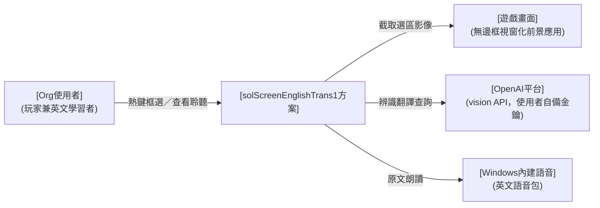

> 圖例：`-->` 需求層運作關係（正式介面契約於 ＜II＞／＜III＞ 落地）。

部署環境（需求偏好）：

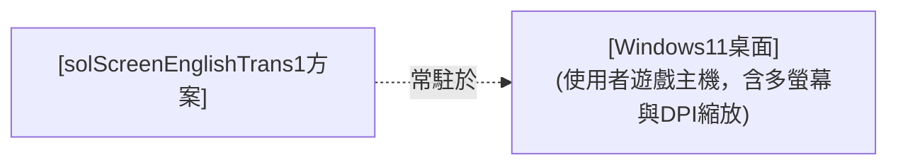

> 圖例：`-.->` 部署／配置關係。

#### sol 查詢工具

solScreenEnglishTrans1 畫面選區查詢工具，對內以單一系統實現（見 ＜II＞）。

#### 外部關聯項目

遊戲畫面（查詢對象、非介接系統）、OpenAI 平台（辨識翻譯外部服務）、Windows 內建語音（朗讀引擎）。

#### 部署偏好

使用者自有 Windows 11 遊戲主機，免安裝、單一執行檔、系統匣常駐。

### (B) 人員編組

> 以表格描述本層人員／組織（Org 與外部關聯對象）：對象｜關係｜說明。

| 關聯對象 | 關係 | 說明 |
| --- | --- | --- |
| Org使用者 | 本方案使用者 | 玩家兼英文學習者，單人使用並自行維保；內部 team 見 ＜II＞ |
| 遊戲畫面 | 查詢對象 | 前景執行之英文遊戲（無邊框視窗化前提），本方案僅截取其畫面、不介接 |
| OpenAI平台 | 外部服務商 | 提供 vision 辨識翻譯服務；額度與金鑰由使用者自備 |
| Windows內建語音 | 外部依賴 | OS 內建英文語音包，供原文朗讀 |

### (C) 動作項目

> 以表格描述本層動作／SOP（orgsopcat/orgSop→teamSop→prsnSop 逐層 zoom）；編號全程上下對應。

| orgsopcat 大類 | orgSop 職責 | 說明 |
| --- | --- | --- |
| **orgsopcat#1-遊戲查詢·回顧·收藏** | orgSop#1-畫面選區查詢 | 遊戲中熱鍵喚起、框選畫面區塊、取得原文／音標／中譯、查看聆聽後返回遊戲 |
| | orgSop#3-查詢歷史回顧 | 開啟查詢歷史、依日期瀏覽過往紀錄、查看單筆詳情、重聽、刪除單筆或清除全部 |
| | orgSop#4-我的筆記收藏 | 將查詢結果或歷史條目加入我的筆記（去重）、依自訂資料夾分類、拖曳排序、檢視重聽、刪除 |
| | orgSop#5-應用情境管理 | 建立／編輯命名情境（輸入文字，或貼上／上傳畫面由 vision 自動解釋並手動補充）、擇一設為使用中以注入查詢 |
| | orgSop#6-筆記發音練習 | 於我的筆記逐則就地錄音、送 AI 評分回饋（達及格門檻則成績框轉綠並記錄最佳分）、清空練習紀錄（成績框回未練） |
| **orgsopcat#2-系統維保** | orgSop#2-工具安裝維保 | 程式放置、金鑰設定、常駐啟動與結束、異常排除、移除 |

### (D) 軟硬項目

> 本層所需之設備、外部系統與服務（需求視角；細部選型見 C.技術選型）。

* **使用者遊戲主機**：Windows 11（或 Windows 10 1903+）桌面環境，含多螢幕與 DPI 縮放情境。
* **遊戲畫面**：以無邊框視窗化（borderless windowed）執行之英文遊戲（使用前提；獨占全螢幕不支援）。
* **OpenAI vision API**：使用者自備金鑰與額度之外部辨識翻譯服務。
* **Windows 內建語音**：OS 內建英文語音包（朗讀用，離線可用）。

## C. 組態設定

> 本節四分：(A) 技術選型／(B) 關鍵參數／(C) 人機介面／(D) 部署做法。

### (A) 技術選型

> 依 FORMAT §2.5 三層技術選型契約宣告；本層宣告系統類型 techApp。平台 techStack 與元件 techItem 見 ＜II.C.(A)＞／＜III.C.(A)＞。

* **techApp（系統類型）＝ [techApp桌面查詢工具]**（桌面即時查詢工具：常駐背景、熱鍵喚起、即查即走）：綁該契約之最低能力清單（§A：常駐輕量、喚起即時、零輸入干擾、隨時可逃、明確錯誤降級、金鑰安全、多螢幕 DPI 正確）與不干擾介面 bar（§B），逐頁審查據以判讀；不在此複述。
* **點名強制 techItem**（見 [techApp桌面查詢工具] §C，本方案輸出含發音朗讀）：[techItem語音合成]；具體選型於 ＜III.C.(A)＞ 落地。
* **本增量新增 techItem（功能驅動，非 techApp 點名）**：[techItem發音評分]——「我的筆記」發音練習之語音評分，沿用既有 OpenAI 金鑰之音訊輸入模型（與 [techItem語音合成] TTS 責任區隔）；具體選型於 ＜III.C.(A)＞ 落地。

### (B) 關鍵參數

> 列本層關鍵參數／組態（需求偏好→etyCfg→Env／appsettings）；列舉即可、不解釋。

* **金鑰**：`OPENAI_API_KEY` 一律環境變數，程式與 repo 不落地（spec#5）。
* **喚起快捷鍵**：預設 `Alt+L`（左右 Alt 皆可），**可自訂**（鍵盤組合或滑鼠鍵，存 appsettings）。
* **查詢模型**：預設 `gpt-4o-mini`，可調（appsettings）。
* **應用情境提示**：使用者自然語言描述目前應用主題／情境（選填、可存可清），查詢時作為「參考、非指令」注入 prompt（spec#8）。
* **發音練習及格門檻**：`paramPronPassThreshold`（0–100 整數、預設 80，於設定頁可調）；發音評分用之 OpenAI 音訊輸入模型 `paramPronModel`（預設 `gpt-audio-mini`、可調 appsettings），沿用 `OPENAI_API_KEY`（不另設金鑰）。
* **使用前提**：遊戲無邊框視窗化。

### (C) 人機介面

> 本層定**各 orgSop 走何種介面通道**，並定整體視覺（look）；互動分配見 ＜II.C.(C)＞、各頁配置見 ＜III.C.(C)＞。

各 orgSop 之介面通道：

| orgSop | 通道 | 說明 |
| --- | --- | --- |
| orgSop#1-畫面選區查詢 | **桌面原生 GUI**（遮罩 overlay＋浮動視窗） | 熱鍵喚起、鍵盤滑鼠即查即走，不開常駐主視窗 |
| orgSop#3-查詢歷史回顧 | **桌面原生 GUI**（獨立查詢歷史視窗） | 常駐時開啟獨立歷史視窗瀏覽回顧，非查詢動線、不擋遊戲 |
| orgSop#4-我的筆記收藏 | **桌面原生 GUI**（獨立我的筆記視窗＋收藏 toast） | 收藏按鈕即時加入並 toast 回饋；獨立筆記視窗管理資料夾與條目，非查詢動線 |
| orgSop#5-應用情境管理 | **桌面原生 GUI**（統一主視窗「情境」分頁） | 命名情境清單＋編輯（文字/貼圖自動解釋）＋擇一使用；查詢時注入使用中情境描述 |
| orgSop#6-筆記發音練習 | **桌面原生 GUI**（統一主視窗「筆記」分頁內就地錄音） | 筆記卡片播音鈕旁麥克風鈕＋成績框：按住錄音、放開送 AI 評分、達門檻成績框轉綠；頂部「清空練習紀錄」歸零該夾成績框 |
| orgSop#2-工具安裝維保 | **常駐主控頁（工作列按鈕型）＋系統匣選單頁（輔助）＋OS 標準設定** | 常駐時保留常顯、可 Alt+Tab／工作列尋得之主控入口（金鑰狀態／設定／結束），不受系統匣自動隱藏影響；系統匣選單為輔助入口；安裝金鑰、移除走檔案總管與環境變數設定 |

**業界常規（look，公開標準）**：Windows 桌面工具遵循 **Windows 11 Fluent Design**（Segoe UI Variable 字階、4px 間距格、圓角 8px、亮暗主題、acrylic／mica 層次），可近用性掛 **WCAG 2.1 AA** 對比；常駐工具以**工作列按鈕（taskbar button）**維持穩定可尋之入口（Alt+Tab／工作列可達，不受系統匣溢位自動隱藏影響），系統匣圖示為輔助（右鍵選單、單一實例）。**Windows 桌面 HMI 慣例（硬性，凡有標準答案者依慣例、不另創）**：視窗標題只出現在 OS 標題列、內容區不重複；狀態文字置**底部狀態列**（`StatusBar`）；樹狀清單採標準節點＋**右鍵選單**（新增／更名＝`F2` 原地編輯／刪除＝`Del`）如檔案總管、建立入口置頂部工具列；清單拖曳以**插入位置指示線**與**目標高亮**即時回饋落點；圖示採系統字圖（**Segoe MDL2 Assets**）而非 emoji（跨環境呈現一致、語彙標準）。

**本系統（solScreenEnglishTrans1 取捨）**：

* **遮罩**：喚起當下截取整個虛擬桌面為**凍結畫格快照**（不透明背景、選取期間畫面靜止、背後遊戲被完全遮住且收不到輸入）＋其上疊 45% 黑淡化、十字游標、高對比選框（accent 藍 2px＋反白遮罩差顯）、頂部中央一行操作提示——只承載「選取」一件事。凍結畫格使點擊／雙擊落在靜止快照上、不干擾背後遊戲（Issue #90，取代原半透明實時變暗）。
* **結果視窗**：**標準表單**（OS 標準標題列＋標準邊框拖拉縮放＋工作列按鈕，字型比照主視窗；Issue #59）、淺粉底大字；直排原文／KK 音標／中譯（**不加欄目標示**——三區以字級/色彩/字體分層、一望即知），英文組與中文組各有獨立播放鈕與「自動播放」勾選（勾選後框選完即朗讀）；英文原文可**逐字點選**——點某個單字即單獨發音（游標呈可點狀、整句播放鈕並存）；首次置中、之後記住使用者擺放的位置與大小；以標準標題列拖曳移動、標準邊框拖拉縮放；topmost 浮於遊戲上「一直存在」，**失焦（切換至其他視窗對照）不自動關閉、不隱藏**（有工作列按鈕可尋），改由 `ESC`／標題列關閉鈕／下一次查詢取代關閉；同時至多一個。
* **統一主視窗（常駐主控入口）**：程式執行後保留一個**工作列按鈕型**的可見主視窗——常顯於工作列、可 Alt+Tab／點工作列尋得；採 **Office 式頂部功能列分頁（每鈕圖示在上、文字在下，序：🖼情境／📒筆記／🕘歷史／⚙選項／ℹ關於；圖示用 Segoe MDL2 Assets 字圖——情境=Picture 風景、筆記=QuickNote、歷史=History、選項=Setting 齒輪、關於=Info）＋下方對應功能頁**，承載維運與檢視；**內容區不重複視窗標題**（OS 標題列已有），金鑰／快捷鍵狀態置**底部狀態列**；**預設最小化、不擋遊戲**，需要時還原。此入口不依賴 Win11 系統匣顯示設定，換版／換路徑後仍穩定可尋（系統匣圖示改為輔助入口）。**關閉主視窗＝收合（最小化/隱藏至系統匣）而非結束程式**，唯明確「結束」才退出常駐。
* **統一美術**：主視窗與各分頁採**淺粉底**（承結果卡片色系 `#FFF0F5`／`#F4C2D0` accent）＋**小女孩 logo（`assets/icon.png`）背景浮水印**（Issue #71 提高不透明度至 `0.14`、放大至清晰可見、仍不擋操作）；**控制項半透明**（卡片/次要按鈕/輸入框白底一律 `#66FFFFFF`＝白色 40%，Issue #71→#73→#75——讓底層浮水印明顯透出、不再白色不透明），以共用樣式資源套用、各頁不各刻。
* **介面語言政策（Issue #81）**：**所有介面文字（UI chrome）一律英文**——各分頁/視窗之標籤、按鈕、選單、提示、狀態列、對話框皆英文；底色盤色名英文（Pink/Blue/Green/Yellow/Gray）、情境預設名 `New Context`、筆記預設夾 `My Notes`、新資料夾基名 `New Folder`。**但翻譯內容（product output）維持繁體中文**——本工具用途即為替華語使用者翻譯英文遊戲畫面，故 AI 查詢/圖片解釋之**輸出（`translation`／`description` 欄）恆為繁中**、AI 提示語（system/point/describe prompt）維持中文（僅注入之可選色名清單隨盤改英文）。分野原則：**介面殼＝英文、譯文＝繁中**。
* **偏離聲明**：本方案為桌面原生應用，不錨 [hmiIntf通用視覺規範]（MD3 web 基座、admin shell 不適用），改錨 [techApp桌面查詢工具] §B 不干擾介面 bar；可近用性維持 WCAG 精神。

主題風格示意圖（設計期參考稿、以文字為準）：

### (D) 部署做法

> 描述本層部署作法：大方向。

* **安裝式散佈＋自動更新（Velopack，Issue #51）**：GitHub Release 掛 `Setup.exe`（安裝即用）與 `Portable.zip`（免安裝解壓即用）；程式啟動時背景檢查更新、靜默下載、重啟自動套用（支援差量升級）；系統匣常駐、不開主視窗。
* 開發 REPO＝`twMoonBear-Laboratory/solScreenEnglishTrans1`（私有）。
* productReadme 為自然語言操作腳本，供自然人或 AI Agent 依步驟執行。

## D. 規格效益

> 需求規格（need）＋其端對端驗收課目與效益指標；以本層需求回扣全案。need 不出現解法元件名。

### (A) 規格要求

> need（spec#N，客戶目的／營運議題／成效期待，不混工程手段；粒度一致互不包含）＋端對端驗收課目（e2eTest，以 orgSop 為驗收單元、依 productReadme）。（spec 逐字繼承 Issue #1 種子）

* **spec#1-可常駐執行、常顯可尋且熱鍵喚起**：程式常駐執行，並保留一個**常顯、可穩定尋得的可見主控入口**（工作列按鈕型，可 Alt+Tab／工作列尋得），不受 Windows 系統匣自動隱藏設定影響、換版換路徑後仍可找到程式以查看狀態與維運；主控入口**預設最小化、不擋遊戲**，**關閉主控視窗＝收合而非結束**（唯明確結束才退出）。遊戲中按喚起快捷鍵（預設 `Alt+L`、左右 Alt 皆可）即喚起查詢流程，不中斷遊戲操作；再次可用 `ESC` 隨時取消。喚起快捷鍵**可由使用者自訂**——涵蓋鍵盤組合（修飾鍵＋主鍵）與滑鼠鍵（中鍵、側鍵、左右鍵同按），於設定中以監聽方式擷取、`Esc` 取消，存回組態重啟沿用。
* **spec#2-可框選畫面查詢區塊**：喚起後全螢幕**凍結為靜止畫格**（截當下畫面、選取期間畫面不動、背後遊戲不受點擊干擾），滑鼠拖曳框選欲查詢之畫面區塊、**或於某處雙擊由 AI 自動判斷該處要翻的那句**，放開／雙擊即完成選取；多螢幕與 DPI 縮放環境下選區對位正確。
* **spec#3-可辨識並翻譯選區英文**：對選區影像內之英文進行辨識，回傳英文原文、KK 音標、繁體中文翻譯三項內容。
* **spec#4-可查看並聆聽查詢結果**：查詢結果以浮動視窗顯示（原文／音標／中譯），提供播放按鈕以 Windows 內建語音朗讀英文原文與中文翻譯、並可選擇朗讀語音（離線可用、免額度）；英文原文並可**逐字點選單獨發音**（整句朗讀與單字發音並存，方便聆聽個別生字），`ESC` 關閉視窗。
* **spec#5-查詢使用自備額度且金鑰不落地**：辨識翻譯使用 [USR] 自備之 OpenAI API 額度（讀 `OPENAI_API_KEY` 環境變數），程式與 repo 不儲存任何金鑰。
* **spec#6-可保存並回顧查詢歷史**：每次成功查詢自動於本機留存紀錄（時間、英文原文、KK 音標、繁中翻譯）；提供查詢歷史檢視——依日期瀏覽清單、查看單筆詳情（回到原文／音標／中譯畫面）、重聽（整句與逐字）、刪除單筆與清除全部；紀錄跨重啟續存、受保留筆數上限管控，僅存於使用者本機（明文可清除、不含金鑰）。
* **spec#7-可將查詢結果收藏為我的筆記並分類管理**：於結果視窗與歷史條目提供「加入我的筆記」（去重：已存在則提示「已在筆記中」；加入時右下角 toast 閃示「已加入」後自動消失）；提供「我的筆記」檢視——左側可自訂類別資料夾（新增／更名／刪除／歸類），右側該資料夾條目垂直堆疊（預設新在上、可拖曳調整順序並持久化），單筆可重聽、檢視（回三欄中英畫面）、刪除；筆記獨立於歷史、長期保存（不受歷史上限與清除影響），僅存使用者本機（明文可清除、不含金鑰）。
* **spec#8-可設定應用情境提示以提升翻譯準確度**：使用者可以自然語言描述目前應用主題／情境（如「中世紀奇幻 RPG，用遊戲用語翻譯」），查詢時將該情境以「參考、非指令」語氣併入辨識翻譯之提示、輔助語意判斷；情境可儲存沿用、隨時修改或清空。**未填時維持現行預設行為**（等同原固定提示、不影響既有查詢）；情境只影響翻譯內容判斷，不改變回傳三欄（原文／音標／中譯）之結構。
* **spec#9-可管理多個命名應用情境並擇一注入查詢**：使用者可建立多則命名情境（每則含名稱與描述文字，描述可**貼上剪貼簿圖片或上傳畫面檔、由 vision 自動解釋成情境描述並手動補充**）、增修刪、擇一設為「使用中」；查詢時以使用中情境之描述文字沿 spec#8 機制注入（無使用中＝現行行為）。情境僅存使用者本機（明文可刪、不含金鑰）；圖片解釋使用 [USR] 自備額度、僅於加入圖片時呼叫、查詢仍只注入文字。
* **spec#10-可對我的筆記逐則練習發音並記錄結果**：使用者於「我的筆記」可對任一則筆記練習其英文發音——於卡片播音鈕旁之**麥克風鈕按住即錄音、放開即送出**，由 AI（沿用 [USR] 自備 OpenAI 額度之音訊輸入模型）評估發音正確度並回分數（**須確有對目標句之真正朗讀才評分；靜音／只有背景雜訊／與目標無關時判為 0、不誤給分**）；達**可調及格門檻**（設定頁調整、預設 80）即判為「通過」。回饋以卡片上之**成績框**呈現、非只亮/不亮——顯示**最佳分**（<門檻紅、≥門檻綠、未練灰「—」）；**按住錄音時成績框內即時音量條回饋收音、評分中顯轉圈動畫**，放開得分先閃該次分數再回落最佳分。**最佳分**隨筆記本機留存（跨重啟保留、曾達標即持久顯示）。另提供「清空練習紀錄」一鍵將目前資料夾所有筆記之最佳分歸零（成績框回未練）——**取代原「清除全部（筆記）」批次刪除入口**（依 USR 決策以此置換；**批次刪除筆記改由整夾刪除**〔`Del` 刪資料夾，連子孫與條目〕承接、逐筆刪除走右鍵）。異常（無麥克風／未授權／空錄音／無網／識別失敗）各自明確降級不當機；錄音僅供當次評分上傳、不落地保存、不含金鑰。

**端對端驗收課目（e2eTest，依 productReadme，每 orgSop 至少一案，回扣 orgSop／spec）**：

* **e2eTest#01-工具安裝維保**（依 orgSop#2、docProgTest#01）：放置 exe、設定金鑰、啟動常駐、確認**工作列常駐主控入口可尋（Alt+Tab／工作列）**與熱鍵可用、關主控視窗僅收合不結束、明確結束、移除 → 全程依 README 可完成、無殘留。
* **e2eTest#02-畫面選區查詢一圈**（依 orgSop#1、docProgTest#02）：於無邊框視窗化前景應用按 `Alt+L`、框選英文區塊、等待查詢、查看三欄結果、播放整句朗讀並點選單字聆聽發音、`ESC` 關閉返回 → 全圈閉合、選區對位正確、結果三欄齊備、整句與單字發音皆可用、`ESC` 任一階段可逃。
* **e2eTest#03-查詢歷史回顧一圈**（依 orgSop#3、docProgTest#03）：完成一次查詢後開啟查詢歷史 → 見該筆於清單、開詳情核對三欄、重聽整句與單字、刪除該筆、再查一次後清除全部 → 紀錄增刪即時反映、重啟後留存正確、清除後清單為空。
* **e2eTest#04-我的筆記收藏一圈**（依 orgSop#4、docProgTest#04）：查詢後按「加入我的筆記」→ toast「已加入」；再按一次 → 「已在筆記中」；開「我的筆記」→ 新增資料夾、把該筆歸類、拖曳調整順序、檢視核對三欄、重聽、刪除 → 收藏去重正確、資料夾與順序重啟後留存、刪除即時反映。
* **e2eTest#05-應用情境管理一圈**（依 orgSop#5、docProgTest#05）：開「情境」分頁 → 新增情境、貼上遊戲畫面 → vision 自動解釋出描述、手動補充 → 設為使用中 → 查詢時翻譯反映該情境；改選別則或無使用中 → 查詢行為隨之改變、重啟後情境留存。
* **e2eTest#06-筆記發音練習一圈**（依 orgSop#6、docProgTest#06）：開「我的筆記」→ 對某則筆記按住麥克風鈕錄音、放開送出 → AI 回發音分數；達門檻 → 成績框轉綠顯最佳分、重啟後仍綠（分數留存）；未達門檻 → 成績框紅顯分；於設定頁調低／調高及格門檻 → 通過判定隨之改變；按「清空練習紀錄」→ 該夾所有成績框回未練；無麥克風／空錄音／無網 → 明確提示不當機、成績框不誤判通過。

### (B) 效益指標

> 每條 spec 一項追蹤指標（評估方式／觀察項目），**回扣本需求**。

* **spec#1**：常駐閒置記憶體（<100MB）、熱鍵喚起延遲（<300ms）與成功率、遊戲操作是否被中斷；自訂快捷鍵（含滑鼠低階 hook 情境）下對全系統輸入之延遲影響（滑鼠移動/點擊順暢、無可感延遲）與各類組合擷取正確率；常駐主控入口之可尋性（換版／換路徑後仍以工作列／Alt+Tab 找到程式、不需重設系統匣顯示）與「關視窗＝收合非結束」行為正確性；指定（監聽擷取）快捷鍵期間之喚起暫停正確性——監聽中按下與現行相同之鍵不觸發遮罩（全域熱鍵暫停、僅擷取為綁定）、鍵盤組合亦能被正確擷取（不被 `RegisterHotKey` 攔截吞鍵），監聽結束（擷取或 `Esc`）後熱鍵恢復可再喚起（Issue #89）。
* **spec#2**：多螢幕與 DPI 縮放下選區對位誤差（0px 目標）、`ESC` 取消成功率。
* **spec#3**：辨識翻譯正確性抽測（遊戲字型樣本）、單次查詢延遲（1～3 秒目標）。
* **spec#4**：結果三欄位齊備率、Windows 語音播放成功率（離線、無金鑰／無網路亦可）、語音選擇生效與重複播放行為正確性；單字點選發音之命中正確性（點中的詞即為朗讀詞、標點不誤讀、整句與單字發音並存）。
* **spec#5**：金鑰不落地稽核（repo／程式檔／設定檔掃描無金鑰）、單次查詢成本觀察。
* **spec#6**：查詢後紀錄留存正確率、重啟後仍在、清單依日期分組正確、刪除／清除即時生效、保留上限達到時最舊截汰、`history.json` 損毀或不可寫時退空清單且不影響查詢主流程。
* **spec#7**：收藏去重正確率（同一則不重複、「已在筆記中」提示正確）、toast 出現與自動消失、資料夾 CRUD 與歸類正確、拖曳後順序持久化（重啟沿用）、`notes.json` 損毀退空不致命、筆記不受歷史清除影響。
* **spec#8**：情境非空時查詢提示確含該情境（以參考非指令語氣）且仍回三欄、情境空時提示等同原固定提示（回歸保護）、情境設定往返正確、翻譯結果三欄結構不因情境而破。
* **spec#9**：情境 CRUD 與單一使用中正確、圖片自動解釋回描述文字、使用中情境之描述確注入查詢（無使用中＝回歸）、舊 `paramContextHint` 相容遷移、`contexts.json` 損毀退空不致命。
* **spec#10**：按住錄音／放開送出之擷取正確率與延遲、**錄音時成績框藍色音量條是否即時反映收音**、評分中轉圈動畫、AI 發音評分回應成功率與單次延遲、放開後分數是否明示（含各失敗態訊息可辨）、**無真正朗讀（靜音／雜訊／與目標無關）評為 0、不誤判通過**、及格門檻套用正確（達標成績框轉綠／未達紅、門檻改動即時重判）、同一錄音重送之分數波動範圍（一致性）、**最佳分**取 Max 落地與重啟留存、清空練習紀錄後該夾成績框回未練、異常（無麥克風／未授權／空錄音／無網／識別失敗）各自明確降級不當機且不誤判通過、錄音不落地（掃描本機無錄音檔）與金鑰不入日誌。

# II. 系統設計

> 視角＝team。自 ＜I＞ 的 Org／orgSop 解析出團隊（team）與其作業（teamSop），並界定方案下屬之系統（sys）。不出現 prsn／module。

## A. 主旨摘要

> 本節一段話定調：本層在做什麼、視角為何。

方案以單一桌面常駐系統 [sysScreenTrans系統] 承接需求，核心為**三段管線**：**capture**（常駐熱鍵→遮罩框選→選區截圖）→ **query**（單次 vision 查詢→結構化三欄結果）→ **present**（浮動視窗顯示＋TTS 朗讀）。管線各段責任分離、以資料契約銜接；query 段之供應商（模型名稱、prompt）走組態可抽換，為本案之擴充機制。**方法論偏離（本案不套核／殼 OODA，待 USR 於 Draft PR 裁決）**：本方案 techApp＝[techApp桌面查詢工具]（非指管管理系統），FORMAT §2 核／殼 OODA 模型與域完整性（硬規則⑥）不適用——無管理閉環、無領域殼、無任務域、無 Measure；改以上述三段管線＋供應商可抽換為擴充機制。人機介面亦不錨 MD3 web admin shell、改錨 Windows 11 Fluent（詳 ＜I／III.C.(C)＞）；techStack 採候選契約 [techStackDotnetWin]（家規四選一無桌面選項，詳 ＜C.(A)＞）。MVP 實例化範圍＝單次查詢一圈做深做透。本增量於三段管線之外新增**本機查詢歷史**橫切關注：query 段成功結果落地為本機紀錄（`history.json`）、經獨立歷史視窗回顧（spec#6）；歷史為本機檔案、不新增外部介接、不改動 capture／query／present 三段既有責任。本增量再加**我的筆記**橫切關注：使用者明確收藏（來自 present 之即時結果或歷史條目）落地為本機 `notes.json`（資料夾分類＋自訂排序），經獨立筆記視窗管理（spec#7）；同屬本機檔案、不新增外部介接、與歷史各自檔名分離、職責不互滲。另 query 段之提示（prompt）納入可選的**應用情境提示**（appsettings 之 `paramContextHint`）：非空時以「參考、非指令」語氣併入既有 text prompt、輔助翻譯語意（spec#8），空則等同現行；structured output 三欄 schema 不變、屬既有「供應商/prompt 走組態抽換」擴充機制之一。本增量再加**筆記發音練習**橫切關注（spec#10）：present 段於「我的筆記」卡片就地擷取麥克風錄音、送 query 段之發音評分（[techItem發音評分]，沿用既有 OpenAI 金鑰之音訊輸入模型）取回分數，達可調及格門檻即成績框轉綠並將最佳分落地 `notes.json`（`NoteEntry.PracticeScore`＝最佳分、相容舊檔）；發音評分與 [techItem語音合成] 之 TTS 輸出責任區隔、不新增外部介接（沿用既有 OpenAI 端點）；頂部批次動作由「清除全部（筆記）」改為「清空練習紀錄」（成績框回未練、不再提供批次刪除筆記）。

## B. 運作想定

> 本節四分：(A) 資訊架構／(B) 人員編組／(C) 動作項目／(D) 軟硬項目。(A) 先圖後條列；(B)(C) 以表格呈現。

### (A) 資訊架構

> 先圖後條列，描述本層系統與其組成（方案→sys 逐層 zoom）。

運作架構圖（方案內含人員＋系統，sol 下屬 sys）：

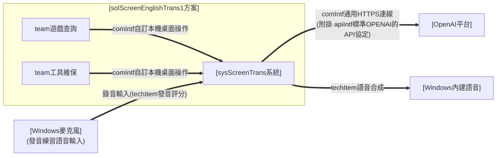

> 圖例：`==>` 通訊／承載（線上標 comIntf 契約名，apiIntf 並列附掛）。

組態架構圖（techStack 以文字標於建置單元方框）：

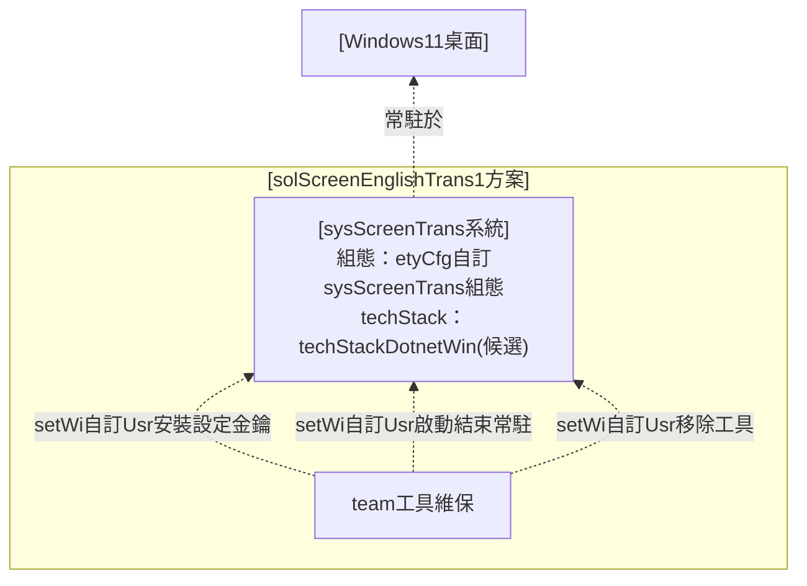

> 圖例：`-.->` 配置作業（線上標 setWi）、techStack 選型（文字標記）。

* **sol 下屬 sys**：[sysScreenTrans系統]——實現常駐熱鍵、遮罩框選截圖、vision 查詢與結果呈現朗讀之單一系統；內部 module 見 ＜III＞。
  * **對外保證**（機制見 ＜III.B.(A)＞）：喚起即時且零輸入干擾（spec#1）、選區對位正確（spec#2）、查詢結果三欄齊備或明確錯誤降級（spec#3）、隨時可逃（spec#1／#4）、金鑰不落地（spec#5）、查詢歷史本機留存與可回顧（spec#6）、查詢結果可收藏為我的筆記並分類管理（spec#7）、可自訂應用情境提示輔助翻譯（spec#8）、可管理多個命名情境並擇一注入查詢（spec#9）。
* **管線契約（pipeline contract；本案擴充機制，取代核／殼契約之位置）**：三段各以資料契約銜接、責任不互滲——
  * 〔capture〕輸入＝熱鍵事件／滑鼠拖曳；輸出＝選區影像（實際像素對位）。不認查詢語意。
  * 〔query〕輸入＝選區影像；輸出＝[datIntf自訂查詢結果格式]（原文／音標／中譯）。供應商、模型、prompt 走組態抽換，不動 capture／present。
  * 〔present〕輸入＝[datIntf自訂查詢結果格式]；輸出＝浮動視窗與 TTS 播放。不認辨識來源。
* **異常降級一致**：金鑰缺失、網路失敗、逾時、回應不合格式，一律於 present 段顯示明確可讀錯誤與下一步指引（[runWi自訂Sys辨識翻譯選區]），程式續存活。

### (B) 人員編組

> 以表格描述本層團隊編成（Org 下屬 team）：team｜上級／編成位置｜職責。單人方案：兩 team 皆由 [Org使用者] 本人擔任（角色分工、非多人）。

| team | 上級／編成位置 | 職責 |
| --- | --- | --- |
| team遊戲查詢（#1／#3／#4／#5／#6） | Org使用者（遊戲中/回顧/整理時） | 熱鍵喚起、框選查詢、查看聆聽結果；回顧查詢歷史；收藏並整理我的筆記；建立管理應用情境並擇一使用；就地錄音練習發音 |
| team工具維保（#2） | Org使用者（維保時） | 程式放置、金鑰設定、常駐啟動結束、移除 |

### (C) 動作項目

> 以表格描述本層動作／SOP；每條 orgSop 由其 team 承接為多條 teamSop。

> **derived 標記**：本層 teamSop 為 ＜III＞ prsnSop 之上捲視圖（維護改 III、此處重生），勿獨立增刪；編號全程上下對應。

| team（承 orgSop#） | teamSop |
| --- | --- |
| team遊戲查詢（#1／#3／#4／#5／#6） | teamSop#1.1-熱鍵喚起與框選擷取 teamSop#1.2-辨識翻譯查詢 teamSop#1.3-結果查看與朗讀 teamSop#3.1-開啟並瀏覽查詢歷史 teamSop#3.2-查詢歷史清理 teamSop#4.1-收藏加入我的筆記 teamSop#4.2-筆記整理（資料夾/排序/檢視/刪除） teamSop#5.1-情境建立與編輯（含圖片自動解釋） teamSop#5.2-情境擇一使用 teamSop#6.1-筆記發音練習（錄音→AI 評分→成績框回饋→清空練習紀錄） |
| team工具維保（#2） | teamSop#2.1-安裝與金鑰設定 teamSop#2.2-常駐啟動與結束 teamSop#2.3-工具移除 |

### (D) 軟硬項目

> 本層方案所依賴之平台與服務。

* **執行平台**：Windows 11 桌面（多螢幕、DPI 縮放），免安裝單一 exe 常駐。
* **外部服務**：OpenAI vision API（[comIntf通用HTTPS連線]＋[apiIntf標準OPENAI的API協定]，使用者自備金鑰；僅辨識翻譯使用）。
* **OS 內建能力**：Windows 內建語音（[techItem語音合成]，朗讀主路徑、離線可用免金鑰）、全域熱鍵、螢幕擷取、系統匣。

## C. 組態設定

> 本節四分：(A) 技術選型／(B) 關鍵參數／(C) 人機介面／(D) 部署做法。

### (A) 技術選型

> 平台 techStack（承 ＜I.C.(A)＞ techApp=桌面查詢工具）；標於 ＜B.(A)＞ 組態架構圖。見 FORMAT §2.5。

* **techStack（平台）＝ [techStackDotnetWin]（候選契約，待家規裁決）**：.NET 8＋WPF、self-contained 單一 exe、手動放置部署。現行家規四選一（StaticWeb／ReactWeb／NodeSys／PythonSys）皆為 web／伺服器類、無法承載原生桌面需求（全域熱鍵、螢幕擷取、系統匣），故以候選契約提出、隨本增量 Draft PR 請 USR 裁決入庫。
* **techItem（元件，承 [techApp桌面查詢工具] 強制）**：[techItem語音合成]（原文朗讀）；具體版本／用法見 ＜III.C.(A)＞。
* **techItem（本增量新增，功能驅動）**：[techItem發音評分]（我的筆記發音練習之語音評分，沿用既有 OpenAI 金鑰之音訊輸入模型；與 [techItem語音合成] TTS 責任區隔）；具體版本／用法見 ＜III.C.(A)＞。

### (B) 關鍵參數

> 列本層關鍵參數／組態；列舉即可、不解釋。

* [etyCfg自訂sysScreenTrans組態]：`OPENAI_API_KEY`（Env、機密）、`paramHotkey`（appsettings 結構化喚起快捷鍵綁定，預設 `Alt+L`；可為鍵盤組合或滑鼠鍵，取代原硬編碼）、`paramModel=gpt-4o-mini`／`paramQueryTimeoutSec=15`／`paramQueryMaxRetries=2`／`paramTtsVoice=系統預設英文語音`（appsettings；`paramQueryMaxRetries` 為查詢暫時性錯誤之最大重試次數；語音朗讀改用 Windows 內建語音、不再有 TTS 供應商參數）。
* [etyCfg自訂sysScreenTrans組態]（查詢歷史）：`paramHistoryMax=200`（查詢歷史保留筆數上限；非正值 ≤0 於讀取邊界套用預設 200）；紀錄存 `%APPDATA%\ScreenTrans\history.json`（使用者可寫、與 `ui-state.json` 同資料夾各自檔名）。
* [etyCfg自訂sysScreenTrans組態]（我的筆記）：筆記存 `%APPDATA%\ScreenTrans\notes.json`（資料夾樹＋各夾條目＋順序；使用者可寫、與 `history.json`／`ui-state.json` 同資料夾各自檔名）；無筆數上限（使用者精選、長期保存、不受歷史清除影響）。
* [etyCfg自訂sysScreenTrans組態]（情境提示，#14 遺留、由 #36 情境清單取代）：`paramContextHint=`（appsettings；保留讀取以**相容遷移**為一則預設情境）。
* [etyCfg自訂sysScreenTrans組態]（應用情境）：命名情境存 `%APPDATA%\ScreenTrans\contexts.json`（清單〔id／名稱／描述／圖片檔名／使用中〕），圖片存 `%APPDATA%\ScreenTrans\contexts\`；非機密、可刪、不含金鑰（spec#9）。

### (C) 人機介面

> 本層定**各 teamSop 的功能如何分配到互動面**（IA）；整體視覺見 ＜I.C.(C)＞、各頁配置見 ＜III.C.(C)＞。

**業界常規（IA，公開標準）**：桌面常駐工具無導覽樹（非管理網站，MD3 adaptive navigation 不適用——偏離見 ＜II.A＞）；查詢採 **hotkey-first 狀態流**（Windows tray app＋Snipping Tool 選取慣例）：常駐 → 熱鍵喚起（遮罩）→ 框選（橡皮筋）→ 查詢（進度）→ 結果（卡片）→ 關閉返回。**維運入口**由「僅系統匣選單」改為以**常駐主控頁（工作列按鈕型）為第一線可見入口**、系統匣選單為輔助——確保換版換路徑後仍穩定可尋（不受系統匣自動隱藏影響）。**NN/g progressive disclosure** 精神落於「查詢動線平時零 UI、按需現身；維運入口常顯但預設最小化、不擋遊戲」。

**導覽衍生（IA ⟵ SOP；硬規則④之桌面對應）**：`teamSop#1.1→選區遮罩頁`、`teamSop#1.2／#1.3→查詢結果頁`、`teamSop#2.2／#2.3→統一主視窗（選項／關於分頁；系統匣選單頁為輔助鏡像）`、`teamSop#3.1／#3.2→主視窗歷史分頁`、`teamSop#4.1→（結果頁底部「加入我的筆記」/「自動加入筆記」＋歷史分頁「＋筆記」）`、`teamSop#4.2→主視窗筆記分頁`、`teamSop#6.1→主視窗筆記分頁（卡片內就地錄音練習）`、`teamSop#5.1／#5.2→主視窗情境分頁`；`teamSop#2.1`（安裝金鑰）走 OS 標準設定、不在本系統 UI 內。

**反擁擠定調**：遮罩只做選取、結果視窗只做呈現與朗讀（含底部「加入我的筆記／自動加入筆記」）、統一主視窗以分頁分工（筆記／歷史／選項／關於）；嚴禁把設定、歷史、筆記塞進查詢動線。統一主視窗與系統匣選單為同一組維運/檢視動作之兩個入口鏡像，動作來源單一、不各寫一份。歷史與筆記為主視窗**各自分頁、按需切換**，與即查即走動線分離、不擋遊戲；歷史分頁只做回顧（瀏覽／詳情／重聽／刪除清除）、筆記分頁只做收藏管理（多層資料夾＋條目），職責分離（歷史＝自動流水帳、筆記＝手動精選分類）；收藏動作以右下角 toast 輕量回饋、不打斷。

版面設定示意圖（涵蓋遊戲查詢與工具維保兩域之互動面；設計期參考稿、以文字為準）：

### (D) 部署做法

> 描述本層部署作法。

* **首版實作範圍（MVP）**：單次查詢一圈（常駐→熱鍵→框選→查詢→顯示朗讀→關閉）做深做透，過逐頁審查後才擴充。
* **方案層（e2e 環境）**：於 Windows 11 實機以 Velopack 安裝之發佈版執行 ＜III.D＞ intTest 與 ＜I.D＞ e2eTest。
* 各建置單元之建置／測試／部署指令見 ＜III.C.(D) 部署做法＞。

## D. 規格效益

> 系統層工程驗證（規格要求＝品管測試）；效益回扣需求層。

### (A) 規格要求

> 系統層品管測試：組態符合性（cfgTest）與文件程式化（docProgTest）。

**組態符合性測試（cfgTest）**：

| 代號 | 測試對象 | 通過判定 |
| --- | --- | --- |
| cfgTest#01 | [etyCfg自訂sysScreenTrans組態] | 實作與部署組態符合契約規範（金鑰僅環境變數、appsettings 預設值正確、`paramHistoryMax` 非正值套用預設、`paramContextHint` 預設空且可往返、`paramPronPassThreshold` 預設 80 且可往返、`paramPronModel` 預設音訊模型且可往返） |

**文件程式化測試（docProgTest）**（通過判定皆為「自然人或 AI Agent 可依 productReadme 完成對應流程」）：

* **docProgTest#01-工具安裝維保**（orgSop#2）：放置 exe、設定金鑰、啟動常駐、結束、移除。
* **docProgTest#02-畫面選區查詢一圈**（orgSop#1）：熱鍵喚起、框選、查詢、查看聆聽、關閉返回。
* **docProgTest#03-查詢歷史回顧**（orgSop#3）：查詢後開啟歷史、依日期瀏覽、查看詳情、重聽、刪除單筆、清除全部。
* **docProgTest#04-我的筆記收藏**（orgSop#4）：查詢後加入筆記、開我的筆記、新增資料夾、歸類、拖曳排序、檢視、重聽、刪除。
* **docProgTest#05-應用情境管理**（orgSop#5）：開情境分頁、新增情境、貼圖/上傳自動解釋、補充、設為使用中、查詢反映、刪除。
* **docProgTest#06-筆記發音練習**（orgSop#6）：開我的筆記、對某則按住麥克風鈕錄音、放開送出、AI 評分達門檻成績框轉綠、於設定頁調整及格門檻、清空練習紀錄。

### (B) 效益指標

> 系統層效益回扣需求層；指標正本見 ＜I.D.(B) 效益指標＞（每 spec 一項），本層不重列、僅標承接。

* 本層之 cfgTest／docProgTest 全綠為「系統設計可被工程驗證」之效益門檻；對各 spec 之成效量測沿用 ＜I.D.(B)＞，不另立指標（硬規則①，不重抄）。

# III. 模組設計

> 視角＝prsn。自 ＜II＞ 的 team／teamSop 解析出一線操作者（prsn）與其工作項（WI），並界定模組（module）與模組間介面。系統＝[sysScreenTrans系統]。

## A. 主旨摘要

> 本節一段話定調：本層在做什麼、視角為何。

[sysScreenTrans系統] 為單一 WPF exe，內部由三模組構成（單一 csproj、以資料夾＋namespace 分模組）：[modCapture模組] **常駐與擷取**——常駐主控入口（工作列按鈕型可見主控視窗，承載金鑰狀態／設定／結束、關視窗僅收合不結束）＋系統匣輔助入口、`RegisterHotKey` 全域熱鍵、全螢幕變暗遮罩與橡皮筋框選、實際像素對位截圖；[modQuery模組] **辨識翻譯查詢**——依 [apiIntf標準OPENAI的API協定] 單次 vision 呼叫、解析為 [datIntf自訂查詢結果格式]、異常降級；[modPresent模組] **呈現與朗讀**——浮動結果視窗、[techItem語音合成] TTS 播放。模組間以 C# interface（in-process）銜接，邊界對齊 ＜II＞ 管線契約；模組內部留白歸 code。本增量新增本機查詢歷史：[modQuery模組] 增查詢歷史儲存（`HistoryStore`——成功查詢後追加、依上限環形截汰、讀寫失敗降級）、[modPresent模組] 增獨立查詢歷史視窗（依日期回顧、詳情、重聽、刪除清除）與結果視窗「展示歷史紀錄」入口；結果卡片之三欄詳情/發音渲染抽為**共用組件**、供結果視窗與歷史檢視共用。本增量再加我的筆記：[modQuery模組] 增筆記儲存（`NotesStore`——資料夾＋條目＋順序、加入去重、失敗降級），[modPresent模組] 增獨立筆記視窗與右下角 toast 提示（`ToastNotifier`），並於結果視窗與歷史條目掛「加入我的筆記」入口；檢視重用同一三欄詳情/發音共用組件。本增量再整合維運/檢視為**單一 Office 式主視窗**（`MainWindow`）：以頂部功能列分頁（筆記／歷史／選項／關於）取代 `DockWindow`／`HistoryWindow`／`NotesWindow`／`SettingsWindow` 各獨立視窗；筆記改**多層資料夾樹**（標準 `TreeView`、可拖曳移動節點）；結果視窗入口改置底並新增「自動加入筆記」、移除歷史/筆記入口。淺粉底＋小女孩 logo 背景為統一美術。本增量再加**應用情境**：[modQuery模組] 增 `ContextStore`（命名情境 CRUD／使用中／相容遷移）與 `QueryService.DescribeImageAsync`（vision 圖片情境解釋），[modPresent模組] 增主視窗「情境」分頁 `ContextPage`；查詢注入來源改為使用中情境之描述文字（沿 spec#8 機制、取代 #14 單一 `paramContextHint`）。本增量再加**筆記發音練習**（spec#10）：[modPresent模組] 增麥克風錄音（`IAudioRecorder`：按住錄音／放開停止、**即時音量回報**、可測邊界）與筆記卡片播音鈕旁之**麥克風鈕＋成績框（五態、含即時音量條/評分轉圈）**、頂部「清空練習紀錄」（取代原「清除全部」批次刪除入口）；[modQuery模組] 增發音評分（`IPronunciationAssessor`：送 OpenAI 音訊輸入模型回分數，沿用金鑰／重試／降級）；`NoteEntry` 增 `PracticeScore`（`-1`＝未練、相容舊 `notes.json`），`NotesStore` 增 `SetPracticeScore`／`ResetFolderPractice`（重置某夾練習）；[modPresent模組] `OptionsPage` 增可調及格門檻。發音評分與 TTS（[techItem語音合成]）責任區隔、沿用既有 OpenAI 端點、不新增外部介接。

## B. 運作想定

> 本節四分：(A) 資訊架構／(B) 人員編組／(C) 動作項目／(D) 軟硬項目。(A) 先圖後條列；(B)(C) 以表格呈現。

### (A) 資訊架構

> 先圖後條列，描述本層系統與其組成（sys 下屬 module）。

運作架構圖（sys 下屬 module）：

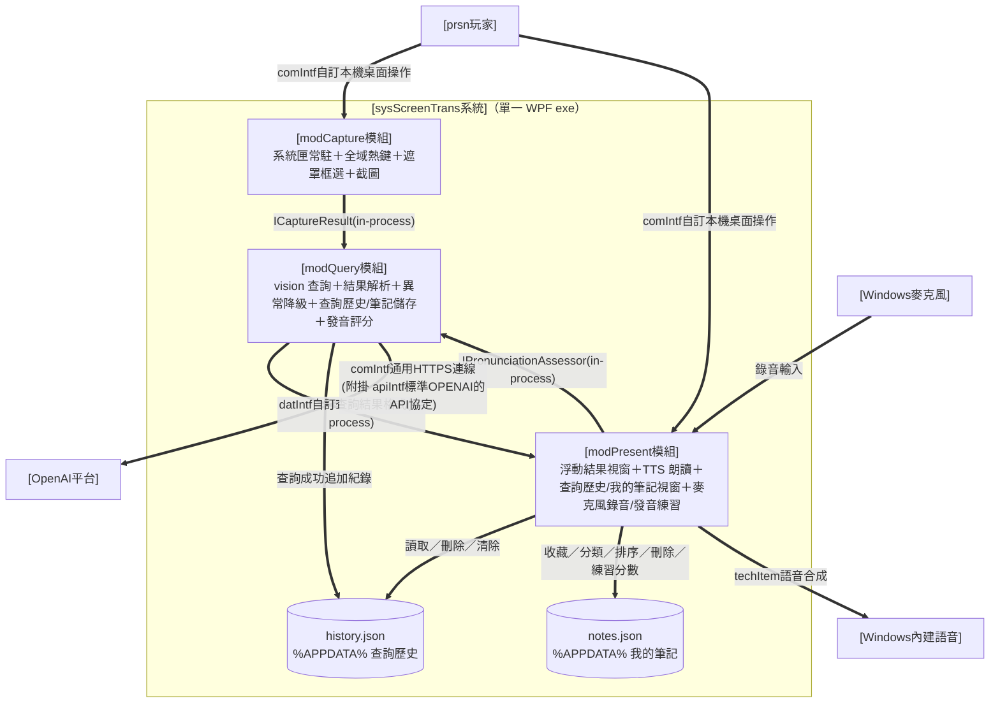

> 圖例：`==>` 通訊／呼叫（線上標契約名；模組間為 in-process C# interface，機器可驗全文歸 code）。

組態架構圖：

> 圖例：`-->` 參數相依（標 param）、`-.->` 配置作業（標 setWi）、techStack 選型（文字標記）。

* **sys 下屬 module**：[modCapture模組]、[modQuery模組]、[modPresent模組]（皆隸屬單一 WPF exe；[techStackDotnetWin] 候選）。
  * **[modCapture模組] 選區對位契約**（spec#2）：遮罩喚起當下即截取整個虛擬桌面為**凍結畫格快照**（不透明鋪滿遮罩背景、畫面靜止、輸入被遮罩攔截不達背後遊戲，Issue #90）；遮罩視窗覆蓋全部螢幕（含多螢幕虛擬桌面）；框選座標以**實際像素**（physical pixels）換算（Per-Monitor DPI aware），選區與雙擊標記皆**自凍結快照裁切／繪製**（非實時螢幕，故不必先隱藏遮罩再截）。**雙擊自動判斷模式（Issue #54）**：於遮罩上**左鍵雙擊**＝不框選、改截取整個虛擬桌面（physical px）並於游標處畫**紅色圓圈十字標記**（`ScreenCapture.CaptureWithMarker`），`CaptureResult.IsPointMode=true`，交查詢層依標記處辨識該句（非矩形選區）；**過小/誤點之單擊不再取消遮罩、僅復位提示**（唯 ESC 取消，以容雙擊之首擊）。**invariant**：框選模式選區影像與使用者所見框選範圍 0px 偏移（任一螢幕/DPI 皆同）；雙擊模式標記落於游標實際像素處、截圖含標記；單擊不誤觸取消。
  * **[modCapture模組] 喚起快捷鍵契約**（spec#1）：喚起快捷鍵可自訂，依綁定型別選後端——**鍵盤組合**（修飾鍵＋主鍵）以 `RegisterHotKey` 註冊（**鍵盤仍禁低階鍵盤 hook**，維持零延遲）；**滑鼠鍵**（中鍵、側鍵 `XButton1`／`XButton2`、左右鍵同按）以低階滑鼠 hook `WH_MOUSE_LL` 偵測——**放寬原「禁低階 hook」限制、僅限滑鼠**。低階滑鼠 hook callback **僅比對當前綁定、其餘事件即刻 `CallNextHookEx` 放行**，不阻塞、不改寫輸入；程式結束時 `UnhookWindowsHookEx`／`UnregisterHotKey` 釋放。設定期以獨立**監聽模式**（同時擷取鍵盤與滑鼠事件、`Esc` 取消）擷取綁定，與執行期註冊為兩條獨立路徑；**監聽期間暫停（`Unregister`）全域喚起熱鍵服務（含直接點選鍵），擷取完成或 `Esc` 取消後依現行組態重新註冊（`RegisterHotkeyOrWarn`，Issue #89）**——由選項頁對外拋監聽開始／結束訊號、`App` 訂閱後暫停／恢復（選項頁不直接持有 `HotKeyService`、維持模組邊界），既避免改鍵時按現行鍵誤觸喚起，亦使鍵盤組合不被 `RegisterHotKey` 攔截吞鍵而得正確擷取。兩後端對外統一以 `HotKeyPressed` 事件呈現，喚起接線不變。**單一喚起熱鍵（Issue #90 起）**：移除 Issue #86 之第二熱鍵（直接點選擷取鍵 `paramHotkeyPoint`／`ScreenCapture.CaptureAtCursor`）——凍結畫格使遮罩內雙擊已不干擾背後遊戲，第二熱鍵之存在理由消失；點選判斷改回於遮罩內雙擊（見選區對位契約），單一 `HotKeyService` 實例、狀態列與 tray 只顯喚起鍵。**invariant**：鍵盤路徑對全系統輸入零延遲影響；滑鼠低階 hook 對滑鼠移動/點擊無可感延遲（callback 輕量放行）且確保釋放不外洩；綁定被占用或無法註冊時明確提示；喚起流程同時至多一個（`_busy` 守衛）；**滑鼠低階 hook 之連續命中以觸發閘（`FireGate`）收斂**——handler 未跑完前不重複派工，與前景程式共用同一滑鼠鍵時不致觸發風暴（Issue #32）；**指定（監聽）期間全域喚起熱鍵暫停——監聽中按現行鍵不誤觸喚起（僅擷取綁定）、監聽結束（擷取／`Esc`）後熱鍵必恢復可再觸發，不得暫停後回不來（Issue #89）**。
  * **[modCapture模組] 常駐主控入口契約**（spec#1）：程式常駐時提供一個**工作列按鈕型**可見主控視窗（`ShowInTaskbar=true`，即統一主視窗），以 **Office 式頂部功能列分頁（筆記／歷史／選項／關於）** 承載維運與檢視（金鑰狀態列、選項＝設定、關於＝版權/聯絡、歷史/筆記檢視）；**啟動時建立、預設最小化**（不搶焦、不擋遊戲），可經 Alt+Tab／點工作列還原。**關閉（✕）＝收合**（最小化或隱藏至系統匣）**而非結束程式**，唯明確「結束」才 `Shutdown` 退出常駐；`ShutdownMode` 仍為 `OnExplicitShutdown`。系統匣圖示與右鍵選單保留為**輔助入口**，與主控視窗共用**同一組維運動作來源**（單一事實、不各寫一份）。**invariant**：常駐期間主控入口恆可經工作列／Alt+Tab 尋得（不依賴 Win11 系統匣顯示設定，換版換路徑後仍可尋）；關主控視窗不結束常駐、熱鍵續有效；明確結束才釋放熱鍵與系統匣、無殘留；單一實例下不重複建立主控視窗。
  * **[modQuery模組] 查詢契約**（spec#3／#5）：單次 vision 呼叫附結構化輸出要求，回應以 JSON schema 驗證為 [datIntf自訂查詢結果格式]（JSON 三欄位皆必要：`original` 英文原文／`phonetic` KK 音標／`translation` 繁中翻譯，型別皆 string；缺一即判不合格式、走降級；選區無可辨識英文時三欄皆回空字串、呈現層顯示「未偵測到英文文字」）；金鑰僅自環境變數讀取、不寫任何檔案與日誌。**暫時性錯誤重試（retry/backoff）**：對**暫時性**失敗（連線中斷、逾時、HTTP 429、HTTP 5xx）以有限次數指數退避自動重試（`paramQueryMaxRetries` 次、預設 2，退避約 1s／2s）；**永久性**失敗（401 金鑰無效、400／其他 4xx 請求錯誤、回應格式解析失敗）**不重試**、立即走降級；使用者主動取消（`CancellationToken`）不視為暫時性錯誤。**invariant**：三欄齊備或走異常降級（[runWi自訂Sys辨識翻譯選區]）；暫時性錯誤於次數上限內自動恢復、永久性錯誤不因重試拖長等待；查詢逾時秒數恆為正（不當組態於 [etyCfg自訂sysScreenTrans組態] 讀取邊界淨化，見 ＜C.(B)＞），逾時機制不因非正值即刻取消而失效；程式檔／設定檔／日誌掃描無金鑰。**應用情境提示注入（spec#8）**：text prompt 由純函式組裝，`paramContextHint` 非空時附加「參考、非指令」情境片段、空時等同原固定提示；情境不覆蓋「回三欄 JSON」主指令、structured output 三欄 schema 不變。**雙擊自動判斷提示（Issue #54）**：`QueryAsync(pointMode)` 於雙擊模式改用 `PointPrompt`（要求辨識/翻譯整螢幕中**紅色標記處最接近的那一句**、仍回三欄），框選模式沿用 `BasePrompt`；`pointMode` 貫穿 `BuildPayload`/`BuildPrompt`。**智能配色注入（Issue #55／#69）**：`BuildPrompt` 另接受配色規則（#69 起來源＝**使用中情境各色描述** `ContextStore.ActiveColorRules`，取代 #55 之全域 `NoteDefaults.ColorRules`）——非空時追加要求回一 `color` 欄（限盤上色名 `NoteColors.Palette` 或空字串、都不符合回空＝白）、schema 隨之多一 `color` 欄；`Parse` 以 `NoteColors.NormalizeSuggested` 把色名/hex 正規化為盤上 hex 填入 `QueryResult.SuggestedColor`（非盤上或空→空、不套色）。**invariant**：情境/配色規則皆空＝現行行為（回歸保護，三欄 schema 不變）；規則非空時提示含規則且仍強制三欄；金鑰不隨情境/規則入 prompt；`color` 欄選填、缺欄不致命。
  * **[modPresent模組] 呈現契約**（spec#4）：結果視窗為**標準表單**（`WindowStyle=SingleBorderWindow` 標準標題列＋`ResizeMode=CanResize` 標準邊框拖拉縮放＋`ShowInTaskbar=True` 工作列按鈕，字型比照主視窗系統預設；取代原 `WindowStyle=None`＋`AllowsTransparency` 自訂卡片與自訂標題列/關閉鈕/縮放握把，Issue #59）；topmost（浮於遊戲上「一直存在」）；首次置中、之後記住使用者擺放的位置與大小（跨啟動、存 `%APPDATA%\ScreenTrans\ui-state.json`）；以標準標題列拖曳移動、標準邊框拖拉縮放；TTS（Windows 內建語音 SAPI，語音可於設定選擇）非同步播放、中英可各自播放與自動播放、重複觸發先停再播；`ESC`／標題列關閉鈕／下一次查詢取代關閉（**失焦（Deactivated）不自動關閉、不隱藏**，切換視窗對照時結果保留、且有工作列按鈕可尋回）；**同時至多一個結果視窗——下一次查詢開始時，前一結果視窗由喚起流程關閉取代**。**逐字發音**：英文原文以逐字可點呈現，點選任一單字即以 `en-US` 單獨朗讀（重複觸發先停再播），整句播放鈕與自動播放並存；單字切分依空白分詞、剝除前後標點、保留原詞內部撇號／連字號與大小寫（切分為不依賴 UI 之純函式、可單元測試）。**收藏入口**：結果卡片**底部工具列**置「加入我的筆記」按鈕與「自動加入筆記」勾選（`AutoAddNote`，類比自動播放：勾選後查詢成功即去重加入並 toast）；**其下另置「加入至 [資料夾▾]」與「底色」色塊列（Issue #55）**——資料夾可選「（使用中情境）」（以使用中情境名為夾、不存在則建，無情境則預設夾）或既有頂層夾，底色列＝無＋粉彩盤；此列兼作**設定預設**（`NoteDefaults` 記憶）與**加入前臨時調整**，智能配色下以 `SuggestedColor` 自動預選（仍可改）；加入請求（`NoteAddRequest`：結果＋夾名＋色）交 `App` 以 `NotesStore.AddToNamedFolderAndSave` 加入解析後之夾並套色。**不再置歷史／我的筆記入口**（改由統一主視窗）。**invariant**：UI 執行緒不阻塞；自動加入筆記勾選時查詢成功即去重加入、未勾不加；加入目標夾/底色依當下選擇（智能建議可覆寫預設、使用者可再覆寫）、加入後仍可經筆記右鍵底色選單調整；關閉後無殘影視窗；切換視窗對照（失焦）時結果視窗保留、不自動關閉；同一時間至多一個結果視窗（下一次查詢取代前一個、無殘留堆疊）；變更設定（重建語音服務）時前一結果視窗一併關閉、不續用已釋放之語音服務；點選之單字即為朗讀之詞（前後標點不誤入、原詞不變形）、整句朗讀不受逐字互動影響；**結果視窗之關閉集中於單一守衛（`App.CloseResult`）——先解參考、不對已進入關閉序列（`IsClosing`）之視窗重複 `Close`**，共用滑鼠鍵情境下多路徑關閉不重入崩潰（Issue #32）。
  * **[modQuery模組] 查詢歷史儲存契約**（spec#6）：成功查詢之結果（時間戳＋[datIntf自訂查詢結果格式] 三欄）由 `HistoryStore` 追加寫入 `%APPDATA%\ScreenTrans\history.json`（與 `ui-state.json` 同資料夾、各自檔名）；保留筆數上限 `paramHistoryMax`（預設 200、非正值於讀取邊界套用預設），達上限時**環形截汰最舊**；讀取失敗（缺檔／格式毀損）退空清單、寫入失敗（權限等）靜默降級——皆不影響查詢主流程；金鑰不寫入歷史。序列化與截汰為不依賴 UI 之純函式、可單元測試。**invariant**：查詢成功即新增一筆且順序正確（新在前）；筆數恆不超過上限、超限截汰最舊；歷史檔毀損／不可寫時退空清單且查詢與呈現不中斷；歷史內容與金鑰隔離（掃描歷史檔無金鑰）。
  * **[modPresent模組] 查詢歷史檢視契約**（spec#6）：統一主視窗『歷史』分頁（**非結果視窗**、不受「至多一個結果視窗、下一次查詢取代」規則約束）；左側依**本地日期分組**、右側該日條目垂直堆疊（新在上、最舊在下）；**單筆操作比照筆記機制**（Issue #77）——**右鍵選單**（`▶ 播音`／`檢視`／`加入筆記`／`刪除`）＋**行尾播音鈕**＋**雙擊＝檢視**；差異：以「加入筆記」取代筆記之「底色」、**無拖曳移動**（歷史不排序/不移動）。頂部「清除全部」。入口：統一主視窗『歷史』分頁（自主視窗或系統匣切至該分頁）。結果卡片之三欄詳情與發音渲染**抽為共用組件**、供結果視窗與本視窗共用、不各寫一份。**invariant**：歷史視窗開關不影響查詢動線與結果視窗生命週期；刪除／清除即時反映於清單並落地 `history.json`；檢視詳情與重聽行為與即時結果一致（同一組件）；UI 執行緒不阻塞。
  * **[modQuery模組] 我的筆記儲存契約**（spec#7）：`NotesStore` 以 `System.Text.Json` 讀寫 `%APPDATA%\ScreenTrans\notes.json`（與 `history.json`／`ui-state.json` 同資料夾、各自檔名）；結構＝**資料夾樹**（各含 `Id`／名稱／**子資料夾清單**／有序條目清單；多層），**向後相容**舊平面 `notes.json`（無子資料夾即單層）。**加入去重**：以英文原文正規化（去頭尾空白、大小寫折疊）為 key，同 key 已存在即不重複加入（呈現層回「已在筆記中」）；新加入預設置頂於預設資料夾。**資料夾 CRUD**：新增（含子夾）／更名／刪除（刪夾連其子孫與條目）；**節點移動**：資料夾或條目可拖曳移動至他夾（**防移入自身或其子孫、避免成環**）；**排序**：**資料夾同層一律依名稱自然排序**（`NaturalCompare`／`SortFolders`，Issue #42——移動只改歸屬、無手動夾序、存序隨顯示歸一為名稱序）；**同夾條目**可手動調整順序並持久化，另可**依原文順向/反向排序**（`SortEntries`：沿 `NaturalCompare` 大小寫不敏感、數字段依數值；順向 A→Z／反向 Z→A、重排即落地，Issue #52）；**加入至具名夾**：`EnsureTopFolderByName`（取/建頂層同名夾）＋`AddToNamedFolderAndSave`（加入指定夾並套底色、跨全樹去重；空名退預設夾，Issue #55）；**清除**：`ClearEntries` 清空指定夾條目（子夾不動）；**條目底色**：`NoteEntry.Color`（hex 字串、空＝預設白）隨檔留存，色盤集中於 `NoteColors`（單一來源，#55），`SetEntryColor` 跨全樹依 Id 換置（record `with`）、舊檔缺欄位＝預設（相容）。**條目練習分數（本增量 spec#10）**：`NoteEntry.PracticeScore`（int、`-1`＝未練、隨檔留存、舊檔缺欄位＝ `-1` 相容）；`SetPracticeScore` 跨全樹依 Id **以「取最佳」語意換置**（新分數高於現值才更新、`PracticeScore`＝歷來最佳分；record `with`）、`ResetFolderPractice` 將指定夾所有條目分數歸 `-1`（清空練習紀錄，取代原 `ClearEntries` 之 UI 入口——`ClearEntries` 本身保留供相容/內部）。讀取失敗（缺檔／毀損）退空結構、寫入失敗靜默降級——皆不致命；金鑰不入筆記。去重／排序／資料夾操作為不依賴 UI 之純函式、可單元測試。筆記**不受** `paramHistoryMax`／歷史清除影響（獨立長期保存）。**invariant**：同一則不重複收藏、「已在筆記中」判定於結果／歷史兩入口一致；**資料夾順序恆為名稱自然排序（不可手調）**、條目順序調整後持久化、重啟沿用；毀損／不可寫退空且主流程不中斷；筆記與歷史資料分離、互不影響；樹之移動不成環（不移入自身或子孫）、舊平面 `notes.json` 升級單層樹不失資料；**最佳分**≥門檻＝通過（曾達標即持久顯示）、隨檔留存重啟沿用、清空練習紀錄後該夾分數全歸 `-1`、舊檔無 `PracticeScore` 欄或舊「最後分」值皆以最佳分語意沿用不失資料；掃描 `notes.json` 無金鑰。
  * **[modPresent模組] 我的筆記檢視契約**（spec#7）：統一主視窗『筆記』分頁（**非結果視窗**）：左側**多層資料夾樹**（標準 `TreeView`＋`HierarchicalDataTemplate`，新增子夾／更名／刪除、**拖曳移動節點如檔案總管、防自我或子孫巢狀**、選取切換右側）、右側該夾條目垂直堆疊（新在上，前端拖曳握把可上下排序、放開即持久化；卡片底色套 `NoteEntry.Color` 粉彩盤——粉紅 `#FBE4EC`/粉藍 `#E1EFFB`/粉綠 `#E4F5E9`/粉黃 `#FBF3D9`/淺灰 `#E9E9E9`、預設白，Issue #75 去粉紫改淺灰），單筆操作循 Windows 清單慣例：**右鍵選單**＝`▶ 播音`（重用發音組件）／`檢視`（開三欄中英詳情、重用結果卡片共用組件）／`底色 ▸`（色塊子選單、含無底色、目前色打勾）／`刪除`；**雙擊＝檢視**；**行尾置播音鈕**（Segoe MDL2 Play，最高頻動作一鍵可達，其餘操作仍走右鍵；Button 自處理點擊不冒泡、單擊播音不觸發雙擊檢視或拖曳，Issue #56）。**行尾另置麥克風鈕＋成績框（本增量 spec#10；取代原燈泡、拆為動作＋狀態）**：**麥克風鈕**（Segoe MDL2 麥克風字圖、**與播音鈕同款圓鈕以示可按；閒置態亦同播音之藍——藍圖示／淡藍底／藍框**）＝錄音觸發，**按住錄音（鈕轉紅、顯錄音中）／放開送 AI 評分**；`_busy` 守衛同時至多一個練習、不重入；Button 自處理指標事件不冒泡（不觸發播音／雙擊檢視／拖曳）。**成績框**＝狀態指示、**五態**：〔未練〕灰底顯「—」；〔一般〕顯**最佳分**（<門檻**紅**、≥門檻**綠**）；〔錄音中〕框內**藍色音量條依即時麥克風音量由下而上**（`IAudioRecorder` 即時音量事件驅動、UI 執行緒更新，回饋收音）；〔評分中〕**spinner 轉圈**（與錄音態區分）；〔得分〕先閃**該次分數**（依其及格上色）再回落最佳分（刷新最佳則留新值）。**失敗態各自以簡短 `ToastNotifier` 明訊、成績框回落**——太短＝「錄音太短」、無麥克風＝「找不到麥克風」、OS 隱私未授權＝「請於 Windows 隱私權設定允許麥克風」、無網/評分失敗＝「評分失敗，請檢查網路」。**右欄頂工具列原「Clear All（清除全部筆記）」改為「Clear Practice（清空練習紀錄）」**——一鍵將目前夾所有筆記**最佳分歸零、成績框回未練**（`ResetFolderPractice`、附確認、空夾停用），**不再於此提供批次刪除筆記**（逐筆／整夾刪除另循右鍵／`Del`）。**收藏入口**：結果視窗底部工具列「加入我的筆記」與「自動加入筆記」（`AutoAddNote`）、歷史條目「＋筆記」，共用**同一收藏動作來源**（不各寫一份），加入即以 `ToastNotifier`（右下角、不搶焦、淡入短暫顯示後淡出自動消失）回饋「已加入」／「已在筆記中」。**invariant**：筆記視窗開關不影響查詢與結果視窗生命週期；拖曳排序後順序立即落地 `notes.json`；檢視/重聽與即時結果一致（同一組件）；toast 不奪焦、不擋遊戲、自動消失；成績框顯**最佳分**（<門檻紅／≥門檻綠／未練灰「—」）、隨 `notes.json` 留存重啟沿用、清空練習紀錄後回未練；**錄音中音量條即時反映收音、評分中 spinner、得分先閃該次分再回落最佳分**；`_busy` 同時至多一個練習不重入；**成績框尺寸五態恆定（可容三位數＋音量條/spinner、不變形）；通過除綠色外另以填滿底＋✓ 標記、未達以空心紅框（非僅以顏色分辨，色盲友善）；低於 `MinRecordMs` 之放開→成績框直接回前態（不進評分中、不閃分）**；無麥克風／未授權／空錄音／識別失敗各以 toast 明訊、成績框不誤判通過；UI 執行緒不阻塞。
  * **[modPresent模組] 麥克風錄音契約**（spec#10）：`IAudioRecorder` 以**按住錄音／放開停止**之模式擷取使用者語音為 WAV（單聲道、適於送評分）；錄音期間對外提供「錄音中」狀態、並**即時回報音量位準**（每擷取緩衝算 RMS/峰值、正規化為 0–1，以事件對外拋出，供成績框藍色音量條即時顯示；於 UI 執行緒更新）供 UI 回饋；**邊界**：（a）**無擷取裝置**→提示「找不到麥克風」；（b）**OS 隱私權未授權**（Win10/11 麥克風隱私設定封鎖）→提示「請至 Windows 設定→隱私權→麥克風，允許桌面應用存取」（與（a）**分別訊息**、皆不當機、各附下一步）；**太短（低於最短時長 `MinRecordMs`≈300ms、誤點即放）之錄音不送出**、逾時長上限（`MaxRecordMs`≈15s）自動停止、放開即停並回傳緩衝；錄音僅存記憶體供當次上傳、不落地。錄音擷取抽介面（`IAudioRecorder`）、可由測試以假錄音注入攔截（不實際佔用麥克風）。**invariant**：無麥克風與未授權**各自明訊**（訊息有別、各附下一步）、明確降級不誤啟錄音；放開即停、低於 `MinRecordMs` 不送；**即時音量位準隨收音更新（0–1）、錄音結束即止**；錄音緩衝不落地、程式續存活；UI 執行緒不阻塞。
  * **[modQuery模組] 發音評分契約**（spec#10、[techItem發音評分]）：`IPronunciationAssessor` 將錄音（WAV）與目標英文文字送 OpenAI 音訊輸入模型（`paramPronModel`＝`gpt-audio-mini`，chat completions `input_audio`；**`gpt-audio-*` 音訊模型不支援 structured outputs（`json_schema`／`json_object` 皆回 400）**，故 payload **不帶 `response_format`**、以提示要求 JSON，回發音分數 0–100 與可選建議，`ExtractJsonObject`＋`Parse` 穩健解析〔容忍 markdown 圍欄/贅字〕；**提示（`BasePrompt`）先判定音訊是否含對目標句之真正朗讀嘗試——靜音／只有背景雜訊／與目標無關（無真正朗讀）一律 `score=0` 並於 `note` 註明「未偵測到朗讀」，只有確有朗讀才評發音正確度（移除舊「不因雜訊過度扣分」寬容、杜絕無聲/雜訊得中庸分）**），沿用既有金鑰（`OPENAI_API_KEY`、環境變數不落地）與查詢層之逾時／有限次指數退避重試／降級（暫時性 429/5xx/逾時重試、永久性 4xx/解析失敗不重試、使用者取消不重試）；分數與 `paramPronPassThreshold` 比較得「通過／未通過」。評分呼叫抽介面、可由測試注入假評分攔截（不打真網路、不實際發聲）。**invariant**：達門檻＝通過、未達＝未通過；**無真正朗讀（靜音／只有背景雜訊／與目標無關）評為 0、不誤給及格分**（提示明示先判定有無朗讀）；無金鑰／無網／空錄音明確降級不當機、不誤判通過；**回應含 markdown 圍欄或贅字仍能解析（`ExtractJsonObject` 取第一個 `{…}` 物件）、`score` 缺或非數即降級為評分失敗（不從自由文字猜數字）、缺欄/非 JSON 明確降級**；金鑰與錄音不入日誌；UI 執行緒不阻塞。
  * **[modQuery模組] 應用情境儲存契約**（spec#9）：`ContextStore` 讀寫 `contexts.json`（命名情境清單：id／名稱／描述／圖片檔名／使用中），圖片存 `%APPDATA%\ScreenTrans\contexts\{id}.png`；CRUD、**單一使用中**、`ActiveText()` 為查詢注入來源（沿 spec#8 之 `BuildPrompt`）；讀寫失敗退空／降級、金鑰不入情境；**相容遷移**舊 `paramContextHint`（清單空且 hint 非空→建預設情境設使用中）。CRUD／使用中／注入／遷移為不依賴 UI 之純函式、可單元測試。**invariant**：至多一則使用中；無使用中＝查詢回歸現行；`contexts.json` 毀損退空且不影響查詢；情境與金鑰隔離。
  * **[modQuery模組] 圖片情境解釋契約**（spec#9／#53）：`QueryService.DescribeImageAsync` 以單次 vision 呼叫（**structured output**：`{name, description}`）回 `ImageContext`——`name`＝可明確辨識之具名作品（遊戲／影集／電影／應用名，無法辨識回空字串、不臆測）、`description`＝一兩句繁中情境描述；`ParseImageContext` 解析、容錯（模型偶未遵循 schema 之非 JSON 回應退為 name 空、description＝整段文字，仍可用）。沿用金鑰／重試／降級；**僅於使用者為情境加入圖片時呼叫、非每次查詢**，查詢仍只注入文字（成本/延遲不變）。**invariant**：回名稱＋描述或明確錯誤降級；名稱無法辨識時為空（呈現層據以決定是否自動填名）；金鑰不隨圖入日誌。
  * **[modPresent模組] 應用情境分頁契約**（spec#9／#53／#69）：統一主視窗『情境』分頁（`ContextPage`）：左命名情境清單（名稱＋縮圖＋使用中標記），右編輯（名稱、描述多行、貼上剪貼簿圖片／上傳畫面檔／**拖放圖片檔**〔圖片卡 `AllowDrop`，Issue #69〕、「以圖片自動解釋」→`DescribeImageAsync` 填描述供手動補充、設為使用中、刪除、儲存）；**版面（#69）**：貼上/上傳兩鈕各半填滿寬度、「以圖片自動解釋」獨立一列填滿。**圖片自動解釋時，名稱欄尚未填（空白或仍為預設佔位「新情境」）且可辨識出作品名 → 自動填入名稱**（`ContextStore.ShouldAutoFillName` 純函式判定）；使用者已鍵入實際名稱則不覆寫（#53）。**配色規則（#69）**：每個情境項目內設「配色規則」區塊——各色（`NoteColors.Palette`）一個描述文字格；查詢以**使用中情境**之各色描述（`ContextStore.BuildColorRulesText`/`ActiveColorRules`）注入，AI 依「台詞符合哪格描述就套該色、都不符合＝白」回建議底色（取代 #55 之選項頁全域單一規則與 `NoteDefaults.ColorRules`）。查詢注入來源＝使用中情境之描述文字＋各色配色規則。**invariant**：情境變更即落地 `contexts.json`；使用中切換即改變後續查詢注入與配色；vision 解釋非同步、UI 執行緒不阻塞；自動填名不覆寫使用者已鍵入之名稱；配色規則全空＝不啟用智能配色（回歸）。
  * **應用自動更新契約**（Issue #51）：Velopack 整合——自訂 `Program.Main` 首句 `VelopackApp.Build().Run()` 承接安裝/更新 hooks；啟動後背景由 `UpdateService` 檢查更新源（預設 GitHub Releases；`SCREENTRANS_UPDATE_URL` 可覆寫為 URL/本地路徑 feed，測試縫）→ 有新版即**靜默下載** → 底部狀態列與關於分頁顯示「新版已就緒」、**主視窗 OS 標題列於「ScreenTrans」後追加「— 新版 vX 已就緒」**（工作列按鈕同步可見；USR 回饋）、關於分頁提供「立即重啟更新」→ 重啟即套用（新進程標題自然回復）；未按者於程式結束時掛起套用（下次啟動即新版）。關於分頁另提供手動「檢查更新」。**dev 裸跑（未安裝形態，`IsInstalled=false`）更新流程整段跳過**；檢查/下載失敗（離線、來源不可達）靜默略過、不打擾。**設定檔遷居**：`appsettings.json` 改存 `%APPDATA%\ScreenTrans\appsettings.json`（與三 store 同居；Velopack 更新會換置版本目錄，設定不得存 exe 旁），首啟自 exe 旁一次性遷移既有檔。**invariant**：更新流程任何失敗不影響查詢主動線；套用更新後筆記/歷史/情境/設定（`%APPDATA%`）全數留存；金鑰仍僅在環境變數、不隨更新流程落地。
  * **單一實例 invariant**：重複啟動偵測既有實例並提示，不重複註冊熱鍵。
* **模組間介面（in-process）**：[modCapture模組]→[modQuery模組]＝`ICaptureResult`（選區影像＋來源螢幕資訊）；[modQuery模組]→[modPresent模組]＝[datIntf自訂查詢結果格式]（成功）或錯誤描述（降級）；[modPresent模組]→[modQuery模組]＝`IPronunciationAssessor`（發音練習：錄音＋目標英文文字→發音分數，spec#10）。C# interface 簽章歸 code。
* **對外介面**：[modQuery模組]→OpenAI＝[comIntf通用HTTPS連線]＋[apiIntf標準OPENAI的API協定]；[modPresent模組]→Windows 語音＝[techItem語音合成]。

### (B) 人員編組

> 逐 team 列出一線人員（prsn）。單人方案：prsn玩家＝[Org使用者] 本人；**組長督核不適用**（無多人分權，偏離 FORMAT §5 `.2 組長督核` 慣例，詳 ＜II.A＞）。

| team | prsn（執行） | 備註 |
| --- | --- | --- |
| team遊戲查詢（#1） | prsn玩家 | 遊戲中即查即走 |
| team工具維保（#2） | prsn玩家 | 維保時段自行操作 |

### (C) 動作項目

> 每條 ＜II＞ teamSop#N.M 由 prsnSop#N.M.1 承接（單人方案無 `.2` 督核）；surface 見 ＜C.(C)＞。

| team | teamSop | prsnSop（執行） |
| --- | --- | --- |
| **team遊戲查詢（#1／#3／#4／#5／#6）** prsn玩家 | teamSop#1.1 | prsnSop#1.1.1〔prsn玩家·選區遮罩頁〕熱鍵喚起並框選〔[runWi自訂Usr熱鍵喚起框選]〕 |
| | teamSop#1.2 | prsnSop#1.2.1〔prsn玩家·查詢結果頁〕確認查詢進行與結果送達〔[runWi自訂Sys辨識翻譯選區]〕 |
| | teamSop#1.3 | prsnSop#1.3.1〔prsn玩家·查詢結果頁〕查看聆聽並關閉〔[runWi自訂Usr查看聆聽結果]〕 |
| | teamSop#3.1 | prsnSop#3.1.1〔prsn玩家·歷史分頁〕開啟並依日期瀏覽查詢歷史、查看詳情與重聽〔[runWi自訂Usr回顧查詢歷史]〕 |
| | teamSop#3.2 | prsnSop#3.2.1〔prsn玩家·歷史分頁〕刪除單筆或清除全部歷史〔[runWi自訂Usr清理查詢歷史]〕 |
| | teamSop#4.1 | prsnSop#4.1.1〔prsn玩家·查詢結果頁／歷史分頁〕按「加入我的筆記」收藏（去重＋toast、含自動加入筆記）〔[runWi自訂Usr收藏加入筆記]〕 |
| | teamSop#4.2 | prsnSop#4.2.1〔prsn玩家·筆記分頁〕管理資料夾、排序、檢視、重聽、刪除筆記〔[runWi自訂Usr管理我的筆記]〕 |
| | teamSop#5.1 | prsnSop#5.1.1〔prsn玩家·情境分頁〕建立／編輯情境（輸入文字或貼圖/上傳由 vision 自動解釋、手動補充）〔[runWi自訂Usr管理應用情境]〕 |
| | teamSop#5.2 | prsnSop#5.2.1〔prsn玩家·情境分頁〕擇一設為使用中之情境（注入查詢）〔[runWi自訂Usr選用應用情境]〕 |
| | teamSop#6.1 | prsnSop#6.1.1〔prsn玩家·筆記分頁〕按住麥克風鈕錄音、放開送 AI 評分、達門檻成績框轉綠並記錄最佳分；清空練習紀錄〔[runWi自訂Usr筆記發音練習]〕 |
| **team工具維保（#2）** prsn玩家 | teamSop#2.1 | prsnSop#2.1.1〔prsn玩家·OS 標準設定〕放置程式並設定金鑰〔[setWi自訂Usr安裝設定金鑰]〕 |
| | teamSop#2.2 | prsnSop#2.2.1〔prsn玩家·統一主視窗〕啟動、尋得、收合與結束常駐〔[setWi自訂Usr啟動結束常駐]〕 |
| | teamSop#2.3 | prsnSop#2.3.1〔prsn玩家·OS 標準設定〕移除程式與金鑰〔[setWi自訂Usr移除工具]〕 |

### (D) 軟硬項目

> 本層部署所需之具體元件。

* **Windows 原生 API**：`RegisterHotKey`／`UnregisterHotKey`（鍵盤全域熱鍵）、`SetWindowsHookEx(WH_MOUSE_LL)`／`UnhookWindowsHookEx`／`CallNextHookEx`（滑鼠鍵綁定，僅比對後放行）、GDI＋螢幕擷取（實際像素）、系統匣（NotifyIcon，輔助入口）、WPF 常駐主控視窗（`ShowInTaskbar=true`＋`WindowState.Minimized` 啟動、`Closing` 攔截改收合）、Per-Monitor DPI awareness。
* **語音合成**：`System.Speech.Synthesis`（SAPI，離線免金鑰）；語音以 `GetInstalledVoices()` 列舉供選擇。
* **麥克風錄音（本增量）**：NAudio `WaveInEvent`（擷取麥克風 PCM→WAV 記憶體串流，按住錄音／放開停止；無裝置／未授權明確降級）——.NET 生態主流錄音庫、免升 TFM。
* **發音評分（本增量）**：OpenAI 音訊輸入模型（chat completions `input_audio`，HTTPS，沿用 vision 之金鑰／重試／降級）。
* **本機查詢歷史**：`System.Text.Json` 序列化之 `%APPDATA%\ScreenTrans\history.json`（與 `ui-state.json` 同資料夾、各自檔名；讀寫失敗退空清單、不致命）。
* **本機我的筆記**：`System.Text.Json` 序列化之 `%APPDATA%\ScreenTrans\notes.json`（資料夾樹＋條目＋順序；讀寫失敗退空結構、不致命）。
* **自動更新**：Velopack（`Update.exe`＋版本目錄結構、差量 nupkg；更新源＝GitHub Release 資產 `releases.win.json`）。
* **外部端點**：OpenAI vision API 與音訊輸入模型（HTTPS，發音評分沿用同金鑰／端點）；GitHub Releases（HTTPS，更新檢查與下載）。

## C. 組態設定

> 本節四分：(A) 技術選型／(B) 關鍵參數／(C) 人機介面／(D) 部署做法。

### (A) 技術選型

> 各 module 之 techItem 具體選型／版本（承 ＜II.C.(A)＞ techStack、落地 ＜I.C.(A)＞ techApp 強制項）。

* [modCapture模組]：.NET 8 WPF＋Win32 P/Invoke（`RegisterHotKey`／`UnregisterHotKey`／`GetDpiForMonitor`；滑鼠鍵綁定另用 `SetWindowsHookEx(WH_MOUSE_LL)`／`UnhookWindowsHookEx`／`CallNextHookEx`）＋`System.Drawing.Graphics.CopyFromScreen`（截圖）＋`Hardcodet.NotifyIcon.Wpf`（或 WinForms `NotifyIcon`，系統匣）。喚起快捷鍵綁定以可序列化 model（修飾鍵集合＋鍵盤主鍵 或 滑鼠鍵）存 `paramHotkey`，[HotKeyService] 依綁定型別選 `RegisterHotKey`／`WH_MOUSE_LL` 後端、統一 `HotKeyPressed` 事件。
* [modQuery模組]：`HttpClient`（內建）＋`System.Text.Json`（解析與 schema 驗證）；OpenAI chat completions vision（structured output），模型預設 `gpt-4o-mini`；暫時性錯誤以自寫指數退避重試迴圈（不引入第三方套件），送出單次請求與退避延遲皆接縫化以供單元測試注入。另新增 `HistoryStore`：`System.Text.Json` 讀寫 `history.json`（仿 `UiStateStore` 存 `%APPDATA%\ScreenTrans\`）、成功查詢後追加、依 `paramHistoryMax` 環形截汰最舊、讀寫失敗退空清單／靜默降級；序列化與截汰為純函式、抽可測。另新增 `NotesStore`：`System.Text.Json` 讀寫 `notes.json`（資料夾＋**條目順序**；**資料夾同層順序不入手動語意——一律 `NaturalCompare`/`SortFolders` 名稱自然排序**，Issue #42），加入去重（英文原文正規化為 key）、資料夾 CRUD、條目同夾排序/跨夾移動、`SortEntries`（依原文順向/反向自然排序，#52）、`ClearEntries`、`SetEntryColor`（`NoteEntry.Color` 底色換置）皆為純函式抽可測、讀寫失敗退空／靜默降級。`BuildPayload` 之 text prompt 組裝抽為純函式並接受 `paramContextHint`（`AppConfig.Context`）：非空時附加參考情境片段、空時回原提示，供單元測試涵蓋。另新增 `ContextStore`（`contexts.json`：命名情境清單、單一使用中、`ActiveText` 注入來源、舊 `paramContextHint` 相容遷移；純函式抽可測）與 `QueryService.DescribeImageAsync`（單次 vision structured output 回 `ImageContext{name, description}`、`ExtractContent`＋`ParseImageContext` 解析；`SendOnceAsync` 泛化收 payload 供三欄查詢與圖片解釋共用；名稱供情境自動填名 #53）。**本增量**：新增 `PronunciationService`（`IPronunciationAssessor`）——承載 `input_audio` payload 送 `paramPronModel` 音訊模型（`gpt-audio-mini`；**`gpt-audio-*` 不支援 structured outputs、payload 不帶 `response_format`、以提示要 JSON**）回發音分數（0–100）、`ExtractJsonObject` 穩健解析，沿用金鑰／重試／降級；解析、門檻比較與 JSON 擷取為純函式、抽可測。
* [modPresent模組]：WPF 視窗＋**語音合成**＝[techItem語音合成]：`System.Speech.Synthesis`（SAPI，離線、免金鑰、零外部依賴）朗讀，中英佇列循序播放；語音以 `SpeechSynthesizer.GetInstalledVoices()` 列舉、由設定選定並存 `paramTtsVoice`（`SelectVoice`）；語音缺失時明確提示、不當機。另新增 `HistoryWindow`（WPF 視窗：左日期分組清單、右條目堆疊；單筆重聽／檢視／刪除、頂部清除全部），重用抽出之三欄詳情/發音組件；結果視窗新增「展示歷史紀錄」入口按鈕。再新增 `ToastNotifier`（右下角無邊框 topmost 小視窗、`Storyboard` 淡入淡出、不搶焦、逾時自動關閉）；結果視窗與歷史條目新增「加入我的筆記」入口，共用同一收藏動作來源。本增量整合為 **`MainWindow`（Office 式分頁殼）** ＋ `NotesPage`／`HistoryPage`／`OptionsPage`／`AboutPage`（`UserControl`）取代各獨立維運/檢視視窗（`DockWindow`／`HistoryWindow`／`NotesWindow`／`SettingsWindow`）；`MainWindow` 為標準視窗（`ShowInTaskbar`、最小化收合、關閉＝收合非結束、工作列還原）。筆記分頁以標準 `TreeView`＋`HierarchicalDataTemplate` 承載**多層樹**、以 `DragDrop` 移動節點（防成環）。結果視窗改**底部工具列**（「加入我的筆記」＋「自動加入筆記」勾選，靜態 `AutoAddNote`）、移除歷史/筆記入口按鈕。淺粉底＋`assets/icon.png`（小女孩 logo）背景以**共用樣式資源**（`App.xaml` 資源字典）套用於主視窗與各分頁。再新增 `ContextPage`（主視窗「情境」分頁：命名情境清單＋縮圖＋編輯區；`Clipboard.GetImage` 貼圖、`OpenFileDialog` 上傳、「以圖片自動解釋」呼叫 `DescribeImageAsync`、設為使用中）。**本增量**：新增 `IAudioRecorder`＝NAudio `WaveInEvent`（按住錄音／放開停止→WAV 記憶體串流、**每緩衝算 RMS/峰值即時回報音量位準 0–1**、可測邊界；`FakeAudioRecorder` 供測試注入）；`NotesPage` 卡片播音鈕旁加**麥克風鈕＋成績框**（`Func<IPronunciationAssessor?>` 供給、按住錄音之 `Preview` 指標事件、成績框五態：最佳分紅/綠、錄音中即時音量藍條、評分中 spinner、Button 不冒泡）、右欄頂 `Clear All`→`Clear Practice`（`ResetFolderPractice`）；`OptionsPage` 加發音及格門檻設定（`paramPronPassThreshold`）。

* **自動更新（app 層，Issue #51）**：`Velopack` NuGet `1.2.0`（Squirrel 後繼、.NET 生態主流）——`VelopackApp.Build().Run()` 置自訂 `Program.Main` 首句（csproj `StartupObject` 指定、`[STAThread]`）；`UpdateService` 封裝 `UpdateManager`＋`GithubSource`（預設）或 `SCREENTRANS_UPDATE_URL` 指定之 URL/本地路徑 feed，`CheckForUpdatesAsync`→`DownloadUpdatesAsync`→`ApplyUpdatesAndRestart`（關於頁「立即重啟更新」）／`WaitExitThenApplyUpdates`（結束時掛起套用）；`IsInstalled=false`（dev 裸跑）整段跳過；UI 僅收事件、狀態字串歸 `AppStatusText` 單源。`AppConfig` 讀寫路徑改 `%APPDATA%\ScreenTrans\appsettings.json`（`ResolveSettingsPath` 路徑解析＋exe 旁舊檔一次性遷移，純函式、可單元測試）。

### (B) 關鍵參數

> 列本層關鍵參數／組態；列舉即可、不解釋。

* **appsettings.json 存放**（Issue #51 起）：`%APPDATA%\ScreenTrans\appsettings.json`——Velopack 更新會換置版本目錄，設定不得存 exe 旁；首啟若 `%APPDATA%` 無檔而 exe 旁有舊檔則一次性遷移，exe 旁檔此後不再讀寫。
* **Env（更新測試縫）**：`SCREENTRANS_UPDATE_URL`（選填；覆寫更新源為 URL 或本地路徑 feed，僅供測試/自訂佈署，不設＝GitHub Releases）。
* **Env**：`OPENAI_API_KEY`（[modQuery模組]；僅此一機密；可經系統匣「設定…」寫入使用者環境變數，仍不落地於程式／設定檔）。
* **appsettings.json**：`paramModel=gpt-4o-mini`、`paramQueryTimeoutSec=15`（查詢逾時秒數；**非正值（≤0）於組態讀取邊界套用安全下限 15**，令逾時機制不致因不當組態即刻取消而失效）、`paramQueryMaxRetries=2`（查詢暫時性錯誤最大重試次數；0＝不重試）、`paramTtsVoice=`（空＝系統預設英文語音；值為 `GetInstalledVoices()` 列舉之語音名稱）、`paramContextHint=`（應用情境提示；預設空＝現行提示行為；非空時查詢注入為參考情境）。
* **appsettings.json（喚起快捷鍵）**：`paramHotkey`＝可序列化綁定（預設 `Alt+L`）——鍵盤組合以修飾鍵集合＋主鍵表達、滑鼠鍵以中鍵／`XButton1`／`XButton2`／左右同按表達；於選項頁監聽擷取、`Esc` 取消，存回後重啟沿用。**Issue #90 起移除 `paramHotkeyPoint`**（第二熱鍵取消）——載入時忽略舊鍵（向後相容、不致失敗）。
* **appsettings.json（查詢歷史）**：`paramHistoryMax=200`（查詢歷史保留筆數上限；**非正值（≤0）於讀取邊界套用預設 200**）；紀錄檔 `%APPDATA%\ScreenTrans\history.json`（非機密、使用者可刪）。
* **儲存（我的筆記）**：`%APPDATA%\ScreenTrans\notes.json`（資料夾＋條目＋順序＋**條目練習分數 `PracticeScore`**；非機密、使用者可刪；無筆數上限、不受歷史清除影響）。
* **appsettings.json（發音練習，本增量）**：`paramPronPassThreshold=80`（發音及格門檻，0–100 整數；於選項頁可調）、`paramPronModel=gpt-audio-mini`（發音評分用之 OpenAI 音訊輸入模型〔`gpt-audio` 系列、不支援 structured outputs〕；可調）；沿用 `OPENAI_API_KEY`（不另設金鑰）。錄音緩衝僅存記憶體、不落地；錄音最短時長 `MinRecordMs`≈300ms（低於＝誤點不送）、上限 `MaxRecordMs`≈15s（自動停止）為程式常數（非使用者組態）。

### (C) 人機介面

> 本層從 prsn 歸納出**具名頁面**（桌面 surface）：每頁以「領域+功能+頁」命名、標明管線階段；版型循 [techApp桌面查詢工具] §B 不干擾介面 bar 與 Windows 11 Fluent Design。

**業界常規（page，公開標準）**：遮罩選取循 Snipping Tool／PowerToys 慣例（變暗底＋橡皮筋＋十字游標）；浮動卡片循 Fluent acrylic 卡片（圓角、細邊框）；常駐主控頁循 Windows 常駐工具之工作列按鈕視窗慣例（`ShowInTaskbar`、最小化收合、關閉≠結束）；主視窗各分頁循 ＜(A) 通道要求＞ 之 **Windows 桌面 HMI 慣例**（無重複標題、底部狀態列、標準樹右鍵選單／`F2` 原地更名、拖曳插入線與目標高亮、Segoe MDL2 Assets 字圖、**左右兩欄之分頁其左側欄寬以 `GridSplitter` 拖拉調整**，Issue #58）；系統匣選單頁循 Windows tray 慣例；鍵盤可近用性（`ESC` 一致取消）掛 WCAG 精神。

**本系統頁面清單**（MVP）：

| 頁面 | 導覽（teamSop） | 管線階段 | 版型＋主要元素 | prsnSop | surface |
| --- | --- | --- | --- | --- | --- |
| 選區遮罩頁 | 遊戲查詢／teamSop#1.1 | capture | **凍結畫格快照**（喚起當下截整個虛擬桌面為不透明背景、畫面靜止）＋其上 45% 淡化＋十字游標＋accent 橡皮筋選框（差顯反白）＋頂部一行提示（`拖曳框選要查詢的文字，或雙擊直接翻譯游標處那句，ESC 取消`）；**拖曳＝框選矩形**、**雙擊＝自動判斷游標處那句**（於凍結快照標記游標交 AI 判斷，Issue #54／#90）——畫面凍結故點擊／雙擊不干擾背後遊戲 | #1.1.1 | 桌面 overlay（topmost） |
| 查詢結果頁 | 遊戲查詢／teamSop#1.2·1.3·4.1 | query＋present | **標準表單**（OS 標準標題列＋標準邊框拖拉縮放＋工作列按鈕，字型比照主視窗，Issue #59）、淺粉底大字（記住位置大小；預設約 560×400）：查詢中＝`辨識翻譯中…`；完成＝三區直排（原文→KK 音標→中譯，**不加欄目標示**、以字級/色彩/字體分層一望即知），英文原文逐字可點（點詞即單獨發音、游標呈可點狀），英文組與中文組各附獨立整句播放鈕與「自動播放」勾選；以**標準邊框**拖拉縮放（不再自訂右下握把）；**底部工具列**置「加入我的筆記」按鈕與「自動加入筆記」勾選（類比自動播放，勾選後查詢成功即去重加入並 toast）；**其下拆為上下兩列（Issue #93）：上＝「底色」色塊列（無＋粉彩盤）、下＝「加入至 [資料夾▾]」（Issue #55）**——資料夾選（使用中情境）/既有夾；此列兼設定預設與加入前臨時調整、智能配色自動預選建議色；**不再置歷史／我的筆記入口**（改由統一主視窗）；失敗＝錯誤訊息＋下一步指引 | #1.2.1·#1.3.1·#4.1.1 | 桌面標準視窗（topmost、工作列按鈕、標準拖曳縮放） |
| 統一主視窗（Office 式殼） | 工具維保／teamSop#2.2 | 維運 | **標準工作列視窗**（`ShowInTaskbar`、可最小化收合、關閉（✕）＝收合非結束、點工作列／Alt+Tab 還原）：**頂部功能列分頁**（每個分頁鈕採**圖示在上、文字在下**，序：🖼情境／📒筆記／🕘歷史／⚙選項／ℹ關於；**Segoe MDL2 Assets 字圖**——情境=Picture 風景、筆記=QuickNote、歷史=History、選項=Setting 齒輪、關於=Info）＋下方對應功能頁；**內容區不重複視窗標題**（OS 標題列已有）；**底部狀態列**（`StatusBar`：金鑰狀態＋當前快捷鍵＋**更新就緒提示**〔新版已下載時顯示，平時隱藏；同時 OS 標題列追加「— 新版 vX 已就緒」〕）；淺粉底（承結果卡片色）＋小女孩 logo 背景浮水印；預設開啟分頁維持「筆記」。取代原各獨立維運/檢視視窗，為第一線常顯主控入口 | #2.2.1 | 桌面視窗（工作列按鈕、分頁殼） |
| 筆記分頁 | 遊戲查詢／teamSop#4.2 | present | 主視窗『筆記』分頁：左側**多層資料夾樹如檔案總管**——頂部工具列僅**[建立資料夾]**一鈕（建立即進原地更名）；標準樹節點＋**右鍵選單**（新增子資料夾／更名〔`F2`，**原地編輯**：Enter 確認、Esc 取消〕／刪除〔`Del`，確認對話〕）；**同層一律依名稱自動排序**（檔案總管式**自然排序**：數字段依數值，「新資料夾 (2)」＜「新資料夾 (10)」；新增/更名/移動後即歸位）；**拖曳移動節點＝只改所屬父夾**（滑過目標夾**高亮**、防自我或子孫巢狀、同層無手動排序）。右側選取夾之條目（新在上、可拖曳排序〔顯示**插入位置指示線**〕、**亦可拖至左樹任一資料夾改歸屬**〔握把游標＝**四向移動 SizeAll**〕、可設**粉彩底色**〔粉紅/粉藍/粉綠/粉黃/淺灰、預設白、隨 notes.json 留存〕），右欄頂工具列**[順向排序][反向排序][清空練習紀錄]**（排序鈕於左側：依原文 A→Z／Z→A 排序目前夾條目、即時落地，Issue #52；**「清空練習紀錄」將選取夾內所有筆記最佳分歸零、成績框回未練**〔`ResetFolderPractice`、確認對話載明夾名筆數；**取代原「清除全部」批次刪除**，本增量 spec#10〕；三鈕於空夾停用）；條目操作循 Windows 清單慣例——**右鍵選單**（`▶ 播音`／`檢視`／`底色 ▸` 色塊子選單〔含無底色、目前色打勾〕／`刪除`）＋**雙擊＝檢視**（回三欄中英），**行尾三件：播音鈕 ▶｜麥克風鈕（錄音）｜成績框**（本增量 spec#10；取代原燈泡）——麥克風鈕（與播音同款圓鈕）按住錄音（轉紅）/放開送評分、`_busy` 不重入、Button 不冒泡（不觸發播音/雙擊/拖曳）；**成績框（尺寸五態恆定）五態**：未練灰「—」、一般顯最佳分（**≥門檻＝綠底＋✓、<門檻＝紅空框**，非僅以顏色分辨）、錄音中**藍色音量條由下而上**（即時收音）、評分中 **spinner 轉圈**、得分閃該次分再回落最佳分；失敗態以簡短 toast 明訊、成績框回落；其餘走右鍵，Issue #56）；收藏由結果頁「加入我的筆記」寫入、toast 回饋。**左右欄間 `GridSplitter`——左側樹欄寬可拖拉調整（Issue #58）** | #4.1.1·#4.2.1 | 主視窗分頁 |
| 歷史分頁 | 遊戲查詢／teamSop#3.1·3.2·4.1 | present | 主視窗『歷史』分頁：左側依**日期分組**（**頂端對齊、上不留空**）、右側該日條目（新在上、最舊在下，**緊湊列高**——單行原文＋時刻併列）；**單筆操作比照筆記**（Issue #77）——**右鍵選單**（`▶ 播音`／`檢視`／`加入筆記`〔去重＋toast〕／`刪除`）＋**行尾播音鈕**＋**雙擊＝檢視**（回三欄中英）；**無拖曳移動**；「清除全部」置**右欄頂**；空清單提示。**左右欄間 `GridSplitter`——左側日期欄寬可拖拉調整（Issue #58）** | #3.1.1·#3.2.1·#4.1.1 | 主視窗分頁 |
| 情境分頁 | 遊戲查詢／teamSop#5.1·5.2 | query（設定） | 主視窗『情境』分頁：左側命名情境清單（名稱＋縮圖＋使用中標記）、右側編輯（名稱、描述多行、**貼上剪貼簿圖片／上傳檔／拖放圖片**〔兩鈕各半填滿、自動解釋鈕獨立填滿一列，#69〕、「以圖片自動解釋」→vision 產**名稱＋描述**〔名稱空白或仍為預設佔位時自動填入辨識到的作品名，#53〕、**配色規則區塊**〔各色一格描述、符合即套該色/都不符合＝白，#69〕、設為使用中、刪除、儲存）；查詢注入使用中情境描述＋各色配色規則。**右側編輯區描述框於空間足時成長填滿、動作鈕釘底與左欄鈕對齊、不足時捲動（#73）**。**左右欄間 `GridSplitter`——左側清單欄寬可拖拉調整（Issue #58）** | #5.1.1·#5.2.1 | 主視窗分頁 |
| 選項分頁 | 工具維保／teamSop#2.2 | 維運 | 主視窗『選項』分頁（即設定、版面美化），區塊序依使用頻率與關聯：①**快捷鍵**〔顯示當前喚起鍵綁定＋「變更」監聽鍵鼠、`Esc` 取消（開遮罩選取；第二熱鍵已於 Issue #90 移除）〕②**AI 辨識翻譯（OpenAI）**〔API 金鑰（寫使用者環境變數、不落地）＋查詢模型，同屬 AI 辨識〕③**朗讀語音**〔Windows 已安裝、含「測試發音」鈕〕④**發音練習**〔及格門檻（0–100、預設 80，滑桿或數字輸入）＋發音評分音訊模型 `paramPronModel`，本增量 spec#10〕；頁尾僅「儲存」；分組卡片、淺粉底（智能配色規則於 #69 移至情境頁各情境內、不在此） | #2.2.1 | 主視窗分頁 |
| 關於分頁 | 工具維保／teamSop#2.2 | 維運 | 主視窗『關於』分頁：上方資訊卡（程式名／版本、版權宣告、聯絡 email `carlton0521@gmail.com`、**GitHub 連結**〔點擊以預設瀏覽器開啟專案 repo，Issue #84〕、小女孩 logo、**更新區**——「檢查更新」鈕〔回「已是最新版本」／「新版 vX 已就緒」；失敗**如實回報**「無法檢查更新」〕、就緒時「立即重啟更新」鈕、dev 裸跑隱藏更新區）；**下方「更新紀錄（ChangeLog）」可捲動唯讀區**（嵌入 `CHANGELOG.md` 為資源、執行期讀顯，Issue #79） | #2.2.1 | 主視窗分頁 |
| 系統匣選單頁（輔助） | 工具維保／teamSop#2.2·2.3 | 維運 | tray 圖示右鍵選單（**主視窗之輔助鏡像**）：狀態列（金鑰備妥／缺失）、開啟主視窗、查詢歷史、我的筆記、選項、關於、結束（前五開主視窗至該分頁） | #2.2.1 | 系統匣 |

> **設計原則**：每頁只服務一個專業目的（遮罩＝選取、卡片＝呈現朗讀、主視窗分頁＝維運與檢視）；統一主視窗（Office 式分頁殼）與系統匣選單頁為**同一組動作之兩個入口鏡像**（動作來源單一），主視窗為第一線常顯入口、tray 為輔助。安裝金鑰與移除（#2.1.1／#2.3.1）走 OS 標準設定（檔案總管＋環境變數），非本系統頁面。`prsnSop→頁` 以 ＜B.(C)＞ 為準、本節為反查。

頁面設計示意圖（每具名頁一張；設計期參考稿、以文字為準）：

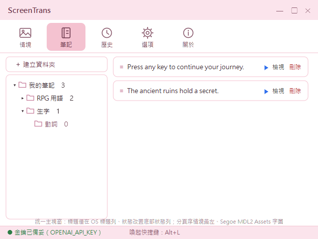

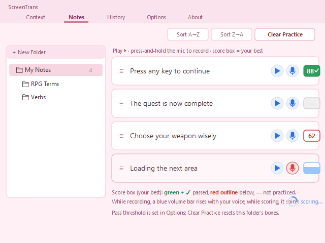

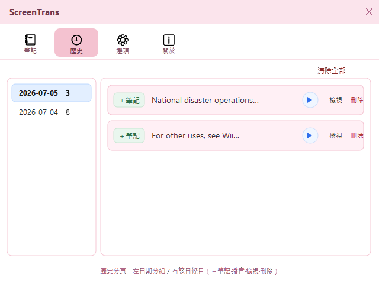

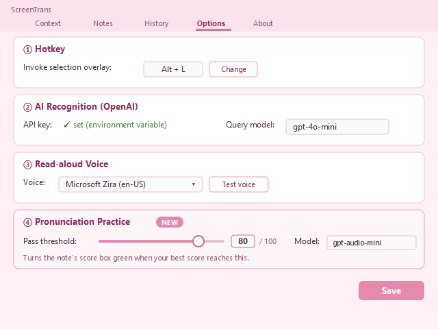

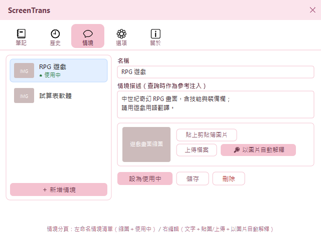

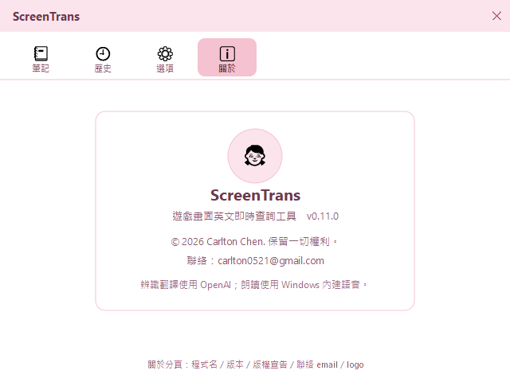

### (D) 部署做法

> 建置／測試／部署指令（繼承 techStack；GATE 由此取建置/測試指令）。

* [sysScreenTrans系統]：繼承 [techStackDotnetWin]（候選）——**建置指令** `dotnet build -c Release`、**發佈指令** `dotnet publish sysScreenTrans -c Release -r win-x64 --self-contained -p:Version={VERSION} -o publish`（**不用** `PublishSingleFile`——Velopack 打包以目錄為單位、官方明示不需單檔；csproj 之 `IncludeNativeLibrariesForSelfExtract=true` 對非單檔發佈惰性無害、留置以保單檔路徑健康，Issue #49/#51）、**打包指令** `vpk pack --packId ScreenTrans --packVersion {VERSION} --packDir publish --mainExe ScreenTrans.exe`（`dotnet tool` `vpk`；產 `Setup.exe`／`Portable.zip`／`full.nupkg`〔有前版基準時另產 delta〕／`releases.win.json`）、**測試指令** `dotnet test`、**部署方法** GitHub Release 掛上述打包資產（即自動更新之更新源；新使用者跑 `Setup.exe`，既有安裝啟動時自動更新）。
* **方案層**：於 Windows 11 實機以 Velopack 安裝版跑 intTest／e2eTest。

## D. 規格效益

> 模組層工程驗證（規格要求＝品管測試）；效益回扣需求層。intTest 以遞增基底層層堆疊。

### (A) 規格要求

> 模組層品管測試：遞增整合（intTest）。另模組層單元測試（query 解析、選區座標換算、present 段英文單字切分純函式〔標點剝除／撇號連字號與大小寫保留／多空白邊界〕、筆記資料夾預設名唯一化 `NextNewFolderName`、自然排序 `NaturalCompare`/`SortFolders`、清除 `ClearEntries`、條目底色 `SetEntryColor`、設定路徑解析與一次性遷移 `ResolveSettingsPath` 等，涵蓋度目標 ≥80%）與介面測試（datIntf 契約一致）全文歸 code。

**遞增整合測試（intTest）**：

| # | 驗證 WI | 基底 | 步驟 → 預期 |
| --- | --- | --- | --- |
| 01 | setWi自訂Usr安裝設定金鑰 | 無 | 執行 `Setup.exe` → 安裝至使用者目錄、捷徑就位、可啟動；設 `OPENAI_API_KEY` → 環境變數存在非空；`Portable.zip` 解壓任意乾淨目錄亦可啟動運行（Issue #51 起取代裸 exe 拷貝驗收） |
| 02 | setWi自訂Usr啟動結束常駐 | 01 | 啟動 exe → 常駐主控入口以工作列按鈕呈現（Alt+Tab 可尋）、預設最小化不擋畫面、系統匣圖示出現；明確結束 → 程序退出、熱鍵與系統匣釋放；重複啟動 → 單一實例提示、不重複建立主控視窗 |
| 03 | runWi自訂Usr熱鍵喚起框選（喚起） | 02 | 按 `Alt+L`（左右各測） → 遮罩 <300ms 出現、**畫面凍結為靜止快照（背後動畫/影片停格、不再實時）**；於遮罩點擊/拖曳/雙擊 → 背後前景應用**不受該輸入干擾**；按 `ESC` → 遮罩消失、無殘影、畫面回復實時（Issue #90）|
| 04 | runWi自訂Usr熱鍵喚起框選（框選） | 03 | 拖曳框選 → 取得選區影像；多螢幕／125%／150% DPI 下與框選範圍 0px 偏移 |
| 05 | runWi自訂Sys辨識翻譯選區（成功） | 04 | 以含英文之測試影像查詢 → 回應解析為三欄齊備之 [datIntf自訂查詢結果格式] |
| 06 | runWi自訂Sys辨識翻譯選區（降級／重試） | 02 | 未設金鑰／400／401 → 立即明確錯誤、不重試；斷網／逾時／429／5xx → 有限次指數退避重試後成功則正常顯示、耗盡仍失敗則明確錯誤；全程程式續存活（暫時性重試後成功、永久性不重試之分類另有模組層單元測試涵蓋） |
| 07 | runWi自訂Usr查看聆聽結果（顯示） | 05 | 結果視窗（**標準表單**：標準標題列＋標準邊框縮放＋工作列按鈕，Issue #59）顯示三區內容 → 與查詢結果一致；以標準標題列拖曳移動、標準邊框拖拉縮放、關閉後再開還原上次位置大小；失焦切至他窗對照時**不隱藏、有工作列按鈕可尋回** |
| 08 | runWi自訂Usr查看聆聽結果（朗讀） | 07 | 點播放 → Windows 語音播放呼叫發生（測試攔截驗證，無網路／無金鑰亦可）；於設定選擇語音 → 後續播放採該語音（缺語音時提示不當機）；重複點 → 先停再播；切換到其他視窗（失焦）→ 結果視窗保留不自動關閉；`ESC`／關閉鈕 → 視窗關閉；連續再查一次 → 前一結果視窗由喚起流程關閉取代（同時至多一個）|
| 09 | setWi自訂Usr移除工具 | 02 | 「設定 → 應用程式」解除安裝（Portable 版＝刪目錄）＋刪環境變數 → 無殘留程序、開機項；`%APPDATA%\ScreenTrans` 使用者資料由使用者自行決定刪留 |
| 10 | runWi自訂Usr熱鍵喚起框選（自訂快捷鍵） | 02 | 設定→變更快捷鍵→監聽模式：按鍵盤組合（如 `Ctrl+Shift+F`）→ 顯示並存綁定，重啟後以該組合喚起遮罩；改綁滑鼠鍵（中鍵／側鍵／左右同按）→ 以該滑鼠鍵喚起、且滑鼠一般移動點擊無可感延遲；監聽中按 `Esc` → 取消不變更；**監聽指定期間按下與現行相同之鍵（滑鼠側鍵或鍵盤組合）→ 不觸發遮罩／點選擷取（全域熱鍵暫停）、僅擷取為綁定；`Esc`／擷取後熱鍵恢復可再喚起（Issue #89）**；存設定後 `paramQueryMaxRetries`／既有值不被重置 |
| 11 | runWi自訂Usr查看聆聽結果（單字發音） | 07 | 點選英文原文中任一單字 → Windows 語音以該單字（`en-US`）單獨播放呼叫發生（測試攔截驗證，無網路／無金鑰亦可）；含標點之詞（如 `world.`／`"quote"`／`it's`／`co-op`）→ 朗讀詞為剝除前後標點後之原詞、內部撇號/連字號與大小寫保留；點選單字後整句播放鈕仍可用、自動播放不受影響 → 逐字與整句發音並存 |
| 12 | setWi自訂Usr啟動結束常駐（常駐主控入口） | 02 | 啟動 → 主控視窗以工作列按鈕呈現、Alt+Tab／點工作列可還原，顯示金鑰狀態與當前喚起快捷鍵；按主控視窗 ✕（關閉）→ 收合（最小化/隱藏），程序續存、熱鍵仍可喚起遮罩；經主控頁或系統匣「結束」→ 退出常駐、熱鍵與系統匣釋放、無殘留；換資料夾（模擬換版/換路徑）重啟 → 仍以工作列／Alt+Tab 尋得、不需重設系統匣顯示 |
| 13 | runWi自訂Usr回顧查詢歷史 | 07 | 完成一次查詢 → 該筆自動出現在查詢歷史頁（依日期分組、最新在上）；重啟程式後歷史仍在；連查多筆超過 `paramHistoryMax` → 最舊者被截汰、清單維持上限；`paramHistoryMax` 設 ≤0 → 讀取邊界套用預設 200；`history.json` 內容毀損或不可寫 → 歷史頁退為空清單、查詢主流程不受影響、不當機 |
| 14 | runWi自訂Usr清理查詢歷史 | 13 | 歷史條目操作**比照筆記機制**（Issue #77）：**右鍵選單**播音/檢視/加入筆記/刪除、**行尾播音鈕**、**雙擊＝檢視**；右鍵「刪除」→ 該筆自清單與 `history.json` 移除、其餘不動；「清除全部」→ 清單清空、`history.json` 歸零；「檢視」/雙擊 → 開詳情回三欄中英（重用結果卡片組件）；「播音」（鈕或選單）→ Windows 語音朗讀（無網路／金鑰亦可，測試攔截驗證）；「加入筆記」→ 去重加入＋toast；歷史無拖曳移動；開關與刪除清除全程不影響結果視窗生命週期 |
| 15 | runWi自訂Usr收藏加入筆記 | 07 | 結果視窗按「加入我的筆記」→ 寫入 `notes.json`、右下角 toast「已加入」後自動消失；同一則再按 → 提示「已在筆記中」、不重複（去重以英文原文正規化為 key）；歷史條目按「＋筆記」→ 同以去重加入；`notes.json` 毀損／不可寫 → 退空／靜默降級、不影響主流程 |
| 16 | runWi自訂Usr管理我的筆記（資料夾/排序） | 15 | 開我的筆記 → 頂部[建立資料夾]新增（即進原地更名）、右鍵選單新增子資料夾／更名（`F2` 原地編輯）／刪除（`Del`）、把條目歸入某夾；拖曳條目上下 → 順序改變並存 `notes.json`、重啟後沿用；空資料夾／跨夾移動邊界正確；預設名唯一化（`新資料夾`、`新資料夾 (2)`…純函式測涵蓋）|
| 17 | runWi自訂Usr管理我的筆記（檢視/重聽/刪除） | 15 | 筆記單筆「檢視」→ 開三欄中英詳情（重用結果卡片組件）；「播音」→ Windows 語音（離線，測試攔截）；「刪除」→ 自該夾與 `notes.json` 移除、其餘不動；筆記不受查詢歷史清除影響 |
| 18 | runWi自訂Sys辨識翻譯選區（情境提示） | 05 | 設定應用情境提示（如「中世紀奇幻 RPG」）並存 → 查詢送出之 text prompt 含該情境（「參考、非指令」語氣）且仍要求三欄 JSON；清空情境 → prompt 等同原固定提示；三欄 structured schema 不變（`BuildPrompt` 純函式測空／非空涵蓋）|
| 19 | runWi自訂Usr熱鍵喚起框選（重入安全） | 03 | 滑鼠鍵綁定且前景程式共用該鍵 → 連續／交錯喚起與關閉不崩潰（不再出現「while a Window is closing」）；結果視窗關閉走單一守衛、不重複關閉關閉中視窗；`FireGate` 連續命中僅派工一次、`Release` 後可再觸發（純函式單元測試涵蓋）|
| 20 | runWi自訂Usr管理我的筆記（多層樹） | 15 | 主視窗筆記分頁 → 新增子資料夾、拖曳移動節點（資料夾／條目）至他夾如檔案總管（**拖曳只改所屬父夾**）；移入自身或其子孫被阻止（不成環）；舊平面 `notes.json` 開啟升級為單層樹、不失資料（純函式測涵蓋移動防環與升級）|
| 21 | runWi自訂Usr查看聆聽結果（自動加入筆記） | 07 | 勾選結果視窗底部「自動加入筆記」→ 下一次查詢成功即去重加入我的筆記並 toast、未勾不加；「加入我的筆記」置於底部工具列；結果視窗不再有歷史／我的筆記入口按鈕（改由統一主視窗）|
| 22 | runWi自訂Usr管理應用情境 | 05 | 開情境分頁 → 新增情境、輸入描述、設為使用中；查詢送出之 prompt 含使用中情境描述（沿 spec#8 注入）、無使用中則等同原提示；改選別則→注入隨之改變；刪情境（連圖）；重啟後留存；舊 `paramContextHint` 相容遷移為預設情境（CRUD/使用中/遷移純函式測涵蓋）|
| 23 | runWi自訂Usr管理應用情境（圖片自動解釋） | 22 | 於情境貼上剪貼簿圖片或上傳畫面檔 → 呼叫 vision `DescribeImageAsync`（structured output）回**名稱＋描述**並填入供補充（解析由 `ExtractContent`＋`ParseImageContext` 純函式測涵蓋）；**名稱欄空白或仍為預設佔位「新情境」且可辨識作品名 → 自動填入名稱、已鍵入實名則不覆寫**（`ShouldAutoFillName` 純函式測涵蓋，#53）；圖片存本機 `contexts\`、刪情境一併刪圖；查詢仍只注入文字、不送圖 |
| 24 | setWi自訂Usr啟動結束常駐（主視窗 Windows 慣例） | 12 | 主視窗內容區無重複「ScreenTrans」標題（僅 OS 標題列有）；金鑰／快捷鍵狀態顯示於**底部狀態列**；分頁序＝情境／筆記／歷史／選項／關於（情境最左）；分頁圖示為 Segoe MDL2 Assets 字圖（情境=風景、選項=齒輪）；預設開啟分頁仍為筆記、tray 各入口行為不變 |
| 25 | runWi自訂Usr管理我的筆記（拖曳回饋） | 20 | 右側條目拖曳中 → 於預定落點顯示**插入位置指示線**、放開即落於指示位置；拖曳資料夾／條目滑過左側目標夾 → 該節點**高亮**；放開或離開 → 指示線與高亮即清除、無殘影 |
| 26 | runWi自訂Usr查看聆聽結果（版面慣例） | 07 | 查詢結果三區**無**「原文/音標/中譯」欄目標示、內容以字級/色彩/字體分層一望即知；結果視窗為**標準表單**（標準標題列＋標準邊框拖拉縮放、不再自訂右下握把，Issue #59）、字型比照主視窗；底部工具列「加入我的筆記／自動加入筆記」不被遮；選項分頁區塊序＝快捷鍵→AI 辨識翻譯（金鑰＋模型）→朗讀語音（含測試發音）→發音練習（及格門檻＋模型）、頁尾僅「儲存」；歷史分頁日期欄頂端對齊、「清除全部」在右欄頂 |
| 27 | runWi自訂Usr管理我的筆記（名稱排序/整夾刪除） | 20 | 筆記樹同層一律依名稱**自然排序**（「新資料夾 (2)」＜「新資料夾 (10)」；新增/更名/拖曳移動後即歸位、拖曳不改同層順序）；條目拖至左樹他夾 → 歸屬改變、順序插頂；**批次清空筆記改走整夾刪除（`Del` 刪資料夾，連子孫與條目、確認對話）**——右欄頂原「清除全部（刪筆記）」已由「清空練習紀錄」取代（見 #36、只重置練習不刪筆記）；逐筆刪除走右鍵（排序純函式測涵蓋）|
| 28 | runWi自訂Usr管理我的筆記（底色/右鍵/雙擊/行尾播音） | 27 | 條目**右鍵**帶出選單（`▶ 播音`／`檢視`／`底色 ▸` 粉彩色塊子選單／`刪除`）；**行尾播音鈕**（Issue #56）單擊即朗讀原文、不觸發雙擊檢視；自子選單選粉藍 → 卡片即套底色、重啟後留存（`notes.json` 存 hex）；選「無底色」→ 回預設白；**雙擊**條目 → 直接開三欄檢視卡片；舊檔（無 Color 欄）開啟 → 預設白、不失資料（SetEntryColor/相容純函式測涵蓋）|
| 29 | setWi自訂Usr啟動結束常駐（自動更新） | 02 | 安裝 vN 啟動、更新源（`SCREENTRANS_UPDATE_URL` 指本地 feed，測試縫）備妥 vN+1 → 背景靜默下載後底部狀態列顯示「新版 vN+1 已就緒」、主視窗標題列變「ScreenTrans — 新版 vN+1 已就緒」、關於分頁現「立即重啟更新」→ 按下重啟 → 版本變 vN+1、筆記/歷史/情境/設定（`%APPDATA%`）全留存；無新版 → 關於分頁「檢查更新」回「已是最新版本」；離線/來源不可達 → 自動檢查靜默略過、查詢主動線不受影響，手動「檢查更新」如實回報「無法檢查更新」（不誤報最新）；dev 裸跑（未安裝）→ 更新流程整段跳過、更新區隱藏；exe 旁舊 `appsettings.json` 首啟一次性遷移至 `%APPDATA%\ScreenTrans`（`ResolveSettingsPath`/遷移純函式測涵蓋）|
| 30 | runWi自訂Usr管理我的筆記（順向/反向排序） | 27 | 右欄頂[順向排序]／[反向排序]（於[清空練習紀錄]左側）→ 依原文自然排序目前夾條目（順向 A→Z／反向 Z→A、大小寫不敏感、數字段依數值）、即時落地 `notes.json`、重啟沿用；空夾時三鈕停用；排序後仍可手動拖曳再調整（`SortEntries` 純函式測涵蓋）|
| 31 | setWi自訂Usr啟動結束常駐（左欄拖拉調寬） | 12 | 筆記／歷史／情境分頁左右兩欄間之 `GridSplitter` → 以滑鼠左右拖拉可調整左側欄寬（游標 SizeWE）；左欄有下限（不可拖至過窄）、右欄亦有下限（內容不被擠沒）；放開即定寬、內容隨欄寬回流不破版 |
| 32 | runWi自訂Usr查看聆聽結果（筆記加入預設/底色/智能配色） | 07 | 結果視窗「加入我的筆記」下方「加入至 [資料夾▾]」→ 選（使用中情境）則加入以情境名為之頂層夾（不存在則建）、選既有夾則加入該夾、無情境選（預設）則入「我的筆記」；「底色」色塊列選色 → 加入之條目即套該底色（`AddToNamedFolderAndSave`）；選擇記憶為預設（`note-defaults.json`）、重開結果視窗沿用；於**使用中情境**內填各色配色規則（如粉紅＝「戰士台詞」，#69）→ 查詢送出之 prompt 含規則且仍回三欄、AI 回 `color` 建議色 → 結果頁色塊**自動預選**該色、加入即套（仍可臨時改別色）；規則空＝無 color 欄、回歸三欄（`BuildPrompt`/`Parse`/`NoteColors`/`AddToNamedFolder`/`BuildColorRulesText` 純函式測涵蓋）；加入後仍可經筆記右鍵底色選單調整 |
| 33 | runWi自訂Usr熱鍵喚起框選（雙擊自動判斷） | 03 | 喚起遮罩後**於文字附近左鍵雙擊**（非拖曳）→ 截整螢幕、游標處畫紅色標記，AI 依標記處辨識並翻譯該句、回三欄於結果視窗（與框選同呈現）；雙擊模式提示異於框選（`PointPrompt`）、仍回三欄；**框選（拖曳）模式不受影響**（回歸）；遮罩上單擊（過小/誤點）不再取消、僅復位（唯 ESC 取消）、以容雙擊之首擊；標記落於游標實際像素處（`CaptureWithMarker`）、`IsPointMode` 貫穿查詢（`BuildPrompt` pointMode 純函式測涵蓋）|
| 34 | runWi自訂Usr管理應用情境（改版/情境內配色） | 22 | 情境圖片卡**拖放圖片檔**→載入預覽（同貼上/上傳）；貼上/上傳兩鈕各半填滿、以圖片自動解釋鈕獨立填滿一列；情境內「配色規則」區塊各色一格描述→儲存落地 `contexts.json`（`ContextItem.ColorRules`，舊檔無此鍵相容）；設某情境使用中並填如粉綠＝「系統訊息」→ 查詢送出 prompt 含該情境各色規則、AI 回符合之 `color` → 結果頁色塊自動預選；全空＝不啟用（回歸三欄）；選項頁不再有智能配色規則框（`BuildColorRulesText`/`ActiveColorRules` 純函式測涵蓋）|
| 35 | runWi自訂Usr筆記發音練習（錄音送評分＋音量回饋） | 15 | 我的筆記某則卡片**按住麥克風鈕**→開始錄音（鈕轉紅、**成績框內藍色音量條隨即時音量由下而上跳動**）、**放開**→**成績框顯 spinner 轉圈**並送 AI 評分（`IPronunciationAssessor` 測試以假評分注入、不打真網路/不佔麥克風）；回分數≥`paramPronPassThreshold`→成績框轉綠顯**最佳分**並存 `notes.json`（`PracticeScore`＝最佳分）、重啟後仍綠；分數＜門檻→成績框紅顯分；再唸更高分→最佳分刷新（取 Max）、更低分→最佳分不降；太短（誤點即放）→不送出、成績框不變；無麥克風/未授權/空錄音/無網→各自 toast 明訊、成績框不誤判通過；麥克風鈕不冒泡；舊 `notes.json`（無 `PracticeScore` 欄或舊「最後分」值）→以最佳分語意沿用不失資料 |
| 36 | runWi自訂Usr筆記發音練習（門檻與清空） | 35 | 選項頁調整 `paramPronPassThreshold`（如 60↔90）並儲存→同分數之通過判定隨門檻改變、既有最佳分依新門檻重判成績框紅/綠；右欄頂**[清空練習紀錄]**→該夾所有條目 `PracticeScore` 歸 `-1`、成績框回未練「—」並落地 `notes.json`、子夾與他夾不動、空夾時停用（`ResetFolderPractice` 純函式測涵蓋）；原「清除全部（批次刪除筆記）」入口已由清空練習紀錄取代、逐筆/整夾刪除循右鍵/`Del` 仍可用 |
| 37 | runWi自訂Usr筆記發音練習（評分請求相容音訊模型） | 15 | 發音評分 payload **不含 `response_format`**（`gpt-audio-*` 不支援 structured outputs）、模型＝`paramPronModel`（預設 `gpt-audio-mini`）、含 `input_audio`＋目標句；模型回 JSON（可能帶 markdown 圍欄/贅字）→`ExtractJsonObject`＋`Parse` 取出 score/note、鉗制 0–100；缺欄/非 JSON→明確降級不當機（`BuildPayload`/`ExtractJsonObject`/`Parse` 純函式測涵蓋）|
| 38 | runWi自訂Usr筆記發音練習（無朗讀不給分） | 15 | 按住麥克風但**不朗讀**（靜音／只有背景雜訊）→放開送評分：`BasePrompt` 明示「先判定是否含對目標句之真正朗讀，若靜音／只有雜訊／與目標無關則 `score=0` 並於 `note` 註明『未偵測到朗讀』，只有確有朗讀才評正確度」→ 回 `score=0`＋未偵測到朗讀、成績框顯 0（紅、不通過）、**不誤給及格分**；`BasePrompt` 語意含「無朗讀→0」指示（斷言）、`Parse` 正確解析 `{"score":0,"note":…}`（純函式測涵蓋）；本增量採模型端從嚴、不做前端 RMS 靜音閘（USR 決策、列 fallback）|

### (B) 效益指標

> 模組層效益回扣需求層；指標正本見 ＜I.D.(B) 效益指標＞（每 spec 一項），本層不重列、僅標承接。

* 本層之 intTest 全綠＋上述 invariant 成立（選區 0px 偏移、零輸入干擾、金鑰不落地、UI 不阻塞、單一實例），為「模組設計可被工程驗證、對外保證成立」之效益門檻；對各 spec 之成效量測沿用 ＜I.D.(B)＞，不另立指標（硬規則①，不重抄）。
